# 所以你想开一个幽灵厨房

> 原文：<https://towardsdatascience.com/so-you-want-to-open-a-ghost-kitchen-cc303cef5332?source=collection_archive---------28----------------------->

## 这是关于 Trendstogo 的三部分博客系列的第一部分，这是我开发的一个市场洞察应用程序，提供对美国食品趋势的见解。

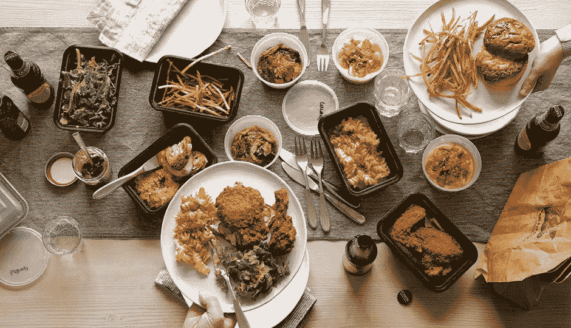

正如 Grubhub、Doordash 和 Postmates 的增长所示，送货和外卖市场多年来一直在蓬勃发展。人们普遍认为，仅美国的外卖和配送市场(线上和线下)每年就超过 2000 亿美元。

尽管有这么多的增长，许多商业模式还没有找到盈利的方法。对于餐馆来说，许多人会发现[削减 30%的销售额(以换取送货上门)是不可持续的](https://www.forbes.com/sites/cameronkeng/2018/03/26/why-uber-eats-will-eat-you-into-bankruptcy/#2a1cad6321f6)，而 [Uber Eats 自己也在努力盈利](https://qz.com/1693843/uber-eats-will-lose-money-until-at-least-2024-say-cowen-analysts/)。虽然 Grubhub 是盈利商业模式的例外，但他们一直遭受着销售额下降的痛苦，结果是出售[的不确定性](https://www.barrons.com/articles/grubhub-stock-falls-after-company-denies-its-selling-itself-51578669824)。

因此，进入幽灵厨房的承诺。食物准备在不附属于真实餐馆的厨房中操作，幽灵厨房能够专注于制作食物，不受经营店面的复杂性和成本的约束。特拉维斯·卡兰尼克的云厨房(CloudKitchens)最近的一项发展可能会推动北美的幽灵厨房，该公司将配备商业厨房的物业出租给食品企业，这些企业希望有一个工作空间来服务于在线食品配送市场。称之为 WeWork of Kitchens，CloudKitchens 恰如其分地获得了软银的 4 亿美元投资。

银弹或最终垃圾箱火灾，如果你的爱和激情召唤你去食品行业，经营一个幽灵厨房可能是一个很好的方式去尝试新的食物和概念，而没有经营一家餐馆的风险和复杂性。

有了这些想法和最近的发展，我有兴趣发现可能服务于食品配送市场供应方的见解。对于一个有抱负的参与者，我想帮助回答这个问题:在一个给定的城市，我们应该提供什么类型的餐厅和食物？更好的是，我们应该提供什么类型的菜肴？

# 数据

为了应对这一挑战，我认为没有比 Grubhub 更好的数据候选人了。虽然失去了市场份额，但只要食品配送市场是一个值得关注的市场，Grubhub 就一直是市场的主导者。这意味着更丰富和更长期的数据。

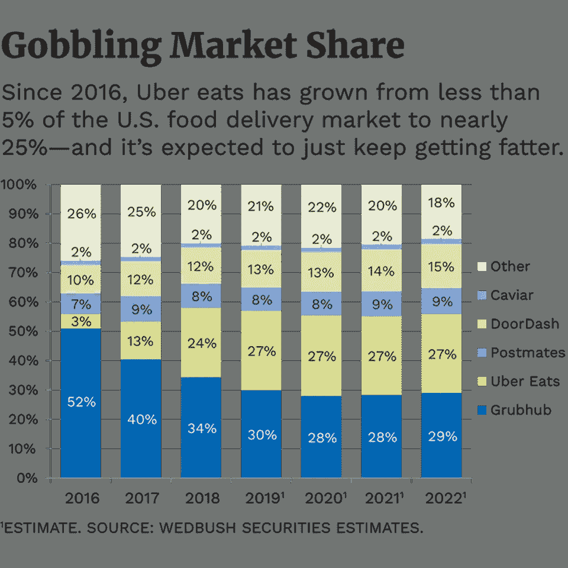

该数据是通过搜集美国 15 个主要城市地区的 Grubhub 餐馆的数据获得的。我从一个城市区域获取数据，只需选择一个经度和纬度坐标，并配置半径英里来捕捉更大的城市区域。例如，我在曼哈顿选择了一个中点，但设置了一个足以覆盖布鲁克林、泽西城和斯塔滕岛的半径英里。

最终的数据集包括 30，000 家餐馆的菜单和简介细节，不包括快餐连锁店。考虑到 Grubhub 的平台上总共有 140，000 个供应商，这还不错。

根据可用的菜单和餐馆数据，有四种类型的信息似乎有助于对餐馆进行分类。

1.  **菜系:高级菜系类型。**数据被附加到餐馆档案中，其中一家餐馆可能有多达 10 种高级菜系。例如亚洲、地中海
2.  **菜品:从菜品“hashtag”中抓取的菜单级菜品类型。**标签名称在前端不可见，但我相信是用于搜索优化。比如鸡饭和鸡沙瓦玛有相同的标签#鸡。只使用了顶级菜单餐馆的菜肴标签。
3.  **价格区间:最贵的项目和价格区间。**顶级菜单中最贵菜品的价格，作为餐厅高端程度和 Grubhub 定义的价格范围的指标。
4.  **菜单可变性:菜肴种类的计数。**菜单中顶级项目的数量、独特菜肴标签的数量、独特菜肴组的数量(例如，两个菜肴的鸡肉、鸡肉串标签将计为 1 个独特菜肴组)。这表明了一家餐馆的专业化和多样化程度。

# 数据处理和降维

目标是将所有这些可用信息整合到一个聚类模型中。我想捕捉餐厅的相似之处，不仅是菜名和菜式，还有价位和菜单的变化。我不想只识别中国餐馆，而是那些菜单上似乎有 50 多道菜的中国餐馆和专门做拉面的中国餐馆。我想知道那些新奇的美国式墨西哥餐馆是否是你邻居墨西哥卷饼的热门去处。

菜单可变性和价格相对容易管理，因为它们是数字和分类数据类型。另一方面，有 162 种不同的菜系和大约 2600 种菜肴。我们可以尝试对每一道菜和每种烹饪类型进行热编码，但当我们将四种类型的数据放入聚类算法时，这可能无法在四种类型的信息之间给我们一个公平的权重。我们可以管理烹饪和菜肴的另一种方法是应用 NLP 来降低维度

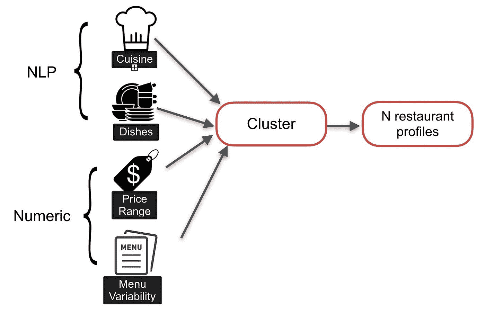

为了减少烹饪和菜肴的维度，我使用了潜在狄利克雷分配(LDA)。LDA 是一种贝叶斯主题建模方法，其中每个文档(或者在这种情况下是餐馆)在一组潜在主题上有一个概率分布。每个主题的特征还在于单词的分布。通过指定 LDA 应该使用多少个主题，该算法会将每个单词分配给一个临时主题。LDA 的基本假设是具有相似主题的文档将使用相似的单词组。

对于菜系和菜肴，我选择 30 作为主题的数量来聚类 163 种菜系类型和大约 2600 种菜肴类型。

下面是一个餐馆的例子，以及它们在许多潜在主题上的概率分布，这些潜在主题是从美食标签中模拟出来的。标题是文档(餐馆),而索引列是我们稍后要识别的菜肴维度。你看到的概率加起来不等于 1，因为模型过滤掉了无关紧要的噪声结果。我们可以在训练模型时通过指定***minimum _ probability = 0.0***来选择捕捉噪声。

下面是使用`pprint(lda.print_topics())`从模型中获得的关于烹饪单词的主题分布示例。

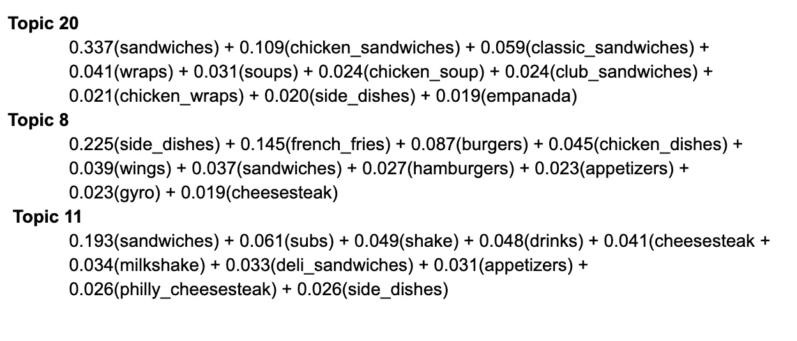

使用 LDA 的一个主要好处是它的可解释性，这也是我选择这种降维方法而不是 LSA 和 NMF 的原因。为了说明这一点，我使用了 PyLDAvis，这是一个方便的 python 交互工具，可以帮助可视化主题如何相互关联以及每个主题有多流行。可视化效果的右侧面板将代表在解释所选主题时最有用的术语。例如，菜肴拟合模型的主题 7 和 11 看起来像两种不同风味的亚洲食物。话题 11 似乎倾向于美国中国菜，而话题 7 是泰国/东南亚菜。尽管它们是两个不同的主题，但它们的相似性(都是亚洲食物)解释了它们如此接近的映射。

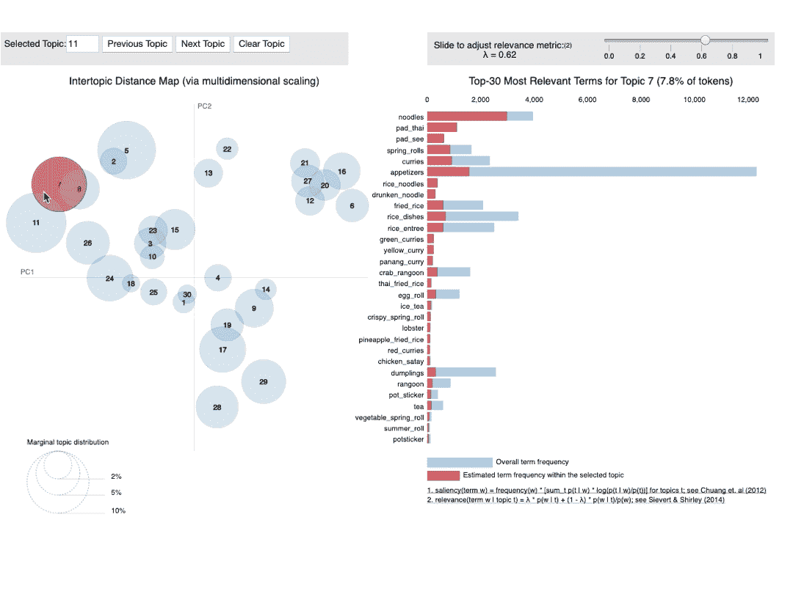

既然我们已经将菜系和菜肴分别减少到 30 个维度，我们可以将所有的餐馆信息类型用于最终的聚类模型。

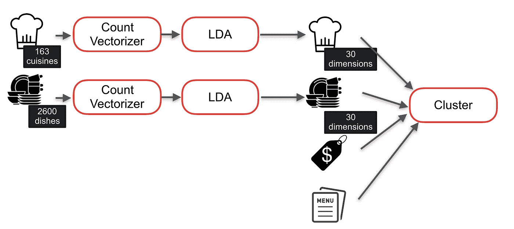

模型的架构

# 我们餐厅的最终聚类

有一些聚类方法可以使用。在运行 DBSCAN、mean shift 和 k-means 之后，我选择了 K-means 作为我最终的聚类模型。阅读下面的原因。

***以下是使用 DBSCAN 聚类的 80 个主题的餐厅数量分布。***

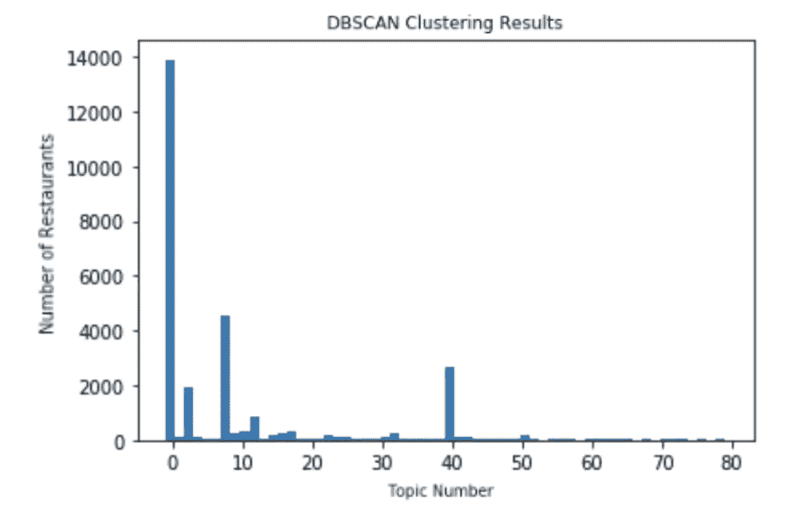

即使使用多种参数组合模拟模型后，餐馆仍主要通过 DBSCAN 和均值漂移聚类到少数几个组中。我并不认为这有助于决策，因为我从一开始就希望能够区分两种类型相近的食物/餐馆，比如新美国风格的墨西哥食物和你家附近的玉米卷店。鉴于目前的分裂，似乎所有的拉丁美洲食物都聚集在一起(作为类比)。

***下图为用 K-means 聚类的 30 多个主题的餐厅数量分布。***

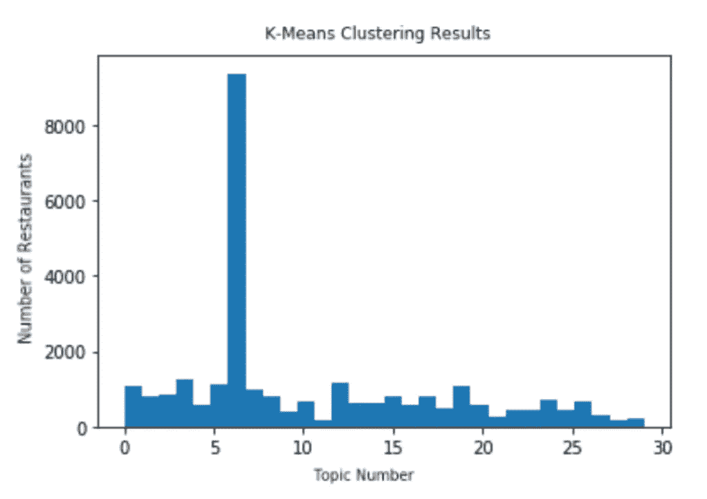

对此的一个解释是，考虑到所选的尺寸，大多数餐馆的位置都很近。DBSCAN 根据观测值的紧密程度对其进行聚类，同时将位于低密度区域的观测值标记为异常值。因此，他们可能会将大型食物类型(如拉丁美洲、亚洲食物)进行聚类，而将瑞典食物视为单个主题组。理想情况下，我想将亚洲食物分成几组，并将斯堪的纳维亚/欧洲食物集中在一起。K-means 会产生不同的结果，因为它会根据分区观测值的最近质心(持续优化)来定位分区观测值。

***K-means 在指定数量的簇分布上的惯性值***

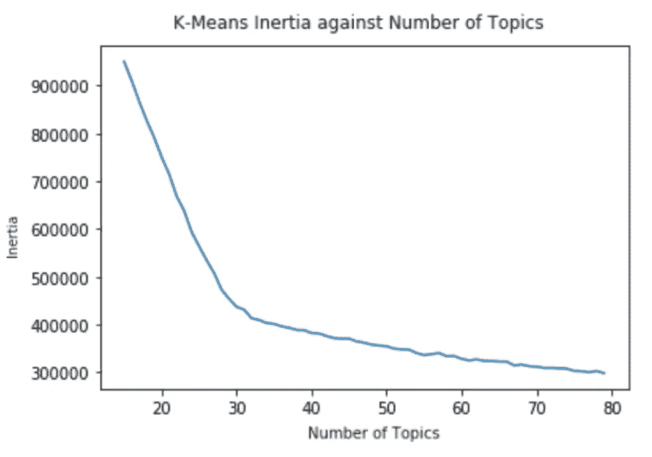

幸运的是，当用 2 到 80 之间的指定簇绘制 K-means 上的惯性分布时，主要纽结是在 30。惯性测量集群的相干性——它测量样本到最近的集群中心的平方距离之和。这意味着大部分信息可以用 30 个维度来捕捉，这大约是我乐意命名和识别的餐馆数量。太棒了。

最终模型的架构

# 结果和结论

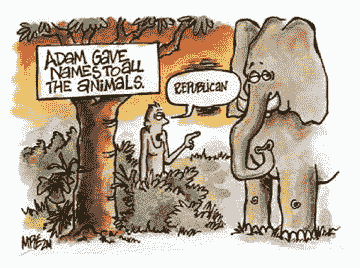

既然这 30，000 家餐馆被归入了 30 家餐馆，它们就需要被命名。一种乏味的工作，我认为我已经完成了数据清理，我也明白这是无监督学习所需要的工作。在我们的聚类模型中使用相同的 4 种类型的信息，我能够区分不同的餐馆简介:

1.  **菜系:**还记得之前的 LDA 主题建模吗？烹饪主题-关键词分布和文档-主题分布在分析每个聚类时变得有用。我按照他们的关键主题关键词和对最终 k-means 聚类的百分比贡献，分析了每一个聚类的前 3 个烹饪维度。
2.  **菜肴:**与菜系相同，但有菜肴 LDA 主题建模
3.  **价格:**获取每簇的平均最高价格
4.  **菜单可变性:**获取每簇顶级菜肴的平均数量

以下是分析过程的示例:

以下是按点评次数排列的前 10 大餐厅群(下一篇博客帖子的剧透！).

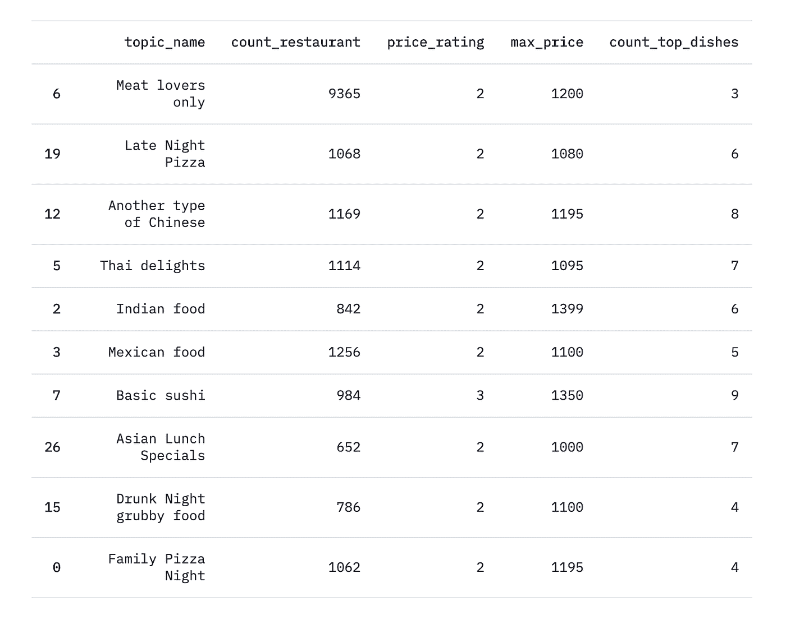

我希望您在阅读识别餐厅简介的过程中感到愉快。但是我们还没有真正做任何事情来发现市场差距或趋势，以帮助你作为一个有抱负的食品供应商(或只是一个好奇的头脑)。因此，请继续关注本系列的第 2 部分。

*本文原帖*[*【https://www.paulynnyu.com/trendstogo1/】*](https://www.paulynnyu.com/trendstogo1/)