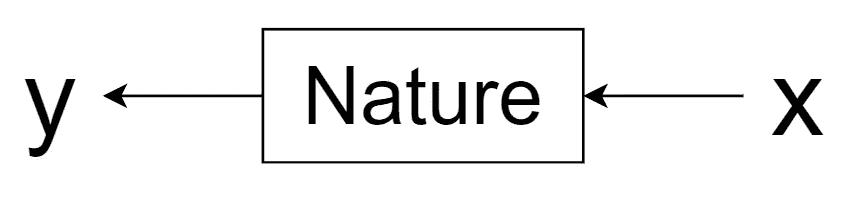
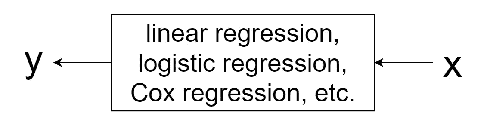
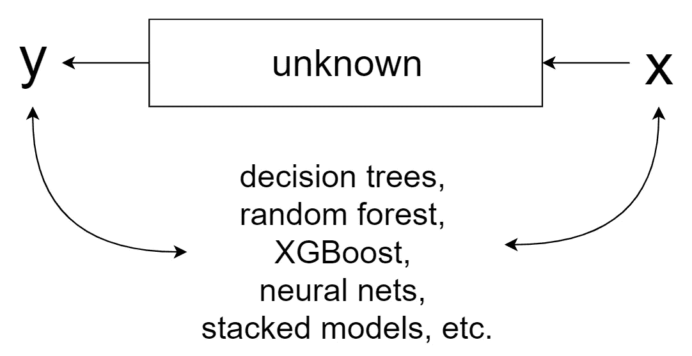
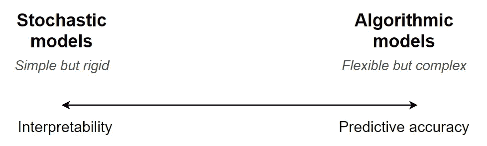
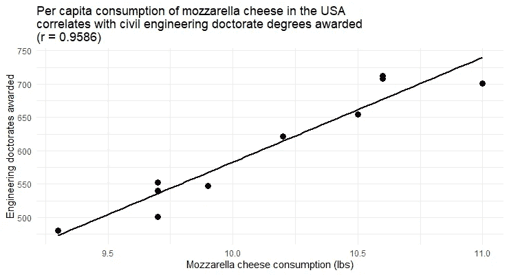
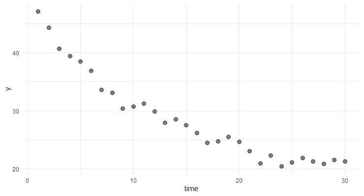
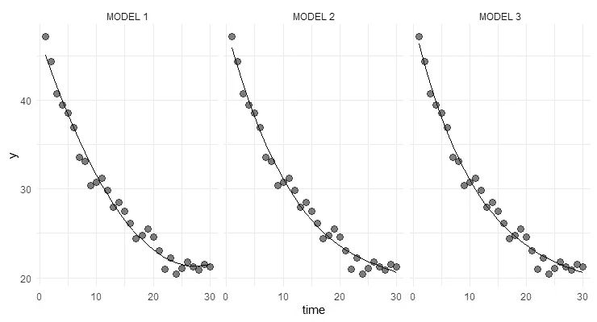
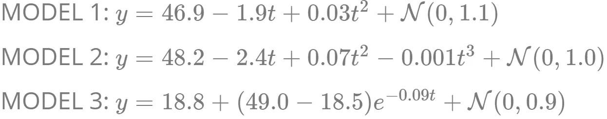
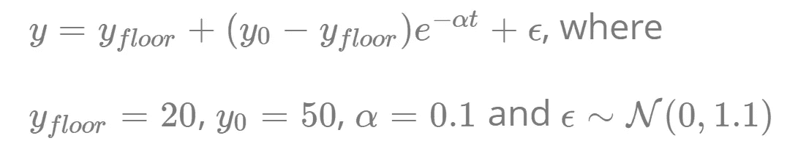

# 所以，你的利益相关者想要一个可解释的机器学习模型？

> 原文：<https://towardsdatascience.com/so-your-stakeholders-want-an-interpretable-machine-learning-model-6b13928892de?source=collection_archive---------25----------------------->

## [模型可解释性](https://towardsdatascience.com/tagged/model-interpretability)

## 这是你告诉他们的。

[医学家](https://unsplash.com/@medienstuermer?utm_source=medium&utm_medium=referral)在 [Unsplash](https://unsplash.com?utm_source=medium&utm_medium=referral) 上拍摄的照片

# 设置场景

你是一名数据科学家，在一家商业公司工作。你花了几周，甚至几个月的时间，开发了这个基于深度学习的模型，它准确地预测了对你的业务非常重要的结果。您自豪地向您的利益相关者展示了结果。然而，非常令人恼火的是，他们并没有注意到您用来构建模型的尖端方法。他们不再关注这个模型有多强大，而是开始问很多问题，为什么它的一些预测看起来是这样的。你的同事们也认为一些关键的预测指标缺失了。他们无法完全理解在这些特征缺失的情况下，预测是如何如此准确的。由于您构建的模型是黑盒类型的，因此对您来说，立即给出所有问题的满意答案是一项挑战。所以你不得不要求一次后续的会面，并花一些时间做准备。

听起来很熟悉？我以前肯定去过那里几次。作为人类，对我们不理解的事物感到不舒服和不信任是很自然的。这也适用于机器学习模型以及非数据科学专家的人如何感知它们。然而，拥有一个可解释的机器学习模型既不总是可能的，也不是必要的。为了帮助我向我的利益相关者和客户解释这一点，我从各种来源，包括我自己的经验，收集了一些关于模型可解释性的关键观点。我在这篇文章中分享这个收藏。希望我的一些数据科学家同事在准备与他们的同事进行类似的对话时也会发现它很有用。

# 对模型的目的要非常清楚

清楚地传达模型的目的是推动涉众采用它的关键因素之一。模型用途有几种分类(如[Calder et al . 2018](https://royalsocietypublishing.org/doi/10.1098/rsos.172096)；[埃德蒙兹等人 2018](http://jasss.soc.surrey.ac.uk/22/3/6.html)；[格林等人 2020](https://www.nature.com/articles/s41467-020-17785-2) 。我个人更喜欢著名的随机森林算法的作者 [Leo Breiman](https://en.wikipedia.org/wiki/Leo_Breiman) 提出的方案。2001 年，Breiman 发表了一篇题为“统计建模:两种文化”的论文。这篇论文受到了很多关注和引用，因为它第一次引发了关于模型可解释性与预测性能的广泛讨论。

根据 Breiman 的说法，数据可以被认为是由一个黑盒生成的，在黑盒内部，自然将输入变量的向量 ***x*** 链接到结果 ***y*** :

来自:布雷曼(2001 年)

作者然后阐述了建模的两个主要目标:

*   *信息:*提取关于自然如何将 ***x*** 与 ***y*** 联系起来的洞见；
*   *预测:*根据 ***x*** *的未来值，提供对 ***y*** 的精确估计。*

当与模型最终用户交流时，区分这两个目标是很重要的。原因是用于实现这些目标的模型通常在复杂性、可解释性和预测能力方面有所不同。

# 阐明可解释性和预测准确性之间的权衡

Breiman (2001)区分了两种实现建模目标的方法或“文化”。

第一种方法，*“数据建模”*，假设数据生成过程可以用随机模型来描述，例如*响应= f(预测值、参数、随机噪声)。*此类模型往往有一组有限的参数，这些参数的值是从观察数据中估计出来的。例子包括线性回归、逻辑回归、Cox 回归等。：

来自:布雷曼(2001 年)

由于其相对简单的结构，第一类模型通常用于阐明感兴趣的系统如何操作。例如，可以直接查看线性回归模型的系数，并快速计算出改变输入值将如何影响响应变量。这也有助于制定随后可以在受控实验中测试的假设。虽然这些模型当然可以用来做预测，但这种预测的质量通常没有 T1 那么高。

这与使用*“算法建模”*方法生成的模型形成对比。这种方法接受了这样一个事实，即自然黑匣子的内部是复杂和未知的。然后，它试图找到一个任意复杂的函数，该函数提供输入变量 ***x*** 到响应变量 ***y*** 的精确映射。属于这一类别的模型通常更复杂，使用随机森林、XGBoost、神经网络等算法进行拟合。：

出处:Breiman (2001 年)，有修改。

使用数据建模方法生成的模型的质量通常使用拟合优度的统计测试和通过检查残差来评估。这种分析的结果通常是二元的:模型要么被认为是“好”的，要么被认为是“坏”的。相比之下，使用算法建模方法建立的模型是基于它们在独立数据集上的预测准确性来评估的。这是一个重要的区别，因为它意味着我们不*而不是*真正关心一个算法模型有多复杂，或者它是否通过了拟合优度的统计测试。重要的是，该模型不会过度拟合，其预测能力对于手头的问题来说足够高。

如今，企业收集大量日益复杂的数据。解决需要基于此类数据的高质量预测的现实世界业务问题需要同样复杂的建模。然而，复杂的模型本质上更难解释。尽管这种权衡并不总是非黑即白的，但我们可以从概念上将其形象化如下:

作为数据科学家，我们的工作是向模型的最终用户阐明这种权衡。做起来很有挑战性。然而，正如 [Cassie Kozyrkov](https://medium.com/u/2fccb851bb5e?source=post_page-----6b13928892de--------------------------------) 在她的关于这个话题的[文章](https://hackernoon.com/explainable-ai-wont-deliver-here-s-why-6738f54216be)中所说的那样，*“生活中并非一切都是简单的”*和*“希望复杂的事情简单并不能让它们变得简单。”*

# 莱姆、SHAP 和其他“解释”黑盒模型的方法怎么样？

可解释的机器学习(又名可解释的人工智能，XAI)无疑是这些天的热门话题。许多学术研究人员、开源框架的开发者和商业平台的供应商正在制造新的方法来解释复杂预测模型的内部工作。一些众所周知的技术的例子包括(见 [Molnar 2020](https://christophm.github.io/interpretable-ml-book/index.html) 的全面概述):

*   LIME(局部可解释的模型不可知解释)；
*   Shapely 值和相关的 SHAP 方法；
*   部分依赖图；
*   特征重要性；
*   个体条件期望；
*   累积局部效应图。

毫无疑问，这些方法对于模型开发和调试非常有用。但让我们诚实地面对自己:一个没有统计学或机器学习背景的门外汉能完全理解并正确解读其中的多少？可以说，即使有，也不多。那么，一个数据科学家可以做些什么来帮助她的利益相关者更好地理解一个模型并获得对其预测的信任呢？

首先，任何数据科学项目都不应该在真空中开发。这意味着商业利益相关者应该从第一天就参与进来。在进入我们作为数据科学家最喜欢的领域——建模和玩算法——之前，我们应该努力从我们的业务同事那里收集尽可能多的领域知识。一方面，以输入特征的形式嵌入这些知识会增加开发高性能模型的机会。另一方面，这将最终减少解释模型如何工作的需要。

但是有时我们确实在没有利益相关者参与的情况下开发模型(例如，作为 R&D 项目的一部分)。在这种情况下，我发现简单地提供一个关于讨论中的模型的输入变量的详细解释是有用的。商业人士自然会有一种直觉，知道哪些变量可能会驱动感兴趣的结果。如果他们看到这些变量已经是模型的一部分，他们对模型的信任就会增加。

另一个经常有效的强大功能是通过一个简单的交互式 web 应用程序来展示模型，以说明预测如何根据输入值而变化。这可以使用任何流行的框架来完成，比如[闪亮](https://shiny.rstudio.com/)、[破折号](https://plotly.com/dash/)、[流线型](https://www.streamlit.io/)。让您的利益相关者移动滑块，运行最疯狂的假设场景！这可以极大地提高他们对模型的理解，比任何特征重要性图都要好。

# 提醒你的同事，相关性不是因果关系

捕捉输入和响应变量之间实际机械联系的预测模型在商业环境中相当罕见。对于包含大量预测器的复杂算法模型来说尤其如此。这些模型中的大多数仅仅因为预测者和响应变量之间的*相关性*而做出预测。但是，俗话说，“[相关不等于因果](https://www.theguardian.com/science/blog/2012/jan/06/correlation-causation)”，或者至少不总是如此。在解释预测模型时，这有两个重要的含义。

首先，*有可能*使用与响应变量*无* *实际*关联的输入变量建立一个有用的预测模型。人们可以在互联网上找到许多所谓的“虚假相关性”的例子。这是其中之一:

来自:[https://tylervigen.com/spurious-correlations](https://tylervigen.com/spurious-correlations)(已修改)

很容易建立一个简单的线性回归模型，根据莫扎里拉奶酪的消费量准确预测授予的博士学位数量。这个模型能在实践中成功地用于估计某一年授予的博士学位数量吗？由于这两个变量之间的高度相关性，肯定是的。但我有预感，任何试图解读它的尝试只会在房间里引发一阵大笑。

第二，利用从预测模型中获得的洞察力来设计控制响应变量的行动是很有诱惑力的。然而，如果这样的模型主要基于非机械关联，那么这样做很可能是没有意义的，有时甚至是危险的。例如，上面描述的关系表明，增加人均消费的马苏里拉奶酪会导致更多的博士学位授予。给它一点时间来理解…你会向一个决策者推荐这个吗？他的目标是通过更多的土木工程师接受博士教育来加强劳动力？

# 解释多种好模式的存在

根据定义，任何模型都只是生成观察数据的过程的近似。由于这种潜在的过程是未知的，相同的数据通常可以由非常不同的模型很好地描述。在统计学中，这种现象被称为*【模型的多样性】* (Breiman 2001)。

只要我们从模型中需要的是高预测准确性，这种现象就不会引起任何问题。然而，如果目标是获得关于数据生成过程的*见解*，然后基于这些信息做出*实际决策*，那就有问题了。原因很简单:不同的模型很好地拟合了相同的数据，却能得出截然不同的结论。最糟糕的是，*没有办法*来判断这些结论中哪些是正确的(除非它们在后续的控制实验中被证明是正确的)。

这里有一个简单的例子。假设，我们有一个描述响应变量 *y* 如何随时间变化的数据集:

这些数据可以通过几种结构不同的模型进行类似的拟合(例如，根据 [RMSE](https://en.wikipedia.org/wiki/Root-mean-square_deviation) )。例如:

三个模型及其估计参数如下:

正如我们所见，模型 1 是二阶多项式，模型 2 是三阶多项式，模型 3 是指数衰减过程。显然，这些模型暗示了 *y* 如何随时间变化的不同潜在机制。

事实上，这个玩具示例基于从定义指数衰减过程的以下模型模拟的数据:

因此，模型 3 对应于生成数据的实际过程，并且它非常适合该过程(就参数估计而言)。然而，我们在现实生活中永远不会知道这一点，可能会错误地得出结论，认为其他一些模型提供了对潜在过程的更好描述。在实践中，使用错误的决策模型可能会导致不可预见的负面后果(Grimm et al. 2020)。

# 结论

机器学习模型的商业用户经常要求“解释”模型如何做出预测。不幸的是，提供这样的解释并不总是可能的。对于主要目的是做出准确预测的复杂模型来说，尤其如此。可以说，如今数据科学家构建的大多数模型都属于这一类。尽管如此，在项目的早期让涉众参与进来，并证明模型捕捉到了他们的领域知识并且[经过了良好的测试](https://hackernoon.com/explainable-ai-wont-deliver-here-s-why-6738f54216be)可以帮助他们建立对模型的信任。

# 在你走之前

我提供数据科学咨询服务。[伸手](mailto:info@nextgamesolutions.com)！