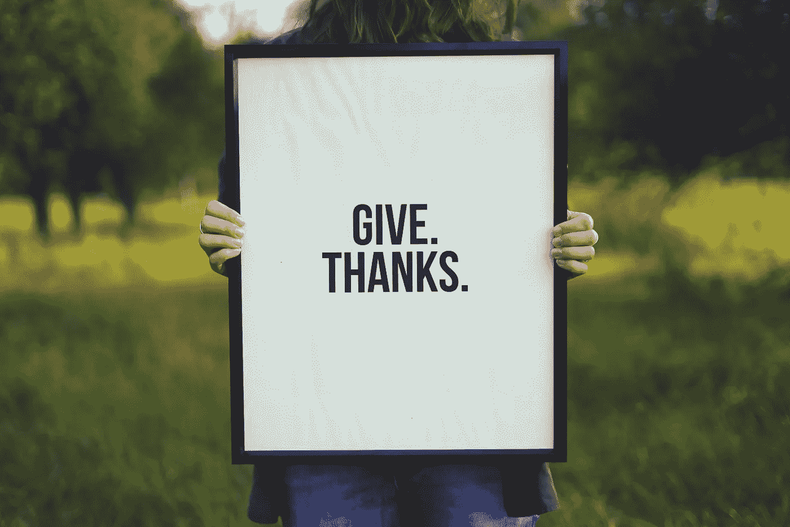

# 你是一名数据科学家。现在怎么办？

> 原文：<https://towardsdatascience.com/so-youre-a-data-scientist-now-what-6d69344cbc7e?source=collection_archive---------51----------------------->

## 感恩

## 你得到了作为数据科学家的第一份工作。这里有 5 种回馈方式。

西蒙·玛吉在 [Unsplash](https://unsplash.com/s/photos/grateful?utm_source=unsplash&utm_medium=referral&utm_content=creditCopyText) 上的照片

我正在写我从懒鬼到数据科学家的旅程，我想起了一个事实，那就是我在这一路上得到了很多帮助。

我很感激。

此外，我感到幸运的是，尽管新冠肺炎危机如此疯狂，我仍然有一份我热爱的工作。

在这篇文章中，我想鼓励数据科学领域的每个人回馈社会，为我们的未来买单。

# 1.做导师

不要因为你没有经验而让你止步不前。你已经走了这么远，你现在所处的位置肯定需要付出艰苦的努力。你可能还不知道所有的事情，而且很可能永远也不会知道，但是你已经获得了经验和见解，这对其他渴望成为数据科学家的人也是有帮助的。

至少，仅仅是提供一只倾听的耳朵对那些正在经历自我怀疑的人来说是有价值的，这种自我怀疑曾经困扰着你的不眠之夜。

从你当地的社区开始，或者找一个合适的在线团体。就我而言，我是从毕业于 [Codeup](https://alumni.codeup.com/?program=data-science) 的学生开始的。从各方面来看，这次经历对我来说都是非常令人满意的。

# 2.编写简单的教程

有很多很棒的教程，当然一个简单易读的代码的简单教程对刚入门的人来说会很有用。

不用说，Medium 的面向数据科学的[出版物是一个很好的平台，因为它的影响力。](https://towardsdatascience.com/contribute/home)

# 3.记录你的失败，让全世界都看到

这里没有骄傲和虚荣的空间。在这个“学习胜于了解”的世界里，表现出谦逊和分享你的错误是有一定价值的，这样别人就可以避免它们。更好的是，这也表明你有足够的安全感从错误中学习，并向他人展示你的成长倾向。

我建议建立一个博客，你可以在那里记录你的功绩。[Wordpress.com](https://wordpress.com)是一个简单的开始方式，但我在[wordpress.org](https://wordpress.org)使用自托管选项，因为它为我提供了灵活性。

# 4.把你的时间捐给非营利组织

这是一个显而易见的。非营利组织通常缺乏现金，或者面临着最大化现金流的压力。许多人没有资源或意愿投资数据科学并利用数据进行创新。这就是你进来的地方。

自愿贡献你的时间，了解非营利组织是如何运作的。让自己沉浸在他们的使命中，检查他们的核心价值观是否与你的一致。

你可以选择自愿贡献你的时间来完成他们的要求，或者你可以贡献你的技能和专业知识，帮助他们提高处理数据的水平。

# 5.分发美元

有那份薪水当然很好。这可能不是行业平均水平承诺的 12 万，但我敢打赌，这比你通常习惯的要多。

我喜欢[kiva.org](https://www.kiva.org/)的模式；我已经成立了一个名为[数据科学家为好](https://www.kiva.org/team/data_scientists_for_good)的贷款团队，在那里我向数据科学家、数据分析师和数据工程师发起挑战，要求他们回馈并为服务不足的群体做出贡献。

今天到此为止！我希望你喜欢这个。这只是一些建议，我很确定还有很多方法可以回馈社会。问题是:

**你今天要开始做什么？**

在下一篇文章中，我将分享我从懒鬼到数据科学家的旅程，我希望它能激励其他人，而不是被仇恨者劝阻。

*敬请期待！*

你可以通过 [Twitter](https://twitter.com/ecdedios) 或 [LinkedIn](https://www.linkedin.com/in/ednalyn-de-dios/) 联系我。

[1]:怀斯曼集团。(2020 年 5 月 17 日)。*菜鸟智慧:为什么在新的工作游戏中学习胜过了解*[https://thewisemangroup.com/books/rookie-smarts/](https://thewisemangroup.com/books/rookie-smarts/)