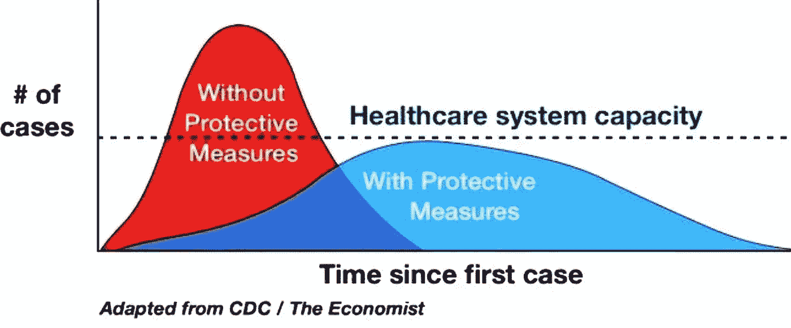
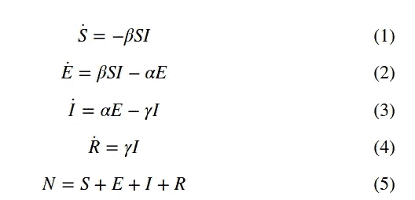
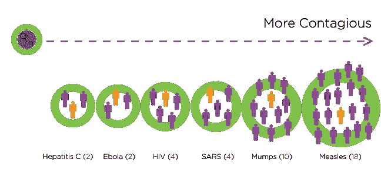
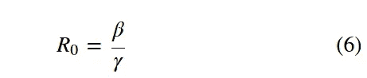
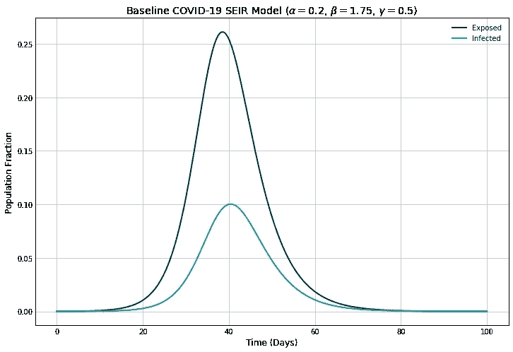
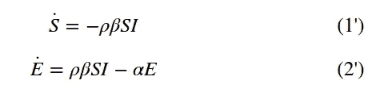
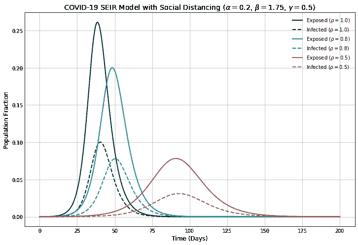

# 社交距离减缓冠状病毒

> 原文：<https://towardsdatascience.com/social-distancing-to-slow-the-coronavirus-768292f04296?source=collection_archive---------2----------------------->

## 模拟新冠肺炎峰的变平

新冠肺炎已经在全世界迅速传播。意大利现在已经进入封锁状态，加州已经宣布进入紧急状态，全球各地的学校和大学已经取消了面对面的课程和活动，企业已经减少了旅行，并推行在家工作的政策。所有这些都是为了减缓疾病的传播。这些努力被广泛地称为社交距离。

这个想法是为了减少人与人之间的接触，从而降低疾病传播的可能性。这种情况的影响经常在如下图所示的图像中表现出来，红色区域被展平，以尽可能地传播疾病。这有助于确保有足够的资源用于患病人群，这将有助于提高存活率。



拉平曲线以保持感染可控(来源: [Fast.ai](https://www.fast.ai/2020/03/09/coronavirus/) )。

我们如何确定这种距离策略的价值，并对这种传播进行建模？

# TL；速度三角形定位法(dead reckoning)

我们走过一个 SEIR 流行病学模型，并用 Python 进行模拟。第一个模型是没有社交距离的基本 SEIR，然后我们加入社交距离来展示这些策略的潜在有效性。

SEIR 模型是一种用于模拟疾病如何在人群中传播的房室模型。这是**的首字母缩写，易感，暴露，感染，康复**。当一种疾病被引入一个群体时，人们从这些阶层(或区间)中的一个转移到下一个。当他们达到状态时，他们不再会被感染，这取决于你的解释，他们要么从疾病中幸存下来，现在具有免疫力，要么死于疾病，从人群中消失。

这是经典 SIR 模型的[扩展，只是增加了一个等式来显示那些暴露在外的人。完整模型如下所示:](/how-quickly-does-an-influenza-epidemic-grow-7e95786115b3)



我们在时域中有四个 ODE，有三个参数:α、β和γ。

*   α是潜伏期的倒数(1/t _ 孵育)
*   β是群体中的平均接触率
*   γ是平均传染期的倒数(1/t _ 传染)

方程(1)是易感人群的变化，受感染者人数及其与感染者接触人数的调节。等式(2)给出了接触过这种疾病的人。它根据接触率而增长，根据人们被感染的潜伏期而减少。

等式(3)给出了基于暴露人群和潜伏期的感染者的变化。它根据传染期而减少，因此γ越高，人们死亡/恢复越快，并进入方程(4)中的最后阶段。最后一个等式，数字(5)，是一个约束条件，表示模型中没有出生/迁移效应；我们自始至终都有固定的人口。

还有一个参数我们应该讨论，臭名昭著的 R0 值。



R0 值越大表示传染病越多(来源:[HealthLine.com](https://www.healthline.com/health/r-nought-reproduction-number#conditions))，

该值定义了疾病传播的速度，并且可以通过等式(6)中给出的关系与我们的参数相关联。



# 模拟冠状病毒

有了这些方程，我们可以建立冠状病毒本身的模型，试图更好地了解它可能如何传播。关键是确定α、β和γ的值，这样我们就可以看到它是如何传播的。

[最近对新冠肺炎](https://www.thelancet.com/journals/langlo/article/PIIS2214-109X(20)30074-7/fulltext)的一项研究为我们估算了其中的一些值(Hellewell 等人，2020)，因此我们可以使用他们的一些参数估计来让我们的模型起飞。

*   潜伏期= 5 天-> α = 0.2
*   R0 = 3.5

不幸的是，这篇论文没有提供γ的值，但是我们可以从另一篇论文(它使用了更复杂的房室模型)中得到一个估计[，从而得到我们 2 天的 1/γ值，所以γ = 0.5。](https://arxiv.org/pdf/2002.06563.pdf)

将 R0 和γ值代入等式(6)，我们得到β = 1.75 的估计值。

现在，是时候把这个模型放到 Python 中了。

# Python 中的基本 SEIR 模型

我们将使用[半隐式欧拉方法](/a-beginners-guide-to-simulating-dynamical-systems-with-python-a29bc27ad9b1) — [对此进行模拟，就像我用 SIR 模型](/how-quickly-does-an-influenza-epidemic-grow-7e95786115b3)演示的那样。这只需要取 S、E、I 和 R 的最近值，加上乘以时间步长的方程。这方面的代码如下:

```
def base_seir_model(init_vals, params, t):
    S_0, E_0, I_0, R_0 = init_vals
    S, E, I, R = [S_0], [E_0], [I_0], [R_0]
    alpha, beta, gamma = params
    dt = t[1] - t[0]
    for _ in t[1:]:
        next_S = S[-1] - (beta*S[-1]*I[-1])*dt
        next_E = E[-1] + (beta*S[-1]*I[-1] - alpha*E[-1])*dt
        next_I = I[-1] + (alpha*E[-1] - gamma*I[-1])*dt
        next_R = R[-1] + (gamma*I[-1])*dt
        S.append(next_S)
        E.append(next_E)
        I.append(next_I)
        R.append(next_R)
    return np.stack([S, E, I, R]).T
```

对于任何一个 ODE 系统，我们都需要提供初始值。我们将对我们的 s0、E0 等使用标准化的总体值。因此，如果我们假设我们的人口中有 1 万人，我们从一个暴露者开始，其余 9999 人易感，我们有:

*   s _ 0 = 1–1/10000
*   E_0 =万分之一
*   I_0 = 0
*   R_0 = 0

现在，我们可以转向模拟本身，将这些值以 1 天的时间步长插入 Python。

```
# Define parameters
t_max = 100
dt = .1
t = np.linspace(0, t_max, int(t_max/dt) + 1)N = 10000
init_vals = 1 - 1/N, 1/N, 0, 0
alpha = 0.2
beta = 1.75
gamma = 0.5
params = alpha, beta, gamma
# Run simulation
results = base_seir_model(init_vals, params, t)
```

我们主要对社交距离的扁平化效应感兴趣，所以让我们画出模拟的 **E** 和 **I** 术语。



我们在没有社会距离的情况下看待我们的基本案例。它表明，在高峰时，我们人口的 10%将在第一次接触后的 40 天后感染该疾病。这很有可能是一种非常严重的感染，即使它是相对短暂的。

让我们转向社交距离的影响以及如何对其建模。

# 具有社会距离的冠状病毒

社交距离包括避免大型聚会、身体接触和其他减少传染病传播的努力。根据我们的模型，这将影响我们的接触率β。

让我们引入一个新的值ρ来捕捉我们的社交距离效应。这将是 0-1 之间的一个常量，其中 0 表示*每个人*都被锁定和隔离，而 1 相当于我们上面的基本情况。为了将它引入我们的模型，我们将修改上面的等式(1)和(2)，将它乘以我们的β，写出等式(1’)和(2’)。



如果我们回到基线模型，我们只需要将ρ值添加到代码中，如下所示。

```
def seir_model_with_soc_dist(init_vals, params, t):
    S_0, E_0, I_0, R_0 = init_vals
    S, E, I, R = [S_0], [E_0], [I_0], [R_0]
    alpha, beta, gamma, rho = params
    dt = t[1] - t[0]
    for _ in t[1:]:
        next_S = S[-1] - (rho*beta*S[-1]*I[-1])*dt
        next_E = E[-1] + (rho*beta*S[-1]*I[-1] - alpha*E[-1])*dt
        next_I = I[-1] + (alpha*E[-1] - gamma*I[-1])*dt
        next_R = R[-1] + (gamma*I[-1])*dt
        S.append(next_S)
        E.append(next_E)
        I.append(next_I)
        R.append(next_R)
    return np.stack([S, E, I, R]).T
```

如果我们将ρ设置为 1、0.8 和 0.5，我们可以想象出当我们通过简单的日常行动加大努力来遏制疾病时的扁平化效应。



在这里，我再次显示了我们的模型的 **E** 和 **I** 值，它们用社交距离因子ρ进行了颜色编码。我们可以看到扁平化效应在这里发生，因为更多的社会距离在整个人口中发生，这具有直观的意义，因为它降低了接触率。我们从 10%的人口同时被感染的基础病例峰值到大约 7.5%再到 3%的低水平。还要注意的是，它给了人们更多的时间去准备，因为高峰被推到了更远的未来。

这些社交距离的情景可能会通过给治疗和供应更多的时间来提高疾病的存活率，同时保持较低的峰值。

当然，这都是基于我们的社交距离因子ρ(以及任何其他可能起作用的因素)的准确性。然而，鉴于病毒的复杂性质，以及像我们这里这样将现实世界特征的相互作用归入包罗万象的因素，很难认真对待这样一个简单的模型。