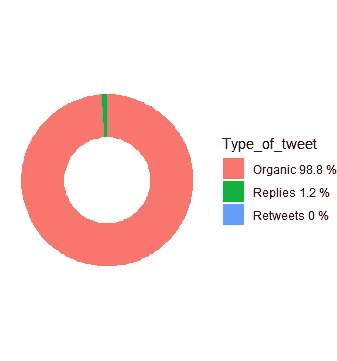
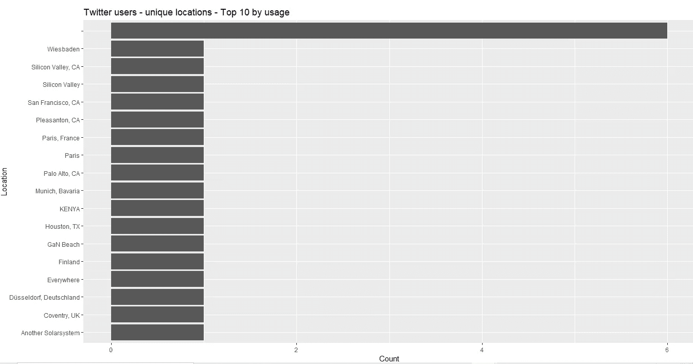
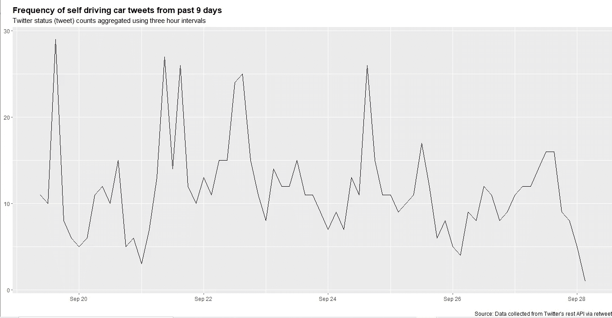
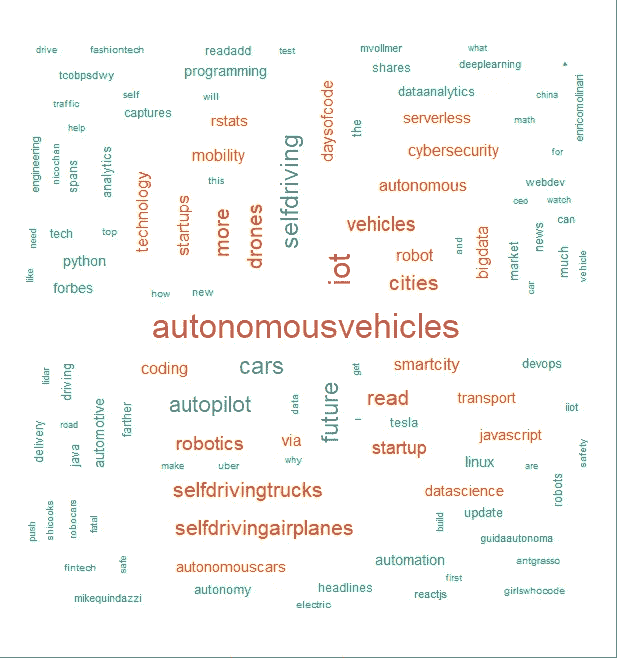
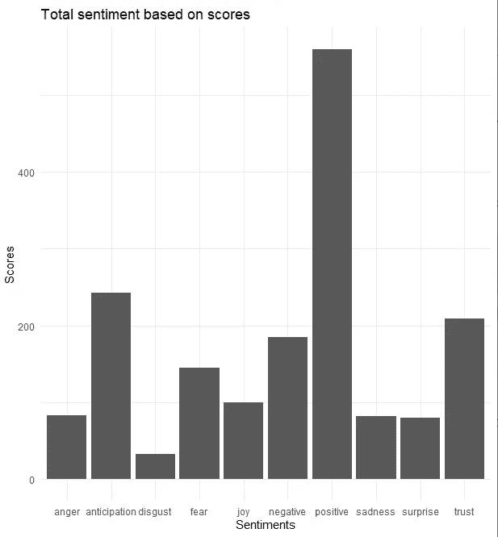
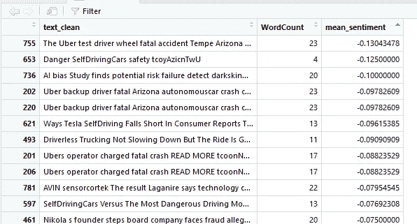
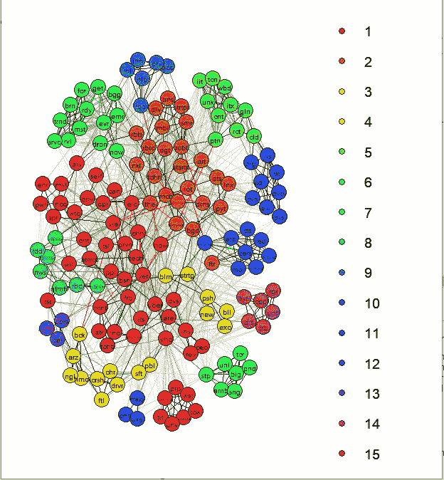
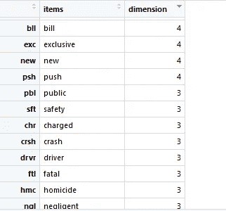

# 通过 Twitter feed 分析进行社交倾听

> 原文：<https://towardsdatascience.com/social-listening-via-twitter-feed-analysis-23fb4fbe7531?source=collection_archive---------36----------------------->

## twitter feed 的客户情感分析

# 什么是社交倾听，为什么它很重要？

社交媒体现在被广泛用于个人对各种话题、个人和企业的赞美或发泄。企业确定其品牌如何被客户感知的一个好方法是通过社交倾听，企业考虑他们的客户在网上对他们说了什么，并利用这些信息 1)改变他们的产品和服务，2)创造更好的客户参与度，3)设计其营销活动。


乔治·帕甘三世在 [Unsplash](https://unsplash.com/s/photos/social-media?utm_source=unsplash&utm_medium=referral&utm_content=creditCopyText) 上的照片

# 使用 R 编程分析社交媒体数据

我们可以很容易地抓取的一个社交媒体渠道是 Twitter，因为 R 包含了抓取 Twitter 数据的可用包，Twitter 平台允许用户创建一个开发者帐户用于研究目的。

## Twitter 开发者帐户入门

我不打算详细介绍如何创建一个 Twitter 开发者帐户，因为这篇博文更多的是关于使用 R 进行分析，但是我发现下面的链接非常有帮助。

 [## 获取和使用访问令牌

### 这篇短文介绍了如何获取和使用 Twitter API 访问令牌，以便在 rtweet 包中使用。要创建 Twitter…

cran.r-project.org](https://cran.r-project.org/web/packages/rtweet/vignettes/auth.html) 

一旦你创建了一个账户，确保你把你的 API 密匙保存在一个安全的地方(比如一些 R 代码),因为这些将被用于认证和允许 tweet 抓取。

按照下面的代码片段，我保存了我的 API 键，然后用它们连接到浏览器。

```
#### 2\. Set parameters for twitter app access ####
## store api keys (replace with your own keys)
api_key <- "aHGiOIWCubjkMmitanwyIiPaDA"
api_secret_key <- "WlbDGVZU8zy6frwvUlxY2j0aBNMTLsutp9VL0z6EsxOzC8SgjXmNTY"
access_token <- "1310431451433360898-ry6VoVI6CpzVA5dix7J3gzsvhQLHtw"
access_token_secret <- "MZiVtV4dddCGF9LSQ7qvRj35B46BI0RflEKUZYx00AHiuX"## authenticate via web browser
token <- create_token(
  app = "rexploretweets",
  consumer_key = api_key,
  consumer_secret = api_secret_key,
  access_token = access_token,
  access_secret = access_token_secret)setup_twitter_oauth(api_key, api_secret_key, access_token, access_token_secret)## Check to see if token is loadedget_token()
```

# 抓取 Twitter

我将假装我是一个豪华汽车品牌，正在考虑将我的范围扩大到**自动驾驶汽车**。然而，我不确定这是否是一个好主意。媒体上有正面也有负面的评论，我觉得挺混乱的。我想在不阅读 Twitter 页面的情况下，找到人们对无人驾驶汽车的看法。

由于我对某个特定的话题或某个# (hashtag)感兴趣，我使用下面的代码来获取所有与自动驾驶汽车相关的推文。不幸的是，由于我的 Twitter 开发者账户，我只能发布过去 6-9 天的推文。

*include_rts* 选项是删除**转发**。我还想删除对推文的**回复**，因为我想在我的分析中只包括个人或**有机的**推文。

```
sd_cars<- rtweet::search_tweets(
                        q = "#selfdrivingcars",
                        n=5000,
                        include_rts = FALSE) # exclude retweetssd_cars_organic <- sd_cars## Remove replies
sd_cars_organic <- subset(sd_cars_organic,is.na(sd_cars_organic$reply_to_status_id))
```

# 推文的探索性分析

然后，我对推文做一些初步分析，以了解一些基本信息。

我提取的推特信息主要是有机推特。预期的转发不在抓取的数据集中。



图 1: Tweet 类型饼图(图片由作者提供)

Twitter 用户使用情况的独特位置柱状图显示，大多数人在美国发推，其次是巴黎(需要做一些清理以避免重复)。



图 2:不同地点的 Twitter 用户(图片由作者提供)

每隔 3 小时的推文频率显示了过去 9 天人们最有可能在推文中谈论自动驾驶汽车的时间。它还显示了最受欢迎的日子。如果我有更长时间的数据，作为一个豪华汽车品牌的老板，我可以根据推文的频率来确定人们对自动驾驶汽车的兴趣是随着时间的推移而增加还是减少。



图 3:按时间排序的推文(图片由作者提供)

因为我是一个非常重要和忙碌的人，所以我不想看单独的推文，所以我想知道人们在谈论什么，也就是说，推文中使用频率最高的词是什么。这需要一点数据清理。

# Twitter Feed 上的文本分析

我使用了 R 中的 ***tm*** 包来清理数据集，如下图所示。

```
## most frequent words ##
sd_cars_organic$text <- gsub("https\\s*","",sd_cars_organic$text)
sd_cars_organic$text <- gsub("@\\s*","",sd_cars_organic$text)
sd_cars_organic$text  <-gsub("amp","",sd_cars_organic$text)
sd_cars_organic$text <-gsub("[[:punct:]]","",sd_cars_organic$text)#draw out only the text column because we are interested in cleaning it with tm
text_corpus<-Corpus(VectorSource(sd_cars_organic$text))#remove words like car, selfdriving cars, autonomous vehicles as they are synonyms of selfdriving cars
#rt = retweet, re = reply
text_corpus<-tm_map(text_corpus,removeWords, c("selfdrivingcars","driverlesscars","autonomousvehicles","cars","car","rt","re","vehicle","selfdriving","driverless","autonomous"))#remove stop words
text_corpus<-tm_map(text_corpus,removeWords,stopwords("english"))
```

然后我想把最频繁出现的单词形象化，但是为了让它们频繁出现，它们至少需要出现 10 次。生成的单词云如图 4 所示。

我发现单词云真的很酷，因为它们总是能提供我从未想过的信息，但很有意义。我从未想过自动驾驶卡车或自动驾驶飞机(尽管我相信它们已经存在)。显然，我预计物联网将会出现，因为自动驾驶汽车需要可能产生大量数据的传感器；因此，大数据和数据分析。这些推文还显示，人们将优步和特斯拉与自动驾驶汽车联系在一起。

此外，似乎我的停用词删除工作不是很好，但你得到了要点。:)



图 4:文字云#无人驾驶汽车(Twitter 数据)——作者图片

现在来了解一下 Twitter 用户对无人驾驶汽车的看法。

# **使用 R 的情感分析**

我必须做进一步的数据转换，以便绘制用户情绪，如下面的代码片段所示。

情感分析的结果如图 5 所示。同样，我喜欢数据分析证实我的假设。大多数人对自动驾驶汽车的看法是积极的。他们对它也很信任，并期待着自动驾驶汽车的出现。也许我应该开始制造自动驾驶汽车，但在此之前，我想了解负面推文的内容。

```
##Converting tweets to ASCII To get rid of strange characters
sd_cars_tweets$text_clean<-iconv(sd_cars_tweets$text_clean,from="UTF-8",to="ASCII",sub="")#removing mentions, in case needed
sd_cars_tweets$text_clean<-gsub("@\\w+","",sd_cars_tweets$text_clean)
tweet_sentiment<-get_nrc_sentiment((sd_cars_tweets$text_clean))
sentimentscores<-data.frame(colSums(tweet_sentiment[,]))
names(sentimentscores)<-"Score"
sentimentscores<-cbind("sentiment"=rownames(sentimentscores),sentimentscores)
rownames(sentimentscores)<-NULLggplot2::ggplot(data=sentimentscores)+
  geom_bar(mapping=aes(x=sentiment,y=Score),stat="identity")+
  theme(legend.position="none")+
  xlab("Sentiments")+ylab("Scores")+
  ggtitle("Total sentiment based on scores")+
  theme_minimal()
```



图 5: Twitter 用户对#无人驾驶汽车的情感分析(图片由作者提供)

# 推文—主题分析

查看与负面情绪相关的推文的一种方法是查看每个单词；然而，由于语言是复杂的，有时它有助于将单词聚集成主题。有各种复杂的包来做主题分析，但是我想用一种快速而简单的方法，那就是通过探索性的图形分析。

探索性图形分析是一种将单词分组为簇或主题的技术。这个我用的是 R 包 ***ega*** 。我的代码如下所示。

首先，我使用*analyze sensition*命令将推文与几个字典进行比较，以便将它们与积极或消极分类的单词进行匹配，从而给每条推文一个相应的情感分数。

第二，我只保留了度量的子集。该命令给出 13 个情感分数。

第三，我计算了每个情绪的平均值，去掉了所有正面情绪(分数> 0)。为了检查我是否只保留了负面情绪，我快速查看了结果数据框(见图 6)。

我必须将我的数据框转换回文档术语矩阵，以便执行进一步的文本清理步骤。由于推文可以包含像表情符号这样的特殊字符，我将字符串转换成了“ASCII”。

我降低了文档术语矩阵中的*稀疏度*，通过使用阈值 0.98 来加速分析。

```
## Only look at negative sentiment ##sd_cars_sentiments<-analyzeSentiment(sd_cars_tweets$text_clean)##select subset of measures
sd_cars_sentiments_subset<-dplyr::select(sd_cars_sentiments,
                                         SentimentGI,SentimentHE,
                                         SentimentLM,SentimentQDAP,
                                         WordCount)#create a mean value for each tweet's sentiment level, leaving us with a single sentiment value for each tweet
sd_cars_sentiments_subset <-dplyr::mutate(sd_cars_sentiments_subset,
                                          mean_sentiment=rowMeans(sd_cars_sentiments_subset[,-5]))# remove unnecessary sentiment measures
sd_cars_sentiments_subset<-dplyr::select(sd_cars_sentiments_subset,
                                         WordCount,
                                         mean_sentiment)sd_cars_df<-cbind.data.frame(sd_cars_tweets,sd_cars_sentiments_subset)#only keep negative sentiments
sd_cars_df_negative<-filter(sd_cars_df,mean_sentiment<0)nrow(sd_cars_df_negative)#topic analysis of negative sentiments
sd_cars_tokenized_list<-tokens(sd_cars_df_negative$text_clean)sd_cars_dfm<-dfm(sd_cars_tokenized_list)#turn this list object into a document feature matrix with the dfm command. 
#use the colsums command to get the count of use for every word, which we assign to the vector "word_sums"
word_sums<-colSums(sd_cars_dfm)length(word_sums)#number of words#which are the most frequent words
freq_negative_words<-data.frame(word=names(word_sums),
                                freq=word_sums,
                                row.names=NULL,
                                stringsAsFactors = FALSE)sorted_freq_neg<-freq_negative_words[order(freq_negative_words$freq,decreasing=TRUE),]#remove odd characters
sd_cars_df_negative$text_clean<-sapply(sd_cars_df_negative$text_clean,
                                       function(row) iconv(row,"latin1","ASCII",sub=""))neg_corpus_tm<-Corpus(VectorSource(sd_cars_df_negative$text_clean))neg_tm<-DocumentTermMatrix(neg_corpus_tm)neg_tm<-removeSparseTerms(neg_tm,0.98)neg_df_cluster<-as.data.frame(as.matrix(neg_tm))#Create clusters using exploratory graph analysisega_neg_sd_cars<-EGA(neg_df_cluster)
```



图 6:对#无人驾驶汽车的负面看法(图片由作者提供)

我得到的探索图如图 7 所示，有 15 个集群。这些簇用缩写词标记，这可能很容易让人混淆。另外，15 个集群有点多。



图 7:自驾汽车负面推文数量的探索图(图片由作者提供)

为了更好地理解每个词群是由哪些词组成的，并创建我自己的话题或主题，我快速浏览了属于每个词群的词。这如图 8 所示。从下面的表格中，我可以看出与撞车相关的推文组成了第三组。所以，也许，这一组的主题可以是安全。



图 8:每个聚类中的单词(图片由作者提供)

# 后续步骤

为了进一步完善这种分析，我可以做以下事情:

*   删除更多的停用词以获得更好的输出
*   下个月重新运行我的分析，并可能在几个月内重复这一过程，这样我就有很多样本来围绕自动驾驶汽车做出决定
*   调整 EGA 函数的参数以减少聚类数
*   尝试其他相关主题(#)，甚至旨在从与自动驾驶汽车相关的 Twitter 账户中获取数据，并结合我现有的分析，就用户对自动驾驶汽车的情绪做出丰富的决定。

# **总结**

在这篇博文中，我已经成功地使用 R 对 Twitter 数据进行了网络搜集，以更好地了解 Twitter 用户对自动驾驶汽车的感受。根据我的分析，似乎大多数人对无人驾驶汽车持积极态度。除了其他关注之外，还存在对与致命事故相关的驾驶员和乘客安全的关注。

如果你想分析 Twitter 数据，我的 R 代码在下面。