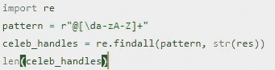
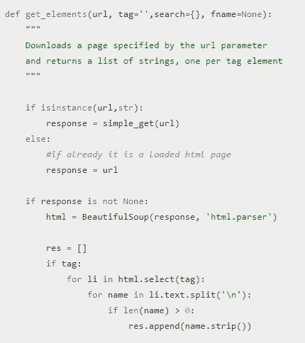
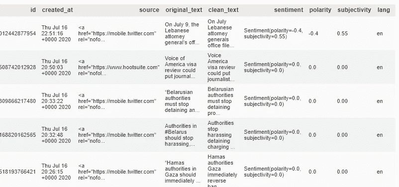
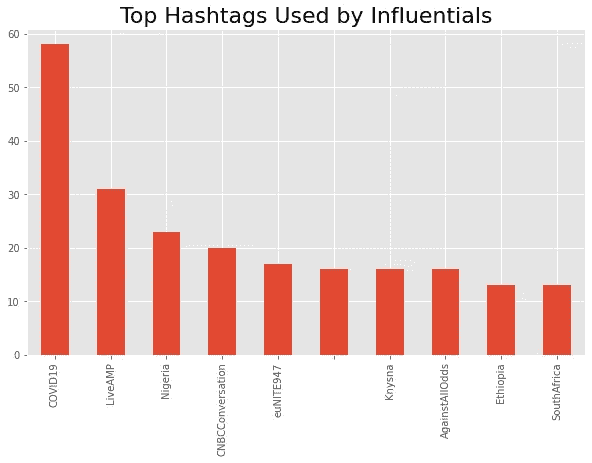
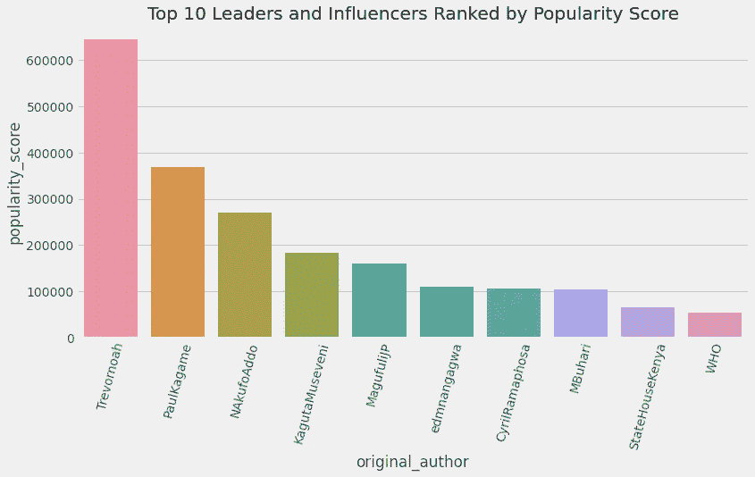

# 社交媒体分析

> 原文：<https://towardsdatascience.com/social-media-analysis-802d7de085a3?source=collection_archive---------59----------------------->

## *分析推文以获得见解并回答业务问题*

社交媒体(Twitter)可以用来推广新的活动或产品吗？

## **简介**

社交媒体是为每个人创造地球村的重要工具。这是一个人们分享他们对正在发生的事情或事件的看法的地方。这篇文章的本质是指导如何从 Twitter 中提取数据并对其进行基本分析，以回答诸如名人中使用最多的标签是什么？谁是被提及最多的 Twitter 用户？等等。我会解释我是如何得到这些数据的，并把我的发现告诉你。敬请关注…

## **先决条件**

1.  python 编程知识
2.  首先确保你有一个 T [witter 账户](http://twitter.com/login)和一个 twitter 开发者账户[点击这里](https://developer.twitter.com/en/apply-for-access)获得一个 Twitter 开发者账户。这为我们提供了对 API 的访问，这将帮助我们进入 Twitter 应用程序，以便我们能够挖掘与我们将在 API 调用中指定的任何有效和公共用户相关的所有推文。

本文分为五个部分，分别是

1.  数据采集
2.  数据清理和分析
3.  结果/发现
4.  结论

# 数据采集

在这篇文章中，我试图启发并让你注意到 Twitter 是如何被用来推广产品和活动的。我特别关注了非洲著名的 Twitter 用户，包括政治领袖和名人。使用的数据包括从 twitter 上搜集的有影响力的推文。这些用户是根据一些指标选出的，这些指标包括

1.受欢迎程度得分=转发次数+点赞次数(每条推文)

2.触及分数=关注者数量-他们关注的人数

3.相关性分数=共享状态数+流行度分数+到达分数

有了这些数据，像非洲最受欢迎的名人，最受欢迎的话题，谁在谈论它等等。用数字和统计来回答。得出的结论是，Twitter 作为一种社交媒体，可以用来推广活动和产品。

使用 Twitter 提供的应用程序编程接口(API)和 Tweepy 库从 Twitter 中抓取推文，以提取影响者共享的推文。提取的推文构成了数据的基础。每条推文都有许多相关元素，比如点赞数、转发数、推文身份、回复数等。这些信息让我能够进行分析，以回答一些普遍的问题，如哪个影响者分享了最多的推文，以及此类推文的赞数和转发数。这些数据还具有地理位置，这使我能够根据非洲大陆的不同地区对推文进行分组，我能够确定这些地方的影响者在谈论哪个主题。该数据包括名人影响者和领导者的 7099 条推文，其中领导者有 1729 条推文，名人影响者有 5370 条推文。每条推文都附有大量信息，在处理和清理推文后，23 条不同的信息解释了推文的文本是什么，来自哪个位置等，这些信息被用于分析。

## 数据清理和分析

用 python Web 抓取库 Beautiful Soup 抓取并格式化网页后，用正则表达式从网页中提取 twitter 句柄。

获取 twitter 句柄的正则表达式代码

基于 html 元素获取网页的请求代码

预处理前

加工和清洗后

## **结果**

对有影响力的人的推文进行分析、评分和加权，以回答商业问题“twitter 是否可以用来推广一项活动”。有 829 个标签被影响者使用，出现最多的标签是 COVID 19。大多数推文来自南非，几乎 75%的推文来自南非约翰内斯堡。领导者总数为 34 人，名人影响者为 91 人，总计 125 人。

新闻 24 一个新闻报道 twitter 页面分享的推文数量最多，但与其他推文数量较少的影响者相比，它的受欢迎程度和到达分数非常低。

平均而言，如果一条推文包含标签 COVID19 并由 GautengProvince 发布，将有 106 条转发和 191 个赞。这显示了当 GautengProvince 在推特上发布关于 COVID19 的消息时人们的反应，也显示了 COVID19 这个话题有多受欢迎。此外，如果一条推文使用标签尼日利亚，并由 MadeInAfrica 发布，它将有 4 个转发计数和 11 个赞。这意味着#尼日利亚不是一个常见的词，因为 MadeInAfrica 的粉丝数量和过去的推文不包含这样的标签。大多数非洲人在他们的推文中不使用标签，例如尼日利亚总统姆布哈里在他过去的 300 条推文中只使用过一个标签，那是在 2020 年 6 月 12 日民主日。世界卫生组织(世卫组织)有最高的得分，但是它不是最受欢迎的，MagufuliP 在图表中名列前茅。

## **结论**

非洲十大领袖

从分析和结果部分来看，很明显，当合适的人使用合适的词语时，twitter 对促进商业活动有很大的影响。由于社交媒体等工具，信息在世界范围内传播得非常快，并且使用来自受欢迎的影响者的正确标签将使这些信息迅速成为趋势。正确的标签将在几秒钟内形成影响者趋势，像艺人这样的影响者，例如特雷弗·诺亚有非常高的受欢迎度和到达分数，尽管事实上与 News24 或世卫组织和特雷弗·诺亚相比，他的共享推文数量明显较低。在推文中使用标签并不意味着推文会流行，也不会增加影响者的受欢迎程度。为了进行更深入和详细的分析，需要更多的数据。像回复计数这样的数据，关于评论推文的人的信息以及他们的评论是什么，将使我们能够详细了解人们如何对影响者的推文做出反应。此外，要进行更深入的分析，需要考虑的一个重要因素是基于影响者的感受或特定地方的趋势的标签。

在这个 [GitHub 库](https://github.com/Abuton/web-scraping-project-twitter-)中可以找到关于分析的完整笔记本。

谢谢你，干杯