# 社交媒体和主题建模:如何在实践中分析帖子

> 原文：<https://towardsdatascience.com/social-media-and-topic-modeling-how-to-analyze-posts-in-practice-d84fc0c613cb?source=collection_archive---------13----------------------->

## 主题建模的实际应用

## 我们讨论主题建模可以用来分析社交媒体上各种文本帖子的方法以及这样做的好处。

图片由 Unsplash 上的 [Alina Grubnyak](https://unsplash.com/@alinnnaaaa) 提供

互联网上每秒钟都会产生大量数据——帖子、评论、照片和视频。这些不同的数据类型意味着有很多内容需要讨论，所以让我们集中讨论一个——文本。

所有的社交对话都是基于书面语言——推文、脸书帖子、评论、在线评论等等。作为一名社交媒体营销人员，一名脸书小组/个人资料版主，或者试图在社交媒体上推广你的业务，你需要知道你的受众对你上传内容的反应。一种方法是全部读完，标记可恶的评论，把它们分成相似的主题组，计算统计数据，然后……仅仅为了看到有成千上万的新评论要加到你的计算中，你就浪费了一大块时间。幸运的是，这个问题还有另外一个解决方案——**机器学习**。从这篇课文中，你将学到:

*   为什么你需要社交媒体分析的专业工具？
*   你能从主题建模中得到什么，它是如何完成的？
*   如何自动在评论中寻找仇恨言论？

# 为什么社交媒体文本是独一无二的？

在开始分析之前，理解为什么社交媒体文本如此独特非常重要:

*   帖子和评论都很短。它们大多包含一个简单的句子，甚至是一个单词或短语。这使得我们只能从一篇文章中获得有限的信息。

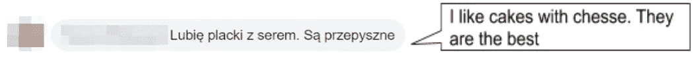

*   表情符号和笑脸——几乎只在社交媒体上使用。它们提供了关于作者情感和背景的更多细节。

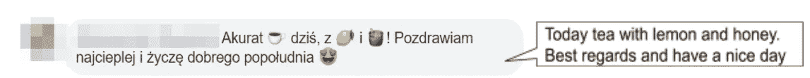

*   使帖子更像口语而不是书面语的俚语。它使陈述显得更随意。

这些功能使社交媒体成为一个完全不同的信息来源，在使用机器学习进行分析时需要特别注意。相比之下，大多数开源机器学习解决方案都基于冗长的正式文本，如维基百科文章和其他网站帖子。因此，这些模型在社交媒体数据上表现很差，因为它们不理解所包含的其他表达形式。这个问题叫做域转移，是一个典型的 NLP 问题。不同的数据也需要定制的数据准备方法，称为预处理。这一步包括从 URL 或提及等无价的标记中清除文本，并转换为机器可读的格式(在 [Sotrender](/modelling-hate-speech-in-polish-importance-of-domain-specific-embeddings-206a02fb3a3b) 中有更多关于我们如何做的内容)。这就是为什么**使用专门为你的数据源创建的工具以获得最佳结果是至关重要的**。

# 社交媒体的主题建模

用于文本分析的机器学习([自然语言处理](https://www.sotrender.com/blog/2019/06/natural-language-processing/))是一个广阔的领域，有许多不同的模型类型可以洞察你的数据。其中一个领域可以回答“给定文本的主题是什么？”就是**话题建模**。这些模型有助于理解人们通常在谈论什么。它不需要任何带有预定义主题的特别准备的数据集。它可以在没有监督和帮助的情况下独自找到隐藏在数据中的模式主题——这使它成为一种**无监督的机器学习**方法。这意味着**很容易为每个单独的问题**建立一个模型。

有许多不同的算法可用于这项任务，但最常见和最广泛使用的是 LDA(潜在狄利克雷分配)。它基于文本中的词频和主题分布。简而言之，这种方法对给定数据集中的单词进行计数，并根据它们的同现率将它们分组到主题中。然后计算每个文档中主题的百分比分布。因此，这种方法假设每个文本都是主题的混合物，这对于每个段落都涉及不同内容的长文档非常有用。

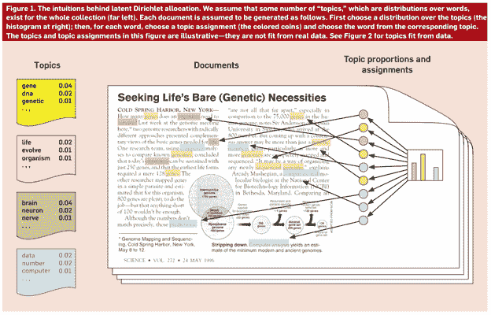

**图一。** LDA 算法(鸣谢:[哥伦比亚大学](http://www.cs.columbia.edu/~blei/papers/Blei2012.pdf)

**这就是为什么社交媒体文本需要不同的程序**。其中一个新算法是 [GSDMM](https://github.com/rwalk/gsdmm) (针对狄利克雷混合模型的吉布斯采样算法)。是什么让这个如此不同？：

1.  它很快，
2.  专为短文本设计，
3.  很容易用一个老师(算法)想要将学生(文本)分成兴趣相似的组(主题)的类比来解释。

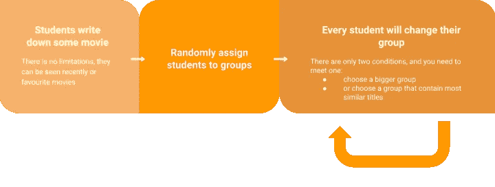

**图二**。组分配算法

学生们被要求在两分钟内写下他们喜欢的一些电影名称。大多数学生能够在这个时间段内列出 3-5 部电影(这对应于社交媒体文本的有限字数)。然后他们被随机分配到一个组。最后一步是每个学生选择不同的桌子，记住两条规则:

*   选择学生多的小组——更喜欢大的小组
*   或具有最相似电影标题的群组—使群组更有凝聚力。

这最后一步重复多次。有利于较大群体的第一条规则对于确保群体不会过度分散至关重要。由于每个学生(文本)的电影标题(单词)的数量有限，每个组(主题)必然会有成员在其列表中具有不同的电影，但来自相同的流派。

作为 GSDMM 算法的结果，您获得了每个文本到一个主题的分配，以及每个主题的最重要单词的列表。

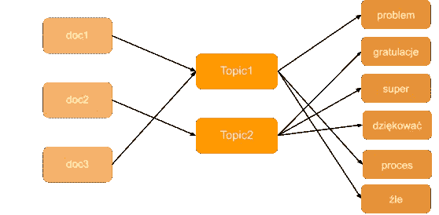

**图三。**记录主题分配并获取主题词

棘手的部分是决定主题的数量(每个无监督方法的问题)，但当你最终做到这一点时，你可以从数据中获得相当多的洞察力:

*   数据中主题的分布

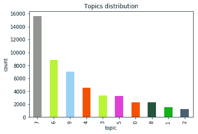

**图 4。**数据中的主题分布

*   词云——允许我们理解主题并命名。这是一个快速简单的解决方案，可以取代阅读整个文本集，并节省您数小时的繁琐工作，将它分成几组。

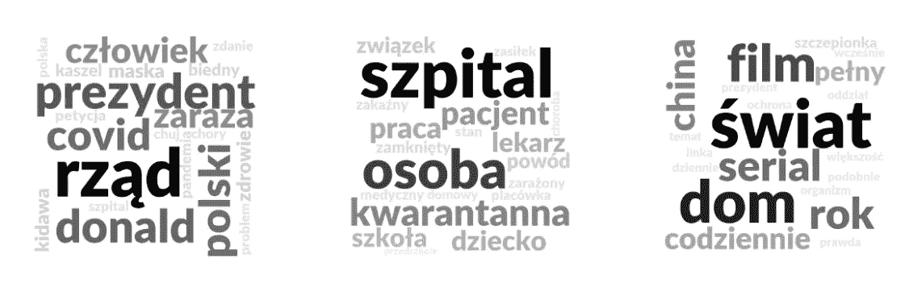

**图 5。**你可以在上图中看到三个单词云的例子。从左到右看，第一个包含单词:总统，政府，迪塞斯，covid——我们可以假设主题是政治。还有一些不太突出的词，如咳嗽、生病和健康，所以这是一个关于政府在健康问题上的行动的话题。

*   主题的时间序列分析——正如我们在下图中看到的，一些主题可能会获得更多的关注，如第 7 个主题，而一些主题会像第 4 个主题一样逐渐消失。试图理解什么是流行的或者将来会流行是一件好事，回顾过去，看看话题是如何变化的。

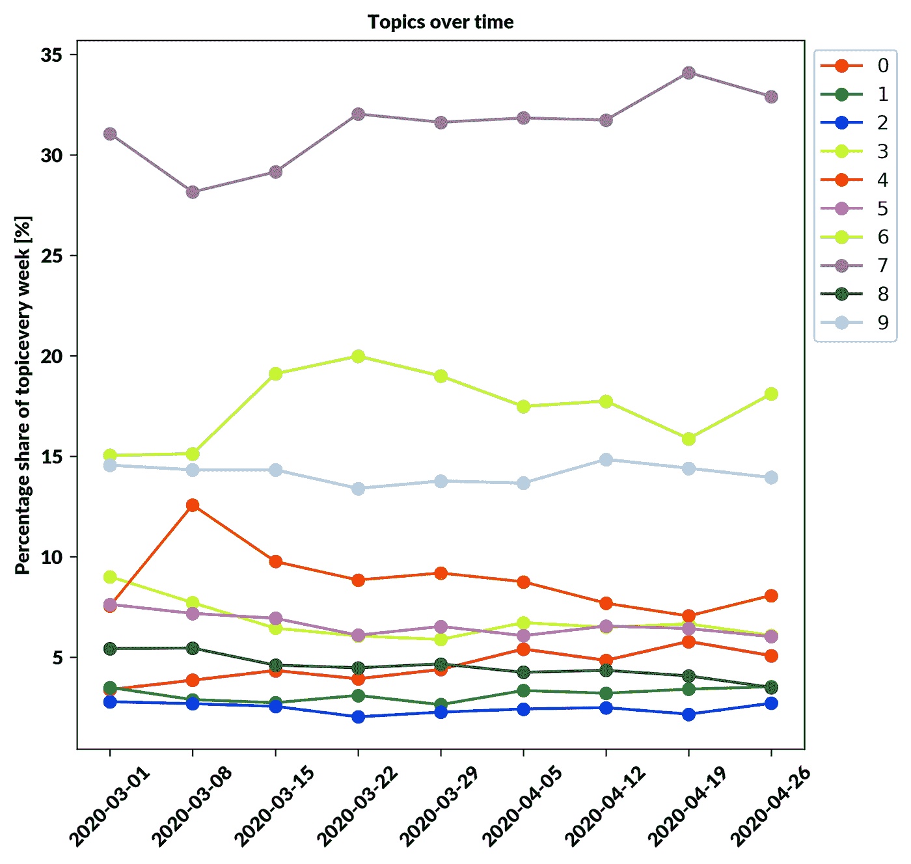

**图 6。**主题随时间的分布

**用例**

在我们最近为 Collegium Civitas 开展的一个项目中，我们分析了 50 000 条社交媒体帖子和评论，并对它们进行了主题分析。它允许我们的客户回答如下问题:

***1)在社交媒体 2 个月的时间跨度里讨论了什么？***

在数据集中，我们能够区分围绕新冠肺炎的 10 个不同的主题。讨论内容包括统计数据和新冠肺炎病因学、日常生活、政府对疫情的反应、旅行限制的后果、贸易市场和供应、日常生活、疫情期间的医疗保健、教会和政治、新冠肺炎的常识和阴谋论、政治和经济、垃圾短信和广告。

***2)疫情局势对讨论有什么影响？***

在疫情爆发期间，最大的主题是新冠肺炎的起源和统计。人们谈论着形势是如何变化的，并就疾病传播的方式交换信息。要阅读更多内容，请访问 [Collegium Civitas 网站](https://www.civitas.edu.pl/pl/uczelnia/aktualnosci/raport-czas-pandemii-w-polskich-mediach-spolecznosciowych)(仅波兰版)。

# 仇恨语音识别

另一个可以用机器学习回答的问题是“**人们在评论或帖子中表达的是一种什么样的情绪？**"或"**我的内容是否产生了仇恨评论？**”。在波兰语中，这些任务只有几种解决方案。这就是为什么我们在 **Sotrender** 建立基于社交媒体文本的情绪和仇恨言论识别模型。我们的解决方案分两步构建。

第一步是将文本和表情符号转换成数字向量表示(嵌入)，以便稍后在神经网络中使用。该步骤的主要目标是实现某种语言模型(LM ),该语言模型具有人类语言的知识，使得表示相似单词的向量彼此接近(例如:queen 和 king 或者 paragraph 和 article ),这意味着这些单词具有相似的意思(语义相似性)。该属性如下图所示。

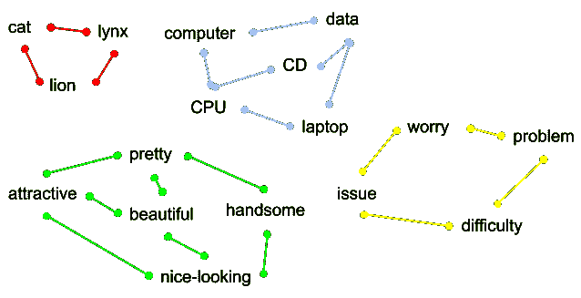

**图 7。**词语相似背后的直觉

训练这种模型类似于通过与孩子交谈来教他们如何说话。孩子们通过听父母说话能够理解单词的意思，他们听得越多，理解得越多。

根据这个类比，我们必须使用一组庞大的社交媒体文本来训练我们的模型理解它的语言。这就是为什么我们使用一组 1 亿条帖子和评论来训练我们的模型，这样它就可以正确地给单词和表情符号分配向量。用嵌入模型矢量化的记号向神经网络提供输入。

第二步是为特定任务设计神经网络——仇恨言论识别。最重要的是数据集——该模型需要仇恨言论和非仇恨文本的例子，以学习如何区分它们。为了获得最佳结果，您需要试验不同的架构和模型的超参数。

作为仇恨言论识别模型的结果，我们得到了数据集的另一个分组。现在我们可以看到**我们的观众如何反应，它创造了多少仇恨的评论或帖子**。更重要的是，通过再次结合每条评论的发布时间，我们可以看到**是否有一个特定的时间段产生了最可恶的评论**，如下图所示。

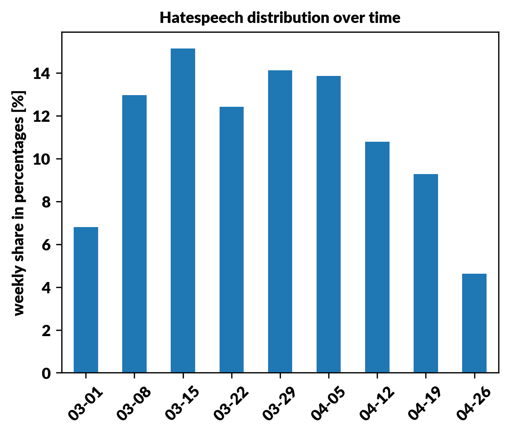

**图**图 **8。**仇恨言论随时间分布

将这种分布与最近的帖子或事件结合起来，可以让你**洞察到激怒人们的内容类型**。仇恨言论贡献的时间变化也可能与话题分布的变化相关。综合分析得到的所有信息可以提供数据集的深度图像。

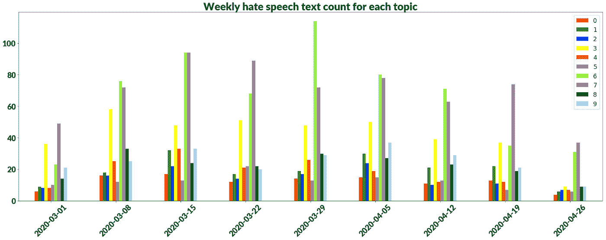

**图九。**每周文字计数含仇恨言论

如上图所示，大多数仇恨与话题 3、6 和 7 有关。**知道什么让人生气，给了以后避开敏感话题的机会。**

情感分析也是如此。我们可以为正面、负面或中性的评论生成类似的可视化效果，并查看它们在时间或主题上的分布。如果您想阅读基于我们 8 周数据分析的完整报告，您可以在这里找到(仅波兰版本)。

# 结论

在 Sotrender 中，我们有仇恨言论和情绪识别的模型，这些模型会针对社交媒体文本不断改进和更新。此外，我们还拥有为个别案例构建主题建模模型的经验。如您所见，这种类型的分析有很多好处:

*   了解你的观众
*   深入研究评论的主题
*   发现流行主题
*   在我们的内容中寻找仇恨或消极的根源

仅举几例！

# 参考

[1]尹，建华，，[一种基于 dirichlet 多项式混合模型的短文本聚类方法](http://dbgroup.cs.tsinghua.edu.cn/wangjy/papers/KDD14-GSDMM.pdf)，(2014)，14 .