# 风险投资中的社会网络分析

> 原文：<https://towardsdatascience.com/social-network-analysis-in-venture-capital-4db03cb5d833?source=collection_archive---------44----------------------->

## 洞察新加坡的在线风险投资格局

# 将社会资本作为一种资源

风险资本家利用各种积累的资源(筛选、监控、顾问等)来改善他们的战略和投资过程。尽管它们可能不像财务报表或研究报告那样显而易见，但社交媒体提供了风投可以利用的替代数据金矿，其形式为[社会资本](https://en.wikipedia.org/wiki/Social_capital)。

# 社会网络分析的相关性

SNA 是通过使用网络和图论来调查社会结构的过程。它是现代社会学中的一项关键技术，我们的目标是将它应用于网络数据，以识别市场中不同参与者的社会资本:投资者、初创企业、新闻机构、生态系统合作伙伴和政府机构。我们的目标是使用 SNA 来识别市场中的关键参与者，制定投资组合战略以管理风险，寻找新的机会，并规划在线关系以抢先采取任何必要的防御或进攻行动。

# 抓取 Twitter 数据

我们的目标是用 Twitter 数据构建知识图表。为了防止冷启动问题，我们进行了初步的人工搜索，从新加坡的大型初创公司、风投、政府法定委员会和新闻网站收集了 79 个企业账户。他们总共有 100 万粉丝，5 万粉丝，40 万推文。

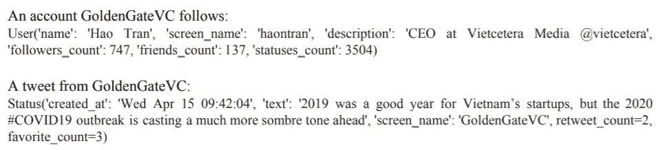

使用 Twitter API 从帐户中收集原始数据的示例

我们维护了单独的字典，以包含用户之间的 4 种不同类型的关系，具有以下键:值对:

1.  遵照
2.  提及—选择以“@”开头的标记
3.  Hashtags —选择以' # '开头的标记
4.  常见关键词——使用基于[宾夕法尼亚树库项目](https://www.ling.upenn.edu/courses/Fall_2003/ling001/penn_treebank_pos.html)的词性标注从所有推文中选择名词和形容词

然后，我们通过递归地从关注和提及列表中抓取用户来扩展我们的数据集。我们可能会有很多噪音和垃圾邮件帐户，所以我们根据他们帐户的活动来过滤他们。然后，字典将用于构建图表。

# 理解图表

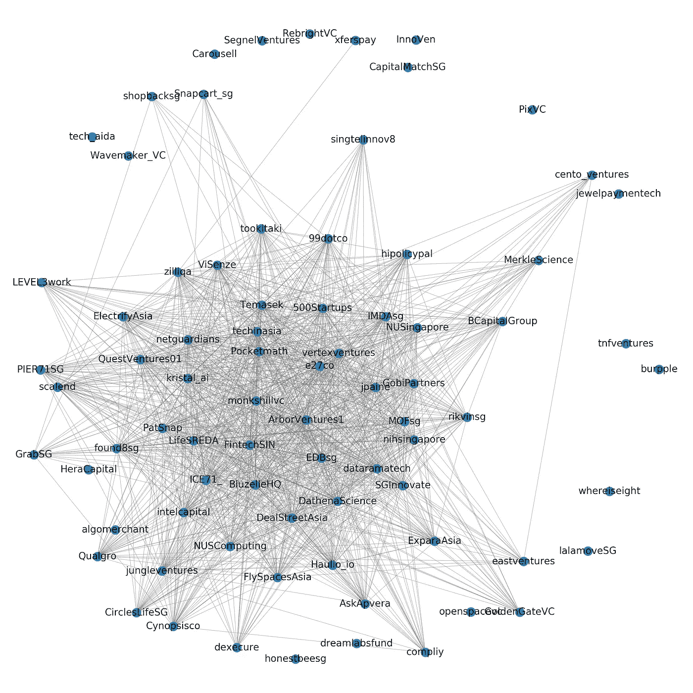

初始用户集的标签图示例

节点代表用户，边代表他们通过关注、提及、关键词或标签的双向关系。对于 Hashtag 和关键字图，当两个节点具有共同的关键字/hashtag 时，在它们之间形成一条边。图形的大小受限于完成的抓取量。

# 调查的结果

## 1.社交网络的整体属性

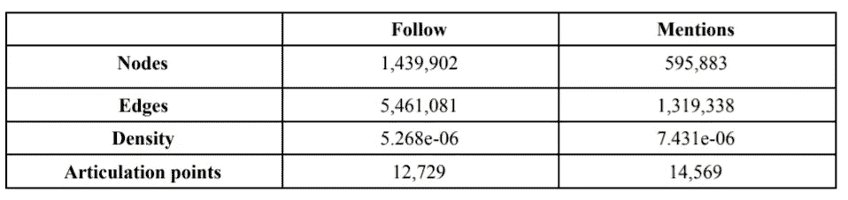

(1)密度= 2*E / (V*(V-1))其中 E 和 V 是边和节点计数。(2)铰接点是如果被移除，则将图分成更多部分的节点。如果没有这样的点，每个用户都以这样或那样的方式相互连接

社交网络是稀疏的，可能意味着与 SG 中的风投相关的整个在线社交社区是断开的。不同的参与者可能有非常不同的兴趣，并且可能属于不同的行业。对于 79 大小的小图，衔接点是跟随图中的 [@BluzelleHQ](https://twitter.com/BluzelleHQ) 、[@ society on](https://twitter.com/SocietyOn)&[@ FintechSIN](https://twitter.com/FintechSIN)和提及图中的[@ PayPal](https://twitter.com/PayPal)&[@ SG innovate](https://twitter.com/SGInnovate)。这些可能是将不同社区联系在一起的关键客户。

## 2.社交网络中的子社区

我们使用无监督学习算法在没有任何标签的输入图形数据中寻找模式。

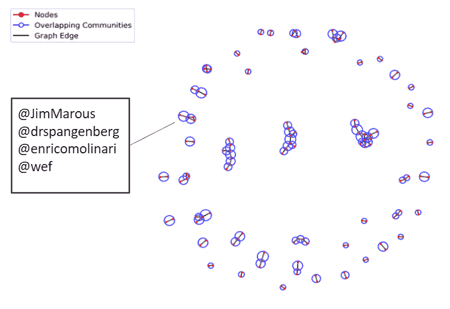

NetworkX 的最大团发现算法在我们的图中识别更小的组。形成团，使得每两个不同的顶点是相邻的。最大团是一个不能通过增加一个相邻顶点来扩张的团。突出显示的最大集团出现在提及图中。

[@JimMarous](https://twitter.com/JimMarous) 是金融科技的发言人&出版商， [@drspangenberg](https://twitter.com/drspangenberg) 法学教授， [@enricomolinari](https://twitter.com/enricomolinari) 创新经理， [@wef](https://twitter.com/wef) 世界经济论坛的官方账号。尽管很可能是天马行空的想象，一段关系可能是在世界经济论坛的一次活动中形成的，一个新的项目可能正在进行中，或者他们可能只是对一些话题有相同的兴趣。风投可以利用这一点来探索潜在的战略伙伴关系，甚至进行投资。

## **3。社交网络中的桥梁**

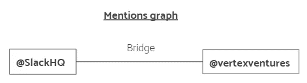

它类似于连接点，但是被表示为关系而不是单个实体。

桥是图中的重要关系，它将几个社区联系在一起。在提及图中，发现了@SlackHQ 和@vertexventures 之间的桥梁。这很有意思，因为根据 Vertex Ventures 的[投资组合](https://www.vertexventures.sg/#portfolio)，他们似乎没有投资 Slack，但他们可能对该公司有特殊兴趣。

## 4.用户之间的间接关系

Dijkstra 的算法用于查找提及图中两个帐户之间的最短路径。

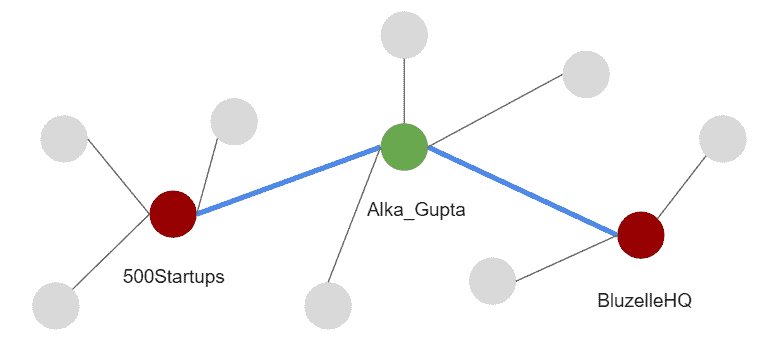

[@500Startups](https://twitter.com/500Startups) 可能对初创公司 [@BluzelleHQ](https://twitter.com/BluzelleHQ) 感兴趣，并且想知道联系他们的最佳方式。虽然他们可以冷接触或找到一个线索，但联系他们之间的普通人可能更有效。这位恰巧是沃顿商学院和易贝商学院的董事顾问 [@Alka_Gupta](https://twitter.com/alka_gupta) 。

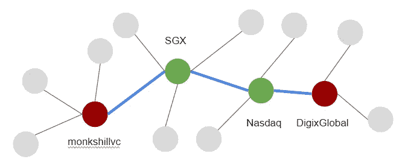

另一个有趣的例子是智能资产公司 [@monkshillvc](https://twitter.com/monkshillvc) 到 [@DigixGlobal](https://twitter.com/DigixGlobal) 之间的路径。 [@SGX](https://twitter.com/SGX) 和[@纳斯达克](https://twitter.com/NASDAQ)都从事证券交易业务，有与投资方 monkshillvc 合作的可能。

## 5.有影响力的账户

**度中心性**

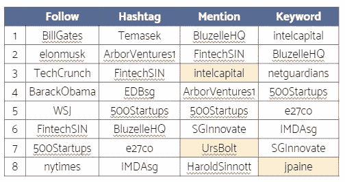

一个节点的度是它有多少条边。

除了那些显而易见和受欢迎的名字，还有几个有趣的账户值得注意。

@英特尔资本的简历:“通过合作的力量帮助建立伟大的公司”。这可能是英特尔投资在风险投资领域脱颖而出的方式。

@UrsBolt 是瑞士财富科技和金融科技大使。他的人脉很广，对那些对这些行业感兴趣的人来说，他可能是一笔财富。

[@jpaine](https://twitter.com/jpaine) 是 [@GoldenGateVC](https://twitter.com/GoldenGateVC) 创始合伙人、 [@Founding](https://twitter.com/Founding) 新加坡董事。他通过关键词建立了良好的关系，这可能意味着他的推文与生态系统中的其他人非常相关。

**接近中心性**

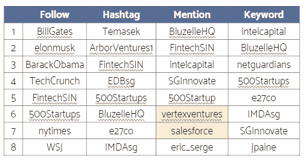

表示网络中一个节点与所有其他节点的距离。计算为从该节点到所有其他节点的最短路径长度的平均值。

[@vertexventures](https://twitter.com/vertexventures) 通常与网络中的大部分账户直接连接或“一跳之遥”。这似乎与他们的简历“Vertex Ventures 是一个全球性的运营商-投资者网络，管理美国、中国、以色列、印度和东南亚的投资组合”相一致。

[@salesforce](https://twitter.com/salesforce) 是一个有趣的发现，因为他们在网络中直接或至少通过另一方(通常可能是组织中的员工)被多次提及。这突出了网络中对 CRM 软件的潜在需求，并可能成为风险投资家与此类供应商合作的机会，以降低其整个公司组合的成本。

**中间中心性**

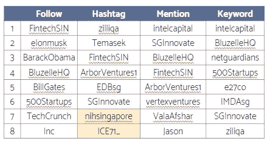

量化一个节点作为两个其他节点之间最短路径上的桥的次数。

[@nihsingapore](https://twitter.com/nihsingapore) 和 [@ICE71_](https://twitter.com/ICE71_) 都是基于 SG 的社区平台/生态系统。这是有道理的，因为他们经常作为关系的中间人“介于”初创公司和投资者之间。

## 6.“富人俱乐部”

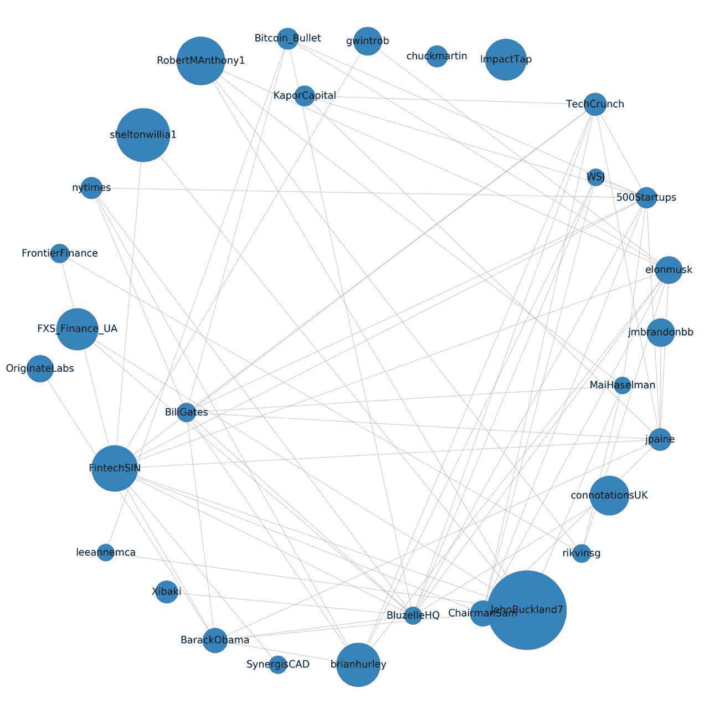

使用谷歌流行的 PageRank centrality,“富人俱乐部”由关系良好的账户组成，这些账户之间也有联系。

[@ImpactTap](https://twitter.com/ImpactTap) 是高影响力，但与其他有影响力的账户联系不紧密。这可能是一个风险投资或创业公司与这个新闻来源组织合作的机会。

@OriginateLabs 是一家来自柏林的数码产品公司， [@SynergisCAD](https://twitter.com/SynergisCAD) 是一家来自美国的工程创新公司，这两家公司都很有影响力，但只与“富人俱乐部”中的 [@FintechSIN](https://twitter.com/FintechSIN) 有联系。他们可能对 SG 市场感兴趣。

[@KaporCapital](https://twitter.com/KaporCapital) 是一家总部位于加州的风险投资公司，与 GoldenGateVC 的 [@jpaine](https://twitter.com/jpaine) 有关联，他们的集体影响力可能会为跨境共同投资机会提供一个更有说服力的理由。

## 7.预测新的关系

我们训练二进制分类模型来基于图的特征预测是否在 2 个节点之间形成边。该图由通过 [node2vec](https://cs.stanford.edu/~jure/pubs/node2vec-kdd16.pdf) 从嵌入层获得的特征表示，node2vec 是一种半监督算法，它最大化了在 d 维特征空间中保存节点的网络邻域的可能性。图中的边将被移除以形成模型的训练数据。移除的边缘将成为验证预测的基础事实。

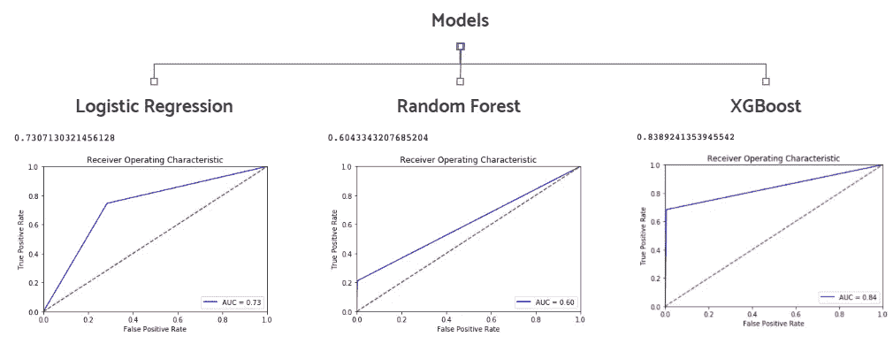

各种分类模型通过其 [AUROC](https://glassboxmedicine.com/2019/02/23/measuring-performance-auc-auroc/) 分数进行评估。

**下图中有趣的链接预测**

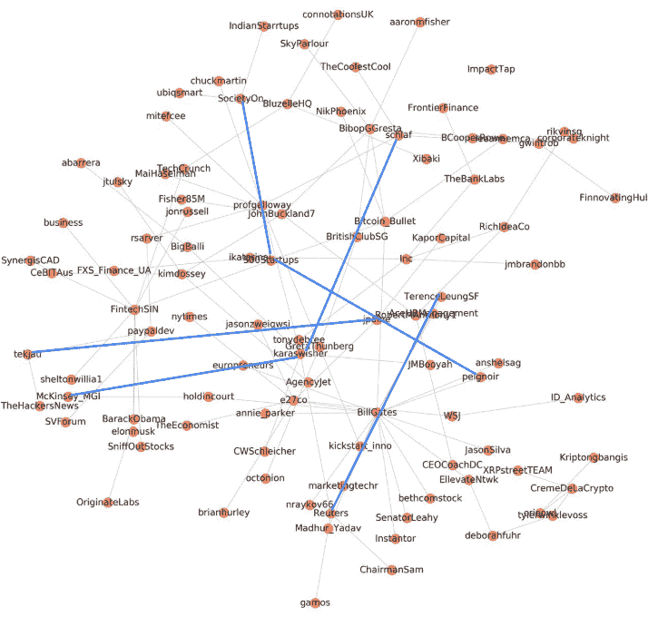

( [@tekjau](https://twitter.com/tekjau) **，**[@ j Paine](https://twitter.com/jpaine))—Razer fin tech Malaysia 的技术 AVP 可能与 GoldenGate 的创始合伙人有关联。

( [@peignoir](https://twitter.com/peignoir) **，**[@ 500 startups](https://twitter.com/500Startups))**—Startup Weekend(最大的创业活动之一)的联合创始人和 VC 500Startups 未来可能会有一个协会，甚至在一个活动上合作。**

**( [@TerenceLeungSF](https://twitter.com/TerenceLeungSF) **，** [【路透社)](https://twitter.com/Reuters) - TerenceLeungSF 在一家初创公司 One Network Enterprises 工作，这种预测的关系可能意味着路透社风投部门的潜在兴趣。**

****标签图中有趣的链接预测****

**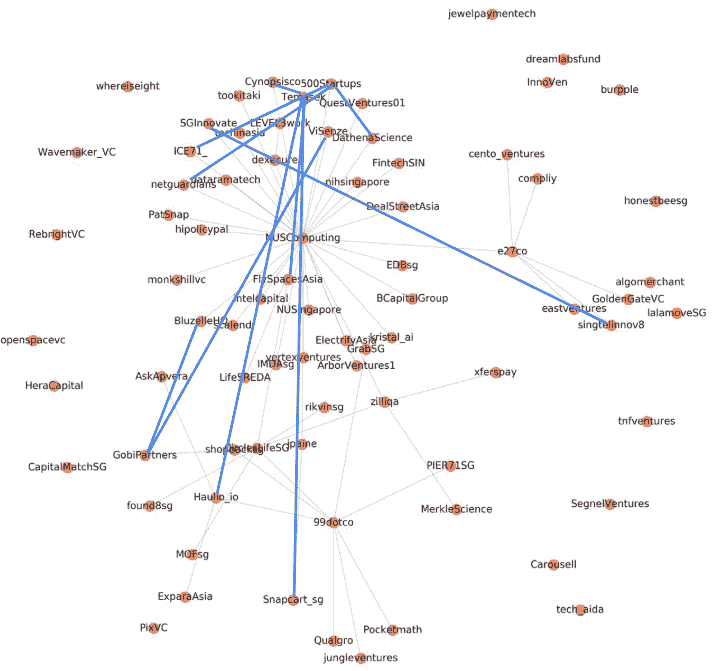**

**有几个 VC:[@ singtelinnov 8](https://twitter.com/singtelInnov8)， [@GobiPartners](https://twitter.com/GobiPartners) ， [@500Startups](https://twitter.com/500Startups) 潜在与创业公司形成关系的: [@Snapcart_sg](https://twitter.com/Snapcart_sg) ， [@Haulio_io](https://twitter.com/Haulio_io) ， [@ViSenze](https://twitter.com/ViSenze) ， [@DathenaScience](https://twitter.com/DathenaScience) 。**

# **结论**

**网络数据形式的社会资本有可能破坏风险投资生态系统。在一个运营和通信日益数字化的时代，用户之间在网上形成的关系变得更加普遍。社交网络分析让我们能够从 Twitter 等公共来源的数据中挖掘出真知灼见。我们使用图形表示社交媒体数据，并实现算法来揭示有趣的信息。**

**这些数据包含个人但公开的信息。如果需要，我会毫不犹豫地记下任何信息。请让我知道。这些见解也是不可信的，因为它具有高度的投机性。**

**这个项目是学校数据挖掘课程的一部分。我的队友阿诺德、简斌、尼古拉斯和炙心功不可没。**