# 用社交网络分析信任

> 原文：<https://towardsdatascience.com/social-network-analysis-of-trust-the-epinions-dataset-22769505672d?source=collection_archive---------27----------------------->

[Cytonn 摄影](https://unsplash.com/@cytonn_photography?utm_source=unsplash&utm_medium=referral&utm_content=creditCopyText)在 [Unsplash](https://unsplash.com/s/photos/hands?utm_source=unsplash&utm_medium=referral&utm_content=creditCopyText) 上拍照

社交网络可以用图的形式来表示，其中用户用节点来表示，用户之间的关系形成边。除了像脸书和推特这样最受欢迎的社交网络，其他类型的网络也可以被分析。在这篇文章中，我们将从 Epinions 网站用户的评论中分析建立在信任基础上的社交网络。Epinions 曾经是一个人们可以评论产品的网站。用户可以免费注册，并根据他们的评论被发现有用的程度来赚钱。由于有人试图利用这个系统，作为一个可能的解决方案，一个信任系统被放置在适当的位置。用户可以将人们放入他们的信任网中，他们可以将那些评论一贯被认为有用的人放入他们的“黑名单”，即“那些评论一贯令人反感、不准确或总体上没有价值的作者”。

**预处理**数据集从 SNAP(斯坦福网络分析项目)网站下载。这个项目是用 Python 完成的，使用了库 NetworkX。为了生成图表并获得其他有用的统计数据，我们制作了一个数据框，其中包含每个节点所有类型度数的统计数据。

**结构分析**网络以有向加权图的形式给出，其中权重为 1 的边表示信任关系，权重为-1 的边表示不信任关系。重要度量的值如下。

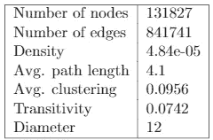

重要措施。

这是一个稀疏网络，聚集系数很高，对于一个社交网络来说很常见。平均聚集系数很高，因为它比随机网络要大得多。传递性是对平均聚类系数。相对于网络大小，直径较小。正边约占边总数的 85%。

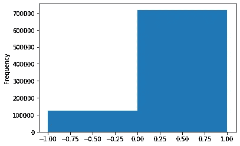

边缘重量分布。

当我们使用信任网络时，我们对至少有一个度的节点的度分布感兴趣(也就是说，至少有一个人信任或不信任那个人)。这里的“程度”是受欢迎程度的代表。我们的第一个假设是，这种分布遵循幂定律(少数高信任节点，大量低信任节点)。检查它是否存在的一种方法是看度数分布的双对数图是否是线性的。

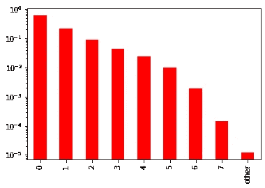

对数对数指数分布。

这种关系是线性的，所以我们对幂律分布的假设是正确的。接下来我们要检查的是度数分布是否处于无标度状态，也就是说

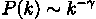

其中 *k* 表示度数大小，2 < γ < 3。我们运行内置函数，得到幂律系数等于 1.70，所以这个网络不在无标度区。即使我们不在无标度区，度数分布也是异质的，平均值没有多少统计意义。

**小世界现象**最大弱连通分量的平均最短路径为 4.1，小于过渡基线 6 和 11(其中节点总数的对数)。所以我们网络的底层有向图是一个小世界模型。这对于具有中枢的网络来说是常见的:对于无尺度机制，它与 log logN 成比例(在这种情况下，如果我们处于无尺度机制中，它将是 2.4)。

**蝶形结构**我们可以通过检查连接的组件来获得关于网络结构的更多信息。最大强连通分量和最大弱连通分量由 41441 和 119130 个节点组成。第二大强连通分量等于 15，第二大弱连通分量等于 20。因此，我们可以得出结论，我们的图有一个很大的组成部分，其中人们相互跟随，占整个网络的大约 30%，大约 90%的节点以某种方式连接。这些分量中的边数分别为 693737 和 833695，分别占边总数的 0.825%和 0.991%。我们用网络的结构做了一个类比，最后检查它是否有一个蝶形结构。我们找出了外部组件的尺寸，并得到以下结果:

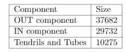

其他组件。

我们确实有一个蝶形结构。它与原始的网状结构相当，只是卷须和导管的总体比例比原始情况下小得多。这很正常，考虑到我们有一个小世界网络。

互惠对于这个网络来说，最重要的措施就是互惠。互惠可以和社会选择联系在一起(我信任信任我的人)。对于我们的图表，整体互易性等于 0.31。对于最强的连通分量，互易性等于 0.37。

**学位对图**不同类型的学位之间有什么关系？

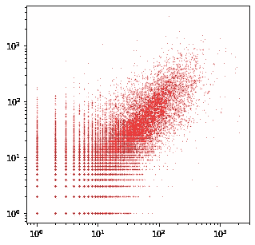

程度与程度的关系。

平均而言，外向度较高的节点往往具有较高的内向度。在具有小内度和外度的节点之间，没有明显的相关性。

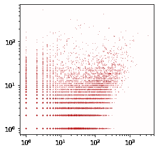

积极与消极的程度。

从这个情节中，我们看到最受信任的作者并不倾向于最不受信任的作者。高度不被信任的作者通常有大约 100 个负面的边缘。

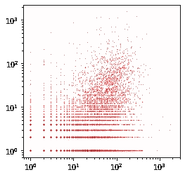

正与负输出度。

从图中，我们看到大多数人更喜欢信任而不是不信任的关系。但是我们已经从边权重分布中知道了。

我们记得，同配性意味着节点倾向于连接到具有相似能力的其他节点，而异配性意味着具有较高程度的节点连接到具有较低程度的节点。

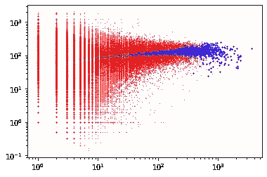

外向度匹配度。

从该图中，我们看到节点基于它们的出度是分类的，即它们连接到具有相似出度的节点。

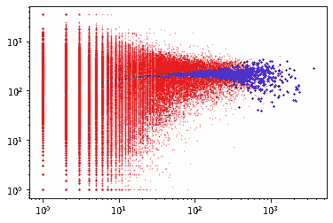

不同程度的协调性。

然而，进入的边缘往往是轻微的异配。这并不奇怪，因为高进入度的边倾向于连接到低进入度的边，这仅仅是因为它们没有太多相似的边。

**富人俱乐部效应**我们想看看最可信的边缘之间有多少互连。由于我们网络的规模和幂律性质，我们无法观察到一定比例的节点，只能观察到前一百个节点。我们研究了两种迹象的密度。

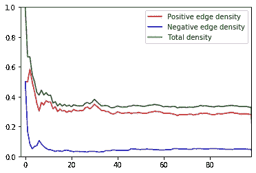

热门节点的丰富俱乐部效应。

从剧情上看，我们没有富人俱乐部效应。在十个最受欢迎的边之后，密度保持在 0.4 左右。由于密度接近一半，我们要检查的是连接倾向于单侧还是随机的一对节点相互跟随。这个子图的互易性是 63%，所以我们得出结论，流行的边通常是不相连的，但当它们相连时，下面是互易的。一种解释是，我们可能认为这些流行节点来自不同的组，因此不在网络中通信。从剧情中我们也看到了一些最信任的成员对其他高信任成员的不信任。

**负富俱乐部**这有点不常见，但我们也想检查负度数最高的边之间是否存在某种关系。想象一下，在我们的社交网络中，我们有一群人的观点偏离了共识(想想阴谋论者或一群网络巨魔)，他们通常不喜欢，但在他们的群体中非常受欢迎。通过检查这些节点之间的富人俱乐部效应，我们可以检查这样一个群体的存在。

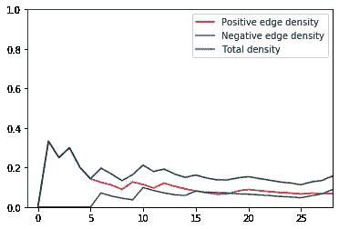

冷门节点的富人俱乐部效应。

由于顶部四个最不可信的顶点之间没有连接，我们将它们删除并绘制了另一个图形。然而，我们看到不信任的节点之间没有高度的互连(有一定程度的信任，但不显著)。我们看到它很快变成了不信任。所以，这个网站不被信任的成员倾向于像孤岛一样运作。

**社区结构**我们的图表没有任何关于图表中潜在社区结构的先前信息。因此，我们使用 Louvain 算法来检测它们。与同类算法相比，它的优势在于速度非常快，即使对于大型网络也是如此。我们的主要目标是找到最中心的社区，因此我们观察了最大 SCC 的基本无向图(忽略了边权重，因为不信任的成员仍然是社区的一部分)。

Louvain 算法产生了少量的大组件和大量的非常小的社区。总共有 11 个社区至少有 100 名成员，它们的规模如下:10032、10540、453、11587、221、143、945、311、111 和 124。

因此，有三个大的社区，每个社区占最大 SCC 的大约 25%。由于这是一个大型网络，因此该算法可能无法检测小型网络(分辨率限制)。然而，由于总模块性等于 0.43，我们对获得的结果感到满意。

**行为采纳**我们感兴趣的是，在可信网络中，某种行为的采纳会是什么样子。例如，假设这是一个医生网络，新的疗法已经出现。开始时，一些高度信任的医学家会开始认为这种疗法是好的(我们假设他们越被信任，在某种程度上就越了解医学进步)。此外，一些极不被信任的医学家也会采取同样的观点。但是，网络中的节点不知道其他节点的受欢迎程度。因此，只有当他们信任的一定比例的人也会采纳某个观点时，他们才会采纳这个观点。此外，被收养人的行为收养将否定可信节点的行为收养的影响。我们假设一个观点一旦被采纳，就不会被改变(否则这个人可能会改变观点，因为不信任的人会否定它)。通过这种方式，我们实施了单调传播(这种疗法可能有效，人们不会检查他们不信任的人的行为)。为了产生这些结果，我们设置了相同的随机种子。我们假设最初，300 个最信任的人中有 200 个采纳了一个观点，同时 100 个最不信任的人中有 50 个会采纳这个观点(他们可能知识渊博，但是由于各种其他原因而不被信任)。

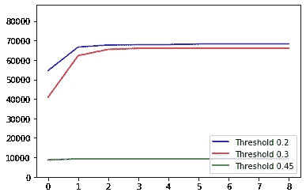

采用一种行为。

从剧情中我们看到，对于较小的门槛，意见采纳会比较快，而对于较大的门槛，则不会扩散太多。然而，我们希望看到更多有趣的动态。我们通过将阈值设置为 0.4 来生成它们。

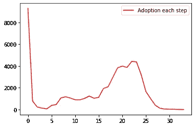

每一步的收养数量。

我们看到，在某些时候，人们几乎已经停止采纳意见，但在某些时候，它开始上升。我们知道，由于幂律结构，观点最初传播得很快，但后来传播速度变慢了。这发生在它到达一个密集的星团时，在它的边界度过一段时间后，它开始膨胀。平均每采纳一个意见需要 17.12 个时间单位！这是整个过程持续时间的一半。此外，由于幂律结构，我们可以将意见的大的初始传播归因于这样的事实，即相当多的少数节点大多只关注受欢迎的节点，因此使他们更愿意采纳意见。接下来，我们看进化图。

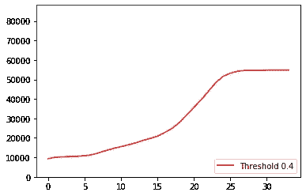

行为采纳的进化。

我们有兴趣看看其他结构属性是如何强制采纳意见的。似乎合乎逻辑的是，观点不会在外部组件中传播，这是事实，因为只有 26%的成员采用了新的观点。

我们检查的下一件事是在创建的社区中采纳意见。我们想知道这种观点在他们中间传播了多少。我们观察了包含至少一百个节点的六个最小的社区。

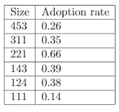

小型社区的采用率。

我们看到在这些社区中有密集的集群阻止采纳意见。这进一步表明该数据集包含一定数量的小型异质社区。这是为什么我们在这种情况下没有信息级联的原因之一。其他原因包括:

*   一些节点没有外部度，因此它们没有可信用户的基础。
*   位于最大弱连通分量之外的节点与主事件隔离开来。
*   不信任比信任多得多的节点(就像在现实生活中，有些人只关注消极的方面)。

**结论**我们已经看到 Epinions 网络展现了社会网络的典型行为:稀疏性、幂律结构和高聚集系数。我们分析了不同程度类型的配对图及其相关性，并获得了有价值的见解。我们已经证明了存在社会选择，我们没有丰富的俱乐部效应。我们隔离了 11 个明显的社区，并检查了其中最小的社区的行为采纳情况。

由于信任是基于所接收信息的质量，我们将它的结构与一般的网络结构进行了比较，我们发现它们是相似的。我们还检查了我们社区的收养行为，发现它基本上不受外界影响。

意见采纳的模拟显示了网络如何对不同阈值的意见采纳做出反应，以及它如何通过组件和社区传播。

代号:[https://github.com/radenjezic153/ComplexNetworkAnalysis](https://github.com/radenjezic153/ComplexNetworkAnalysis)