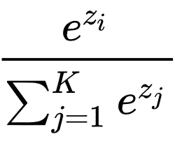
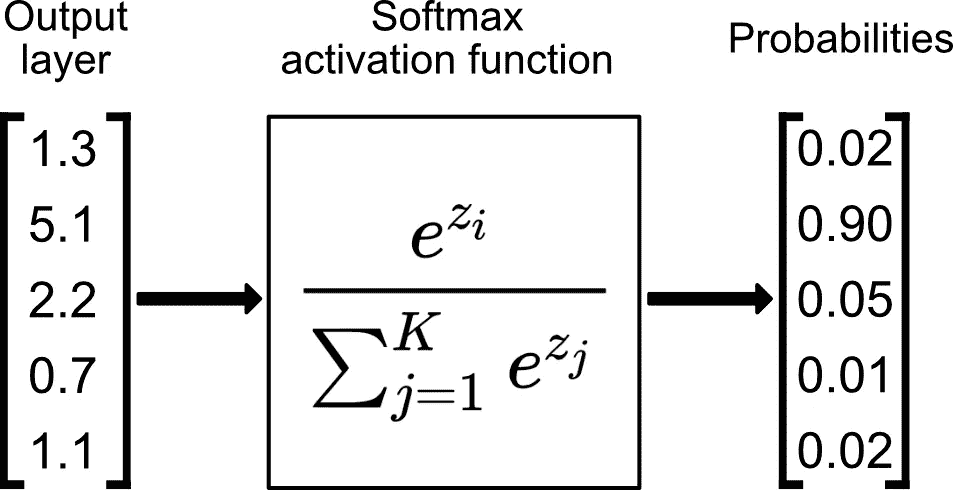

# 解释了 Softmax 激活功能

> 原文：<https://towardsdatascience.com/softmax-activation-function-explained-a7e1bc3ad60?source=collection_archive---------21----------------------->

## 并从零开始实现。

如果你做过深度学习，你可能会注意到两种不同类型的激活函数——一种用于隐藏层，一种用于输出层。


照片由 [Aaron Burden](https://unsplash.com/@aaronburden?utm_source=medium&utm_medium=referral) 在 [Unsplash](https://unsplash.com?utm_source=medium&utm_medium=referral)

用于隐藏层的激活函数对于所有隐藏层来说几乎是相同的。不太可能看到 ReLU 用在第一个隐藏层上，后面是双曲正切函数——一般都是 ReLU 或者 tanh。

但是我们在这里说的是输出层。这里我们需要一个函数，它接受任何值，并将它们转换成概率分布。

Softmax 功能来拯救。

该函数对于**分类**问题非常有用，尤其是当你处理多类分类问题时，因为它会报告每个类的“置信度”。因为我们在这里处理的是概率，所以 softmax 函数返回的分数总和将为 1。

因此，预测类是列表中置信度得分最高的项目。

现在，我们将看到 softmax 函数是如何用数学方法表达的，然后将它翻译成 Python 代码是多么容易。

# 数学表示

根据官方[维基百科页面](https://en.wikipedia.org/wiki/Softmax_function)，下面是 softmax 函数的公式:



乍一看可能会令人望而生畏，但这是你在研究深度学习时会遇到的最简单的函数之一。

它指出，我们需要对输出层的每个元素应用一个标准指数函数，然后通过除以所有指数的总和来归一化这些值。这样做可以确保所有取幂值的总和等于 1。

如果需要，请花时间多次通读前一段，因为这对进一步理解至关重要。如果仍然有点模糊，我们准备了一个(希望)有用的图表:



以下是步骤:

1.  对输出图层的每个元素取幂，并将结果相加(本例中约为 181.73)
2.  取输出层的每个元素，对其取幂并除以步骤 1 中获得的和*(exp(1.3)/181.37 = 3.67/181.37 = 0.02)*

到目前为止，我希望您已经了解了 softmax 激活函数在理论上是如何工作的，在下一节中，我们将在 Numpy 中从头开始实现它。

# 履行

如果你已经理解了前一部分，这一部分将会很容易和直观。如果没有，简单的 Python 实现应该仍然有助于一般的理解。

首先，让我们声明一个模拟神经网络输出层的数组:

```
output_layer = np.array([1.3, 5.1, 2.2, 0.7, 1.1])
output_layer**>>> array([1.3, 5.1, 2.2, 0.7, 1.1])**
```

把这想成 K 类分类问题，其中 K 是 5。接下来，我们需要对输出层的每个元素求幂:

```
exponentiated = np.exp(output_layer)
exponentiated**>>> array([ 3.66929667, 164.0219073 , 9.0250135 , 2.01375271,
 3.00416602])**
```

现在我们准备计算概率！我们可以使用 Numpy 将每个元素除以取幂和，并将结果存储在另一个数组中:

```
probabilities = exponentiated / np.sum(exponentiated)
probabilities**>>> array([0.02019046, 0.90253769, 0.04966053, 0.01108076, 0.01653055])**
```

就是这样-这些是从输出图层的原始值中获得的目标类概率。

之前我们提到过概率之和应该等于 1，所以让我们快速验证一下这句话是否有效:

```
probabilities.sum()**>>> 1.0**
```

我们结束了。如果你明白了这一点，你就明白了 softmax 的激活功能。让我们在下一部分总结一下。

# 在你走之前

softmax 函数应该很容易理解。由于 TensorFlow 和 PyTorch 等复杂的库，我们不需要手动实现它。这并不意味着我们不应该知道他们是如何工作的。

我希望这篇文章足够容易理解和理解。感谢阅读。

喜欢这篇文章吗？成为 [*中等会员*](https://medium.com/@radecicdario/membership) *继续无限制学习。如果你使用下面的链接，我会收到你的一部分会员费，不需要你额外付费。*

[](https://medium.com/@radecicdario/membership) [## 通过我的推荐链接加入 Medium-Dario rade ci

### 作为一个媒体会员，你的会员费的一部分会给你阅读的作家，你可以完全接触到每一个故事…

medium.com](https://medium.com/@radecicdario/membership)