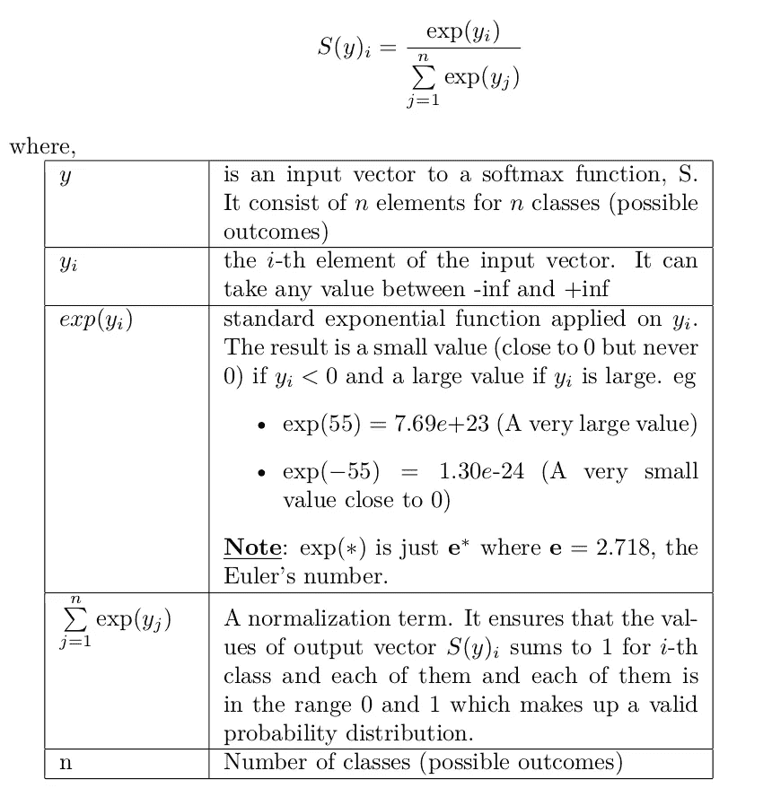
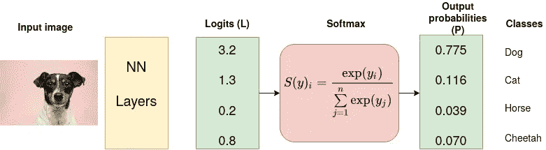
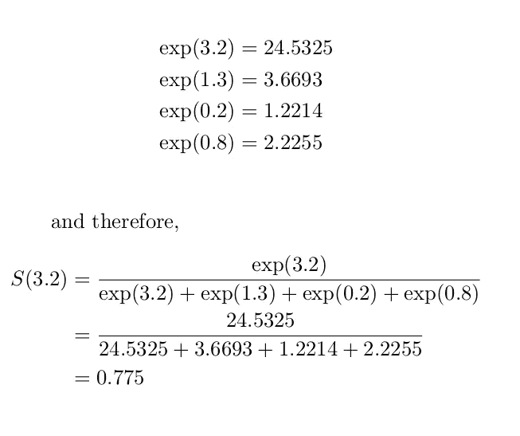
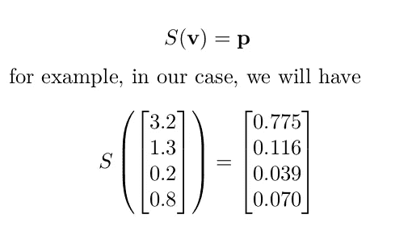
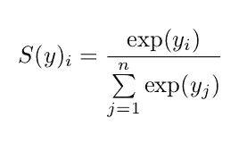

# Softmax 激活功能——实际工作原理

> 原文：<https://towardsdatascience.com/softmax-activation-function-how-it-actually-works-d292d335bd78?source=collection_archive---------1----------------------->


[法托斯 Bytyqi](https://unsplash.com/@fatosi?utm_source=medium&utm_medium=referral) 在 [Unsplash](https://unsplash.com?utm_source=medium&utm_medium=referral) 上的照片

在处理机器学习问题，具体来说，深度学习任务时，Softmax 激活函数是一个流行的名称。它通常被放在深度学习模型的最后一层。

> 它通常用作神经网络的最后一个激活函数，将网络输出标准化为预测输出类别的概率分布。—维基百科[ [链接](https://en.wikipedia.org/wiki/Softmax_function)

Softmax 是一个将数字/对数转换成概率的激活函数。Softmax 的输出是一个向量(比如说,`v`),包含每种可能结果的概率。对于所有可能的结果或类别，向量`v`中的概率总和为 1。

数学上，Softmax 定义为:



**例子**

考虑一个 CNN 模型，该模型旨在将图像分类为狗、猫、马或猎豹(4 种可能的结果/类别)。CNN 的最后(全连接)层输出 logit 向量 L，该向量通过 Softmax 层将 logit 转换为概率 p。这些概率是 4 个类别中每个类别的模型预测。



输入图片来源:Victor Grabarczyk 在 [Unsplash](https://unsplash.com/s/photos/dog?utm_source=unsplash&utm_medium=referral&utm_content=creditCopyText) 上拍摄的照片。作者图解。

让我们计算应用 Softmax 后第一个 logit 生成的概率



您可以用同样的方式计算其他值。

在 python 中，我们可以如下实现 Softmax

```
from math import expdef softmax(input_vector):
    # Calculate the exponent of each element in the input vector
    exponents = [exp(j) for j in input_vector] # divide the exponent of each value by the sum of the  
    # exponents and round of to 3 decimal places
    p = [round(exp(i)/sum(exponents),3) for i in input_vector] return pprint(softmax([3.2,1.3,0.2,0.8]))
```

输出:

```
[0.775, 0.116, 0.039, 0.07]
```

**符号:**我们可以将所有的 logits 表示为一个向量， **v** ，并在这个向量上应用激活函数， **S** ，以输出概率向量， **p** ，并表示操作如下



注意标签:狗、猫、马、猎豹都是字符串格式。我们需要定义一种将这些值表示为数值的方式。

**将分类数据转化为数值数据**

真相标签是分类数据:任何特定的图像都可以被归类到这些组中的一组:狗、猫、马或猎豹。然而，计算机不理解这种数据，因此我们需要将它们转换成数字数据。有两种方法可以做到:

1.  整数编码
2.  一键编码

**整数编码(也叫标签编码)**

在这种编码中，标签被赋予唯一的整数值。例如在我们的例子中，

**0** 代表“狗” **1** 代表“猫” **2** 代表“马” **3** 代表“猎豹”。

*何时使用整数编码:*当标签本质上是有序的，即具有某种顺序的标签时，使用整数编码。例如，考虑一个分类问题，其中我们想要将服务分类为差、中性或好，那么我们可以如下编码这些类

**0** 为“不良”，1**为“空档”，2**为“良好”。****

显然，标签有一定的顺序，并且标签相应地赋予标签权重。

相反，当标签是名义上的(没有特定排序的名称)时，我们避免使用整数编码，例如，考虑花卉分类问题，其中我们有 3 个类别:鸢尾、杂色鸢尾和海滨鸢尾，

**0** 为“刚毛鸢尾” **1** 为“杂色鸢尾” **2** 为“海滨鸢尾”。

该模型可以采用标签的自然排序(2>1>0 ),并且给予一个类别比另一个类别更多的权重，而事实上这些只是没有暗示特定排序的标签。

**一键编码**

对于不存在这种顺序关系的分类变量，整数编码是不够的。独热编码是优选的。

在独热编码中，标签由二进制变量(1 和 0)表示，从而对于给定的类，生成二进制变量，其中 1 表示对应于该特定类的位置，0 表示其他位置，例如，在我们的情况下，我们将为 4 个类生成以下标签

**【1，0，0，0】**【狗】**【0，1，0】**【猫】**【0，0，1，0】**【马】**【0，0，0，1】**【猎豹】。

**备注:**尽管我们已经回答了“何时使用哪种类型的编码系统？”。有一种方法可以实际使用任何一种编码方法。对于 TensorFlow 和 Keras 来说，这取决于你如何定义你的损失函数。我们稍后会谈到这一点。

回想一下:Softmax 函数的分母是一个归一化项。它确保函数的输出是介于 0 和 1 之间的值。



但有人可能会问，为什么不使用标准归一化，即取每个 logit，然后除以所有 logit 的总和，以获得概率？为什么要拿指数？这里有两个原因。

*   Softmax 归一化对小的和大的变化/改变有不同的反应，但是标准归一化不通过强度区分刺激，因此最长比例是相同的，例如，

# Softmax 标准化

softmax([2，4]) = [0.119，0.881]

softmax([4，8]) = [0.018，0.982]

#标准标准化

```
def std_norm(input_vector):
    p = [round(i/sum(input_vector),3) for i in input_vector]
    return p
```

std_norm([2，4]) = [0.333，0.667]

std_norm([4，8]) = [0.333，0.667]

注意到区别了吗？对于标准归一化，一个矢量和由标量缩放的同一个矢量产生相同的输出。对于上述情况，第一个向量[2，4]乘以 2 得到[4，8]，两者产生相同的输出。根据相同的推理，以下对将产生相同的输出:{[8，24]，[2.4，7.199]}比例因子为 0.3。事实上，任何按因子缩放的矢量都会产生与原始矢量相同的输出。

*   当逻辑中有负值时，就会出现另一个问题。在这种情况下，您将在输出中以负概率结束。Softmax 不受负值的影响，因为任何值(正或负)的指数总是正值。

我希望读完这篇文章后，你现在对 Softmax 激活功能实际上是如何工作的有一个更清晰的理解。

您可能也会对以下文章感兴趣

[](/cross-entropy-loss-function-f38c4ec8643e) [## 交叉熵损失函数

### 在大多数分类问题中用于优化机器学习模型的损失函数…

towardsdatascience.com](/cross-entropy-loss-function-f38c4ec8643e) [](/on-object-detection-metrics-with-worked-example-216f173ed31e) [## 基于实例的目标检测度量

### AP、mAP、AP50 等指标，并举例说明。

towardsdatascience.com](/on-object-detection-metrics-with-worked-example-216f173ed31e) [](/end-to-end-machine-learning-project-reviews-classification-60666d90ec19) [## 端到端机器学习项目:综述和分类

### 将评论分为正面或负面的项目

towardsdatascience.com](/end-to-end-machine-learning-project-reviews-classification-60666d90ec19) 

在[https://medium.com/@kiprono_65591/membership](https://medium.com/@kiprono_65591/membership)加入 medium，全面了解 Medium 上的每个故事。

每当我用这个链接发帖时，你也可以把文章发到你的邮箱里:【https://medium.com/subscribe/@kiprono_65591 

感谢您的阅读😊