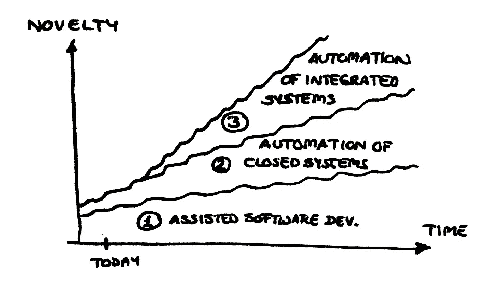
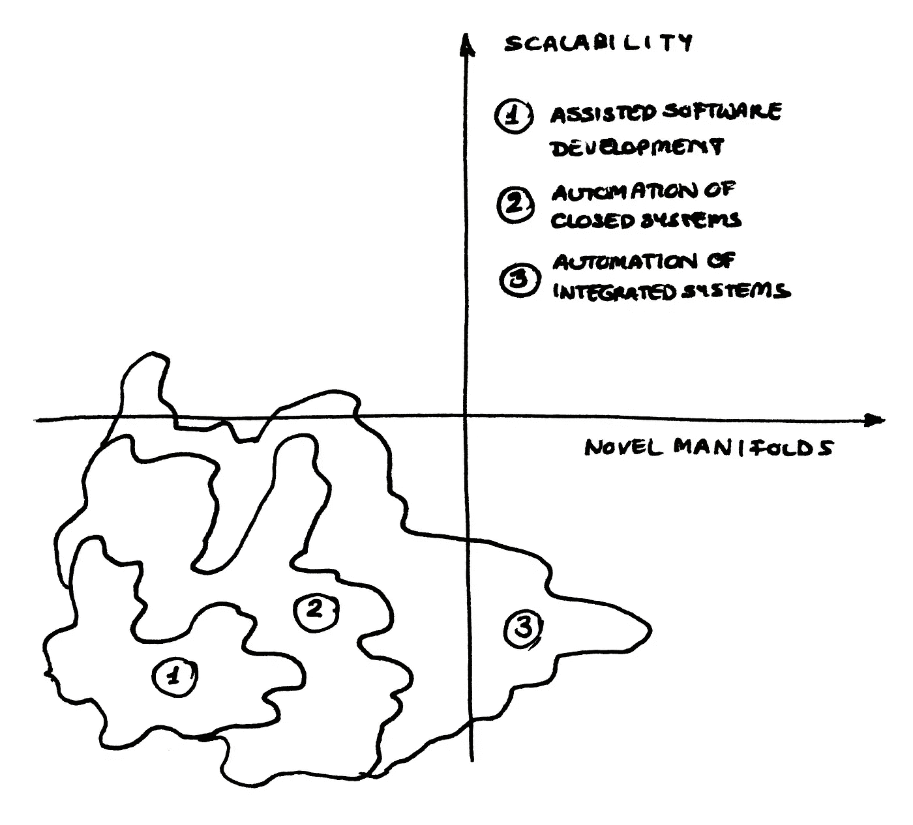

# 到 2030 年，软件开发人员可能会被淘汰

> 原文：<https://towardsdatascience.com/software-developers-might-be-obsolete-by-2030-cb5ddbfec291?source=collection_archive---------0----------------------->

## 意见

## 为什么你不会丢掉工作

软件开发是扯淡的工作吗？我不这么认为。安妮·斯普拉特在 [Unsplash](https://unsplash.com/t/technology?utm_source=unsplash&utm_medium=referral&utm_content=creditCopyText) 上的照片

1930 年，约翰·梅纳德·凯恩斯[预测到本世纪末我们将拥有 15 小时工作周。但到了 2013 年，很明显这位伟大的经济学家犯了一些错误。](https://www.businessnewsdaily.com/15210-false-promise-of-keynes-15-hour-workweek.html)

欢迎来到人类学家大卫·格雷伯创造的狗屁工作时代。自 20 世纪 30 年代以来，全新的行业如雨后春笋般涌现，但这些行业并不一定给我们的生活增加多少价值。Graeber 可能会称软件开发中的大多数工作为扯淡。

我不同意 Graeber 的观点，尤其是在软件方面。但他确实触及了一个有趣的问题:随着越来越多的流程实现自动化，大多数工作在某个时候都会过时。据估计，使用目前的技术，45%的工作可以自动化。随着时间的推移，他们可能会。

在软件开发中，事情发展得非常快，你可以实时看到这种情况:软件测试一成为热门话题，[自动化工具](https://medium.com/@briananderson2209/best-automation-testing-tools-for-2018-top-10-reviews-8a4a19f664d2)就开始涌现。这仅仅是软件中废话部分——迭代和耗时的部分——被自动化的众多领域之一。

然而，这回避了一个问题，即开发人员是否会因为构建自动化工具而变得过时。如果越来越多的[机器可以自己写代码](https://arxiv.org/pdf/2007.03629.pdf)，我们还需要人类做什么？

 [## 面向对象编程已经死了。等等，真的吗？

### 函数式编程的鼓吹者们，你们把枪口对准了错误的敌人

towardsdatascience.com](/object-oriented-programming-is-dead-wait-really-db1f1f05cc44) 

# 从设计逻辑到设计思维

软件开发人员本质上是建设者。他们构建逻辑链接、算法、程序、项目等等。关键是:他们建立逻辑的东西。

随着人工智能的兴起，我们看到了范式的转变。开发人员不再设计逻辑链接。相反，他们在这些逻辑联系的启发上训练模型。

许多开发人员已经从构建逻辑转向构建思维。换句话说，越来越多的软件开发人员开始从事数据科学家的活动。

## 自动化的三个层次

如果你曾经使用过 IDE，那么你就会知道辅助软件开发是多么的神奇。一旦您习惯了像自动完成或语义代码搜索这样的功能，您就不想再没有它们了。

这是软件开发中自动化的第一个领域。当机器理解你想要实现的东西时，它们可以帮助你完成这个过程。

第二个领域是封闭系统。考虑一个社交媒体应用程序:它由许多相互链接的不同页面组成。然而，它是封闭的，因为它没有被设计成直接与另一个服务通信。

尽管构建这样一个应用程序的技术变得越来越容易使用，但我们还不能谈论真正的自动化。到目前为止，如果您想创建动态页面、使用变量、应用安全规则或集成数据库，您需要能够编码。

第三也是最后一个领域是集成系统。例如，银行的 API 就是这样一个系统，因为它是为了与其他服务通信而构建的。然而，在这一点上，自动化 ATM 集成、通信、世界模型、深度安全和复杂的故障排除问题几乎是不可能的。

自动化的三个领域。图片由作者提供，但改编自埃米尔·沃纳在 InfoQ 的演讲。软件开发是一条坎坷的道路，我们并不真正知道未来何时到来。

## 电脑眼中的世界

当被问及未来是否会被机器人取代时，人类工人通常不这么认为。这适用于软件开发以及许多其他领域。

他们的[理由](https://stackoverflow.blog/2020/09/16/neural-networks-could-help-computers-code-themselves-do-we-still-need-human-coders/)很清楚:创造力、同理心、协作或批判性思维等品质不是计算机所擅长的。

但通常，这并不是完成工作的关键。即使是最复杂的项目也包含许多可以自动化的小部分。深度思维科学家 Richard S. Sutton [这样说](http://www.incompleteideas.net/IncIdeas/BitterLesson.html):

> “研究人员寻求利用他们在该领域的人类知识，但从长远来看，唯一重要的是利用计算。”

不要误会我；人类的素质是惊人的。但是当涉及到常规任务时，我们高估了这些问题的重要性。例如，在很长一段时间里，即使是研究人员也认为机器永远无法识别照片上的猫。

如今，一台机器可以一次分类数十亿张照片，而且比人类更准确。虽然一台机器可能无法惊叹一只小猫的可爱，但它非常擅长处理未定义的状态。这就是机器眼中的小猫照片:一种未定义的状态。

## 走向新的流形和尺度

除了处理未定义的状态之外，还有两件事计算机可以比人做得更有效率:首先，大规模地做事。第二，研究新颖的流形。

我们都经历过计算机在一定规模下工作得有多好。例如，如果你要求一台计算机`print("I am so stupid")`两百次，它会毫无怨言地这样做，并在几分之一秒内完成任务。问一个人类，你将需要等待几个小时来完成这项工作…

流形基本上是一种奇特的或数学的方式，指的是共享特定属性的空间子集。例如，如果你拿一张纸，那是三维空间中的二维流形。如果你把这张纸揉成一团或者折叠成一个平面，它仍然是一个流形。

事实证明，计算机确实擅长在人类难以想象的流形中工作，例如，因为它们延伸到二十个维度，或者有许多复杂的扭结和边缘。由于许多日常问题，如人类语言或计算机代码，可以用数学流形来表达，因此在未来部署真正高效的产品有很大的潜力。

我们在计算机可扩展性和新流形探索方面的进展。我们在第一区和第二区工作，但几乎没有触及第三区。图片由作者提供，但改编自[埃米尔·沃纳在 InfoQ](https://www.infoq.com/presentations/automated-software-dl/)的演讲。

# 现状

## 当前的发展

看起来开发者已经使用了很多自动化工具。但是我们仅仅处于软件自动化的尖端。迄今为止，自动化集成系统几乎是不可能的。但是其他领域已经实现了自动化。

首先，代码审查和调试可能很快就会成为过去。瑞士公司 [DeepCode](https://www.deepcode.ai) 正在开发一款自动识别 bug 的工具。谷歌的 [DeepMind](https://arxiv.org/pdf/2007.03629.pdf) 已经可以为现有代码推荐更优雅的解决方案。脸书的 [Aroma](https://arxiv.org/pdf/1812.01158.pdf) 可以自动完成小程序。

更有甚者，机器推断代码相似度系统，简称 [MISIM](https://newsroom.intel.com/news/intel-mit-georgia-tech-machine-programming-code-similarity-system/#gs.gozxls) ，号称可以像 Alexa 或 Siri 理解人类语言一样理解计算机代码。这是令人兴奋的，因为这样的系统可以让开发人员自动化常见且耗时的任务，如将代码推送到云或实现合规性流程。

## 激动人心的地平线

到目前为止，所有这些自动化在小项目中表现很好，但是在更复杂的项目中却毫无用处。例如，错误识别软件仍然会返回许多误报，如果项目有一个非常新颖的目标，自动完成功能就不起作用。

由于 MISIM 还没有出现很长时间，这个自动化还没有定论。然而，你需要记住，这些仅仅是开始，这些工具有望在未来变得更加强大。

## 即将到来的应用

这些新的自动化设备的一些早期应用可能包括跟踪人类活动。当然，这并不意味着像一个间谍软件；更确切地说，像安排工人的工作时间或为学生个性化课程这样的事情可以通过这种方式进行优化。

这本身就提供了巨大的经济机会，因为学生可以更快地学习重要的东西，工人可以在他们碰巧更有生产力的时间工作。

如果 MISIM 像它承诺的那样好，它也可以用来重写遗留代码。例如，许多银行和政府软件都是用 COBOL 语言编写的，而这种语言现在已经很难教授了。将这段代码翻译成一种更新的语言会使它更容易维护。

在未来的很长一段时间里，成为一名软件开发人员仍将令人兴奋不已。布鲁克·卡吉尔在 [Unsplash](https://unsplash.com/collections/4854928/work-culture?utm_source=unsplash&utm_medium=referral&utm_content=creditCopyText) 上的照片

# 开发商和企业如何保持领先

所有这些新的应用都令人兴奋。但是在他们头上悬着一把巨大的达摩克利斯之剑:如果竞争对手在你赶上之前就利用了这些自动化，那该怎么办？如果他们让开发人员完全过时了怎么办？

## 投资于持续交付和自动化测试

这无疑是自动化世界中的两个流行语。但是它们仍然很重要。

如果你在发布前没有测试你的软件，你可能会损害用户体验或者遇到安全问题。经验表明，自动化测试涵盖了人类测试人员甚至没有想到的案例，尽管它们可能是至关重要的。

持续交付是越来越多的[团队采用的一种实践，而且理由很充分。当你捆绑了很多很多的特性，并且每三个月才发布一次更新时，你通常会花接下来的几个月来修复在这个过程中损坏的所有东西。这种工作方式不仅是快速开发的一大障碍，也损害了用户体验。](https://www.oreilly.com/content/5-automation-trends-in-software-development-quantified/)

有大量的自动化软件用于测试，还有版本控制(和许多其他框架)用于持续交付。在大多数情况下，花钱购买这些自动化产品似乎比自己开发要好。毕竟，你的开发人员是被雇来构建新项目的，而不是自动化枯燥的任务。

如果你是一名经理，把这些购买视为一项投资。通过这样做，你尽你所能支持你的开发者，因为你利用了他们真正擅长的东西。

## 左移:在每个项目的早期阶段包括开发人员

通常，项目是在高层管理或 R&D 团队附近的某个地方创建的，然后向下传递，直到他们到达开发团队——然后开发团队的任务是使这个项目想法成为现实。

然而，由于不是每个项目经理都是经验丰富的软件工程师，项目的某些部分可能由开发团队实现，而其他部分可能成本高昂或者几乎不可能实现。

这种方法在过去可能是合法的。但是作为软件开发中许多单调的部分——是的，这些部分是存在的！—正在被自动化，开发人员有机会变得越来越有创造力。

这是一个让开发人员离开的绝佳机会，也就是说，让他们参与到项目的规划阶段。不仅要他们知道什么可以实施，什么不可以。凭借他们的创造力，他们可能会以事先无法想象的方式增加价值。

## 让软件成为重中之重

自从微软的塞特亚·纳德拉[宣称](https://www.computerweekly.com/news/2240242478/Satya-Nadella-Every-business-will-be-a-software-business)“每一项业务都将是软件业务”以来，已经过去了短短的五年。他是对的。

开发人员不仅应该在管理上向左转。软件应该提高优先级。

如果说当前的疫情教会了你什么，那就是如今很多生活和价值创造都发生在网上。

软件为王。矛盾的是，自动化程度越高，这一点就越明显。

自动化正把软件爱好者变成领导者。在 [Unsplash](https://unsplash.com/collections/8807863/girls-who-code?utm_source=unsplash&utm_medium=referral&utm_content=creditCopyText) 上由[Christina @ wocintechchat.com](https://unsplash.com/@wocintechchat?utm_source=unsplash&utm_medium=referral&utm_content=creditCopyText)拍摄的照片

# 底线是:极客正在成为领导者

当我在学校的时候，喜欢电脑的人被认为是不合群的孩子、书呆子、极客、不可爱的生物、缺乏人类感情和激情的僵尸。我真希望我是在夸大其词。

然而，随着时间的推移，越来越多的人看到了开发商的另一面。编写代码的人不再被认为是书呆子，而是被认为是能做出很酷的东西的聪明人。

自动化程度越高，软件就越强大。从这个意义上来说，你担心由于自动化而失去开发人员的工作是没有根据的。

当然，十年后——甚至几个月后——你可能会做一些你现在都无法想象的事情。但这并不意味着你的工作会消失。而是会升级。

你真正需要克服的恐惧不是你可能会失业。你需要摆脱对未知的恐惧。

开发者，你不会过时的。你们不会再是书呆子了。相反，你们会成为领导者。