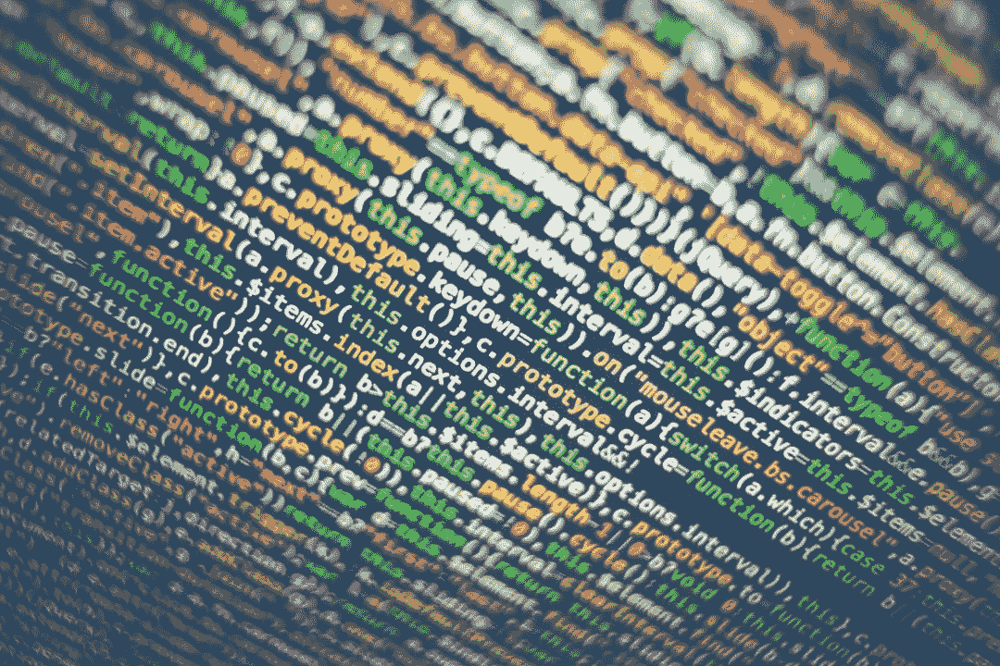

# 数据科学家的软件工程——写干净代码的艺术

> 原文：<https://towardsdatascience.com/software-engineering-for-data-scientist-art-of-writing-clean-code-f168bf8a6372?source=collection_archive---------47----------------------->

照片由来自 [Pexels](https://www.pexels.com/photo/technology-computer-display-text-330771/?utm_content=attributionCopyText&utm_medium=referral&utm_source=pexels) 的 [Markus Spiske](https://www.pexels.com/@markusspiske?utm_content=attributionCopyText&utm_medium=referral&utm_source=pexels) 拍摄

这是本系列的第二篇文章。有关该系列文章的列表，请查看**部分的前几篇文章**。

**简介**

“代码被阅读的次数比它被编写的次数多”是软件工程师中的一句名言。当我们不考虑目标(数据科学与否)、语言(R、Python 或 Scala)或项目性质而编写代码时，干净的代码风格使开发人员的生活变得容易。我个人相信 CRUM 哲学，容易合作，容易理解，容易保持。如何带领你的团队走向一个干净的代码大军，是一个具有挑战性的任务。编码标准的重要性来了。一个定义良好的标准，一个由工程师和数据科学家团队遵循的定制编码标准，总是能确保我们拥有可维护的软件工件。但是在一堆笔记本的世界里。rmd 文件编码标准的空间在哪里？本文试图讨论编码标准这个主题，以及如何构建自己的标准。

**编码标准**

编码标准与最佳实践指南一致，这是一组开发人员想要遵循的。同意指南告诉我们必须如何编写代码，以便项目代码在开发人员之间保持一致。所有成熟的软件开发和产品团队总是创建和维护这样一个标准作为参考。自从多技术和多语言开发开始以来，人们在不同语言之间切换就成了一种需求。Data Scientist 使用笔记本和类似技术中的探索性(可视化)和开发支持。在这种情况下，焦点更多的是在“模型”而不是代码上，直到它到达部署。在本文中，我们将研究 Python 和 r。

**Python 和 PEP8**

一般来说，Pythonista 喜欢遵循 PEP-8 编码标准。当吉多·范·罗苏姆创建 Python 时，可读性是基本的设计原则之一。一般来说，Python 代码被认为是可读的。但是简单和强大的电池使得阅读简单的代码变得困难。PEP-8 的存在是为了提高 Python 代码的可读性。大多数时候，有经验的 Python 开发人员会为团队制作一个定制的 Python 指南。主要关注领域(总体而言)包括:

命名规格

代码布局

刻痕

评论

表达和陈述

一般编程建议

这将是一个起点。一般来说，对于数据科学项目和软件项目，还有更多的情况需要处理。大多数基于 Python 的项目现在都在使用 Python3.X。类型提示是 P3.x 的关键特性之一。建议将其作为编码指南的一部分。数据科学项目中典型的[模式和反模式之一是 lambda 函数的使用和滥用。大多数时候，lambdas 在生产中进行调试。关于数据帧操作的 lambda 的使用以及可追溯性和调试的目的应该被强制执行。

需要关注框架驱动的模式，例如 Pandas 和其他框架。其中一个例子是在 to_sql API 中使用 SQL 数据类型。大多数情况下，一个长字典直接输入到 to_sql 中。为简单起见，变量可以管理这种模式；更多地指定数据类型是一次性的需求。

Google 的 Python 编码指南[1]是为你的团队精心设计 Python 编码标准的一个很好的起点。另一个有用的参考是 RealPython 的‘如何用 PEP 8 写出漂亮的 Python 代码’[2]。

**R 和代码风格指南**

在最性感的工作头衔“数据科学”之前，R 是统计学家、数据挖掘者和 ML 研究人员最喜欢的编程语言。在冬天到来之前，R 在企业中被大量采用。由于非软件专业人员编写代码的本质，编码标准没有被广泛执行。尽管如此，当企业范围的采用开始时，一些标准已经存在。这三个标准分别是 Tidyverse 风格指南[3]、Hadley Wickham 的指南[4]和 Google R 风格指南[5]。如果我们非常依赖 RShiny 应用程序，最好在关闭标准文档之前咨询一下 UI/UX 团队。

**IDE 和笔记本**

在软件工程中，IDE 插件总是作为虚拟攻击者来维护编码标准。但是笔记本和 IDE 环境不一样。当我们成为数据科学家和 ML 工程师时，建议证明编码标准的方向。我们应该包括团队特定的最佳实践以及可重用的组件。

大多数时候，大多数笔记本都充满了程序代码(没有函数类，等等..).该代码可以重复几次；探索性数据分析是这方面的典型案例。最好创建可重用的函数。这将在一个高度迭代的模型构建环境中消除复制粘贴错误和头发拉扯。从长远来看，我们最终可能会创建一个好的集合或库，供整个企业使用。

**工具**

有一些优秀的工具可以帮助格式化和检查编码标准。Flake8 是我最喜欢的工具，我和 VSCode 一起使用。用 R 和 RStudio 编码时，我更喜欢安装‘lintr’；除此之外，我还要确保编辑器是为静态代码分析配置的。

在项目代码评审期间，根据团队经验，我为 lint 分数设置了一个可接受的阈值。所以并不总是 10！如果你开始执行标准，最好从一个可能的点开始，逐步提高期望值。

**接下来的步骤**

到目前为止，我们讨论了编码标准和指针，以开始数据科学和机器学习项目的编码标准。在一个多样化的、熟练的机器学习/数据实际执行的团队中，这是不容易的。一个人可能必须通过非常耐心的再教育来克服阻力。在接下来的文章中，我们将讨论模型构建者的**测试驱动开发。**

**快乐模型建筑！！！** **往期文章**

[1]AI/ML/数据科学项目的软件工程—[https://medium . com/@ jaganadhg/Software-Engineering-for-AI-ML-Data-Science-Projects-bb73e 556620 e](https://medium.com/@jaganadhg/software-engineering-for-ai-ml-data-science-projects-bb73e556620e)

**参考**

[1]谷歌 Python 风格指南，[https://google.github.io/styleguide/pyguide.html](https://google.github.io/styleguide/pyguide.html)

【2】如何用 PEP 8 写出漂亮的 Python 代码，[https://realpython.com/python-pep8/#why-we-need-pep-8](https://realpython.com/python-pep8/#why-we-need-pep-8)

[3]《时尚指南》，[https://style.tidyverse.org/syntax.html#control-flow](https://style.tidyverse.org/syntax.html#control-flow)

[4]高级 R 作者哈德利·韦翰，[http://adv-r.had.co.nz/Style.html](http://adv-r.had.co.nz/Style.html)

[5]谷歌的 R 风格指南，[https://google.github.io/styleguide/Rguide.html](https://google.github.io/styleguide/Rguide.html)

*原载于*[*https://www.linkedin.com*](https://www.linkedin.com/pulse/software-engineering-data-scientist-art-writing-gopinadhan-jagan-)*。*