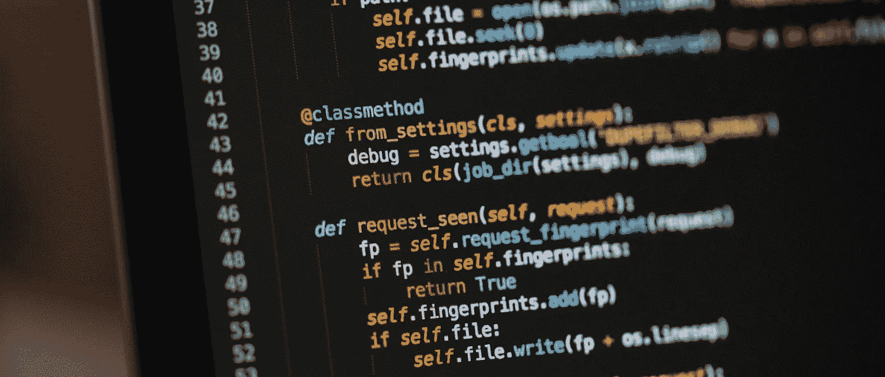
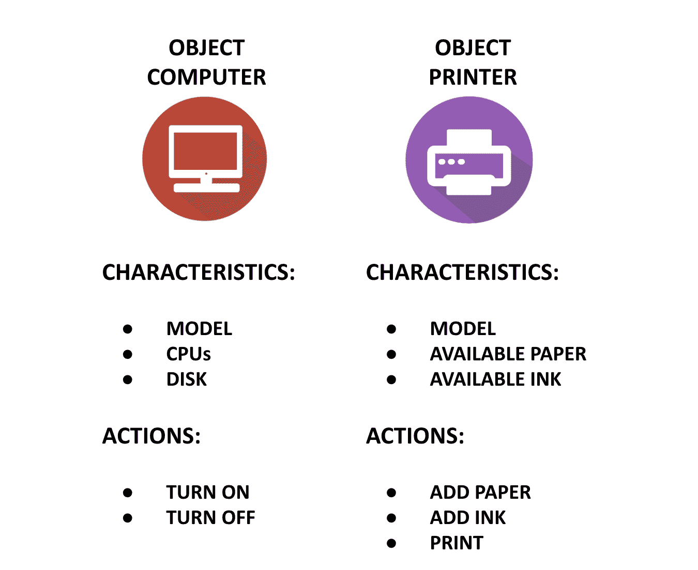
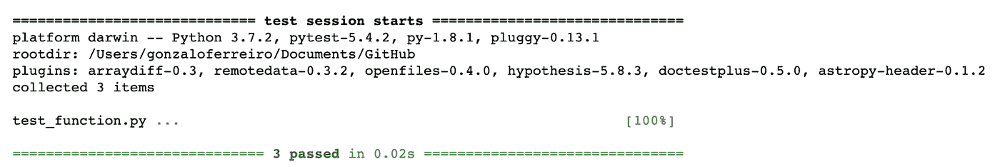
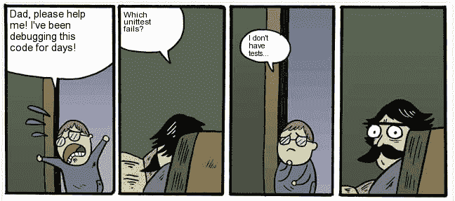

# 数据科学家的软件工程基础

> 原文：<https://towardsdatascience.com/software-engineering-fundamentals-for-data-scientists-6c95316d6cc4?source=collection_archive---------28----------------------->



来源:[克里斯里德](https://unsplash.com/photos/ieic5Tq8YMk)@ unsplash-免费库存图片

## 不是软件工程师我学到的东西🙃

作为一个领域，自从数据科学开始流行以来，它已经引起了与其他学科的争论。统计学家抱怨从业者缺乏基本的统计知识，数学家反对在没有充分理解应用原则的情况下应用工具，软件工程师指出数据科学家在编程时对基本原则的无知。老实说，他们都有道理。在统计学和数学方面，的确，你需要对概率、代数和微积分等概念有扎实的理解。知识需要有多深？嗯，这很大程度上取决于你的角色，但基本原则是没有商量余地的。编程时也会发生类似的事情；如果您的角色意味着编写生产代码，那么您至少需要了解软件工程的基础知识。为什么？原因很多，但我认为可以概括为五个原则:

*   **代码的完整性**，根据它写得有多好，对错误的弹性，捕捉异常，测试和被其他人审查
*   **代码的可解释性**，配有适当的文档
*   代码在真实环境中运行的速度
*   你的脚本和对象的模块化,以便可重用，避免重复，提高代码类的效率
*   **慷慨**与你的团队一起，让他们尽快审查你的代码，并在将来理解你为什么要写任何一段代码

根据这些观点，在这个故事中，我们将看到一些我认为最有用的基本原则，不是天生的程序员，而是从一个完全不同的背景进入这个领域。他们帮助我写出了更好的产品代码，节省了我的时间，也让我的同事在实现我的脚本时更加轻松。

# 编写干净代码的重要性


来源:[奥利弗·黑尔](https://unsplash.com/photos/oTvU7Zmteic)@ unsplash——免费库存图片

理论上，我们在这个故事中涉及的几乎所有东西都可以被认为是编写更干净代码的工具或技巧。然而，在这一特定的部分，我们将集中在单词 clean 的严格定义上。正如 Robert Martin 在他的书 [Clean Code](https://www.amazon.co.uk/Clean-Code-Handbook-Software-Craftsmanship/dp/0132350882) 中所说，即使是糟糕的代码也可以运行，但是如果代码不干净，它会让一个开发组织崩溃。怎么会？老实说，可能性有很多，但是想象一下审查糟糕的代码所浪费的时间，或者开始一个新的角色，却发现你将处理一些很久以前写的难以辨认的代码。或者更糟的是，想象某个东西中断了，导致某个产品功能停止工作，而在你之前写代码的人(如此肮脏的代码)已经不在公司了😱。

这些都是比较常见的情况，不过咱们就不那么戏剧化了；谁从来没有写下一些代码，让它挂起一段时间去做更紧急的事情，然后当回来时却不记得它实际上是如何工作的？我知道这发生在我身上。

这些都是为编写更好的代码付出额外努力的正当理由。因此，让我们从基础开始，看看一些编写更简洁的脚本的技巧:

*   **在你的代码中用名字**来描述。我从未忘记几年前在大学上 Java 课时学到的一个概念:让你的代码成为*助记符*。助记法指的是一种系统，如帮助记忆某些东西的字母、想法或联想的模式。也就是说，这意味着编写不言自明的名称
*   只要有可能**尽量暗示类型**。例如，对于一个返回布尔对象的函数，可以用 is_ 或 has 作为前缀
*   **避免缩写，尤其是单个字母**
*   另一方面，**避免长的名字和行**。写长名字并不意味着更具描述性，就行的长度而言,[PEP 8 Python 代码风格指南](https://www.python.org/dev/peps/pep-0008/)中的指南建议行长度不超过 79 个字符。
*   不要为了一致性而牺牲清晰性。例如，如果您有代表雇员的对象和包含所有这些对象的列表，那么 employee_list 和 employee_1 比 employees 和 employee_1 更清晰
*   关于空行和缩进，**让你的代码更容易阅读**用类似银行的字体分隔部分并使用一致的缩进

# 编写模块化代码的重要性


来源:[莎伦·麦卡琴](https://www.pexels.com/photo/art-materials-art-supplies-blocks-blur-1148496/)@ pexels-免费股票图片

我认为这是数据科学家和数据分析师最重要的观点之一，也是软件工程讨论的一个非常常见的来源，因为我们非常习惯于在 Jupyter 笔记本等工具中编码。这些工具对于探索性的数据分析来说是惊人的，但是对于编写生产代码来说却不是这样。事实上，Python 本质上是一种面向对象的编程语言，深入讨论它的含义不在此范围之内，但简而言之，与编写一系列指令供脚本执行的过程式编程不同，面向对象编程是关于构建具有自身特征和动作的模块。举以下例子:



来源:图片由作者制作

在实践中，这些特征被称为属性，而动作将是方法。在上面的例子中，对象 Computer 和 Printer 是独立的类。一个类是一个蓝图，包含所有特定类型对象的属性和方法。也就是说，我们创建的所有计算机和打印机将共享相同的属性和方法。这个想法背后的概念叫做封装。封装意味着您可以将所有功能和数据合并到一个实体或模块中。当你把一个程序分解成模块时，不同的模块不需要知道事情是如何完成的，如果它们不负责做的话。为什么这很有用？这不仅仅是为了代码的可重用性，避免重复和提高效率，就像前面提到的那样，而且如果需要的话，这也使得调试更加容易。

同样，如果您所做的只是在 Jupyter 笔记本中进行探索性的数据分析，这可能并不相关，但是如果您正在编写一个将成为真实环境一部分的脚本，尤其是随着应用程序规模的增长，将您的代码分成单独的模块是有意义的。通过在将所有部分组合在一起之前完善程序的每个部分，您不仅可以更容易地在其他程序中重用单个模块，还可以通过查明错误的来源来更容易地修复问题。

编写模块化代码的一些进一步的技巧:

*   干:不要重复自己
*   使用函数不仅减少了重复性，而且通过描述性的名称提高了可读性，便于理解每个模块的功能
*   尽量减少实体(函数、类、模块等)的数量。)
*   单一责任原则:一个类应该有且只有一个责任的思想。比人们想象的要难。
*   遵循开放/封闭原则。即对象应该对扩展开放，但对修改关闭。这样做的目的是编写代码，这样您就能够在不更改现有代码的情况下添加新功能，从而防止出现这样的情况:对一个类的更改也需要您修改所有依赖的类。面对这个挑战有不同的方式，尽管在 Python 中使用继承是很常见的。
*   每个函数尽量少用三个参数。如果它有很多，也许把它分开。类似的标准适用于函数的长度；理想情况下，一个函数应该有 20 到 50 行。如果它有更多，那么你可能想把它分成单独的功能
*   也要注意你的课时长度。如果一个类有超过 300 行，那么它应该被分成更小的类。

如果您已经在使用 Python，但对面向对象编程一无所知或知之甚少，我强烈推荐这两个免费课程:

*   [data camp 的 Python 面向对象编程](https://www.datacamp.com/courses/object-oriented-programming-in-python)
*   在 https://realpython.com/[举办的](https://realpython.com/)面向对象编程的 Python 介绍

# 重构的重要性


来源: [RyanMcGuire](https://pixabay.com/photos/car-repair-car-workshop-repair-shop-362150/) @ pixabay —免费股票图片

维基百科对重构的定义如下:

> 在计算机编程和软件设计中，代码重构是在不改变现有计算机代码外部行为的情况下对其进行重构的过程。重构旨在改进软件的设计、结构和/或实现，同时保留其功能。重构的潜在优势可能包括提高代码可读性和降低复杂性；这些可以提高源代码的可维护性，并创建一个更简单、更清晰或更具表现力的内部架构或对象模型来提高可扩展性。

我认为这个定义本身就说明了问题，但是除此之外，我们可以补充一点，重构给了我们一个机会，在我们让代码工作起来之后，清理和模块化我们的代码。这也给了我们一个提高代码效率的机会。到目前为止，我所了解到的是，当软件工程师谈论高效代码时，他们通常指的是以下两者之一:

1.  减少运行时间
2.  减少内存空间

让我们简要介绍一下这两点…

以我的经验来看，随着你写越来越多的产品代码，减少代码的运行时间是你需要慢慢学习的。当你在 Jupyter 笔记本上做一些分析时，计算这些成对的距离花费你两分钟、五分钟或十分钟都没关系。你可以让它运行，回复一些无聊的消息，去洗手间，灌满一杯咖啡，然后回来看你的代码完成。然而，当有用户在另一边等待时会发生什么呢？当你的代码编译时，你不能让它们一直挂着，对吗？

在 Python 中，有几种改进方法，让我们快速介绍其中的一些:

**使用向量运算让你的计算更快**。例如，当检查一个数组的元素是否在另一个数组中时，你可以使用 NumPy 的 *intersect1d* ，而不是编写循环。您也可以使用向量根据条件搜索元素，以便执行加法或类似操作。让我们看一个简单的例子，当我们必须**遍历一个数字列表并执行一个给定条件**的操作时:

而不是使用这样的东西:

```
# random array with 10 million pointsa = np.random.normal(500, 30, 10000000) # iterating and checking for values < 500t0 = time.time()total = 0for each in a: if each < 500: total += eacht1 = time.time()print(t1-t0)
```

时间:3.64595947 秒

```
# same operation only using numpyt0 = time.time()total = a[a<500].sum()t1 = time.time()print(t1-t0)
```

时间:0.06348109245300293 秒

快了 58 倍以上！

我知道熊猫数据框架非常容易使用，我们都喜欢它们，但是，当编写产品代码时，最好避免使用它们。我们用熊猫做的很多手术也可以用 Numpy 来做。让我们看看其他一些例子:

*   **根据条件**对矩阵行求和

```
# random 2d array with 1m rows and 20 columnn
# we’ll use the same in following examplesa = np.random.random(size=(1000000,20))# sum all values greater than 0.30(a * (a>0.30)).sum(axis=1)
```

在上面的代码中，乘以一个布尔数组是可行的，因为 True 对应于 1，False 对应于 0👍🏻

*   **根据某种条件添加一列**

```
# obtain the number of columns in the matrix to be used as index of the new one to be placed at the endnew_index = a.shape[1]# set the new column using the array created in the previous examplea = np.insert(a, new_index, (a * (a>0.30)).sum(axis=1), axis=1)# check new shape of aa.shape
```

Prints: (1000000，21) |新列已添加🎉

*   **根据多个条件过滤表格**

```
# filter if the new last column is greater than 10 and first column is less than 0.30b = a[(a[:,0]<0.30)&(a[:,-1]>10)]b.shape
```

打印:(55183，21) | 55183 行符合条件👍🏻

*   **如果条件满足，更换元件**

```
# change to 100 all values less than 0.30a[a<0.3] = 100
```

除了上面的代码，另一个减少运行时间的好方法是**并行化**。并行化意味着编写一个脚本来并行处理数据，使用机器中几个或所有可用的处理器。为什么这能让我们的速度大幅提升？因为大多数时候我们的脚本是串行计算数据的:它们解决一个问题，然后是下一个，然后是下一个，等等。当我们用 Python 编写代码时，通常会发生这种情况，如果我们想利用并行化，我们必须明确这一点。我将很快就此写一个独立的故事，但是，如果你渴望了解更多，在所有可用于并行化的库中，我最喜欢的是:

*   [多重处理](https://docs.python.org/3/library/multiprocessing.html)
*   [数字巴](https://numba.pydata.org/numba-doc/latest/user/5minguide.html)

关于**减少内存空间**，减少 Python 中的内存使用是困难的，因为 [Python 实际上并没有将内存释放回操作系统](http://effbot.org/pyfaq/why-doesnt-python-release-the-memory-when-i-delete-a-large-object.htm)。如果您删除对象，那么内存可用于新的 Python 对象，但它不会被释放()回系统。此外，如前所述，Pandas 是一个很好的探索性数据分析工具，但除了生产代码较慢之外，它在内存方面也相当昂贵。然而，我们可以做一些事情来控制内存使用:

*   首先:如果可能的话，**使用 NumPy 数组代替 Pandas** Dataframes。即使是字典也比数据帧占用更少的内存
*   **减少熊猫数据帧的数量**:当我们修改数据帧时，不是创建一个新的对象，而是尝试使用参数 inplace=True 来修改数据帧本身，这样就不会创建副本。
*   **清除您的历史**:每次您对一个数据帧(例如 df + 2)进行更改时，Python 都会在内存中保存该对象的副本。您可以使用%reset Out 清除该历史记录
*   **注意你的数据类型**:与数字相比，对象和字符串数据类型在内存方面要昂贵得多。这就是为什么使用 df.info()检查 Dataframe 的数据类型总是有用的，如果可能的话，使用 df['column'] = df['columns']对它们进行转换。astype(类型)
*   **使用稀疏矩阵**:如果你有一个包含大量空值或空单元的矩阵，使用稀疏矩阵会更方便，它通常占用更少的内存空间。您可以使用*scipy . sparse . CSR _ matrix(df . values)*来完成
*   使用生成器而不是对象:生成器允许你声明一个行为像迭代器的函数，但是使用单词*产生*而不是*返回*。生成器不会创建一个包含所有计算的新对象(例如，一个列表或一个 NumPy 数组),而是生成一个保存在内存中的值，只有在您需要时才会更新。这就是所谓的懒惰评估。在《走向数据科学》中 Abhinav Sagar 的精彩故事中找到更多关于生成器的信息。

# 测试的重要性


来源:[pix abay](https://www.pexels.com/photo/red-and-yellow-hatchback-axa-crash-tests-163016/)at @ pexels-免费库存图片

需要数据科学方面的测试。其他软件相关领域通常抱怨数据科学家的代码缺乏测试。虽然在其他类型的算法或脚本中，如果出现错误，程序可能会停止工作，但在数据科学中，这甚至更危险，因为程序可能会实际运行，但由于值编码不正确、功能使用不当或模型实际所基于的数据破坏假设，最终会产生错误的见解和建议。

当我们提到测试时，有两个主要概念值得讨论:

*   单元测试
*   试驾开发

先说前者。**单元测试**之所以这么叫是因为它们覆盖了一个小的代码单元，目标是验证我们代码的每一个单独的部分都按照设计执行。在面向对象的编程语言中，比如 Python，一个单元也可以被设计为评估整个类，但也可以是一个单独的方法或函数。

单元测试可以从头开始编写。事实上，让我们这样做，这样我们可以更好地理解单元测试实际上是如何工作的:

假设我有以下函数:

```
def my_func(a,b):c=(a+b)/2*1.5return c
```

我想测试以下输入是否返回预期的输出:

*   4 和 2 返回 4.5
*   5 和 5 返回 5.5
*   4 和 8 返回 9.0

我们完全可以这样写:

```
def test_func(function, output): out = function if output == out: print(‘Worked as expected!’) else: print(‘Error! Expected {} output was {}’.format(output,out))
```

然后简单地测试我们的功能:

```
test_func(my_func(4,2),4.5)
```

版画:*果然奏效！*

然而，对于更复杂的函数，当我们想一次测试几个函数，甚至是一个类时，这就变得更棘手了。没有这些 faff 的单元测试的一个很好的工具是 [pytest 库](https://docs.pytest.org/en/latest/getting-started.html)。Pytest 要求您创建一个包含要测试的一个或多个函数的 python 脚本，以及另一组断言输出的函数。该文件需要以前缀“test”保存，然后只需像任何其他 Python 脚本一样运行即可。Pytest 最初是为了从命令行使用而开发的，但是如果您仍然处于项目的早期阶段，有一种从 Jupyter 笔记本使用它的简单方法；您可以使用神奇的命令 *%%writefile* 创建并保存一个. py 文件，然后直接从笔记本中使用命令行语句运行该脚本。让我们看一个例子:

```
import pytest%%writefile test_function.pydef my_func(a,b): c=(a+b)/2*1.5 return cdef test_func_4_2(): assert(my_func(4,2)==4.5)def test_func_5_5(): assert(my_func(5,5)==7.5)def test_func_4_8(): assert(my_func(4,8)==9.0)
```

只需运行脚本:

```
!pytest test_function.py
```

如果一切按预期运行，会看到如下输出:



将来，我会写另一个故事来讨论单元测试的更复杂的例子，以及如果你需要的话，如何测试整个类。但同时，这应该足够让您开始并测试您的一些功能了。请注意，在上面的例子中，我测试的是返回的确切数字，但是您也可以测试数据帧的形状、NumPy 数组的长度、返回的对象的类型等等。

我们之前在本章开头提到的另一点是**试驾开发或 TDD** 。这种测试方法包括编写要为一段代码执行的单元测试，甚至在开始开发之前。下一步，你会想要写最简单和/或最快的代码，以通过你最初写下的测试，这将帮助你确保质量，通过在写代码之前关注需求。此外，根据最初编写的一个或多个测试，它将迫使您通过将代码分解成小代码块来保持代码简单、干净和可测试。一旦你有了一段真正通过测试的代码，你就可以专注于重构来提高代码的质量或进一步的功能。



来源:https://me.me/—模因库

TDD 的一个主要好处是，如果将来需要对代码进行更改，而你不再从事那个项目，你转到了另一家公司，或者你只是在度假，了解最初编写的测试将帮助任何人获取代码，以确保一旦更改完成，它不会破坏任何东西。

值得考虑的其他几点:

*   笔记本:探索的理想选择，TDD 的不理想选择
*   乒乓 TDD:一个人写测试，另一个人写代码
*   为您的测试设置性能和输出指标

# 代码审查的重要性


来源:[Charles Deluvio](https://unsplash.com/photos/Lks7vei-eAg)@ unsplash-免费图片

代码审查有益于团队中的每个人，促进最佳编程实践并为生产准备代码。代码审查的主要目标是捕捉错误，然而，它们也有助于提高可读性，并检查团队是否符合标准，因此不会将脏的或慢的代码投入生产。除此之外，代码评审对于分享知识也是很棒的，因为团队成员可以阅读来自不同背景和风格的人的代码片段。

如今，excellence 的代码审查工具是 GitHub 和 pull requests 这样的平台。“拉”请求是将一段代码或一个全新的脚本中的变更集成到某个代码环境中的请求。它被称为拉请求，因为它们的提交意味着准确地请求某人将您编写的代码拉进存储库。

从 [GitHub 的文档](https://help.github.com/en/github/collaborating-with-issues-and-pull-requests/about-pull-requests)中，我们可以看到他们对拉请求的定义:

> Pull 请求允许你告诉其他人你已经推送到 GitHub 上的一个存储库中的一个分支的变更。一旦打开了一个拉请求，您就可以与协作者讨论和评审潜在的变更，并在您的变更被合并到基础分支之前添加后续提交。

拉式请求本身就是一门艺术，如果你有兴趣了解更多，那么[这个由](https://medium.com/@hugooodias/the-anatomy-of-a-perfect-pull-request-567382bb6067)[雨果·迪亚斯](https://medium.com/@hugooodias)写的名为《完美拉式请求的剖析》的故事一定会派上用场。但是，在审查代码时，您可以问自己几个问题:

*   **代码是否干净、模块化？寻找重复、空白、可读性和模块化**
*   **代码是否高效？**看循环，对象，函数结构，能不能用多重处理？
*   **文件是否有效？**查找内嵌注释、[文档字符串](https://en.wikipedia.org/wiki/Docstring)和自述文件
*   **代码测试过了吗？**寻找单元测试
*   **[**伐木**](https://www.quora.com/What-is-Logging-in-programming) **够好吗？**查看日志信息的清晰度和正确频率**

**嗯，我想这已经足够了😅。一如既往，我渴望阅读您的评论和反馈。**

**别忘了看看我的其他一些故事:**

**[](/the-most-gentle-introduction-to-principal-component-analysis-9ffae371e93b) [## 主成分分析最温和的介绍

### 包括特征向量和特征值

towardsdatascience.com](/the-most-gentle-introduction-to-principal-component-analysis-9ffae371e93b) [](/4-free-maths-courses-to-do-in-quarantine-and-level-up-your-data-science-skills-f815daca56f7) [## 4 门免费数学课程，用于隔离和提升您的数据科学技能

### 因为没有数学数据就没有科学

towardsdatascience.com](/4-free-maths-courses-to-do-in-quarantine-and-level-up-your-data-science-skills-f815daca56f7) [](/5-more-tools-and-techniques-for-better-plotting-ee5ecaa358b) [## 5 更好的绘图工具和技术

### 充分利用您的数据

towardsdatascience.com](/5-more-tools-and-techniques-for-better-plotting-ee5ecaa358b) 

或者访问我在 Medium 上的个人资料，查看我的其他故事🙂。还有**如果你想直接在你的邮箱里收到我的最新文章，只需** [**订阅我的简讯**](https://gmail.us3.list-manage.com/subscribe?u=8190cded0d5e26657d9bc54d7&id=3e942158a2) **:)。**再见，感谢阅读！

接下来查找一些我用作故事来源的优秀网站:

*   [https://programminghistorian.org](https://programminghistorian.org/en/lessons/code-reuse-and-modularity#modularity)
*   [https://www.kevinlondon.com](https://www.kevinlondon.com/2015/05/05/code-review-best-practices.html)
*   [https://stackify.com/](https://stackify.com/solid-design-open-closed-principle/)
*   [https://stack overflow . com/questions/39100971/how-do-I-release-memory-used-by-a-pandas-data frame](https://stackoverflow.com/questions/39100971/how-do-i-release-memory-used-by-a-pandas-dataframe)**