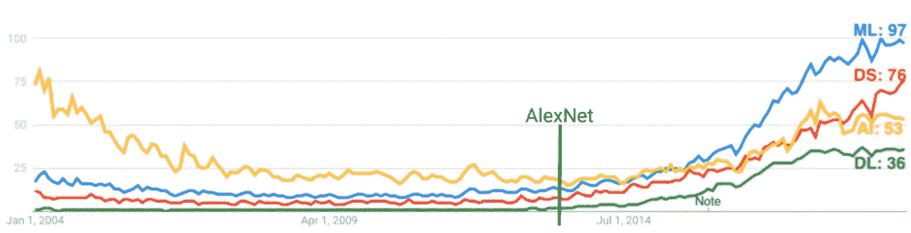
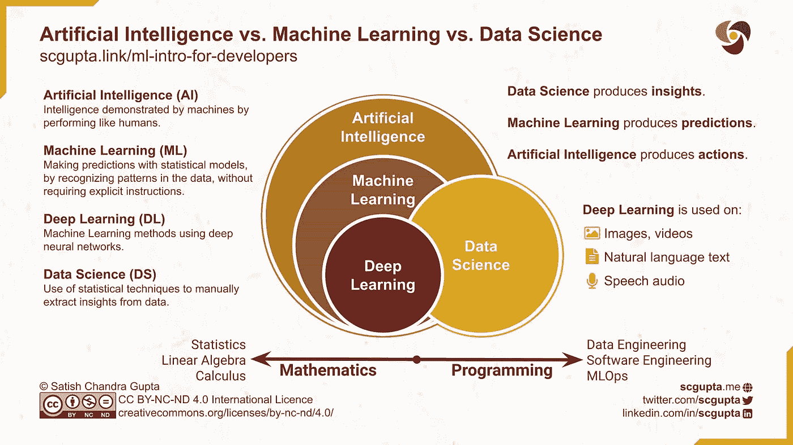
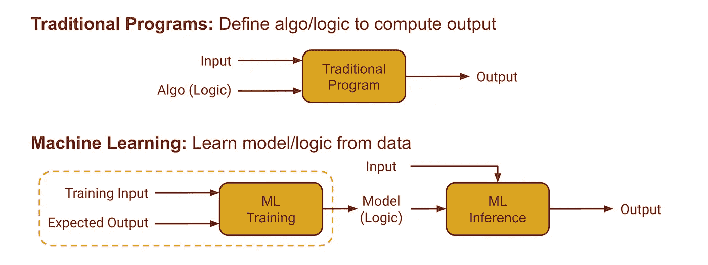
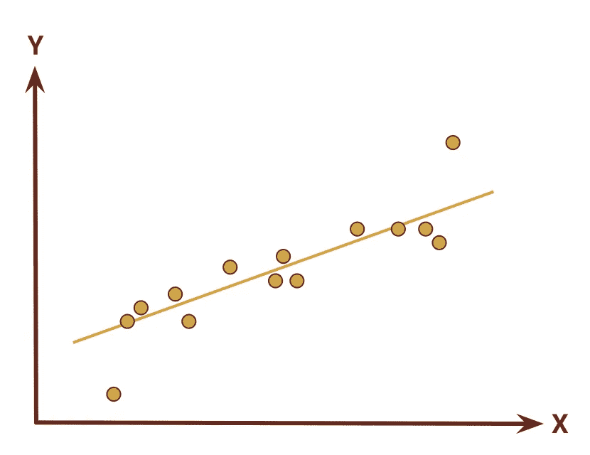
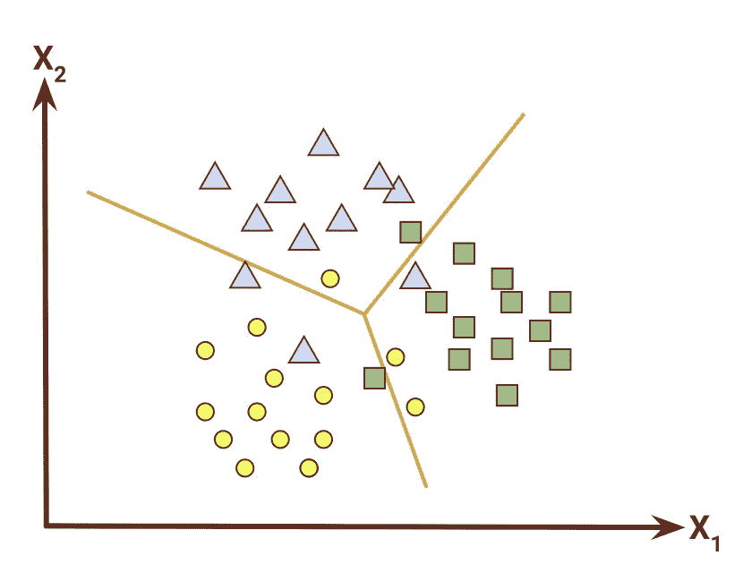
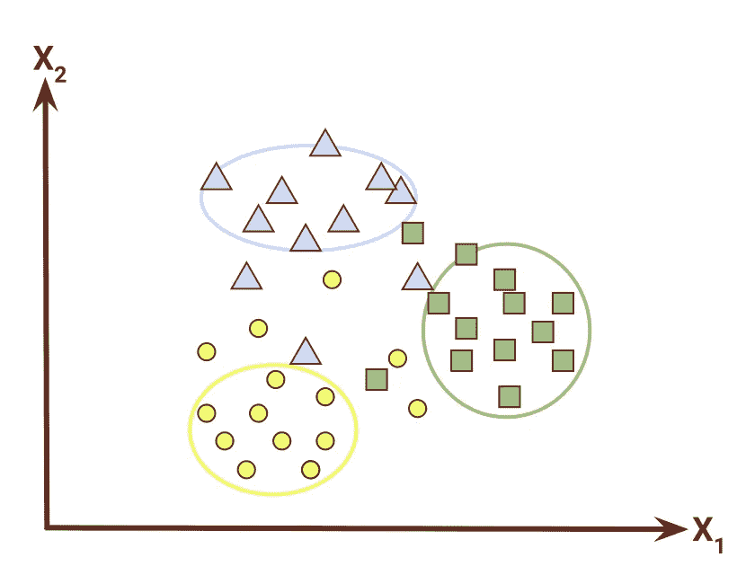
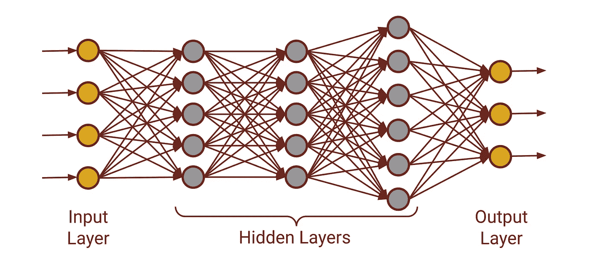
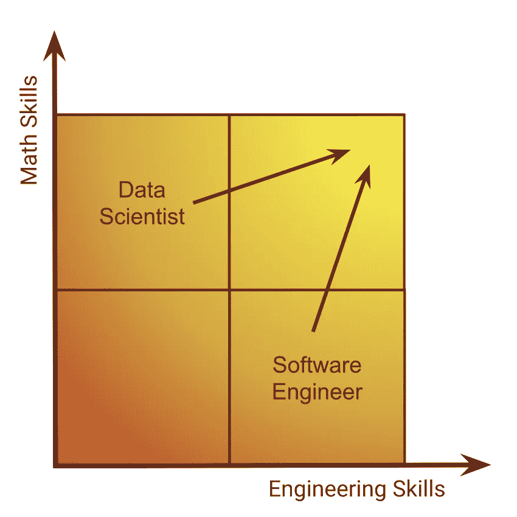

# 一位工程师对机器学习的探索

> 原文：<https://towardsdatascience.com/software-engineers-trek-into-machine-learning-46b45895d9e0?source=collection_archive---------46----------------------->

我和我的徒步旅行伙伴正在攀登印度北阿坎德邦和喜马拉雅山的马亚丽山口

## 面向开发者的机器学习

## 地形图和软件开发人员着手 ML 探险的指南针。

你是一名软件工程师。你会注意到人工智能、机器学习、深度学习、数据科学这些流行词汇无处不在。你想知道这些短语是什么意思，是否所有这些都是真实和有用的，或者是另一种炒作和短暂的时尚。

你想弄清楚它正在或将要如何改变计算机/IT 行业，以及你为什么要关心它。你在谷歌上搜索，阅读各种文章、博客和教程。你有了一些想法，但也被你发现的大量数学、工具和框架所淹没。

> Y 你希望有人能给你一个概述，比如说，一张适合工程师的地图和指南针，来帮助你踏上掌握这一切的旅程。这篇博文是写给你的。

和你一样，我也是一名软件工程师，也经历过那段旅程。我的经验是相关的，你可以用它来规划你自己的道路。除了编程，我还喜欢在喜马拉雅山徒步旅行。我在我的 ML 旅程和高海拔旅行中看到了有趣的相似之处。通过这些对比，我将解释你如何计划和进行一次 ML 探险。

# 徒步探险

长途跋涉有以下四个阶段。

**不可抗拒的诱惑:**我会因为听到或读到徒步旅行而被吸引。山峰、小径、山谷和地形。人们滔滔不绝地说这是一次美丽而富有挑战性的跋涉。这是一种难以抗拒的诱惑。但是在我投入时间、精力和资源之前，我会问:这条路值得吗？体验是怎样的？我为什么要上？我读人们的博客，看照片，花时间在谷歌地球上。最后，我要么说“啊！”或者我更想这么做。

**研究地形:**那才是真正工作开始的时候。每一次跋涉都有挑战。所以我在谷歌地图和谷歌地球上研究地形。我花时间看海拔地图，阅读博客，了解没有回报的点，以及可能的逃跑路线。我想知道主要的地理特征、困难和危险。

努力训练:一旦我清楚自己要做什么，我就会计划并准备。我开始努力训练，制定详细的计划，定期评估自己的进步。

**检查你的装备:**最后，我储备物资，检查我的装备，尤其是地图和指南针。我确保这张地图在我的脑海中根深蒂固，并且我对附近地区有足够的了解，能够有一个直观的方向感。

然后冒险就开始了！

让我们来考察学习机器学习的这四个阶段。

# 不可抗拒的诱惑:为什么要学习机器学习

像大多数软件工程师一样，我没有接受过机器学习方面的正式训练。在我职业生涯的大部分时间里，我构建编译器、程序分析和编程工具以及 IDEs 与机器学习非常不同的东西。但在微软研究院工作时，我看到我的同事们应用机器学习和统计学来解决困难的程序分析和软件工程问题。这些技术的成功吸引了我。但是让我们来检查一下:这真的值得你花时间去做吗？还是所有这些都只是昙花一现？

四个最常见的流行语是人工智能(AI)、机器学习(ML)、深度学习(DL)、数据科学(ds)。让我们看看[谷歌趋势](https://trends.google.com/trends/explore?date=all&q=Machine%20Learning,Data%20Science,Artificial%20intelligence,Deep%20Learning)中的这些短语，俗话说:我们相信上帝；其他人必须提供数据。

[谷歌趋势](https://trends.google.com/trends/explore?date=all&q=Machine%20Learning,Data%20Science,Artificial%20intelligence,Deep%20Learning)面向人工智能(AI)、机器学习(ML)、深度学习(DL)、数据科学(ds)

自 2012 年 9 月 AlexNet 以来，这四个短语有了显著增加。 [AlexNet 以将近 11%的优势赢得 ImageNet 竞赛](https://papers.nips.cc/paper/4824-imagenet-classification-with-deep-convolutional-neural-networks.pdf)这是一个分水岭时刻。在研究中，提高几个百分点是一件大事，但超过 10%是非常罕见的。

2015 年[微软研究院 CNN **超越人类级别视觉**性能](https://arxiv.org/pdf/1512.03385.pdf)。考虑到焦点调节和色觉锥赋予人类眼睛动物界中最好的深度和颜色感知能力，在视觉任务中击败人类水平是惊人的！

目前，不仅仅是趋势数据。事实上，**消费者每天都会使用 ML 几次**:网页搜索结果排名、垃圾邮件检测、地图中的预计到达时间(ETA)、围绕主题的新闻故事聚类、谷歌和脸书上的广告、亚马逊和网飞等网站上的推荐系统，以及 Alexa 和谷歌助手。

**企业也越来越依赖 ML** 进行欺诈检测、定价/财务建模、客户流失预测、设备故障预测、网络入侵检测、客户细分、情感分类、图像/视频分析和语音/音频处理。

它闯入我们的日常生活有两个原因:

*   大量的数据正在生成，而且
*   经济的按需云计算的可用性。

很明显，ML 不仅仅是炒作或短暂的时尚。它是真实的，就在此时此地。所以这趟旅程是值得的。

# 研究地形:机器学习导论

一旦你决定开始这趟旅程，研究地形是很重要的。让我们从理解四个流行短语开始。

**人工智能(AI):** 机器通过像人类一样的表现所展示的智能。

**机器学习(ML):** 通过识别数据中的模式，使用统计模型进行预测，而不需要明确的指令。

**深度学习(DL):** 使用深度神经网络的机器学习方法。

**数据科学(DS):** 使用统计技术从结构化和非结构化数据中提取知识和见解。

人工智能是最广泛的术语，包括统计以及其他技术。ML 是 AI 的子集，DL 是 ML 的子集。数据科学与 AI、ML 和 DL 有重叠。

DS、ML 和 AI 之间的差异的一个过于简单的定义是:

*   **数据科学**产生**洞察**
*   **机器学习**产生**预测**
*   **人工智能**产生**动作**

数据管理和 ML/DL 模型的持续部署正在成为主流。公司正在对编程和工程学科进行大量投资。

人工智能 vs 机器学习 vs 深度学习 vs 数据科学。图片由作者创作，并在[Creative Commons BY-NC-ND 4.0 International](https://creativecommons.org/licenses/by-nc-nd/4.0/)许可下发布。

## 传统程序与机器学习

这些定义都可以，但是机器学习和传统程序有什么区别呢？

在**传统编程**中，程序员设计逻辑或算法来解决一个问题。程序将该算法应用于输入并计算结果。

但是在**机器学习**中，程序员并不编写计算结果的逻辑。相反，她从数据中建立了一个模型。模型是逻辑。随着更新的数据(用户对输出正确性的反馈)的到来，模型(也就是逻辑)也会改变。所以程序自己“学习”。

机器学习程序有两个不同的阶段:

*   **训练:**输入和期望输出用于训练和测试各种模型，选择最合适的模型。
*   **推论:**模型应用于输入计算结果。这些结果有时是错误的。在这种情况下，建立一种收集用户反馈的机制。

这种反馈被添加到训练数据中，从而导致模型的改进。这个循环被称为[数据管道](/scalable-efficient-big-data-analytics-machine-learning-pipeline-architecture-on-cloud-4d59efc092b5)或数据工程。

传统程序与机器学习

这一切还是抽象的。让我们以检测垃圾邮件的**问题**为例，比较传统和机器学习解决方案。

在**传统编程解决方案**中，程序员将分析人类将如何确定一封电子邮件是否是垃圾邮件，并列举一份详尽的规则和模式列表。例如:

*   免费这个词出现了好几次
*   有像减肥这样的短语，
*   声称你中了彩票的信息
*   来自特定国家或 IP 地址的消息等等。

随着垃圾邮件发送者改变策略，程序员需要不断更新这些规则来跟上他们。这就是过去知识或专家系统的构建方式。

在**机器学习解决方案**中，程序员将:

*   准备数据集:大量被人为标记为垃圾邮件或非垃圾邮件的电子邮件
*   训练、测试和调整模型，并选择最佳模型。
*   在推理过程中，该模型用于确定是将电子邮件保存在收件箱还是垃圾邮件文件夹中。
*   统计模型不是 100%准确的。垃圾邮件发送者也不断想出新的策略。所以有时垃圾邮件分类是不正确的。用户会将此类电子邮件从收件箱移动到垃圾邮件文件夹(反之亦然)。
*   这种用户动作被跟踪并被视为新的人类标记的数据。
*   这些示例被添加到数据集中，并且新的模型被训练以保持与垃圾邮件趋势同步。

## 机器学习

机器学习有三种技术:

**监督学习:**训练一个将输入映射到输出的函数。训练在给定的带标签的输入-输出对示例(称为训练数据集)中推断关系。两种常见的方法是回归和分类。

**无监督学习:**在没有预先存在标签的情况下，训练寻找数据集中以前未知的模式。两种常见的方法是聚类和主成分分析(也称为降维)。

**强化学习:**训练软件代理在一个环境中采取行动，以最大化某种累积回报的概念。它的应用是在机器人，游戏，技能学习和适应。

让我们再了解一下三种最常见的技术:回归、分类和聚类。

线性回归

**回归**是一种监督学习技术，从一个或多个自变量中估计因变量的值。一个例子是从房子的大小、位置、卧室数量、浴室数量等来估计房子的价值。

这就像在给定点上拟合一条曲线，以便在一个大样本数据集上最小化估计值和实际值之间的差异。在估计函数中，Y = f(X)，Y 被称为*结果*，X 被称为*特征向量*。

线性回归

**分类**是一种监督学习技术，用于从对象的特征中识别类别/组。一个例子是识别给定照片中的车辆是轿车、卡车还是摩托车。

就像画线一样，将一个区域划分为多个区域(在本例中为 3 个，代表汽车、卡车、摩托车),使得不在它们区域内的物体数量最少。在分类函数中，Y = f(X)，Y 称为*标签*(而且是有限集，像程序中的 enum)，X 称为*特征向量*。

使聚集

**聚类**是一种无监督学习技术，将对象分组为相似对象的聚类。换句话说，根据给定的相似性标准，一个聚类中的对象比其他聚类中的对象彼此更相似。一个例子是根据主题对相似的新闻文章进行聚类。

分类和聚类的基本区别在于，在分类中，标签集是有限的和给定的；但是在聚类中，类的数目和定义是事先不知道的，是从数据中推断出来的，所以标签集既不是有限的，也不是给定的。

现在，让我们尝试将开头列出的一些问题映射到这些技术之一:

*   网页搜索结果排名/评分:*回归*
*   垃圾邮件检测:*分类*
*   地图中的 ETA:*回归*
*   展示能使收入最大化的广告:*回归*
*   推荐系统:*聚类*

我想暂停一下，强调一下机器学习不是灵丹妙药。这完全取决于你用于训练的数据，因为在 ML 中，数据就是逻辑。如果你在收集和管理数据时不小心，最大似然预测会有严重的错误。它被称为*垃圾入，垃圾出*。

对于监督学习，你训练系统的目的很重要。例如，如果你训练了一个分类系统来区分汽车、卡车和摩托车，你就不能用它来区分红色汽车和蓝色汽车。如果您的问题发生变化，您必须更改训练数据中的标签，并重新训练模型。

## 深度学习

深度学习是使用**深度神经网络(DNN)** 模型的机器学习的子集。这些模型有一个输入层、一个输出层和几个中间隐藏层。

有各种适合不同问题的专业网络设计。一些例子是卷积神经网络(CNN)、递归神经网络(RNN)、长短期记忆(LSTM)神经网络。在这篇文章中，我们不会详细讨论各种类型的 dnn。

dnn 解决同样的问题:回归、分类、聚类等。但是 dnn 是计算密集型的(因此很昂贵)，它们用于某些类型的数据。

其他机器学习技术通常足以处理结构化数据。DNNs 在非结构化数据上给出更好的结果。dnn 通常用于三种非结构化数据:

**视觉:**处理图像和视频数据。常见的应用是图像中的对象识别、视频摘要。

**自然语言:**用自然语言处理文本。常见的应用有情感分类、意图识别、实体识别、机器翻译。

**语音:**处理语音音频数据。常见的应用是语音识别(语音到文本)和语音合成(文本到语音)。

深度神经网络的一个例子(DNN)

## 工具和框架

Python 是机器学习从业者中最受欢迎的语言。有一个丰富的库和框架生态系统。

对于数据科学和机器学习，可以使用 [NumPy](https://numpy.org/) 、 [Pandas](https://pandas.pydata.org/) 、 [SciPy](https://www.scipy.org/) 和 [SciKit-Learn](https://scikit-learn.org/) 。对于数据可视化， [MatplotLib](https://matplotlib.org/) 和 [Seaborn](https://seaborn.pydata.org/) 很有用。

在实验和探索想法的过程中， [Jupyter Notebook](https://jupyter.org/) 、 [Kaggle kernels](https://www.kaggle.com/kernels) 和 [Google Colabs](https://colab.research.google.com/) 非常方便地记录代码以及可视化和实验输出。

对于深度学习来说， [TensorFlow](https://www.tensorflow.org/) 和 [PyTorch](https://pytorch.org/) 以及 [Keras](https://keras.io/) API 是构建神经网络最流行的框架。

要在云上部署，所有主要的云提供商都有替代方案:谷歌云 [AutoML](https://cloud.google.com/automl/) ，亚马逊 [SageMaker](https://docs.aws.amazon.com/sagemaker/) ，微软 [Azure ML](https://docs.microsoft.com/en-us/azure/machine-learning/) 。

# 刻苦训练:如何进入机器学习

正如你所看到的，机器学习是一个广阔的领域，有很多地方要覆盖。这并不容易。所以你需要努力训练。

好消息是，这是人类历史上最好的自学时间，即使是计算机科学的前沿课题。你只需要动力和一台网络连接良好的电脑。

不缺乏好的文章，教程，和优秀和负担得起的在线课程。我重申，如果你有动力自己学习机器学习，这是前所未有的好时机。

## 机器学习的在线课程和教程

我列出了一些我喜欢的课程，但是还有很多其他非常好和有用的在线资源。

*   机器学习基础知识:[吴恩达著名的 ML 课程](https://www.coursera.org/learn/machine-learning)
*   面向从业者的机器学习:[DS/ML Python boot camp @ Udemy](https://www.udemy.com/python-for-data-science-and-machine-learning-bootcamp/)
*   谷歌的 [ML 速成班](https://developers.google.com/machine-learning/crash-course)
*   张量流:[教程](https://www.tensorflow.org/tutorials)
*   PyTorch: [教程](https://pytorch.org/tutorials/)
*   深度学习:[课程@ DeepLearning.ai](https://www.deeplearning.ai/)
*   深度学习:[程序员实用深度学习@ FastAI](https://course.fast.ai)
*   生产中的 ML:[全栈深度学习](https://course.fullstackdeeplearning.com)
*   云:谷歌 [Cloud AutoML](https://cloud.google.com/automl/) ，亚马逊 [SageMaker](https://docs.aws.amazon.com/sagemaker/) ，微软 [Azure ML](https://docs.microsoft.com/en-us/azure/machine-learning/)
*   [Kaggle](https://www.kaggle.com/learn) 拥有丰富的数据集和比赛来源。

## 机器学习书籍

一旦你开始学习 ML，你可能想挑选一些这样的书来巩固你的理论基础。这些是一些最受尊敬的教授写的一些最好的书。这些都可以在网上免费获得。

*   [统计学习的要素](https://web.stanford.edu/~hastie/ElemStatLearn/)，作者:Hastie，Tibshirani，Friedman
*   [统计学习介绍](http://faculty.marshall.usc.edu/gareth-james/ISL/)，作者:詹姆斯、威滕、哈斯蒂、提布拉尼
*   [深度学习](https://www.deeplearningbook.org/)，作者古德菲勒、本吉奥、库维尔、巴赫
*   [模式识别和机器学习](https://www.microsoft.com/en-us/research/people/cmbishop/#!prml-book)，作者毕晓普
*   [机器学习的向往](https://www.deeplearning.ai/machine-learning-yearning/)，作者吴恩达
*   [语音和语言处理](https://web.stanford.edu/~jurafsky/slp3/)，作者 Jurafsky，Martin

## 快速入门指南

如果您想快速了解一个特定的问题，这里有一个文章列表，可以帮助您快速开始处理特定的技术或问题。

*   一个[简介](/intro-to-data-science-part-1-numpy-and-pandas-49d98740661b)、[教程](https://www.hackerearth.com/practice/machine-learning/data-manipulation-visualisation-r-python/tutorial-data-manipulation-numpy-pandas-python/tutorial/)、[完整指南](/a-complete-pandas-guide-2dc53c77a002)到 [**数据操作**](/data-manipulation-for-machine-learning-with-pandas-ab23e79ba5de) 与 [NumPy 和熊猫](/numpy-and-pandas-for-data-scientists-2be4a093b4b5)
*   [提示](/10-tips-to-improve-your-plotting-f346fa468d18)在[上绘制](/basics-of-graph-plotting-7eaadd11a8d)[和**数据可视化**](/introduction-to-data-visualization-in-python-89a54c97fbed) 用 [Matplotlib](/data-visualization-using-matplotlib-16f1aae5ce70) 和 [Seaborn](/data-visualization-using-seaborn-fc24db95a850) ，并拥有[乐趣](/seaborn-lets-make-plotting-fun-4951b89a0c07)做 [**探索性数据分析**](/how-to-perform-exploratory-data-analysis-with-seaborn-97e3413e841d)
*   一个[动手操作](/hands-on-introduction-to-scikit-learn-sklearn-f3df652ff8f2) [介绍](/an-introduction-to-scikit-learn-the-gold-standard-of-python-machine-learning-e2b9238a98ab)到[**Scikit-学习**](https://scikit-learn.org/stable/tutorial/index.html) 用[举例](https://scikit-learn.org/stable/tutorial/statistical_inference/supervised_learning.html)
*   一个[初学者指南](/a-beginners-guide-to-linear-regression-in-python-with-scikit-learn-83a8f7ae2b4f)到 [**线性回归**](/linear-regression-detailed-view-ea73175f6e86) 与 [Scikit-Learn](https://scikit-learn.org/stable/modules/linear_model.html)
*   [概述](/logistic-regression-detailed-overview-46c4da4303bc)[中的](/logistic-regression-using-python-sklearn-numpy-mnist-handwriting-recognition-matplotlib-a6b31e2b166a)**逻辑回归** 或 [**分类**](/machine-learning-classifiers-a5cc4e1b0623) 与 [Scikit-Learn](https://scikit-learn.org/stable/auto_examples/linear_model/plot_iris_logistic.html)
*   [概述](/support-vector-machine-introduction-to-machine-learning-algorithms-934a444fca47)[解释](/support-vector-machine-explained-8d75fe8738fd)[支持向量机](https://towardsdatascience.com/tagged/support-vector-machine)**(**[**【SVM】**](/support-vector-machines-svms-4bcccbd78369)**)**与 [Scikit-Learn](https://scikit-learn.org/stable/modules/svm.html) 以及各种[内核](https://stackabuse.com/implementing-svm-and-kernel-svm-with-pythons-scikit-learn/)
*   [简介](/random-forest-3a55c3aca46d)到 [**决策树**](/decision-trees-in-machine-learning-641b9c4e8052)[实现](/an-implementation-and-explanation-of-the-random-forest-in-python-77bf308a9b76)[了解](/understanding-random-forest-58381e0602d2)被施魔法 [**随机森林**](/enchanted-random-forest-b08d418cb411) 与 [Scikit-Learn](https://scikit-learn.org/stable/modules/tree.html)
*   [简介](/naive-bayes-classifier-explained-50f9723571ed)，[教程](https://medium.com/@awantikdas/a-comprehensive-naive-bayes-tutorial-using-scikit-learn-f6b71ae84431)，[解释](/naive-bayes-classifier-explained-54593abe6e18)，以及[的](https://www.datacamp.com/community/tutorials/naive-bayes-scikit-learn)[实现](https://hub.packtpub.com/implementing-3-naive-bayes-classifiers-in-scikit-learn/)朴素贝叶斯 [分类器](https://www.sicara.ai/blog/2018-02-28-naive-bayes-classification-sklearn)与 [Scikit-Learn](https://scikit-learn.org/stable/modules/naive_bayes.html)
*   一个[概述](/an-overview-of-time-series-forecasting-models-a2fa7a358fcb) [**时间序列**](/an-end-to-end-project-on-time-series-analysis-and-forecasting-with-python-4835e6bf050b) 数据处理和[预测](https://link.medium.com/Zj7ldgSbs5)用 Scikit-Learn
*   [理解](/understanding-the-bias-variance-tradeoff-165e6942b229)[**偏差-方差权衡**](/the-bias-variance-tradeoff-8818f41e39e9)
*   [准确度、精确度、召回率](/accuracy-precision-recall-or-f1-331fb37c5cb9)和 **F1 分数** ，这些[指标](https://medium.com/@george.drakos62/how-to-select-the-right-evaluation-metric-for-machine-learning-models-part-3-classification-3eac420ec991)将用于[评估 ML 算法](https://medium.com/@george.drakos62/how-to-select-the-right-evaluation-metric-for-machine-learning-models-part-3-classification-3eac420ec991)
*   [山脊(L2)和拉索(L1) **正规化**](/regularization-in-machine-learning-76441ddcf99a) 同 [Scikit-Learn](/ridge-and-lasso-regression-a-complete-guide-with-python-scikit-learn-e20e34bcbf0b)
*   [**K 最近邻**](/building-a-k-nearest-neighbors-k-nn-model-with-scikit-learn-51209555453a) 或 [k-NN](/knn-using-scikit-learn-c6bed765be75) 分类器用 [Scikit-Learn](https://scikit-learn.org/stable/modules/neighbors.html) ，一个[教程](https://machinelearningmastery.com/tutorial-to-implement-k-nearest-neighbors-in-python-from-scratch/)
*   [**K-Means 聚类**](/k-means-clustering-with-scikit-learn-6b47a369a83c) [用](/k-means-clustering-explained-4528df86a120) [Scikit-Learn](https://scikit-learn.org/stable/tutorial/statistical_inference/unsupervised_learning.html) 解释
*   [**DBSCAN**](/dbscan-algorithm-complete-guide-and-application-with-python-scikit-learn-d690cbae4c5d) [聚类](/dbscan-clustering-for-data-shapes-k-means-cant-handle-well-in-python-6be89af4e6ea)与 [Scikit-Learn](https://scikit-learn.org/stable/auto_examples/cluster/plot_dbscan.html)
*   [**主成分分析**](/a-one-stop-shop-for-principal-component-analysis-5582fb7e0a9c) ( [降维](/dimensionality-reduction-for-machine-learning-80a46c2ebb7e))用 [Scikit-Learn](https://scikit-learn.org/stable/auto_examples/decomposition/plot_pca_3d.html) [举例](https://scikit-learn.org/stable/auto_examples/decomposition/plot_pca_iris.html)
*   一[简要说明](/brief-on-recommender-systems-b86a1068a4dd)的[建设](/how-to-build-a-simple-recommender-system-in-python-375093c3fb7d)一[的**推荐系统**的](/introduction-to-recommender-systems-6c66cf15ada)

# 检查你的齿轮:工程师的机器学习

当你开始你的 ML 之旅时，是时候检查你的装备，掌握地图和指南针了。

## 当心盲点

**确定性逻辑**在软件工程师中根深蒂固。但是机器学习本质上是统计的。我们需要学会接受这一事实，即该模型不会在所有输入上都正确工作。针对特定的输入进行修复很可能会降低整体性能。这是我经历的最大的挣扎。

您可能会感到惊讶，一个已经通过的单元测试甚至可能在没有任何代码更改的情况下就开始失败。这可能是因为将训练数据随机划分为训练集、验证集和测试集。随机分区会导致稍微不同的模型。并且该模型可能恰好在单元测试中使用的输入上失败。你需要将统计正确性的概念内在化。

## 面向工程师的机器学习地图

您了解了三种最重要的机器学习技术:线性回归、分类和聚类。你知道神经网络和深度学习的应用。你还得到了深入知识的课程和书籍清单。您还有一个关于最重要的主题和技术的文章列表。所有这一切给你一个 ML 景观的概述。那是你的**地图**。您已经准备好踏上学习 ML 模型如何工作的旅程。

## 工程师用机器学习指南针

数据科学家擅长数学。他们已经掌握了处理数据和设计高效模型的技巧。这些可能不完全是你的强项，但是你需要慢慢培养这些能力。没有这一点，模型将仍然是一个黑箱。

请记住你作为软件工程师的优势。你有很强的编程能力。您是构建高可伸缩性应用程序的专家。您已经掌握了持续的开发-测试-部署流程。您设计的系统可以 24x7 全天候运行，并具有自动监控和警报功能。

这些技能在数据科学家中并不常见。他们可能不关心在 24x7 生产系统中建立 ML 模型的正确性保证。他们通常为给定的数据集构建批处理程序。将它投入生产可能需要大量的(重新)工作和工程。你必须使你的工程实践适应 ML 的世界。你可以把工程纪律和严谨带到 ML。

数据科学家和软件工程师都需要更好地理解对手。他们必须不断向右上象限移动。那是你的**罗盘**。

तमसोमाज्योतिर्गमय(tamasmājytirgamaya)。引领我从黑暗走向光明。

# 冒险开始了

关键要点是:

*   AI 是真实的，未来就在这里。正如吴恩达所说: *AI 是新的电*。就像工业革命时期的电力一样，AI 会对一个又一个行业进行革命。
*   这仅仅是人类开始人工智能冒险的开始。
*   通过培训你可以学到任何东西，从今天开始！

*祝你好运，一路顺风！！！*

**如果你喜欢这个，请:**

*原载于*[*ML4Devs.com*](https://www.ml4devs.com/articles/machine-learning-intro-for-developers/)*。*