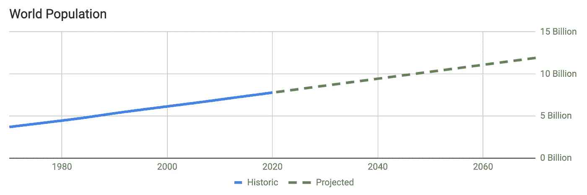
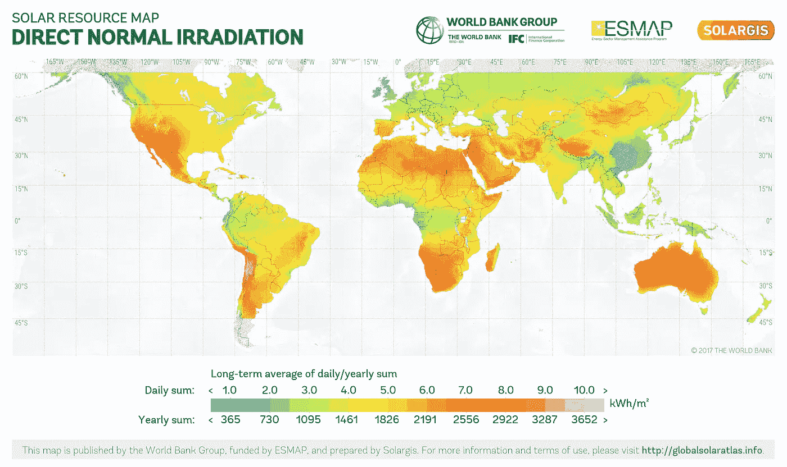
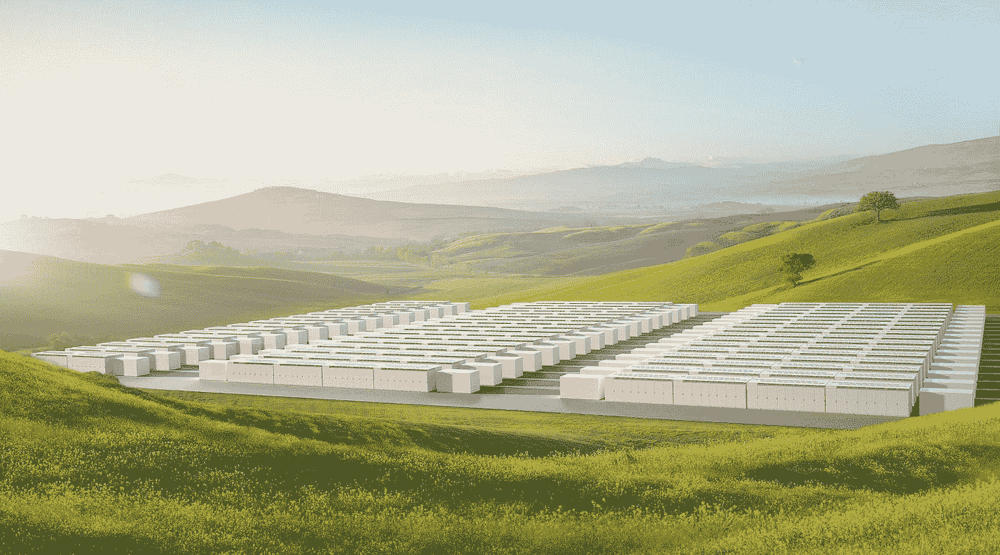
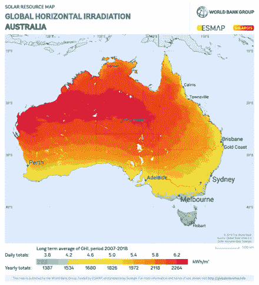
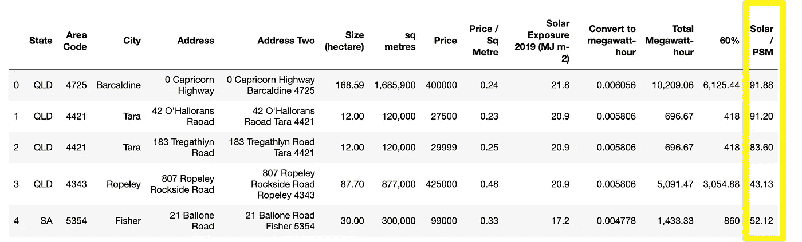
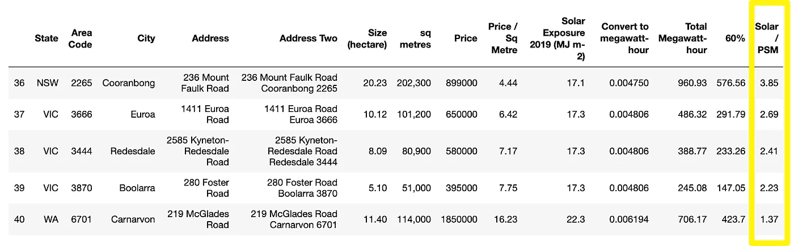
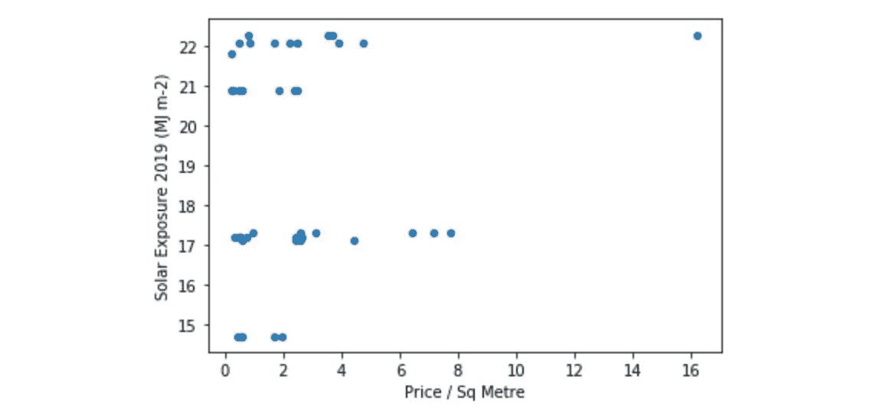
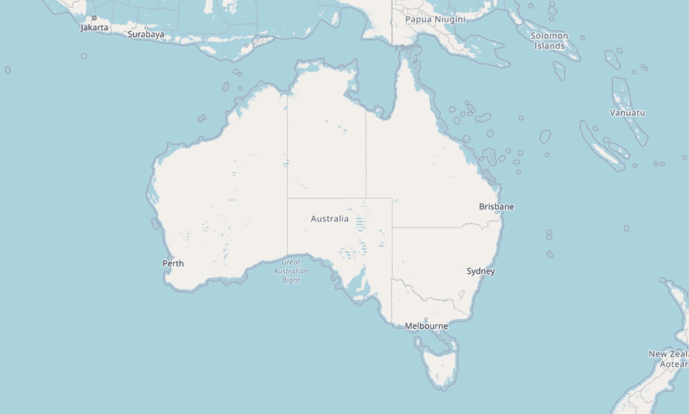
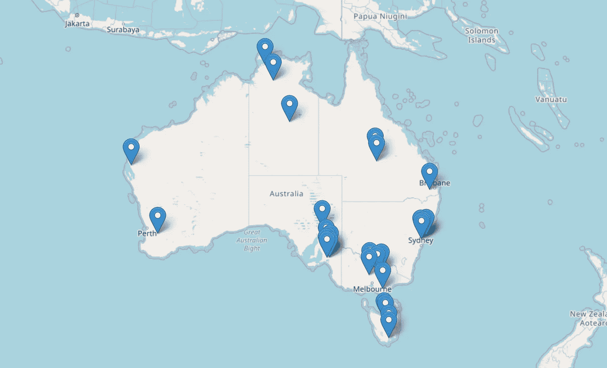
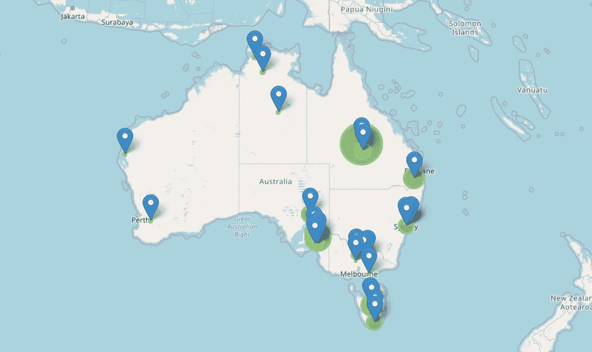

# 太阳能和房地产可持续发展商机

> 原文：<https://towardsdatascience.com/solar-arbitrage-the-real-estate-and-clean-energy-opportunity-d0ff08e4152?source=collection_archive---------57----------------------->

## 数据科学找到一种有利可图的行善方式

世界人口正在从今天的 78 亿增加到预计未来 50 年的 120 亿。这相当于地球上新增 42 亿人口，大约是美国的 13 倍。



数据来自联合国 population.un.org 办事处

为了维持这种增长，我们需要生产更多的能源。但是为了维持地球，我们需要可持续的能源。那么问题就变成了:有没有一种方法可以在创造利润的同时解决这些问题？



你觉得什么最突出？图片来自维基百科。

上图是太阳辐照度图，即单位面积从太阳接收的功率(瓦特每平方米，W/m2)。

商业案例:澳大利亚是地球上最大的陆地之一，拥有最高的太阳辐射量，但它的土地价格是否考虑了阳光照射的价值？机会在于找到大量暴露在阳光下的被低估的土地，并将这些土地主要转化为太阳能农场——太阳能套利的商业案例。

这种商业模式来自于将电力销售回电网，并创造 B2C 和 B2B 能源解决方案。这可能是将电力返销到澳大利亚、新加坡，为消费者提供更便宜的电力，并创造 B2B 能源解决方案，如特斯拉的 Powerpack & Megapack。



图片来自 Tesla.com

利用数据科学，让我们探索一下这个机会是否存在。**我们正在寻找:澳大利亚的一个位置，那里有最高的阳光照射率和廉价的土地。**



澳大利亚太阳辐照度。图片来自维基百科。

这方面没有公开可用的数据(因此是“秘密”机会)，所以我们必须手动将拼图拼在一起。感兴趣的关键变量:位置、土地面积、价格、年日照量。数据来源:

*   土地面积和价格数据来自:domain.com.au/rural
*   阳光照射数据来自:bom.gov.au/climate/data/index.shtml?书签=203

大部分工作是在收集数据和计算太阳能与土地的价格比率，这已经在这个数据集中完成。我们正在寻找大量的土地，如农村和农场土地。

```
# Import data
import pandas as pd
solar = pd.read_csv('data/land_and_solar.csv')
solar.head()
```



这里的关键一栏是“太阳能/每平方米价格”，这是这块土地每 1 美元得到的阳光照射量。数字越高，获利机会越好。

```
solar.tail()
```



让我们来看看目前价格/平方米和阳光照射之间是否存在关联？换句话说，目前的房地产市场价格是否考虑了阳光照射？

```
# Plot to see if there is a correlation
solar.plot.scatter(x='Price / Sq Metre', y='Solar Exposure 2019 (MJ m-2)')
```



如果已经有了相关性，我们会期望看到一个线性模式。

目前的房地产价格似乎没有反映阳光照射。这也许就是机会所在！接下来，让我们将位置可视化。这就是 Python 打败 Excel 的地方。我们将绘制位置图，并根据太阳能/每平方米价格比率对每个位置进行加权。

```
# Use street address to find latitude and longitude and add to datafrom geopy.geocoders import Nominatim
from geopy.extra.rate_limiter import RateLimiter
geolocator = Nominatim(user_agent="application")
geocode = RateLimiter(geolocator.geocode, min_delay_seconds=1)
solar['location'] = solar['Address Two'].apply(geocode)
solar['point'] = solar['location'].apply(lambda loc: tuple(loc.point) if loc else None)
solar[['latitude', 'longitude', 'altitude']] = pd.DataFrame(solar['point'].tolist(), index=solar.index)# Create base map in Australia
import folium
def generateBaseMap(default_location=[37.76, -122.45], default_zoom_start=4):
    '''
    Create a base map
    '''
    base_map = folium.Map(
        location = default_location
        , control_scale = True
        , zoom_start = default_zoom_start
    )
    return base_map
base_map = generateBaseMap(default_location=[-24.003064,134.629882])
display(base_map)
```



leav 生成的地图。

```
# Plot land locations from dataset
for i in range(0,len(solar)):
    folium.Marker(
        location=[solar.iloc[i]['latitude'], solar.iloc[i]['longitude']],
        popup=solar.iloc[i]['Solar / PSM']
    ).add_to(base_map)display(base_map)
```



这些标记代表可供出售的土地。

```
# Plot Solar / Price Per Sq Metre ratio and give them weightings
for i in range(0,len(solar)):
    folium.Circle(
        location=[solar.iloc[i]['latitude'], solar.iloc[i]['longitude']],
        popup=solar.iloc[i]['Solar / PSM'],
        radius=solar.iloc[i]['Solar / PSM']*3000,
        color='crimson',
        fill=True,
        fill_color='crimson'
    ).add_to(base_map)display(base_map)
```



绿色圆圈代表“太阳能/每平方米价格”比率。圈子越大，土地越值钱。它标志着你以更低的土地成本获得更多的阳光照射。

秘诀:离澳大利亚昆士兰州的大堡礁不太远的地方，将是建立一个有利可图的太阳能发电厂的理想地点。


截至 2020 年 5 月的农村待售土地。图片来自 domain.com.au 农村土地出售清单。

**下一步:**

这一初步探索显示了潜在的房地产和清洁能源的机会及其价值，为更深入的分析。下一步将是将数据集扩展为完整的位置列表，并探索建立太阳能发电厂的商业模式。一些问题包括:建造和维护一个大型太阳能发电厂的成本是多少，可以产生多少能量，利润率是多少，土地利用还有哪些其他机会？世界上还有哪些地方也存在这种机会？

像食物一样，能源是人类生活的重要组成部分。对能源的需求将永远存在，并且在未来，对能源的需求将继续增加。这是一个以有利可图的方式行善的真正机会。

如果这引发了一些好奇，让我们连接。我很想进一步探索这个问题。