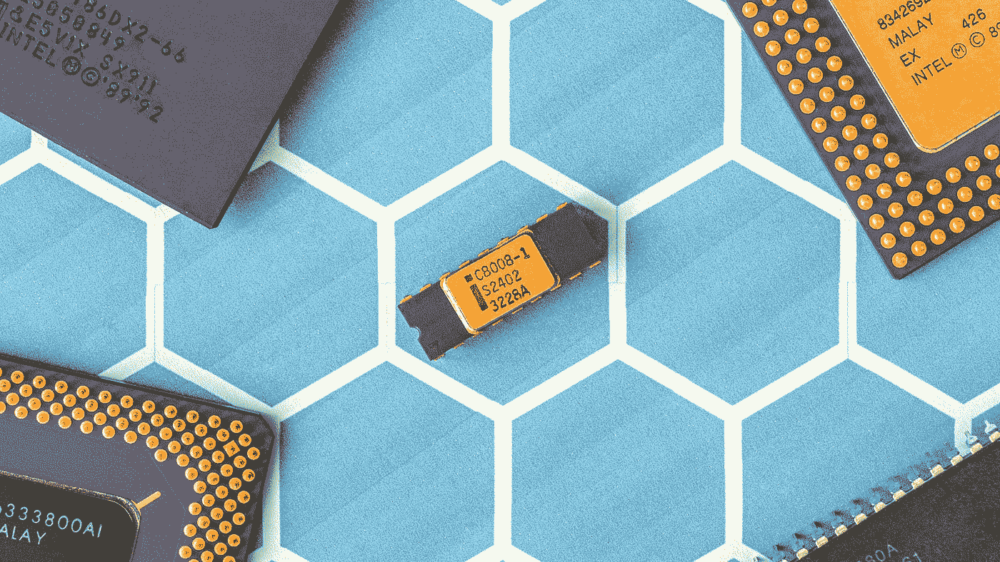

# 太阳图像分析:几毫秒内 50 亿行

> 原文：<https://towardsdatascience.com/solar-image-analysis-5-billion-rows-in-a-matter-of-milliseconds-cd5276161087?source=collection_archive---------78----------------------->

## GPU 供电的工作站节省了 NASA 数年的计算时间！

穆罕默德·诺哈西在 [Unsplash](https://unsplash.com?utm_source=medium&utm_medium=referral) 上的照片

自从 2010 年发射*太阳动力学观测站(SDO)* 任务以来，美国宇航局拍摄了超过 1 . 5 亿张太阳图像。这为航天局存储、管理和分析了超过 18pb 的数据。直到最近，NASA 还面临着一场计算噩梦。

关于太阳的工作，我们可以学到什么？GPU 驱动的数据科学工作站如何缓解 NASA 的计算挑战？让我们快速浏览一下！

太阳物理学是研究太阳如何工作并影响地球上的生命。美国宇航局的研究科学家正在以每 1.3 秒一张的速度收集太阳图像，希望从这颗发光的恒星上的各种太阳活动中获得洞察力。

能够使用带有 CPU 的传统计算平台来处理这些图像，处理它们并识别特征，这需要研究人员花费数年甚至数十年的时间来回答一个问题或在一个问题上取得进展。

## 基于 NVIDIA 的数据科学工作站

据 NASA 的研究科学家 Michael Kirk 称，由 Quadro RTX GPU 驱动的数据科学站执行计算的速度比更老、更传统的 CPU 驱动的数据科学站快 150 倍。

Jonas Svidras 在 [Unsplash](https://unsplash.com?utm_source=medium&utm_medium=referral) 上拍摄的照片

美国国家航空航天局的高度精确的算法，用于拾取“坏”像素并将其从太阳图像中移除，相当于该任务的大量计算挑战。自 2010 年以来拍摄的惊人的 1.5 亿张图像包含数十亿个这样的“坏”像素！

新工作站通过过滤数十亿坏像素，使分析和查找假阴性的过程变得更加容易和快速。事实上，美国宇航局的研究人员仍在研究这一过程。他们对未来的计划也是经历假阳性；即被算法挑选为“好”像素的坏像素。

NVIDIA 驱动的数据科学工作站为美国宇航局的研究科学家和天体物理学家提供了一个完美的平台，开始使用和应用一些来自人工智能(AI)和机器学习(ML)的更现代和更先进的技术。

> “现在许多太阳物理学工作的圣杯是能够做出预测；对太阳耀斑何时爆发、太阳活动何时活跃以及活跃程度的预测。如果我们能够做出这些预测，任何在轨道上拥有卫星的公司都将能够采取预防措施来保护他们的卫星。”——迈克尔·柯克，美国国家航空航天局的研究科学家。

惠普将其 [Z 数据科学工作站](https://www8.hp.com/us/en/workstations/industries/data-science.html)营销为“世界上最强大的工作站”,能够在几毫秒内通过一次点击与多达 50 亿个数据集行进行交互。

由[约书亚·索蒂诺](https://unsplash.com/@sortino?utm_source=medium&utm_medium=referral)在 [Unsplash](https://unsplash.com?utm_source=medium&utm_medium=referral) 上拍摄的照片

如果这不令人兴奋，我不知道什么才是。

如果你喜欢这篇快速的新闻般的文章，并且想更深入地了解用于太阳图像分析的算法，请让我知道并关注更多！