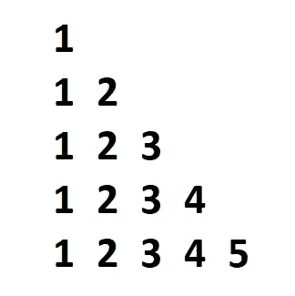
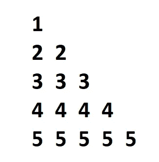
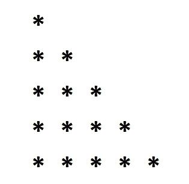
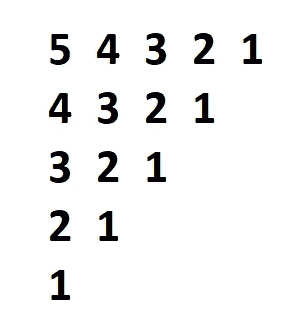
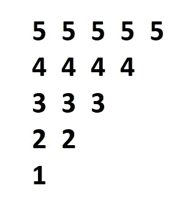
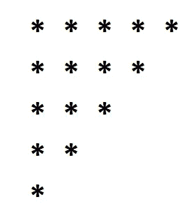
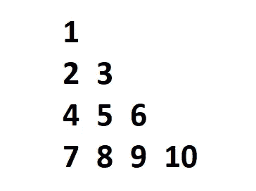
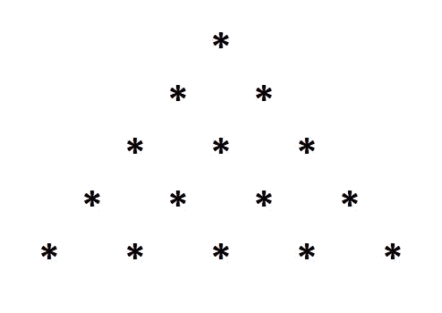

# 模式编程面试问题解答

> 原文：<https://towardsdatascience.com/solutions-to-interview-questions-on-pattern-programming-cb1cff41844?source=collection_archive---------10----------------------->

## 用 python 解决公司面试中提出的各种模式编程问题

照片由 [Maranda Vandergriff](https://unsplash.com/@mkvandergriff?utm_source=medium&utm_medium=referral) 在 [Unsplash](https://unsplash.com?utm_source=medium&utm_medium=referral) 上拍摄

编码面试通常会要求一个模式程序来测试候选人。

通常，在持续四轮的面试过程中，第一轮往往是一个编程轮，并且有可能所问的问题之一可能是模式程序。

模式编程是指经常给你一个特定的模式设计问题，带有星号(*)或数字或字母，你要在迭代循环语句的帮助下对该设计进行编程。

在本文中，我们将揭示解决这些问题的方法，并理解这些编程模式背后的理论。

几年前，我曾用 Java 编程来解决我的大部分模式程序，但 python 同样简单，甚至可能更简单。因此，python 将是本文选择的语言。

然而，使用的语言并不重要，只有解决这些问题背后的有趣逻辑才是重要的。今天，我们将探讨一些基本问题。

所以，事不宜迟，让我们动手开始编码吧！

# 模式-1:数字变化的半金字塔-1

作者截图

上述模式是我们将在本文中解决的第一类问题。大多数模式类型的问题可以很容易地通过两到三次迭代操作来解决。

仔细观察，您会发现在打印第一个数字后，光标会跳到下一行，然后在打印两个数字后，光标又会移到下一行，依此类推。

我们解决这种模式的逻辑非常简单。我们将有 5 行，然后在打印出与行数相等的数字后，我们将移动光标。

我的意思是，对于第一行，将打印 1 个数字，第二行将打印 2 个数字，依此类推。

> **注意:**本文中提到的问题有多种解决方案。这些是我选择的代码和方法。你可以用任何你觉得更适合你的编程风格的方式来解决它们。

## 代码:

通过定义如下用户定义的变量，可以根据用户的输入选择行数:

我之前建议的逻辑在代码块中实现。要记住的最关键的一点是，内部循环总是首先实现的。之后，执行外部循环。range 函数总是包括指定的第一个数字，而忽略最后一个数字，取而代之的是 n-1 值。(其中 n 是最后一位数字，在本例中是 6)。

在这个程序中，我们指定了将要相应解释的行数。之后，我们运行内部循环，它根据我们拥有的行数执行。我们打印“j ”,因为每次值被重置为 1 时，它都会按照行的升序打印相应的值。

> **注意:**对于本文的其余部分，我将使用缺省的 5 行。你可以选择你喜欢的两种方法之一。

# 模式 2:数字变化的半金字塔-2

作者截图

我们要解决的第二个模式程序与第一个半金字塔问题非常相似。这里唯一的区别是，我们需要打印与行数相等的数字，数字需要根据各自的值进行解释。

这意味着数字“1”将首先被解释，并且只被打印一次。数字“2”将被第二次执行并打印两次，以此类推。

## 代码:

在这个程序中，我们指定了将要相应解释的行数。之后，我们运行内部循环，它根据我们拥有的行数执行。

此后，我们将在每次执行完成时打印“I”。“I”指定了第 I 行和数字“I”，必须在每次连续迭代中打印出来。这意味着数字“1”将首先被解释，并且只被打印一次。数字“2”将被第二次执行并打印两次，以此类推。

# 模式 3:带星号' * '的半金字塔

作者截图

下一个模式程序应该很简单，因为我们之前已经解决了两个类似的问题。事实上，这可以通过两种方法来实现。

这两种解决方法都是前面两个问题中提到的。唯一的替换是使用星号“*”代替数字“I”或“j”。请注意，也可以使用其他符号，如哈希“#”，但方法保持不变。

## 代码:

## 方法 1:

## 方法 2:

上面显示的两个代码块都是解决这个模式程序的有效方法。

我们正在计算范围，直到行数，然后执行所需的星号值，相当于行数。光标移动到下一行之后，是代码块的内部“j”循环所建议的代码。

# 模式 4:反半金字塔变体 1

作者截图

我们将遇到的下一个模式程序是数字的逆半金字塔。这里，我们有五行类似于前面的问题。我们必须从提到的最大行数开始，一直到只包含一个数字的底部。

对于接下来的几个模式程序，我们将使用使用 range(N，-1，-1)的反向迭代逻辑，它表示迭代数的反向实现。

## 代码:

上面的代码块显示了两个连续的 for 循环，以相反的方式执行外部和内部迭代。这里，我们从第一行开始，反向打印五个数字。这种实现将导致行数递减，直到达到循环数的可持续极限。

# 模式 5:反半金字塔变体 2

作者截图

这个模式程序是先前解决的反半金字塔问题的第二个变体。逻辑很简单。共有 5 行，我们打印的行数与每一行的行数相反。

即使对于这个模式程序，我们也将使用使用 range(N，-1，-1)的反向迭代逻辑，这表示迭代数字的反向实现。

## 代码:

上面的代码块显示了两个连续的 for 循环，以相反的方式执行外部和内部迭代。这里，我们从第一行开始，反向打印五个数字。

在这个实现中打印的数字将导致行数的降序，直到我们达到循环数的可持续结尾，并且每个打印的数字等于循环的逆序。

# **模式-6:带星号“*”的反半金字塔变异**

作者截图

即使对于这个模式程序，我们也将使用使用 range(N，-1，-1)的反向迭代逻辑，这表示迭代数字的反向实现。逻辑类似于前面两个相应解释的模式程序。

## 代码:

解释类似于前两个反半金字塔模式程序。我们只是打印符号，而不是行号或列号。

# 模式 7:数字变化的半金字塔-3

作者截图

这是本文的最后一个半金字塔实现。我们按照升序打印每个数字。如前面的模式程序所示，行和列将递增。但是，我们将使用增量计数来计算增加的数字。

## 代码:

这里，在上面的代码块中，我们用变量“num”指定了一个计数，该计数从 1 开始，并相应地递增。行数和列数将分别用' ith '和' jth' for 循环处理。对于同一个问题，我建议尝试相反的实现。

# 模式 8:带星号' * '的完整金字塔

作者截图

我们今天要分析的最后一个模式程序是带星号的全金字塔。为了更好地从概念上理解，您也可以自由地尝试使用数字。

我们将根据问题使用一个额外的变量来计算所需的空间。行和列的计算将与前面的模式编程问题中处理的几乎相同。

## 代码:

在这个模式程序中，我们使用数字“n”来表示用户的输入。“k”变量用于计算相应的空格数。一旦计算出空格的数量，我们将减去剩余的空格。第 I 行和第 j 列的计算类似于所有其他模式程序。

Artem Sapegin 在 [Unsplash](https://unsplash.com?utm_source=medium&utm_medium=referral) 上拍摄的照片

# 结论:

在本文中，我们设法涵盖了面试中可能会问到的大多数基本模式编程问题，以及如何系统地解决这些问题。

在编程的世界中有许多可能的模式，并且通过使用您选择的编程语言，您可以构建更多的模式。

如果你们对这些感兴趣，那么我也会制作第二部分，涵盖更多类似的模式编程问题，这些问题可能会在面试中被问到。

此外，如果您对我们今天解决的问题有任何疑问，观众可以随时告诉我。此外，请随意建议更多您认为我应该在未来涵盖的问题模式。

看看我的其他一些文章，你可能会喜欢读！

 [## 揭秘人工智能！

### 打破人工智能领域和它的未来。

towardsdatascience.com](/demystifying-artificial-intelligence-d2887879aaf1)  [## 用代码和例子简化函数的 args 和 kwargs！

### 理解 python 编程和机器学习的*args 和*kwargs 的完整概念。

towardsdatascience.com](/simplifying-args-and-kwargs-for-functions-with-codes-and-examples-b785a289c2c2)  [## 简单有趣的万圣节 Python 项目！

### 这是一个有趣的“不给糖就捣蛋”的游戏，让你在万圣节愉快地学习 python 编程

towardsdatascience.com](/simple-fun-python-project-for-halloween-ff93bbd072ad)  [## 5+独特的 Python 模块，用于创建脱颖而出的机器学习和数据科学项目！

### 超过 5 个酷 Python 库模块的指南，用于创建令人敬畏的机器学习和数据科学项目。

towardsdatascience.com](/5-unique-python-modules-for-creating-machine-learning-and-data-science-projects-that-stand-out-a890519de3ae) 

谢谢你们坚持到最后。我希望你们喜欢阅读这篇文章。我希望你们都有美好的一天！