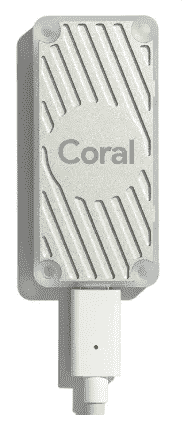
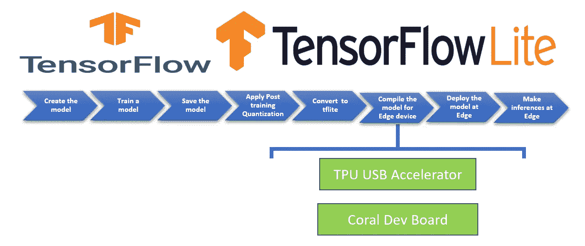
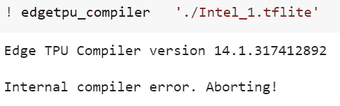
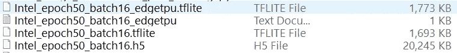
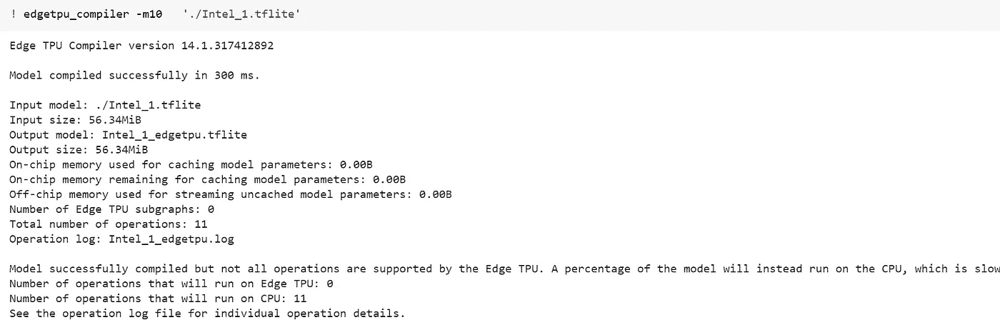
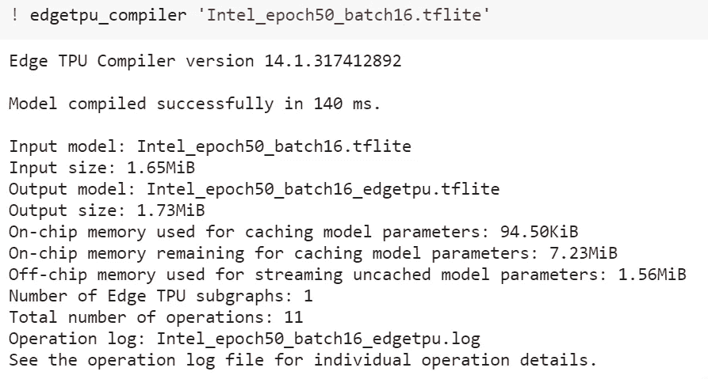
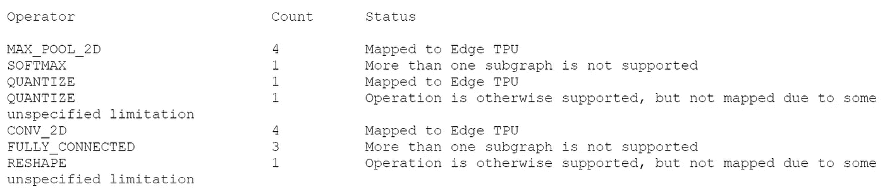

# Edge TPU 问题的解决方案

> 原文：<https://towardsdatascience.com/solutions-to-issues-with-edge-tpu-32374310e732?source=collection_archive---------46----------------------->

## 了解如何解决使用 TPU USB 加速器时的常见问题

***在这篇文章中，我将分享我在 Edge TPU USB 加速器上制作深度学习模型时遇到的一些常见错误以及对我有效的解决方案。***



来源:https://coral.ai/products/accelerator/

Coral USB 加速器是一种专用集成芯片(ASIC ),可为您的机器增加 TPU 计算能力。额外的 TPU 计算使深度学习模型的边缘推断更快更容易。

把 USB 加速器插在 USB 3.0 口，复制 TFLite Edge 模型，连同做推论的脚本，就可以开始了。它可以在 Mac、Windows 和 Linux 操作系统上运行。

要创建 Edge TFLite 模型并使用 USB 加速器在边缘进行推理，您将使用以下步骤。

1.  **创建模型**
2.  **训练模型**
3.  **保存模型**
4.  **应用培训后量化**
5.  **将模型转换为 TensorFlow Lite 版本**
6.  **使用 edge TPU 编译器编译 tflite 模型，用于 Coral Dev board 等 Edge TPU 设备到 TPU USB 加速器**
7.  **在边缘部署模型并进行推理**



## 问题 1:使用 edgetpu_compiler 编译 TfLite 模型时，出现错误“内部编译器错误。中止！”

***出错的代码***

```
**test_dir='dataset'** 
**def representative_data_gen():
  dataset_list = tf.data.Dataset.list_files(test_dir + '\\*')
  for i in range(100):
    image = next(iter(dataset_list))
    image = tf.io.read_file(image)
    image = tf.io.decode_jpeg(image, channels=3)
  *  image = tf.image.resize(image, (500,500))*
    image = tf.cast(image / 255., tf.float32)
    image = tf.expand_dims(image, 0)**# Model has only one input so each data point has one element
    **yield [image]****keras_model='Intel_1.h5'**#For loading the saved model and tf.compat.v1 is for compatibility with TF1.15 **converter=tf.compat.v1.lite.TFLiteConverter.from_keras_model_file(keras_model)**# This enables quantization
**converter.optimizations = [tf.lite.Optimize.DEFAULT]**# This ensures that if any ops can't be quantized, the converter throws an error
**converter.target_spec.supported_ops = [tf.lite.OpsSet.TFLITE_BUILTINS_INT8]**# Set the input and output tensors to uint8
**converter.inference_input_type = tf.uint8
converter.inference_output_type = tf.uint8**# set the representative dataset for the converter so we can quantize the activations
**converter.representative_dataset = representative_data_gen
tflite_model = converter.convert()**#write the quantized tflite model to a file
**with open('Intel_1.tflite', 'wb') as f:
  f.write(tflite_model)****with open('Intel_1.tflite', 'wb') as f:
  f.write(tflite_model)
print("TFLite conversion complete")**
```

将模型转换为 Tflite 后，为 Edge TPU 编译模型



这个错误没有描述，您被留在黑暗中解决这个问题。

## 对我有效的解决方案

我创建了两个定制模型，它们具有相同的架构，但不同的数据集，不同的类数量，并使用相同的步骤来编译这两个 tflite 模型。

一个模型编译成功，而另一个模型给出了“内部编译器错误”

现在我知道这不是创建边缘 TPU 模型的模型或步骤，而是与数据相关的东西。

关于这个问题的讨论:[https://github.com/tensorflow/tensorflow/issues/32319](https://github.com/tensorflow/tensorflow/issues/32319)帮助我尝试不同的选择。

我的解决方案是缩小图像尺寸，瞧，它成功了！！！

这个解决方案为什么有效？

减小图像尺寸可能有助于用于创建代表性数据集的激活范围。

代表性数据集有助于精确的激活动态范围，用于量化模型。

当我们量化模型时，我们将用于表示 TensorFlow 模型的权重、激活和偏差的数字的精度从 32 位浮点降低到 8 位整数，这有助于使模型变得轻量。

**TFLite 和 EdgeTPU 模型是轻量级的，因此我们具有更低的延迟、更快的推理时间和更低的功耗。**

下图显示了以 H5 格式、TFlite 模型和 EdgeTPU 保存的模型的大小差异。



我又尝试了一件事来固化我的理解；我试图在 Edge TPU 运行时版本的较低版本中编译具有更高图像维度(500，500)的相同错误模型。

它编译了，但是整个模型将在 CPU 而不是 TPU 上运行，这表明量化模型仍然有一些浮点运算。



我用图像尺寸(100，100)而不是(500，500)重新训练模型

有效的代码。

```
**keras_model='Intel_epoch50_batch16.h5'**#For loading the saved model and tf.compat.v1 is for compatibility with TF1.15 **converter=tf.compat.v1.lite.TFLiteConverter.from_keras_model_file(keras_model)**# This enables quantization
**converter.optimizations = [tf.lite.Optimize.DEFAULT]**# This ensures that if any ops can't be quantized, the converter throws an error
**converter.target_spec.supported_ops = [tf.lite.OpsSet.TFLITE_BUILTINS_INT8]**# Set the input and output tensors to uint8
**converter.inference_input_type = tf.uint8
converter.inference_output_type = tf.uint8**# set the representative dataset for the converter so we can quantize the activations
**converter.representative_dataset = representative_data_gen
tflite_model = converter.convert()**#write the quantized tflite model to a file
**with open('Intel_class.tflite', 'wb') as f:
  f.write(tflite_model)**with open('Intel_epoch50_batch16.tflite', 'wb') as f:
  f.write(tflite_model)
```

现在该模型用最新版本的 Edge TPU 编译器编译。



随着维度的变化，现在大部分操作将在 TPU 上运行。



Edgetpu 日志文件

## 问题 2: ValueError:在操作“reshape”的输入数组中发现过多维度

在 tflite 模型成功编译 edgetpu_compiler 之后，我们实例化了用于推理的解释器。遇到错误“ValueError:在操作“reshape”的输入数组中发现过多维度。

我在这个帖子里回复了关于我的解决方案的讨论:【https://github.com/google-coral/edgetpu/issues/74 

## 对我有效的解决方案

问题在于我用于训练后量化的代表性数据集。用于创建代表性数据集的数据集比我在 images 文件夹中提供的图像更多。

我的 test_dir 有 99 个图像，我将范围设置为 100。当我将用于代表性数据集的数据集与文件夹中的图像数量进行匹配时，问题就解决了。

```
**def representative_data_gen():
  dataset_list = tf.data.Dataset.list_files(test_dir + '\\*')
  for i in range(99):
    image = next(iter(dataset_list))
    image = tf.io.read_file(image)
    image = tf.io.decode_jpeg(image, channels=3)
    image = tf.image.resize(image, (100,100))
    image = tf.cast(image / 255., tf.float32)
    image = tf.expand_dims(image, 0)**# Model has only one input so each data point has one element
    **yield [image]**
```

## 结论:

一步一步，排除变量会引导你找到根本原因。我使用 5W 和 1H 技术，其中 5W 代表谁、什么、哪里、何时、为什么，而 1 H 代表如何。