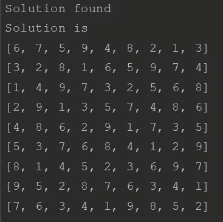

# 用 Python 中的 Crook 算法更优雅地解数独

> 原文：<https://towardsdatascience.com/solve-sudoku-more-elegantly-with-crooks-algorithm-in-python-5f819d371813?source=collection_archive---------9----------------------->

## 不再胡乱猜测玩数独了

数独过去是(现在对我来说仍然是)一种消磨时间和训练大脑的令人上瘾的数字游戏。即使现在，我仍然在书店里看到提供数独练习的书，当然还有许多应用程序在应用程序商店里提供练习。

但是，当任何一个挑战落到程序员手里，他马上会想到的是如何用一个脚本来解决。数独也不例外。一个常见的解决数独的方法是使用回溯(又名蛮力)。此方法是深度优先搜索，测试的整个分支，直到该分支违反规则或该分支是解决方案。

虽然这几乎可以保证找到解决方案，但蛮力并不享受我不太喜欢的数独之美。因此，我正在寻找一种更优雅的方式来解决数独。确实有一个。

索引

1.  [克鲁克算法](#1290)
2.  [步骤](#df9a)
3.  [Python 程序](#2aaf)

# 克鲁克算法

温斯罗普大学计算机科学教授詹姆斯·克鲁克(James Crook)发表了一篇名为“解决数独难题的纸笔算法”([链接](http://www.ams.org/notices/200904/rtx090400460p.pdf))的论文。他创造了一种解决数独的算法，他说这种算法可以在物理上应用。该算法应用数独中的所有规则，并使用更数学的方法来解决数独。不涉及复杂的规则。所以我把这个算法转换成一个 Python 脚本

在介绍这个算法之前，我想提两点:

1.  在论文中，克鲁克提到，如果没有进一步的可能步骤，猜测是必要的。我不包括对剧本的猜测。所以你用这个算法解数独的时候，有可能得不到解。

我们开始吧。

(PS:我假设你已经知道数独的规则，因此我不会详细解释这些规则。如果你不知道，请去维基百科查一下。

# 步骤

## 第一步:标记

第一步很简单，在每个单元格中列出所有可能的数字。

如果你用一个应用程序玩数独，应该已经有一个功能允许你在一个单元格中写下一些可能的数字。在算法的第一步，对于每个单元格，你按照规则，写下所有可能的数字。

## 第二步:寻找单身者

团队“单身”看起来很复杂。然而，这个概念很简单，找到是否有一个行、列或框在整个行、列或框中只有一个可能的值。由于每一行、列和框中有且只有一个数字，如果行、列或框中只有一个具有相应数字的单元格，则该数字必须在该单元格中。因此，您用这个数字填充这个单元格，然后更新受影响的行、列或框中的标记。

## 第三步:寻找抢占式集合

这一步很难，因为我花了很多时间来理解这一部分。下面是克鲁克论文中抢占式集合的定义。

> 抢占式集合由集合[1，2，.]中的数组成。。。，9]并且是大小为 m 的集合，2 ≤ m ≤9，其数是 m 个单元的唯一潜在占有者，其中唯一意味着集合[1，2，.。。，9]是这 m 个小区的潜在居住者。
> 
> 先占式集合由{[n₁、n₂表示。。。，nₘ]，[c (i₁，j₁)，c(i₂，j₂]。。。，c(iₘ，jₘ)]}，那里[n₁，n₂，。。。，nₘ]，对于 i = 1，2，.，1≤ nᵢ ≤9。。。m 表示先占集合中的数的集合，而[c (i₁，j₁)，c(i₂，j₂]，。。。，c(iₘ，jₘ)]表示 m 个单元的集合，其中集合[n₁，n₂，.。。nₘ]及其子集专门出现。
> 
> 抢占式集合的范围是抢占式集合的所有单元格所在的行、列或框。当 m = 2 或 3 时，范围可以是集合[行，框]或[列，框]中的一个。

简而言之，如果 m 个数字是一行、一列、一个框、[行、框]或[列、框]内 m 个单元格的标记的集合或超集，那么这个数字和单元格的组合就是一个抢占式集合。

## 步骤 4:排除抢占式集合之外的可能数字

这一步是算法中最重要的部分，有助于减少可能的单元数量。

> 设 X 是数独难题标记中的一个先占集合。那么 X 中出现在 X 范围内不在 X 中的单元格的标记中的每个数字都不可能是难题解答的一部分。

在此步骤中，对于抢占式集合中的所有数字，它们不可能是抢占式集合之外的单元的可能数字。这里的原因很简单，因为每个数字在每一行、列或框中只能出现一次。如果这个数在抢占式集合中，这个数必须放在集合中的那些单元格中。因此，同一行、列和框中的所有单元格都不能将此数字作为标记中的可能数字。

# Python 程序

项目链接:[https://github.com/wyfok/sudoku](https://github.com/wyfok/sudoku)

需要一个 excel 来存储单元格 A1 到 I9 中的数独问题。缺少的单元格用 0 填充。在 main.py 中，在提供 excel 文件的文件路径和问题的工作表名称后，程序将运行基本的数独规则和 Crook 算法，直到结果不再更新。然后程序会打印出结果，不管这个结果是不是解。

问题

解决办法

基本上，整个 Python 程序循环每个规则，并更新标记和解决方案。例如，下面是检查每一行的函数。如果一个可能的数字只出现在一个单元格中，那么这个数字就是这个单元格的解。

下面是应用克鲁克算法的功能。该函数将尝试从最大的可能数字集合到最小的数字集合中找到一个抢占式集合。如果一个单元格中的可能数字的大小与其中的可能数字是该单元格的子集的单元格的数量相匹配，则该函数将消除抢先集之外的单元格的所有可能数字。

请随意使用我的程序来解决你的数独问题。如果您有任何问题，请随时留下您的评论。下次见。

参考:

[http://pi . math . Cornell . edu/~ mec/summer 2009/meerkamp/Site/Solving _ any _ Sudoku _ ii . html](http://pi.math.cornell.edu/~mec/Summer2009/meerkamp/Site/Solving_any_Sudoku_II.html)【http://www.ams.org/notices/200904/rtx090400460p.pdf】T2