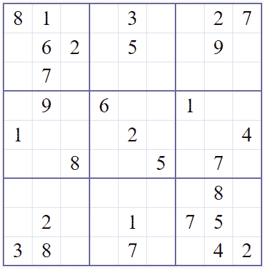
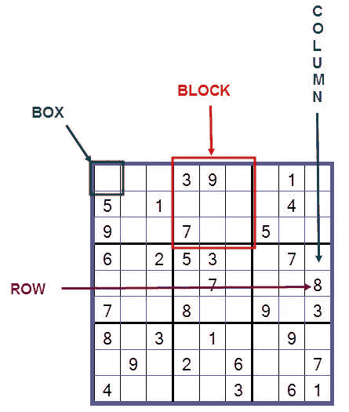
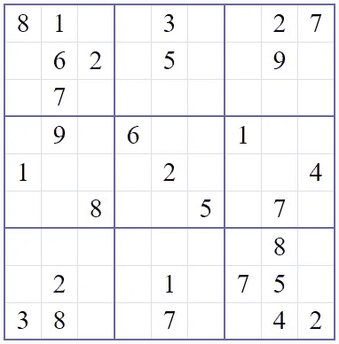
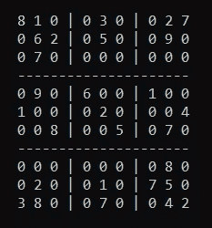
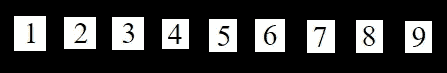

# 自动解决数独

> 原文：<https://towardsdatascience.com/solve-sudokus-automatically-4032b2203b64?source=collection_archive---------2----------------------->



## 通过用 Python 实现数独求解算法，并用 PyAutoGUI 自动化人机交互

在这篇文章中，我将介绍如何制作自己的脚本来解决数独难题。此外，PyAutoGUI 增强了这个脚本，使数独求解相当自动化(您只需执行代码)。

我把这篇文章分成以下几部分:

1.  数独入门——这个简短的部分涵盖了必须牢记的基本规则；
2.  数独解决算法——这部分从定义必要的数据结构开始，我们将创建一个算法来解决任何给定的难题；
3.  自动化——如果你的脚本知道一个谜题的一步一步的解决方法，那就太酷了。如果你的代码与网页交互并自动解决数独，那就更酷了。

我希望您已经安装了 Python、Pillow 和 PyAutoGUI 模块。如果你还没有 PyAutoGUI，那么你应该按照这里的[](https://pyautogui.readthedocs.io/en/latest/install.html)**安装。**

# **数独规则**

****

**数独术语解释。来源:https://www.pinterest.com/pin/468796642443225725/**

**重要的事情先来。如果你不熟悉数独游戏的规则，不要害怕。它们非常简单:**

**您必须用 1 到 9 的数字填充 9x9 网格的方框，以使每行、每列和 3x3 块中没有重复出现的数字。**

**如果你看一下这张图片，左上角的框中唯一合适的数字是 2，因为它是唯一一个没有出现在这一行、列和框中的数字。**

# **数独和数据结构示例**

****

**来自互联网的随机难题**

**我们从网上随便拿一个数独谜题，试着用 Python 来解。我建议我们将这个难题作为一个二维 Python 数组来处理，其中空盒子用零表示，其他盒子用相应的数字表示。我们应该获得以下内容:**

```
sudoku =    [[8, 1, 0, 0, 3, 0, 0, 2, 7], 
            [0, 6, 2, 0, 5, 0, 0, 9, 0], 
            [0, 7, 0, 0, 0, 0, 0, 0, 0], 
            [0, 9, 0, 6, 0, 0, 1, 0, 0], 
            [1, 0, 0, 0, 2, 0, 0, 0, 4], 
            [0, 0, 8, 0, 0, 5, 0, 7, 0], 
            [0, 0, 0, 0, 0, 0, 0, 8, 0], 
            [0, 2, 0, 0, 1, 0, 7, 5, 0], 
            [3, 8, 0, 0, 7, 0, 0, 4, 2]]
```

**当试图从第 *i* 行和第 *j* 列访问某个元素时，只需调用**

```
sudoku[i][j]
```

# **让它看起来更像一个真正的数独游戏**

**当然，这个二维 python 数组看起来不像没有任何网格线的真正的数独。因此，最好能打印出谜题的当前状态。下面是代码示例及其输出。**

```
def printsudoku():
    print("\n\n\n\n\n")
    for i in range(len(sudoku)):
        line = ""
        if i == 3 or i == 6:
            print("---------------------")
        for j in range(len(sudoku[i])):
            if j == 3 or j == 6:
                line += "| "
            line += str(sudoku[i][j])+" "
        print(line)
```

****

**一个 *printsudoku* 函数的示例输出**

**我们开始吧！现在我们已经准备好一步一步地创建算法。**

**免责声明:我没有完全自己创造这个数独解决算法。想法和实现都是从麻省理工学院 open 课件 Youtube 频道抄袭来的，更具体的说是从这个 [*视频*](https://www.youtube.com/watch?v=auK3PSZoidc) *。然而，它被-NC-SA 许可为知识共享，这给我的共享开了绿灯。***

## **第一步。寻找未填充的单元格**

**要求解某个单元格，我们必须首先找到空单元格的行号和列号。下面的函数完成了这个任务。**

```
def findNextCellToFill(sudoku):
    for x in range(9):
        for y in range(9):
            if sudoku[x][y] == 0:
                return x, y
    return -1, -1
```

**这将遍历第一行中的所有列，然后是第二行，依此类推。每当遇到空单元格时，该函数都会返回相应的索引。简单！**

## **第二步。验证条目**

**假设我们有一个条目。我们需要一个函数来检查当放置到第 *i* 行和第 *j* 列时是否违反了数独的三个主要规则。如果没有违反这三个规则，下面的函数返回 *True* 。否则，该函数将返回*假*。**

```
def isValid(sudoku, i, j, e):
    rowOk = all([e != sudoku[i][x] for x in range(9)])
    if rowOk:
        columnOk = all([e != sudoku[x][j] for x in range(9)])
        if columnOk:
            secTopX, secTopY = 3*(i//3), 3*(j//3)
            for x in range(secTopX, secTopX+3):
                for y in range(secTopY, secTopY+3):
                    if sudoku[x][y] == e:
                        return False
            return True
    return False
```

**检查了三个规则:**

1.  **rowOk:这个检查第 *i* 行是否没有重复的数字；**
2.  **columnOk:这个函数确保第 *j* 列中没有重复的数字；**
3.  **如果 rowOk 和 columnOk 都为*真*，那么第 6–10 行检查该条目是否适合某个块。**

## **第三步。解开谜题**

**现在一切都是为了解决给定的数独。我们将使用以下函数来实现:**

```
def solveSudoku(sudoku, i=0, j=0):
    i, j = findNextCellToFill(sudoku)
    if i == -1:
        return True for e in range(1, 10):
        if isValid(sudoku, i, j, e):
            sudoku[i][j] = e
            if solveSudoku(sudoku, i, j):
                return True
            sudoku[i][j] = 0
    return False
```

**该函数的前三行确保我们的拼图中有一个空单元格。如果 I = 1，那么我们就完成了解谜。**

**如果在第 *i* 行和第 *j* 列有一个空单元格，那么它会尝试将 1 到 9 的所有可能条目放入这个框中。如果条目有效(由 *isValid* 函数验证),则尝试在假设这是正确条目的情况下递归求解数独。**

**如果我们的假设是错误的，那么第 9 行将返回*假*，这将把第 *i* 行和第 *j* 列中的单元格的值设置为零。**

**要解决我们的数独，进行以下函数调用:**

```
solveSudoku(sudoku)
printsudoku()
```

**第一个解决了我们的难题，后者给出了解决方案。太好了！**

# **从解决方案到自动化**

**自动化部分分为两个部分:**

1.  **在数独网格上定位数字。这样我们可以解决任何数独，而不必手动填充*数独*变量。**
2.  **用数字填充空白单元格。**

**我们通过使用 PyAutoGUI 模块来实现自动化。请在您的代码中导入它。**

```
import pyautogui as pag
```

# **从我们的显示器上读取数独**

## **准备**

**我们将要解决来自 [**网络数独**](https://www.websudoku.com/?level=2) 的随机数独难题。打开一个随机拼图，保存每个数字的图像片段。它们都应该保存到与 Python 脚本相同的文件夹中。确保文件格式为. png。**

****

**保存每个号码的图像片段**

**这些片段可以有不同的尺寸，只要它们都只在白色背景上显示一个数字。我们先把它们命名为“1.png”、“2.png”等。**

## **定位号码**

**PyAutoGUI 模块有一个在屏幕上定位给定图像的功能。就我而言**

```
for pos in pag.locateOnScreen("3.png"):
    print(pos)
```

**返回屏幕上第三个位置的所有信息:**

```
Box(left=1124, top=510, width=32, height=33)
Box(left=959, top=845, width=32, height=33)
```

**前两个参数(left 和 top)给出了图像左上角的像素坐标。第三个和第四个给了我们图像的尺寸，但是现在我们不需要它们。**

**要获取所有数字的位置，请使用以下命令:**

```
for i in range(1, 10):
    for pos in pag.locateAllOnScreen(str(i)+'.png'):
        print(pos)
```

## **填充数独数组**

**因为我们不打算使用之前的*数独*数组，所以让我们把这个数组中的所有数字都变为零:**

```
sudoku =    [[0, 0, 0, 0, 0, 0, 0, 0, 0], 
            [0, 0, 0, 0, 0, 0, 0, 0, 0], 
            [0, 0, 0, 0, 0, 0, 0, 0, 0], 
            [0, 0, 0, 0, 0, 0, 0, 0, 0], 
            [0, 0, 0, 0, 0, 0, 0, 0, 0], 
            [0, 0, 0, 0, 0, 0, 0, 0, 0], 
            [0, 0, 0, 0, 0, 0, 0, 0, 0], 
            [0, 0, 0, 0, 0, 0, 0, 0, 0], 
            [0, 0, 0, 0, 0, 0, 0, 0, 0]]
```

**现在让我们定义拼图上两个单元格的像素坐标:左上和右下。在我的案例中，数字是:**

```
topleftx = 975
toplefty = 507
bottomrightx = 1307
bottomrighty = 846
```

**现在我们有了它们，让我们定义一个盒子的宽度和高度:**

```
boxwidth = (bottomrightx - topleftx)/8
boxheight = (bottomrighty - toplefty)/8
```

***解释:看一行单元格时，最左边的单元格到最右边的单元格的距离是 8 个框宽。这同样适用于列。因此，我们必须将坐标差除以 8。***

**现在我们必须定义一个函数，用正确的数字替换数独数组中的零。**

```
def fillsudoku(nr, pos):
    global sudoku
    indexlocx = int((pos[0] - topleftx + boxwidth/2)//boxwidth)
    indexlocy = int((pos[1] - toplefty + boxheight/2)//boxwidth)
    sudoku[indexlocy][indexlocx] = nr
```

**我不打算解释数学，但它需要一个 *Box* 对象，并找到我们的数字的“索引坐标”。如果到目前为止你已经正确地做了每件事，那么它将完美地工作。**

**最后，让我们用屏幕上的信息填充数组:**

```
for i in range(1, 10):
    for pos in pag.locateAllOnScreen(str(i)+'.png'):
        fillsudoku(i, pos)
```

**如果您从 IDE 跳转到 web 浏览器的速度不够快，请在代码的开头添加以下延迟方法:**

```
import timetime.sleep(5)  #this makes a 5 second delay to executing the script
```

## **填充空单元格**

**太好了！现在我们有了一个使用屏幕信息填充我们的*数独*数组的方法。既然我们有了求解算法，那么我们可以立即求解。为此，我们只需要以下函数:**

```
def fillcell(nr, x, y):
    xcoord = topleftx + boxwidth * x
    ycoord = toplefty + boxheight * y
    pag.click(xcoord, ycoord)
    pag.press(str(nr))
```

**这里我们有三个输入参数:**

*   ***nr* :这是我们要插入的号码；**
*   ***x* :我们要插入的单元格的列索引*NR；***
*   ***y* :我们要插入的单元格的行索引*NR*；**

**第 2–3 行找到单元格中点的近似坐标，我们必须插入数字。第 4-5 行单击该单元格并写下该数字。**

**哦是的！还有一件事。在解数独之前，请创建一个数独数组的副本。稍后我会解释。**

```
import copysudokucopy = copy.deepcopy(sudoku)
```

# **将碎片拼在一起**

**为了保持一致，我将在下面嵌入一个 Github 要点:**

**到目前为止，我们从屏幕上读取了数独并解决了它。在试图解决它之前，我们也有两个相同的数独数组: *sudoku* 和 *sudokucopy* 。**

**制作*数独游戏*是为了比较我们拼图的初始和最终状态，并填充空白单元格。**

```
for x in range(9):
    for y in range(9):
        if sudokucopy[x][y] == 0:
            fillcell(sudoku[x][y], y, x)
```

# **接下来呢？**

**现在可以执行了，如果您的配置是正确的，它应该是这样的:**

****

**当然，可以做一些改进:**

1.  **我花了大约 20 秒将数据从屏幕加载到*数独*数组。您可以使用一些不同的模块(或创建自己的模块)来加快速度。**
2.  **修改数独求解算法，使自动求解部分看起来更像人类的思维。现实生活中没有人能解决上面动画中显示的难题。**

**请随意修改这个实现，并在不同的谜题上测试它(甚至是最极端的谜题)。**

**如果你读完整篇文章，我想感谢你。如果你有任何想法或者修改了代码，让我在评论区知道。:)**