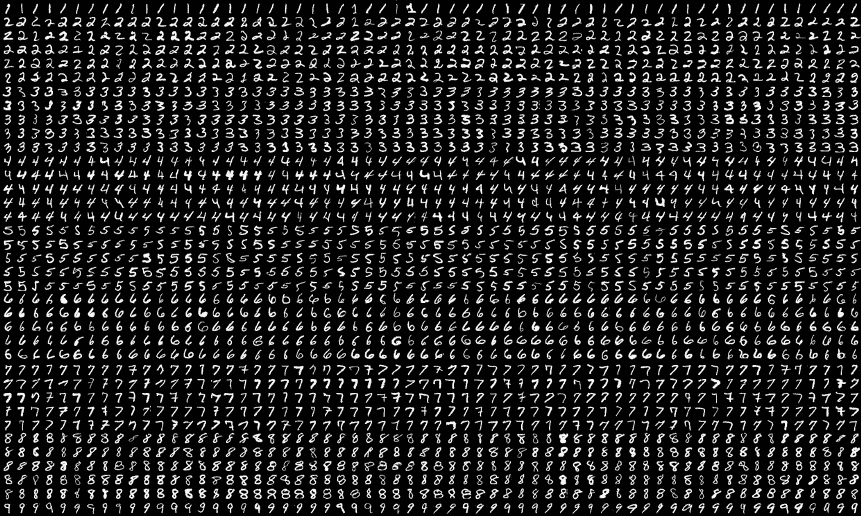
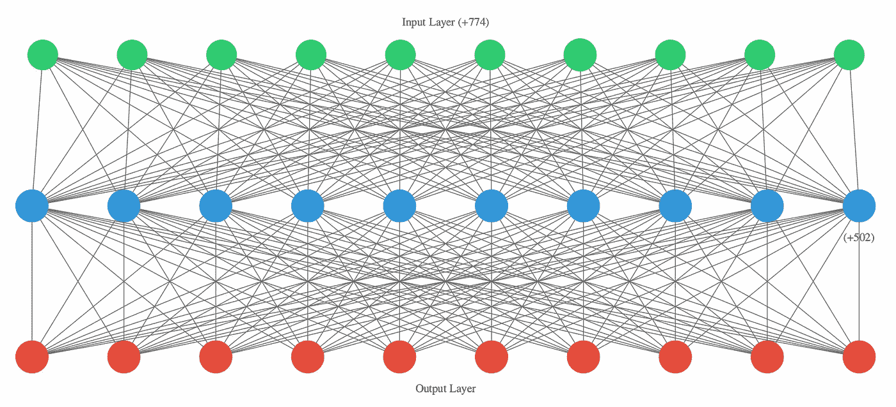

# 解决 MNIST 图像分类问题

> 原文：<https://towardsdatascience.com/solve-the-mnist-image-classification-problem-9a2865bcf52a?source=collection_archive---------16----------------------->

## “你好，世界！”深度学习和 Keras

求解 MNIST 是机器学习模型的一个基准。这也是你进入深度学习领域时首先会遇到的问题之一。

在本文中，我们将设计一个神经网络，它使用 Python 库 Keras 来学习对 MNIST 数据集的手写数字进行分类。

解决 MNIST 问题的疯狂之处在于，它根本不消耗资源。你*不需要 GPU* 。我们在这里建立的模型可以在不到一分钟的时间内在任何现代 CPU 上快速训练。



手写数字的 MNIST 数据集

# 关于 MNIST 数据集

MNIST 数据集是一组 60，000 幅训练图像加上 10，000 幅测试图像，由美国国家标准与技术研究所(NIST)在 20 世纪 80 年代汇编而成。这些图像被编码为 NumPy 数组，标签是一个数字数组，范围从 0 到 9。图像和标签是一一对应的。

# 设置 Keras 和相关性

假设您已经安装了 [Anaconda](https://anaconda.com) ，我们将简要讨论安装 Keras 和其他依赖项。

虽然 Anaconda 在默认情况下捆绑了很多好东西，但它没有预装 Keras。然而，Anaconda Cloud 的好人们在这里有一个定制的 Keras 包。

您可以使用命令行从`conda-forge`通道安装它。

```
$ conda install --channel conda-forge keras
```

# 深度学习教育学

1.  绘制训练样本和相应目标的映射，即加载数据。
2.  创建网络架构。
3.  选择一个损失函数、一个优化器和度量标准，以便在测试和培训期间进行监控。
4.  根据需要对数据进行预处理。
5.  对训练样本运行网络，即*正向传递*以获得预测。
6.  计算批次上的网络损耗。
7.  更新网络的所有权重，减少批次损失。

# 解决 MNIST 图像分类问题

MNIST 图像分类问题是一个多类分类问题。让我们实施上面讨论过的教学方法。

采用的*工作流程*简单。我们将把*训练数据*输入神经网络。然后，网络将学习关联图像和标签。最后，网络将对*测试数据*和达到的准确度进行预测。

## 步骤 1:加载数据

MNIST 数据集以一组四个 NumPy 数组的形式预装在 Keras 中。我们将使用`load_data()`函数加载数据集。

加载用于训练和测试的数据

## 步骤 2:网络架构

我们将使用*密集连接的*(也称为*完全连接的* ) *顺序神经层*来构建网络。*层是神经网络的核心构建块。它们是基本的张量运算，实现了渐进式的“数据提炼”

*(前面混乱的句子，仔细阅读**)*

层将它之前的层的输出作为输入。

*   * *因此，层的输入的“*形状必须与前一层的输出的“*形状相匹配。”**
*   * *连续层*根据前一层的输出动态调整输入到该层的形状，从而减少程序员的工作量。

为了创建我们的网络，

包括两个密集连接的顺序神经层的网络体系结构

我们的网络由两个完全连接的层组成。第二层(也是最后一层)是一个 *10 路 softmax* 层，它返回 10 个概率得分的数组。每个分数是当前数字图像属于我们的 10 个数字类之一的概率。

## 第三步:编译

现在让我们选择一个*优化器，一个用于评估模型性能的损失函数&指标。*

选择三连胜。这个步骤对网络的准确性有最大的影响

## 步骤 4:预处理图像数据

我们将通过*将*整形为网络期望的形状，并通过*缩放*使所有值都在[0，1]区间内，来预处理图像数据。

以前，我们的训练图像存储在类型为`uint8`的 shape (60000，28，28)数组中，其值在[0，255]范围内。我们将把它转换成一个形状为(60000，28 * 28)的`float32`数组，其值在 0 和 1 之间。

预处理输入数据

然后我们将使用`keras.utils`中的`to_categorical`函数对标签进行分类编码

编码目标

现在，我们准备训练我们的网络。

## 第五步:开始训练

Keras 通过调用网络的`fit()`方法来训练网络。我们*使*模型符合它的训练数据。

训练神经网络

随着网络的训练，你会看到它的准确性增加，损失减少。您在这里看到的时间是与 i7 CPU 相对应的训练时间。

```
Epoch 1/5
469/469 [==============================] - 5s 10ms/step - 
loss: 0.2596 - accuracy: 0.9255
Epoch 2/5
469/469 [==============================] - 5s 10ms/step - 
loss: 0.1047 - accuracy: 0.9693
Epoch 3/5
469/469 [==============================] - 5s 11ms/step - 
loss: 0.0684 - accuracy: 0.9791
Epoch 4/5
469/469 [==============================] - 5s 10ms/step - 
loss: 0.0496 - accuracy: 0.9851
Epoch 5/5
469/469 [==============================] - 5s 11ms/step - 
loss: 0.0379 - accuracy: 0.9887
```

我们已经获得了`98.87%`的训练精度。这个度量告诉我们，我们的网络正确地分类了测试数据中 98.87%的图像。

## 步骤 6:评估网络性能

MNIST 数据集保留了 10，000 张图像，我们将通过在这个以前从未见过的数据集上测试来评估我们网络的性能。

评估模型性能

```
313/313 [==============================] - 1s 3ms/step - loss: 0.0774 - accuracy: 0.9775
Test Loss: 0.07742435485124588
Test Accuracy : 97.75000214576721 %
```

我们获得了测试精度`97.75%`,由于过度拟合，与训练精度相比，这是可以理解的。

# 可视化网络

为了可视化我们的神经网络，我们需要几个额外的依赖项。您可以使用安装它们

```
$ $HOME/anaconda/bin/pip install graphviz$ pip3 install ann-visualizer
```

我们将使用`ann-visualizer`将我们的神经网络可视化为一个图形。这一步是可选的；您可以选择不可视化您的网络。然而，看图表无疑更有趣。

`graphviz`是对`ann-visualizer`的依赖

使用 ann-visualizer 可视化网络。

这是你的神经网络。



MNIST 神经网络。输入层由 786(28×28)个节点组成。所有节点都连接到第一层上的每个其他节点，即全连接或密集连接的网络。

关于可视化神经网络的更多信息，请查看您刚刚使用的`ann-visualizer`的 GitHub 库。

[](https://github.com/Prodicode/ann-visualizer) [## Prodicode/ann-visualizer

### 一个很棒的可视化 python 库曾经与 Keras 一起工作。它使用 python 的 graphviz 库来创建一个可展示的…

github.com](https://github.com/Prodicode/ann-visualizer) 

# 结论

恭喜你！你已经成功跨过了深度学习的门槛。如果这是你第一次涉足神经网络，我希望你喜欢它。

我建议你配合这篇文章。你可以在十分钟之内解决 MNIST 图像分类问题。确保对我们之前讨论的**教学法**给予足够的重视。这是全面解决和实现神经网络的基础。

我假设读者对诸如优化器、分类编码、损失函数和度量标准之类的技术细节已经有了很好的理解。你可以在这里找到我关于这些概念的练习笔记。

更多内容，请查看 Francois Chollet 的《用 Python 进行深度学习[》一书。](https://www.manning.com/books/deep-learning-with-python)

请随意查看本文的[实现](https://github.com/rakshitraj/fchollet)以及我在 [GitHub](https://github.com/rakshitraj/) 上的更多工作。

感谢阅读！