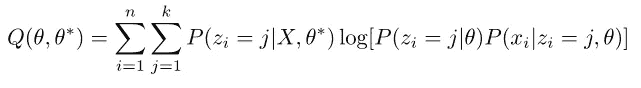
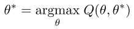
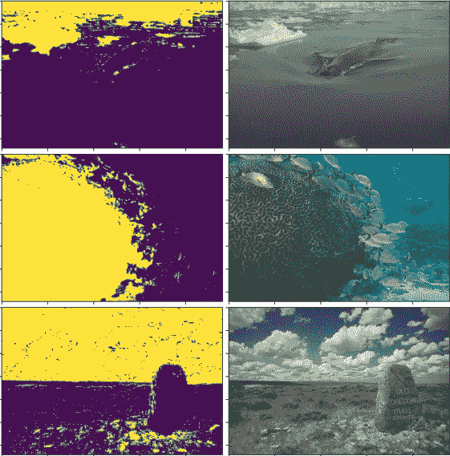
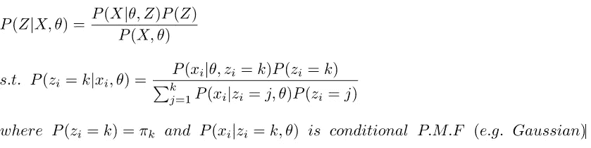
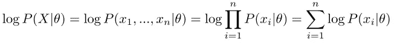
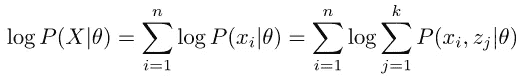
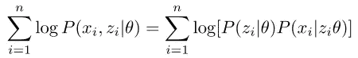
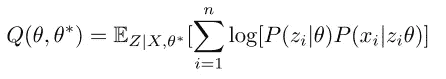
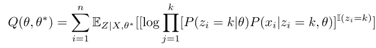
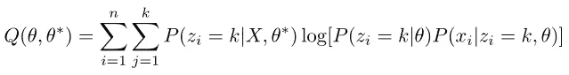

# 期望最大化算法:解决一个先有鸡还是先有蛋的问题

> 原文：<https://towardsdatascience.com/solving-a-chicken-and-egg-problem-expectation-maximization-em-c717547c3be2?source=collection_archive---------17----------------------->

作者照片。

## 流行的期望值最大化算法背后的直觉和示例代码

著名的 1977 年出版的期望最大化(EM)算法[1]是 20 世纪后期最重要的统计论文之一。EM 的目标不是简单地将分布模型拟合到数据，而是将模型拟合到数据的高级(即潜在)表示。本文的目的是描述 em 算法如何迭代计算两个相互依赖的未知数，这很像一个先有鸡还是先有蛋的问题。

EM 算法的主要优势是它能够在无监督的任务中处理未标记的数据，以及[正确性证明](https://en.wikipedia.org/wiki/Expectation%E2%80%93maximization_algorithm#Proof_of_correctness)，这保证了最终将达到局部最大值或“足够好”的解决方案。它的实用性得到了各种应用的支持，包括无标签图像分割、无监督数据聚类、修复缺失数据(即插补)或发现原始数据的更高级(潜在)表示。

为了理解 EM 算法，我们将在无监督图像分割的环境中使用它。在这个例子中，我们的数据集是由像素集合组成的单个图像。每个基准点或像素都有三个特征，即 R、G 和 B 通道。例如，我们可以将**图 1** 中的 *321 x 481 x 3* 图像表示为 *154401 x 3* 数据矩阵。我们的任务是聚集相关的像素。为了简单起见，让我们考虑一个聚类，其中 *k = 2* ，这意味着我们希望将每个像素分配到类 1 或类 2。我们的最终结果将看起来像图 1(右)的**。**

图一。来自 Berkeley 分割数据集[3]的原始图像(左)和使用基于 EM 算法的高斯混合模型(GMM)的聚类分配(右)。**来源:**作者照片。

在这项任务中，EM 算法将用于拟合高斯混合模型(GMM ),以将图像分为两个部分。我们的 GMM 将使用两个(k=2)多元高斯分布的加权和来描述每个数据点，并将其分配给最可能的分布。本例中使用 EM 算法来计算多元高斯分布的参数以及混合权重。

# 第一节。期望最大化背后的核心思想——概率潜在表征

期望最大化(EM)算法的主要目标是计算数据的潜在表示，它捕捉数据的有用的、潜在的特征。使用概率方法，EM 算法计算数据的“软”或概率潜在空间表示。比如在**图 1 中。**每个像素被分配一个属于类 0 和类 1 的概率。正如我们将在后面看到的，这些潜在空间表示反过来帮助我们提高对潜在统计模型的理解，这反过来帮助我们重新计算潜在空间表示，等等。

> *EM 算法的核心目标是在改进底层统计模型和更新数据的潜在表示之间交替进行，直到满足收敛标准。*

通常，在描述 EM 算法和其他相关概率模型时，使用以下符号。

*   **X:** 原始数据集其中| **X** | = *(#数据点，#特征)*。x 可以是连续的或离散的(例如，原始 RGB 值在范围[0，255]内是连续的)。
*   **P(X|Z，θ):** 由 **Z** where| **P(X|Z，θ)** | = *(#数据点，#潜变量)指定的底层统计模型 **θ** 下的完全似然。*潜变量 **Z** 是离散的，规定了 **X** 属于哪个统计分布。在我们的示例中， **X|Z，θ** 属于多元高斯模型，每个像素 *x* 可以属于 **x|z=1，μ1，σ1**或 **x|z=2，μ2，σ2**
*   **P(Z=k):** 我们的潜在表示的先验概率 **Z** 或者随机采样数据点承担特定潜在分配的概率。Z 通常属于多项分布，或者在我们的例子中是更简单的二项分布。
*   **θ:** 我们底层统计模型的参数。如果我们假设一个底层的多元高斯混合模型，那么 **θ** 既包括**σ**和 **μ** ，也包括混合系数 **π** ，其中 **|π|** =( *#潜在变量)。*混合系数代表将潜在表示随机分配给数据点的概率，并且与 **P(Z=k)** 是相同的精确量。

更清楚地说，在我们的例子中(假设一个 GMM 模型) **X** 是*154401×3*像素矩阵， **Z** 是*154401×1*聚类赋值，统计模型参数 ***θ*** *= {μ1，σ1，μ2，σ2，π1，π2}* 其中 *|μ_i| = 3*

# 第二节。理解期望最大化

现在我们有了一个具体的例子，让我们把 EM 算法的定义分解为*“更新未观察到的潜在空间变量以找到统计模型参数的局部最大似然估计的迭代方法”[2]。*

## 第一部分。设置:“迭代方法…”

EM 算法有三个主要步骤:初始化步骤、期望值步骤和最大化步骤。在第一步中，统计模型参数 **θ** 被随机初始化或者通过使用 k 均值方法初始化。初始化后，EM 算法在 E 和 M 步之间迭代，直到收敛。

## 第二部分。***…****即更新未观察到的潜在空间变量****…***

E-step 用于更新未观察到的潜在空间变量 **Z** 并为更新统计模型的参数 **θ** 设置阶段。电子步骤可以分为两个部分。第一部分更新我们的条件分布 **P(Z|X，θ)** ，它代表我们数据的软潜在分配(计算*见*附录“软潜在分配】*)。*E 步的第二部分计算 **Q(θ，θ*)** 其中 **θ*** 代表统计模型的先前参数 **θ** 代表潜在的新参数。

> *我们统计模型* ***θ**** *的当前值和数据* ***X*** *用于计算软潜在赋值* ***P(Z|X，θ*)。***

**Q(θ，θ*)** 背后的直觉大概是 EM 算法中最令人困惑的部分。它的包含最终导致计算时间和最优性之间的折衷。解释一下，EM 算法的缺点是它只能保证找到 **θ** 的估计，该估计找到了似然 **P(X|θ)** 的局部最大值，而不一定是绝对最大值。在理想情况下，真正的最大似然估计可以通过最大化似然 **P(X，Z|θ)** 来找到；然而，最大化这个值是困难的，因为我们需要对 **Z** 进行边缘化，以便获得可能性 **P(X|θ)** (有关更多详细信息，请参见*附录“对数可能性的棘手性”*)。相反，EM 算法使 **Q(θ，θ*)** 最大化，这与 **P(X|θ)** 相关，但更容易优化。

> *更具体地说* **Q(θ，θ*)** *是完全对数似然* ***log[* P(X|Z，θ)】***相对于* ***Z*** *的当前分布给定* ***X*** *和* **的当前估计** *换句话说，它是相对于先前计算的软分配* ***Z|X，θ**** 的完全对数似然的期望。

要理解我们为什么需要 **Q(θ，θ*)** ，想想这个。我们需要找到最佳的 **θ** 来最大化 **P(X，Z |θ)；**然而，我们无法合理地对每个数据点的所有 **Z** 求和。然而，假设 Z 被神奇地知道了。那么这个问题可以完全避免，因为 **P(X，Z|θ)** 会变成 **P(X|Z，θ)** 。但是，明显的问题是 **Z** 一开始并不知道。为了解决这个问题，我们计算 ***P(Z|X，θ*)*** 以提供对 **Z** 的软估计，并以 ***Z|X，θ**** 为条件，取完整对数似然的期望，填入**Z。**换句话说，我们以 **P(X|Z，θ)** 为条件

**Q(θ，θ*)** 的简化版如下图所示(详见*附录“*计算 Q(θ，θ*)”)。

E-step 用于寻找 Q(θ，θ*)，这是在先前的统计模型参数 **θ*** 和数据 **X** 的条件下，相对于 **Z** 的完全对数似然的期望。

## 第 3 部分:“… *求统计模型参数的局部极大似然估计(MLE)。*

与 E-step 相比，M-step 非常简单，用于更新我们统计模型的参数 **θ** 。一旦我们计算出 **Q(θ，θ*)** 我们可以通过计算以下表达式来改进统计模型参数的 MLE:

更新统计模型的 M 步操作。

## **第四部分。收敛！**

收敛标准很简单——将每个新计算的 **Q(θ，θ*)** 与之前的进行比较，如果差值小于某个阈值ϵ(例如，ϵ= 1e-4 ), em 算法终止。在实践中，您可能希望使用各种初始化 **θ** 来运行该算法几次，以找到最大化 **P(X|Z，θ)** 的参数，因为每次 EM 算法执行时，您只能保证找到局部最大似然估计。

# 第三节。使用 EM 参数化高斯混合模型的 Python 示例

**代码片段:**高斯混合模型(GMM)的一个例子，它使用期望最大化来聚类图像。

**图二。**使用 EM 参数化高斯混合模型(k=2)对来自伯克利分割数据集[3]的图像进行示例分割。**来源:**作者照片。

# 第四节。EM 的三个重要直觉

总之，在 **Q(θ，θ*)** 和最终的 EM 算法**背后有三个重要的直觉。**首先，完全对数似然 **P(X|Z，θ)** 比对数似然 **P(X，Z|θ)** 更快最大化，因为没有超过 **Z** 的边缘化。但是，这就引入了一个问题，因为我们不知道 **Z** 。因此，第二个直觉是，我们可以改为最大化 **Q(θ，θ*)** 或 **P(X，|Z，θ)** 的对数的期望值，其中通过调节对 **Z|X，θ*** 的期望来填充 **Z** 。最后的直觉是，通过找到最大化 **Q(θ，θ*)** 的参数 **θ** ，我们将更接近最大化可能性 **P(X，Z|θ)的解决方案。**虽然并非微不足道，但对这种正确性的[证明](https://en.wikipedia.org/wiki/Expectation%E2%80%93maximization_algorithm#Proof_of_correctness)表明，提高 **Q(θ，θ*)** 会导致 **P(X，Z|θ)** 提高至少一样多，如果不是更多的话。因此，EM 算法将总是收敛到局部最大值。

# 第五节。最近的工作和结论

最初由 Dempster、Laird 和 Rubin [1]描述的期望最大化(EM)算法提供了一种有保证的方法来计算依赖于未知或未观测数据的统计模型的局部最大似然估计(MLE)。尽管当数据集很大时，它的执行速度会很慢；收敛的保证和算法以无人监督的方式工作的能力使它在各种任务中有用。最近，人们开始使用神经网络，主要是编码器-解码器架构，其中编码器用于将 X 重新参数化为高级变量 X*，解码器封装统计参数θ*，产生每像素的软分配 P(Z|X*，θ*)。使用典型的编码器-解码器的损失函数来训练网络，但是用 P(Z|X*，θ*)来加权。这种方法被称为神经期望最大化(N-EM) [4]，虽然有用，但它失去了 EM 的收敛保证。此外，还不清楚这种方法是否从图像中提取了更多相似颜色的特征，为改进和进一步研究留下了足够的空间。

人工智能领域的一个令人兴奋的挑战将是开发从原始感觉数据中可靠地提取离散实体的方法，这是人类感知和组合概括的核心[5]。期望最大化，虽然不是什么新东西，但它提供了一个镜头，未来寻求解决这个问题的技术应该通过这个镜头来审视。

# **附录**

## A.软潜在分配计算

在期望步骤(E-step)中计算软分配，以更新我们的潜在空间表示。

**补充 1:** 使用贝叶斯法则和全概率法则导出的潜在空间变量计算的软赋值。

## **B .解释对数似然法的难解性**

通常，统计模型的最佳参数通过找到使对数似然最大化的 **θ** 或 **log[P(X|θ)]** 来拟合数据。假设是独立的，这通常如下所示:

**等式 1:** 典型的最大似然估计(MLE)设置。

然而，由于对 **Z** 的依赖性，我们只能计算 **P(X，Z|θ)** ，因此，为了计算 **P(X|θ)** ，我们必须忽略 **Z** 并最大化以下内容:

**方程式 2。**对数似然法。

这个数量更难以最大化，因为我们必须对所有的 *n* 个数据点的潜在变量 **Z** 进行边缘化或求和。

## *计算 Q(θ，θ*)*

不是最大化**等式 2** 中的对数似然，而是最大化完整数据的对数似然，首先假设对于每个数据点 *x_i* ，我们有一个已知的离散潜在分配 *z_i* 。

**方程式 3。**完全对数似然

好消息是，不像**等式 2。**我们不再需要在**等式 3 中对 Z 求和。**然而，坏消息是我们不知道 *z_i* 。为了解决这个问题，我们尝试通过最大化 **Q(θ，θ*)** 或相对于 **Z|X，θ*** 的完全对数似然的期望来猜测 *z_i* ，这允许我们填充 *z_i.* 的值

**方程式 4。**关于当前条件分布的完全对数似然的期望值 **Z|X，θ*。**

**等式 4** 可以简化为

其中 **I** 是*指标*函数，可以用来评估期望值，因为我们假设 *z_i* 是离散的。最终，上面的等式可以简化为

**方程式 5。**简化版的 Q(θ，θ*)

**方程式 5。**最后显示了 **Q(θ，θ*)** 的有用性，因为与**等式 3 不同，**求和中没有任何一项以 **Z** 和 **θ为条件。**在上面的等式中，最左边的项是软潜在分配，最右边的项是 **Z** 的先验和条件概率密度函数的对数乘积。最右边的项可以分成两项，以最大化混合权重( **Z** 的先验)和概率密度函数的分布参数

回到具体的 GMM 例子，虽然在上面的**等式 5 中可能不明显。**、 *{μ1，σ1 }、{μ2，σ2 }和{π1，π2}* 出现在不同的项中，可以使用各自分布的已知最大似然估计独立地最大化。例如，当更新 *{μ1，σ1 }*和 *{μ2，σ2 }*时，可以使用高斯分布的最大似然估计，而对于 *{π1，π2}* 可以使用二项式分布的最大似然估计。这些更新与经典 MLE 方程的唯一区别是包含了加权项 **P(Z|X，θ*)** 。

# **引文**

[1]登普斯特，A.P 新墨西哥州莱尔德；鲁宾博士(1977 年)。“通过 EM 算法不完整数据的最大可能性”。皇家统计学会杂志，B 辑。39: 1–38.

[2]“期望最大化算法”，维基百科文章，[https://en . Wikipedia . org/wiki/Expectation % E2 % 80% 93 最大化 _ 算法](https://en.wikipedia.org/wiki/Expectation%E2%80%93maximization_algorithm)

[3]李辉，蔡剑飞，阮氏一青，.语义图像分割的基准。IEEE ICME 2013。

[4]格雷夫、克劳斯、斯约尔德·范·斯廷基斯特和于尔根·施密德胡伯。“神经期望最大化。”*神经信息处理系统的进展*。2017.

[5]巴塔格利亚、彼得·w 等，“关系归纳偏差、深度学习和图形网络” *arXiv 预印本 arXiv:1806.01261* (2018)。