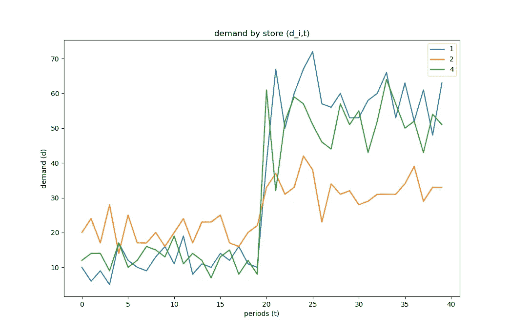
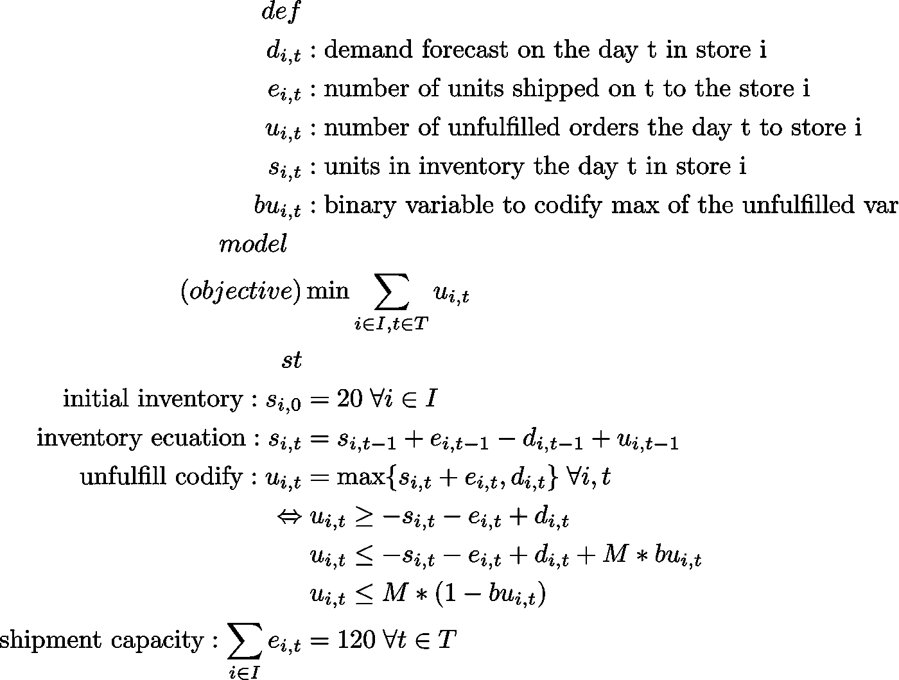
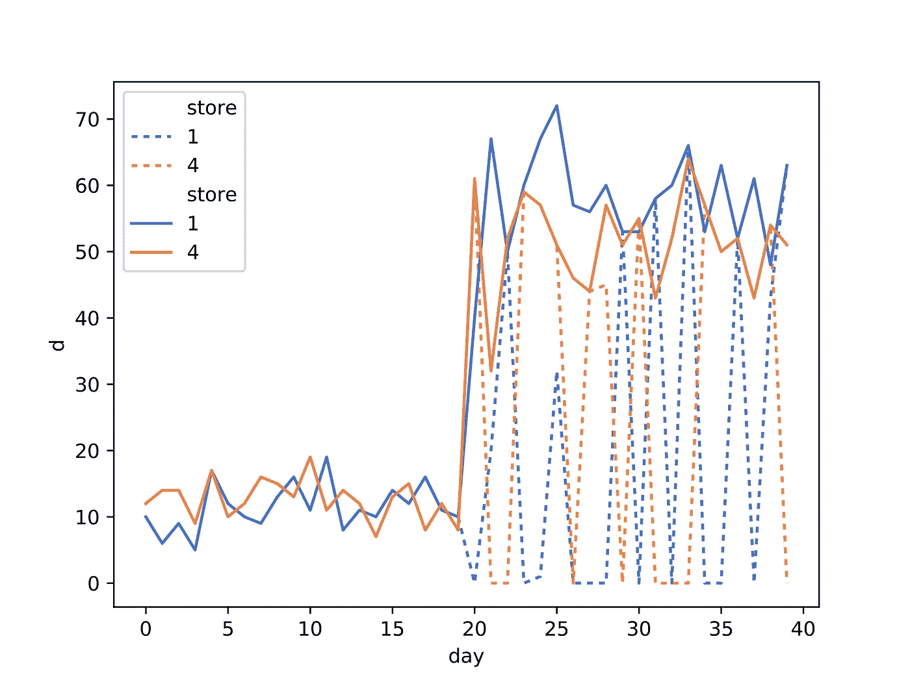
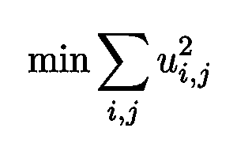
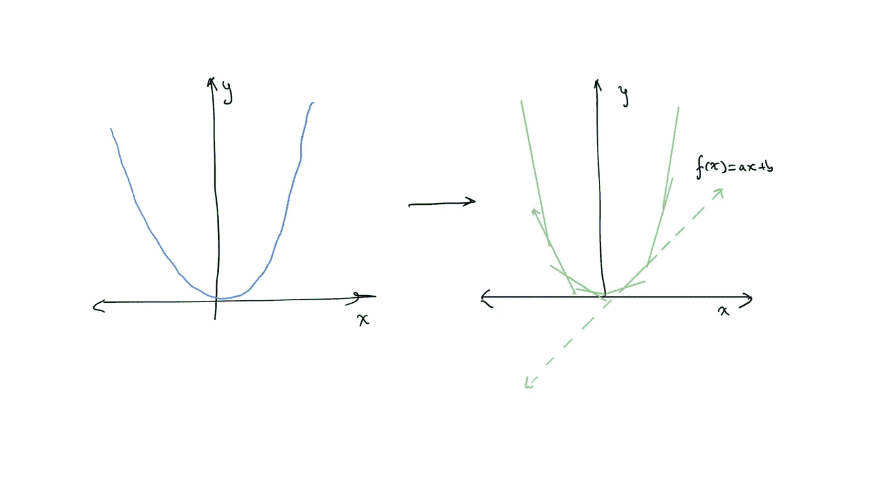
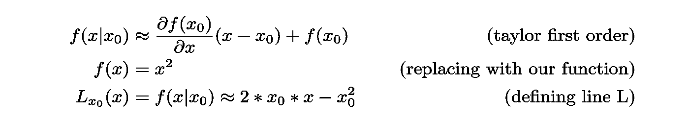
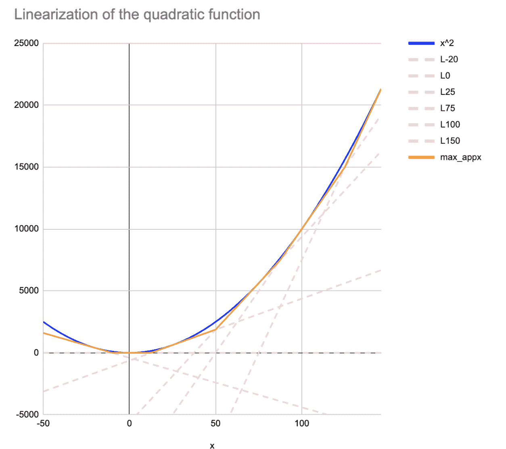
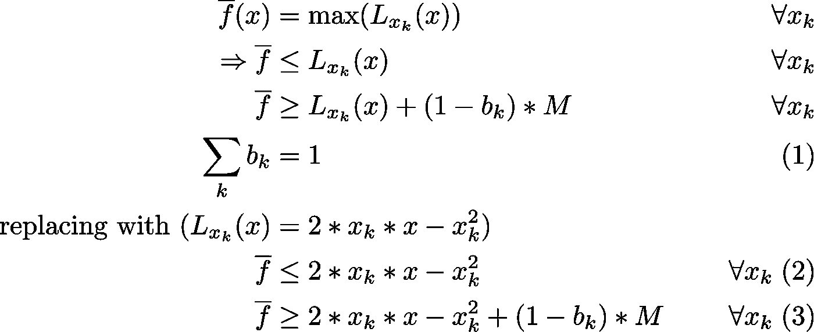
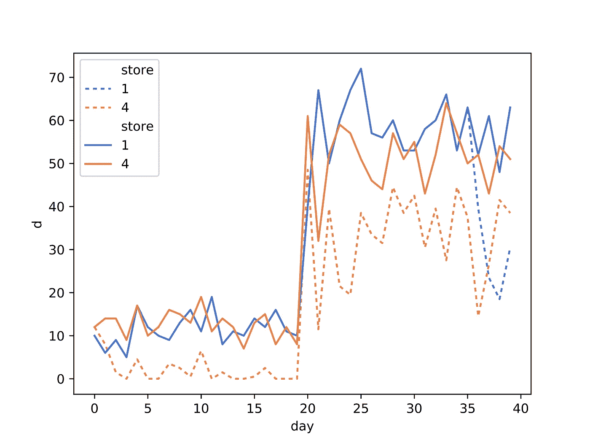

# 在开源线性求解器中求解二次问题(QP)

> 原文：<https://towardsdatascience.com/solving-a-quadratic-problem-qp-in-an-open-source-linear-solver-56ed6bb468e8?source=collection_archive---------37----------------------->

## 如何线性化二次函数以在线性解算器中使用它，(也就是说，我没有钱支付 Gurobi)使用零售示例

所以，我上大学的时候用了很多花哨的优化软件(有学生许可证),比如 AMPL、CPLEX 和 Gurobi，我非常兴奋，因为“给我模型”和“我会解决它”。唯一的问题是，这些超级牛逼的解决方案是 f̶*̶ ̶e̶x̶p̶e̶n̶s̶i̶v̶e̶不便宜，许多小公司没有钱购买许可证，或者也许他们不愿意支付，除非他们看到的价值。


来源:[funny-memes.org](https://www.funny-memes.org/2014/01/in-terms-of-money-we-have-no-money.html)，转自:[梅丽莎·伊莱亚斯](https://www.pinterest.cl/pin/189432728053114696/)

所以，像我一样，你发现有许多[开源线性解算器可用](https://en.wikipedia.org/wiki/List_of_optimization_software)，但是它们[没有你的学生授权的奇妙解算器](https://www.gurobi.com/es/resource/switching-from-open-source/)那么快和先进，当然，它们有局限性。我最怀念的一个功能是解决 QP 模型的能力。

因此，如果你正在寻找一种在开源线性求解器(比如 [COIN-CBC](https://en.wikipedia.org/wiki/COIN-OR) )中求解 QP 模型的方法，这篇文章可能适合你。

**如果你熟悉什么是** [**QP 车型**](https://en.wikipedia.org/wiki/Quadratic_programming) **你可以跳过下一节**。如果你想知道*我为什么要关心二次函数？* 保持阅读。

# 我为什么要关心二次函数？

(又名不应该是求解一个 ***线性*** 模型？).我认为介绍 QP 模型重要性的最简单的方法是通过一个例子。


由[伯吉斯·米尔纳](https://unsplash.com/@burgessbadass?utm_source=medium&utm_medium=referral)在 [Unsplash](https://unsplash.com?utm_source=medium&utm_medium=referral) 上拍摄的照片

让我们假设你要计划一整季从仓库到零售店的 t 恤发货(姑且称之为 *i ∈ I* a 店和 *e{i，t}* 在 *t(第 t 天)*期间到店的发货 *i* )。让我们想象一下，通过某种超级酷的机器学习算法，你对每个商店和时间段进行了预测(让我们称之为 *d{i，t}* 需求预测 *i ∈ I，t ∈ T* )。

比方说，在这个例子中，我们对 t 恤衫的需求激增(因为夏天),我们可能无法满足所有需求。如果我们为三家商店(1、2、4)绘制预测图，我们将得到:



现在，让我们建立一个线性模型来最小化每个商店上的未履行订单( *u{i，t}* )。



好的，这里没有什么特别的，只是一个标准的线性模型。我们用 python 实现了我们最喜欢的线性建模库( [python-mip](https://www.python-mip.com/) ❤️)

完整代码在[https://github.com/pabloazurduy/qp-mip](https://github.com/pabloazurduy/qp-mip/blob/master/model.py)

有了模型结果，我们就可以按商店绘制未完成订单，只关注两家商店 *(1，4)* 。在此图中，虚线表示已完成的订单，实线表示预测的需求，这两条线之间的差距就是未完成的数量。



需求(实线)和满足的需求(虚线)之间的差距

我们可以从上图中观察到一些有趣的事情:

1.  在第 20 天之后差距才开始出现。这意味着，在第一阶段，我可能能够完成所有订单，但在第二阶段(旺季)，我开始有大量未完成的订单。
2.  **给定商店的未履行订单数量与实际数量相差甚远**。如果我们关注商店 1(蓝线)，我们可以看到第 20 天我们有 0 个订单，第二天我们完成了所有订单，第三天又有 0 个订单。
3.  **店铺间未成交订单数量也不一致**。我们可以看到，在第 20 天到第 25 天之间，有些日子我们履行了商店 4 的所有订单，但没有履行商店 1 的任何订单，第二天情况正好相反。

然后，我们有一个问题… **解决方案在商店之间不“公平”**。如果我手动解决这个问题，并且只有 120 个单位在不同地点之间分配，我会“更平均地”分割它们，因为我知道我将有未完成的订单。但是，至少我会在每家商店实现 60%的[填充率](https://en.wikipedia.org/wiki/Service_level#.CE.B2_service_level_.28type_2.2C_also_known_as_.22fill_rate.22.29)，而不是让一些商店 100%填充率，另一些商店 0%填充率，保持更好的跨商店服务水平。

这个问题从何而来？问题是我们的模型只关心**未履行订单总量** (min ∑ u{i，t})因此对于模型来说相当于一家店有 100 个未履行订单，另一家店有 0 个，或者每家店有 50 个未履行订单，因为成本是相同的(100 个单位)。那么我们如何解决这个问题呢？U **唱一个二次函数。**



现在，有了*“二次惩罚”*，成本在商店和期间之间不是线性的，因此，最好有一个更平均分布的未完成订单数(100 + 0 > 50 + 50)。这是二次函数最常见的应用之一。那么，*我们如何在线性求解器中实现它呢？*

# (二次函数的)线性化问题


来源:[makeameme.org](https://makeameme.org/meme/BEWARE--math)

解决 QP 模型有许多可能的解决方案，但是我们将实现可能是最简单的一个，继续使用我们的线性解算器，线性化。如果我们绘制二次函数，我们将得到类似左图的结果:



线性化概念图

我们要做的是将这条曲线变换成一系列( *k* )线，这些线可以是原始曲线的近似。我们只对近似值 *x* 的一定精度感兴趣，因此我们可以在域的边界之间选择有限数量的点( *x{k}* 点)。更多的点将导致原始函数的更好的近似。那些点 *x{k}* 被称为[兴趣点](https://en.wikipedia.org/wiki/Linearization#Uses_of_linearization)。使用[泰勒展开式](https://en.wikipedia.org/wiki/Taylor_series)的第一项，我们将找到每个感兴趣点的线性化。



线的定义(L=ax+b)

为了说明这一点，我们假设我们有 6 个兴趣点。绘制原始曲线和六条线，我们得到下图:



我们可以观察到，我们添加的点越多，近似结果就越精确。但是，正如我们将很快观察到的，更多的行将增加模型的复杂性。

## 将此线性化添加到线性模型中

我们可以利用 *x* 函数是[凸](https://en.wikipedia.org/wiki/Convex_function)的事实。有了那个性质，我们可以假设所有的线 *L(x)* 总是 *f(x)* 的一个“下盖”。记住这一点，我们可以使用 max 函数得到曲线~f(x)的离散近似，因为是所有直线的最大值( *L(x)* )。因此使用一个[已知编码](https://math.stackexchange.com/questions/2446606/linear-programming-set-a-variable-the-max-between-two-another-variables/3568461#3568461)我们可以将其添加到模型中



线性化的编码

我们可以看到，对于我们添加到线性化中的每个离散点，我们也向模型添加了一个新的二元变量( *bk* )，因此， ***更精细的近似将导致更高的执行时间。***

## Python 实现

我构建了一个助手，它可以将我们从这种近似中抽象出来:

完整代码在[https://github.com/pabloazurduy/qp-mip](https://github.com/pabloazurduy/qp-mip/blob/master/model.py)

然后我们可以简单地将它添加到我们之前的模型实现中

让我们运行它，看看新的结果:

```
OptimizationStatus.FEASIBLE
Objective value: 23390.00000000
Lower bound: 18454.285
Gap: 0.27
Enumerated nodes: 35926
Total iterations: 7133610
Time (CPU seconds): 1939.06
Time (Wallclock seconds): 2001.06
```



需求(实线)和满足需求(虚线)之间的差距，二次模型

我们可以从情节中观察到一些有趣的东西

1.  **门店日间未完成订单数比较稳定**:我们可以观察到，旺季没有缺货的日子，第二天也没有积压的日子。即使是库存较少的商店(如 4 号店)，我们也看到我们总是完成一定数量的订单。
2.  **门店间未完成订单数量更加一致**。我们可以看到，差距的数量也得到更好的分配，特别是在这一时期结束时。我们注意到，在第一个周期中，商店 4 比商店 1 有更多的短缺，这是因为实例中还有其他商店(总共 5 个)，这也可能是由于离散化点的数量少造成的，如果间隙更小，函数是常数。
3.  **该解决方案在各门店间的服务水平较高。**该解决方案不仅提高了客户体验，因为店与店之间以及不同日子同一店内的可靠性更高。

我们找到了。现在，我们可以看到，结果更加一致。按店铺/天计算，使用 5 个兴趣点的时间会稍微长一点，但是，如果我们要在一个季度内解决一次这个问题，那也没什么大不了的

**感谢您的阅读！！**，这是我写的第一篇文章，所以请随意给我任何反馈。A **本项目所有源代码均可用** [**此处为**](https://github.com/pabloazurduy/qp-mip) ，任何问题请留在回购中。