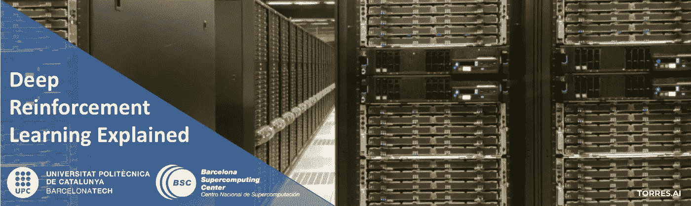
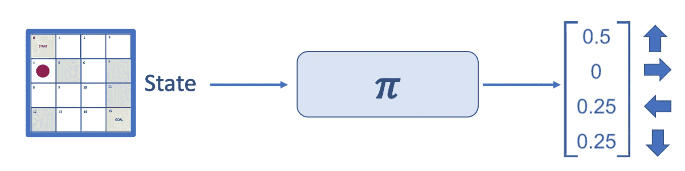
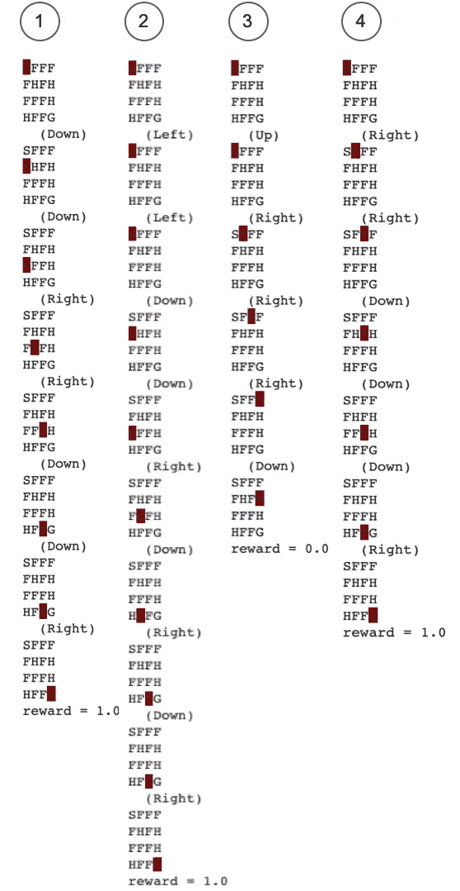
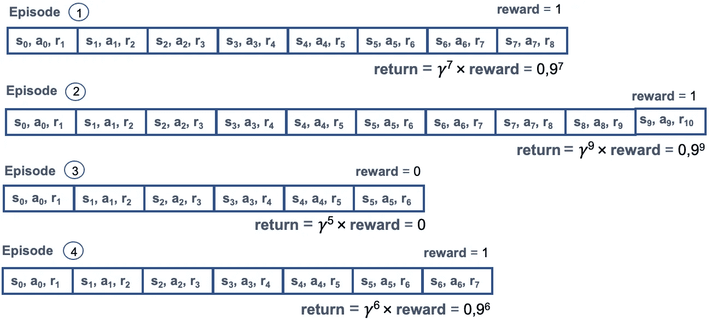
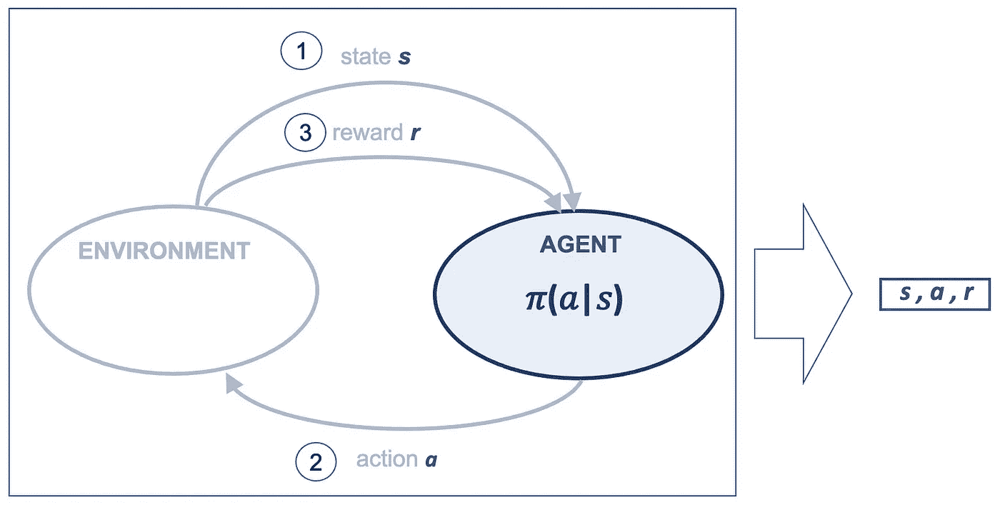
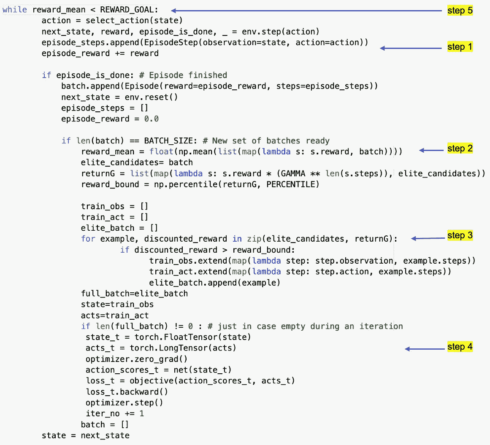
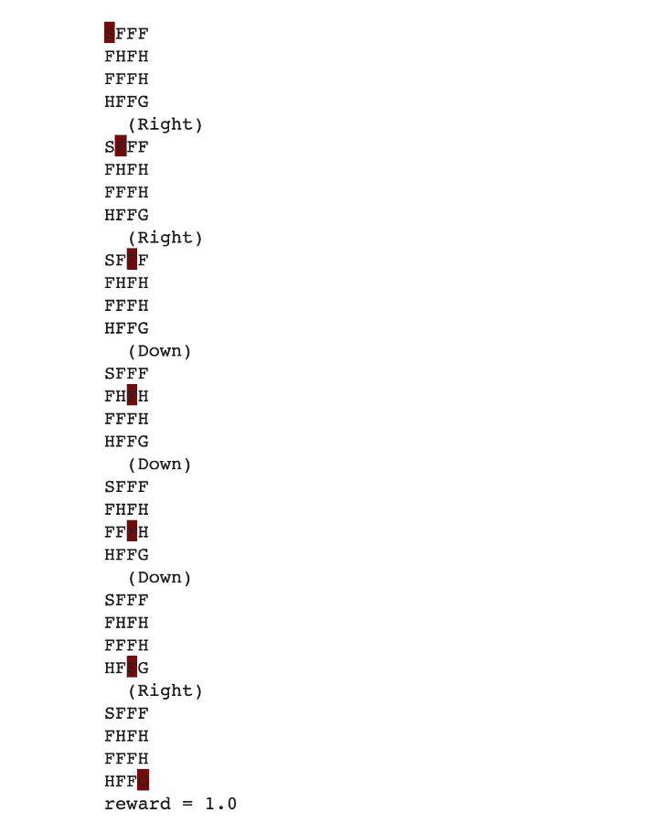

# 用交叉熵方法解决一个强化学习问题

> 原文：<https://towardsdatascience.com/solving-a-reinforcement-learning-problem-using-cross-entropy-method-23d9726a737?source=collection_archive---------11----------------------->

## [深度强化学习讲解— 06](https://towardsdatascience.com/tagged/deep-r-l-explained)

## 使用深度神经网络的代理创建



> 在介绍深度学习和 Pytorch 基础知识的三篇文章之后，在这篇文章中，我们将重点放回合并强化学习和深度学习。

在[以前的帖子](/drl-02-formalization-of-a-reinforcement-learning-problem-108b52ebfd9a)中，我们提出了一个智能体在不确定的情况下做出决策来解决复杂的决策问题。为此目的，代理采用了一个**策略𝜋，**作为基于当前状态*确定下一个动作*的策略。从这篇文章开始，我们将探索不同的方法来获得一个允许代理人做决定的策略。**

**在这篇文章中，我们将从交叉熵方法开始，这将有助于读者在融合深度学习和强化学习时热身。这是一种用于参数化政策优化的进化算法，John Schulman 声称这种算法在复杂的 RL 问题上“令人尴尬的好”。**

# **1.交叉熵方法**

**交叉熵被认为是一种进化算法:从一个群体中抽取一些个体，只有“精英”控制着后代的特征。**

**本质上，交叉熵方法所做的是获取一堆输入，查看产生的输出，选择产生最佳输出的输入，并调整代理，直到我们对看到的输出满意为止。**

## **1.1 概述**

**记住一个**策略**，用 **𝜋(𝑎|𝑠表示，**表示代理应该对每个观察到的状态采取什么动作。在这篇文章中，我们将认为我们代理的核心是**一个产生政策*的神经网络***。**

> **我们将解决这类问题的方法称为[基于策略的方法](/policy-based-methods-8ae60927a78d)，它训练产生策略的神经网络。在未来的文章中，我们将会更深入地探讨这种方法。**

**在实践中，策略通常被表示为动作(代理在给定状态下可以采取的动作)的**概率分布，这使得它非常类似于之前提出的分类问题(深度学习文章中的[)，类的数量等于我们可以执行的动作的数量。在我们的例子中，神经网络的输出是一个动作向量，它表示一个概率分布，如下图所示:](/deep-learning-with-pytorch-a93b09bdae96)****

****

**在这种情况下，我们称之为随机策略，因为它返回行动的概率分布，而不是返回确定性的单个行动。**

**我们想要一个策略，一个概率分布，我们随机初始化它。然后我们通过播放几集来改进我们的策略，然后以更有效的方式调整我们的策略(神经网络的参数)。然后重复这个过程，以便我们的政策逐渐变好。这是交叉熵方法的基础。**

## **1.2 训练数据集**

**由于我们将神经网络视为第一个代理的核心，因此我们需要找到一些方法来获取可以作为训练数据集吸收的数据，其中包括输入数据及其各自的标签。**

**我们要做的是将这个问题视为一个监督学习问题，其中观察到的状态被视为特征(输入数据)，而动作构成标签。**

**在特工的一生中，其经历被呈现为**集**。每一集都是对代理从环境中获得的状态、它发出的动作以及对这些动作的奖励的一系列观察。交叉熵方法的核心是扔掉不好的剧集，对更好的进行训练，那么我们如何找到更好的呢？。想象一下，我们的经纪人演了好几集这样的戏。对于每一集，我们都可以计算出代理商已经认领的**回报**(总回报)。请记住，代理人试图通过与环境的互动来积累尽可能多的总报酬。**

**同样，为了简单起见，我们将使用冰湖的例子。为了理解发生了什么，我们需要更深入地了解冰湖环境的奖励结构。只有当我们达到目标时，我们才会得到`1.0`的奖励，这个奖励并不能说明每集有多好。它是快速有效的吗？还是我们在湖上转了很多圈才随机踏入最后一个牢房？我们不知道；只是`1.0`奖励仅此而已。**

**让我们想象一下，我们已经有了代理程序，我们用它来制作 4 集，我们可以用`.render()`方法来可视化:**

****

**请注意，由于环境的随机性和代理选择采取行动的方式，每集有不同的长度，也显示了不同的奖励。显然一集的奖励是`1.0`比一集的奖励是`0.0`要好。结局都是一样的奖励的剧集呢？**

**很明显，我们可以认为某些集比其他集“更好”，例如，第三集比第二集短。对于这一点，贴现因子γ是很有帮助的。我们可以用 *𝛾 = 0，9* 。在这种情况下，贴现回报将等于在时间步长 t 的剧集结束时获得的奖励 ***r*** ( `1.0`或`0.0`)γ到 *t* 。**

**让我们用一个图表来说明这四集，其中每个单元格代表代理人的步骤，一个**转换**，以及相应的贴现回报:**

****

**我们可以看到，较短剧集的**折现回报**将高于较长剧集。**

## **1.3 交叉熵算法**

**交叉熵方法的**核心很简单。基本上，它生成一批集，在一批集中丢弃不好的集，以在更好的集上训练代理的神经网络。为了决定丢弃哪些，我们在示例中使用了第 70 个百分位数，这意味着我们只保留了比其他 70%做得更好的 30%。****

**因此，随着我们使用新一批精英剧集，神经网络学会重复导致神经网络决策结果变得越来越好的动作。必须训练代理，直到达到该批剧集阈值的某个平均回报。**

**因此，该方法的伪代码可以通过以下步骤来描述:**

**0.初始化代理神经网络模型**

1.  **使用我们当前的代理模型创建一个**批次**剧集在环境中播放。**
2.  **计算每集的预期回报，并使用所有奖励的百分比来决定一个**回报边界**。**
3.  **扔掉所有回报低于回报界限的剧集。**
4.  **使用情节步骤训练代理的神经网络，这意味着剩余“精英”情节中的过渡 **< *s* 、 *a* 、 *r* >** )，使用状态 ***s*** 作为输入，发出动作 ***a*** 作为标签。**
5.  **从第 1 步开始重复，直到我们对该批剧集的平均奖励感到满意。**

**我们将在下一篇文章中讨论这种方法的一种变体，即我们可以将“精华”剧集保留更长时间。我的意思是，该算法的默认版本从环境中采样剧集，对最佳剧集进行训练，然后将它们丢弃。然而，当成功剧集的数量很少时，可以将“精英”剧集保持更长时间，将它们保持几个迭代以在其上进行训练。**

# **2.环境**

**环境是数据的来源，我们将从其中创建数据集，该数据集将用于训练我们代理的神经网络。**

## **2.1 情节步骤**

**代理将从随机策略开始，其中所有动作的概率是一致的，并且在训练时，代理将有希望从从环境中获得的数据中学习，以优化其策略，从而达到最优策略。**

**来自环境的数据是情节步骤，应该用形式为 ***< s，a，r >*** (状态、动作和回报)的元组来表示，这些元组在每个时间步骤中获得，如以下方案所示:**

****

## **2.2 环境编码**

> ***这篇文章的* [*全部代码可以在 GitHub*](https://github.com/jorditorresBCN/Deep-Reinforcement-Learning-Explained/blob/master/DRL_06_07_Cross_Entropy.ipynb) *和* [*上找到，使用这个链接*](https://colab.research.google.com/github/jorditorresBCN/Deep-Reinforcement-Learning-Explained/blob/master/DRL_06_07_Cross_Entropy.ipynb) *可以作为一个 Colab 谷歌笔记本运行。***
> 
> **正如我们在本系列的其他帖子中所做的那样，这篇帖子中的代码受到了 Maxim Lapan 的代码的启发[，他写了一本关于这个主题的优秀实用书籍](https://github.com/PacktPublishing/Deep-Reinforcement-Learning-Hands-On-Second-Edition/tree/master/Chapter04)。**

**我们来编码吧。我们必须首先导入几个包:**

```
**import numpy as npimport torch
import torch.nn as nnimport gym
import gym.spaces**
```

**我们将从使用**不光滑** FrozenLake 环境开始(在下一篇文章中，我们将讨论更多关于光滑版本的内容):**

```
**env = gym.make(‘FrozenLake-v0’, is_slippery=False)**
```

**我们的**状态空间**是离散的，这意味着它只是一个从 0 到 15(包括 0 和 15)的数字(我们在网格中的当前位置)。**动作空间**也是离散的，从零到三。**

**我们的神经网络需要一个数字向量。为此，我们可以应用离散输入的传统 onehot 编码(前一篇文章中介绍的[，这意味着我们网络的输入将有 16 个数字，除了我们将编码的索引之外，其他地方都是零。为了简化代码，我们可以使用 Gym 的`ObservationWrapper`类并实现我们的`OneHotWrapper`类:](/deep-learning-basics-1d26923cc24a)**

```
**class OneHotWrapper(gym.ObservationWrapper):def __init__(self, env):
   super(OneHotWrapper, self).__init__(env)
   self.observation_space = gym.spaces.Box(0.0, 1.0, 
              (env.observation_space.n, ), dtype=np.float32)def observation(self, observation):
    r = np.copy(self.observation_space.low)
    r[observation] = 1.0
    return r env = OneHotWrapper(env)**
```

**总的来说，我们在`env`有一个不滑的冰湖环境，我们将利用这个环境来获取剧集，以便获得数据来训练我们的经纪人。**

# **3.代理人**

**我们已经提出，我们的代理是基于神经网络。让我们来看看如何编码这个神经网络，以及如何使用它来执行代理所做的动作选择。**

## **3.1 模型**

**我们的模型的核心是一个使用 Sigmoid 激活函数的 32 个神经元的单隐层神经网络。我们的神经网络没有什么特别的。我们从任意数量的层和神经元开始。**

```
**obs_size = env.observation_space.shape[0]
n_actions = env.action_space.n
HIDDEN_SIZE = 32net= nn.Sequential(
     nn.Linear(obs_size, HIDDEN_SIZE),
     nn.Sigmoid(),
     nn.Linear(HIDDEN_SIZE, n_actions)
)**
```

**神经网络将来自环境的单个观察作为输入向量，并为我们可以执行的每个动作输出一个数字，即动作的概率分布。一种简单的方法是在最后一层之后加入 softmax 非线性。然而，请记住在[之前的帖子](/deep-learning-with-pytorch-a93b09bdae96)中，我们试图避免应用 softmax 来增加训练过程的数值稳定性。在本例中，我们使用 PyTorch 类`nn.CrossEntropyLoss`，而不是先计算 softmax，然后再计算交叉熵损失，它将 softmax 和交叉熵组合在一个更稳定的表达式中。CrossEntropyLoss 需要来自神经网络的原始的、未标准化的值(也称为 logits)。**

## **3.2 优化器和损失函数**

**其他“超参数”如损失函数和优化器也是使用以下代码为该示例设置的:**

```
**objective = nn.CrossEntropyLoss()
optimizer = optim.SGD(params=net.parameters(), lr=0.001)**
```

## **3.3 采取行动**

**这种抽象使我们的代理非常简单:它需要将从环境接收的观察到的**状态**传递给神经网络模型，并使用概率分布执行随机采样，以获得要执行的**动作**:**

```
 **sm = nn.Softmax(dim=1) def select_action(state):
**1:**      state_t = torch.FloatTensor([state])
**2:**      act_probs_t = sm(net(state_t))
**3:**      act_probs = act_probs_t.data.numpy()[0]
**4:**      action = np.random.choice(len(act_probs), p=act_probs)
        return action**
```

**让我们详细解释一下这段代码:**

****第 1 行:**该函数要求第一步将状态转换为张量，以将其摄入我们的神经网络。在每次迭代中，我们将当前的观察值(16 个位置的 Numpy 数组)转换为 PyTorch 张量，并将其传递给模型以获得行动概率。记住我们的神经网络模型需要张量作为输入数据(为了阐明代码我们用后缀`_t`表示变量是张量)。**

****第 2 行:**使用`nn.CrossEntropyLoss`的结果我们需要记住，每次我们需要从我们的神经网络输出中获得概率时，都要应用 softmax。**

****第 3 行:**我们需要将输出张量(记住 model 和 softmax 函数返回张量)转换成一个 NumPy 数组。该数组将具有与输入相同的 2D 结构，批次维度在轴 0 上，因此我们需要获取第一个批次元素来获得动作概率的 1D 向量。**

****第 4 行:**有了动作的概率分布，我们可以通过使用 NumPy 函数`random.choice()`对该分布进行采样，从而获得当前步骤的实际动作。**

# **4.培训代理**

**在下图中，我们展示了训练循环的屏幕截图，显示了交叉熵算法的一般步骤:**

****

**为了不使这篇文章太长，特别是因为这种方法是作为 DRL 编码的热身而引入的，我们将这种算法的详细解释留到下一篇文章中。通过这种方式，我们能够在进入培训过程的细节之前直接测试模型并熟悉它。**

**现在，我只是建议运行这个循环的代码，看看结果。只是提一下，我们认为在 80%的情况下有奖励是好的结果。记住这篇文章的全部代码可以在 GitHub *上找到。***

# **5.测试代理**

**现在剩下的就是看代理人是否真的做出好的决策。为了检查这一点，我们可以创建一个新的环境(`test_env`，并检查我们的代理在接受培训后是否能够到达目标单元。下面的代码会做到这一点:**

```
**test_env = OneHotWrapper(gym.make(‘FrozenLake-v0’, 
           is_slippery=False))
state= test_env.reset()
test_env.render()is_done = Falsewhile not is_done:
   action = select_action(state)
   new_state, reward, is_done, _ = test_env.step(action)
   test_env.render()
   state = new_stateprint(“reward = “, reward)**
```

**代码是一个简单的循环，它通过`.step()`方法与环境交互，直到剧集结束(`is_done`)。感谢`.render()`方法，我们可以更直观地看到代理的行为:**

****

**如果我们试几次，就会发现它做得足够好。**

# **6.下一步是什么？**

**在下一篇文章中，我们将详细描述训练循环(在这篇文章中我们已经跳过了),并看看我们如何在考虑更好的神经网络(具有更多神经元或不同的激活函数)的情况下改善代理的学习。此外，我们将考虑该方法的变体，该方法为训练过程的多次迭代保留“精英”片段。[后文见](/cross-entropy-method-performance-analysis-161a5faef5fc)。**

> **这篇文章的[全部代码可以在 GitHub](https://github.com/jorditorresBCN/Deep-Reinforcement-Learning-Explained/blob/master/DRL_06_07_Cross_Entropy.ipynb) 上找到，[可以通过这个链接](https://colab.research.google.com/github/jorditorresBCN/Deep-Reinforcement-Learning-Explained/blob/master/DRL_06_07_Cross_Entropy.ipynb)作为一个谷歌笔记本运行。**

# **深度强化学习讲解系列**

****由** [**UPC 巴塞罗那理工**](https://www.upc.edu/en) **和** [**巴塞罗那超级计算中心**](https://www.bsc.es/)**

**一个轻松的介绍性[系列](https://torres.ai/deep-reinforcement-learning-explained-series/)以一种实用的方式逐渐向读者介绍这项令人兴奋的技术，它是人工智能领域最新突破性进展的真正推动者。**

**[](https://torres.ai/deep-reinforcement-learning-explained-series/) [## 深度强化学习解释-乔迪托雷斯。人工智能

### 本系列的内容](https://torres.ai/deep-reinforcement-learning-explained-series/) 

# 关于这个系列

我在 5 月份开始写这个系列，那是在巴塞罗那的封锁期。老实说，由于封锁，在业余时间写这些帖子帮助了我。感谢您当年阅读这份刊物；它证明了我所做的努力。

**免责声明** —这些帖子是在巴塞罗纳封锁期间写的，目的是分散个人注意力和传播科学知识，以防对某人有所帮助，但不是为了成为 DRL 地区的学术参考文献。如果读者需要更严谨的文档，本系列的最后一篇文章提供了大量的学术资源和书籍供读者参考。作者意识到这一系列的帖子可能包含一些错误，如果目的是一个学术文件，则需要对英文文本进行修订以改进它。但是，尽管作者想提高内容的数量和质量，他的职业承诺并没有留给他这样做的自由时间。然而，作者同意提炼所有那些读者可以尽快报告的错误。**