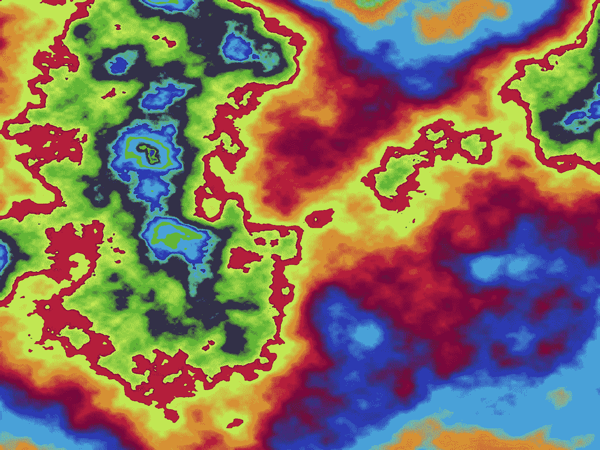

# 用遗传算法解决社会距离问题

> 原文：<https://towardsdatascience.com/solving-a-social-distancing-problem-using-genetic-algorithms-e5f1709c87a1?source=collection_archive---------19----------------------->

## 使用 DEAP python 包的遗传算法应用示例。



来源:[https://en . Wikipedia . org/wiki/File:Plasma _ fractal _ the art problem _ 1935 . jpg](https://en.wikipedia.org/wiki/File:Plasma_fractal_theartproblem_1935.jpg)

“社交距离”如今变得非常流行，但这些规则如何适应我们的日常生活并不总是显而易见的。在这个故事中，我们将研究一个社会距离问题，并用遗传算法找到解决方案。在设定了问题及其约束条件之后，在将这些原则应用于我们的问题之前，我将总结一下遗传算法(GA)的原则。

# 问题是

今年夏天(2020 年 8 月)，来自 [Neo4j](https://medium.com/neo4j) (图形数据库)的人们提出了要用图形解决的每周挑战。第一周的[高级烧烤挑战](https://medium.com/neo4j/summer-of-nodes-week-1-the-barbecue-ead98d441a91)包括一项社交距离任务，其规则如下:

*   来自 11 个家庭的 20 名客人被邀请参加一次烧烤(用婚礼、感恩节晚餐、任何派对，取决于一年中的时间来代替烧烤)。数据是 CSV 文件，格式为:

```
Guest,Family  # headers added for clarity
Host,A
Jane,B
Jun,C
Oliver,C
....
```

*   你可以把它们放在 6 张桌子上，每张桌子有 6 个座位，其中两个连续的座位相距 1 米(我们认为桌子是圆形的)
*   每张桌子必须包含来自至少两个不同家庭的客人
*   每桌不得有两个以上来自同一家庭的客人
*   来自不同家庭的客人必须坐在相距至少两米的地方

虽然这个问题可以用图来解决(参见这里提出的解决方案:[https://medium . com/neo4j/summer-of-nodes-week-1-the-barbecue-EAD 98d 441 a 91](https://medium.com/neo4j/summer-of-nodes-week-1-the-barbecue-ead98d441a91))，但在我看来，这像是一个可以用其他技术解决的约束问题。在这篇文章中，我研究了使用遗传算法来解决这个特定的问题。

谈到遗传算法，让我们把重点放在这项技术背后的主要原则，以及这种算法如何帮助解决上述问题。

# 简而言之，遗传算法原理

与一般的方法不同，遗传算法不考虑单一的解，而是根据某些条件(梯度等)进行更新。).取而代之的是，GA 会考虑一个**解群体**，并基于偏向“最佳”个体的选择过程，在几个**代**中进化它们。这包括能够通过适应度函数来确定一个解决方案“有多好”，或者它离最佳解决方案有多远。因此，算法的步骤是:

1.  对于群体中的每个**个体**，一个**适应度函数决定了该个体离解**有多近
2.  一个**选择**过程产生下一代可能的解决方案，偏向于“最佳个体”，意思是具有最高适应性的个体
3.  **个体被突变**，这意味着解基于一些规则而改变(例如:交换两个位置)并且**交换**发生，这基本上是将一个个体的某个部分与另一个交换(突变和交换的区别在这里[解释](https://ai.stackexchange.com/a/9079))。
4.  迭代过程从步骤 1 重新开始，直到满足停止标准(迭代次数、适应度函数达到给定阈值……)

现在让我们回到我们的社交距离问题。

# 问题定式化

对我们来说，一个解决方案是列出分配给每位客人的座位。座位是一个整数，其值等于

```
table_number * 10 + seat_number
```

例如，表 4 中的座位 2 对应于整数 42。

> 只要我们每张桌子的座位少于 10 个，这种方法就很好。

因此，*一个*解可以写成:

```
[10, 31, 19, 20, 23, 35, 22, 5, 6, 13, 3, 17, 33, 8, 1, 28, 27, 24, 25, 15]
```

索引为 0 的来宾(主机)被分配到表 1(基于 0 的索引)和座位 4。相应的表格转载如下:

```
[[-1, 'Ren', -1, 'Mohamed', -1, 'Jeremy'],
 ['Avery', -1, 'Rowan', -1, 'Host', -1],
 [-1, 'Hugo', -1, 'Isabella', -1, 'Maria'],
 [-1, 'Jun', 'Oliver', -1, 'Milan', 'Mia'],
 ['Fatima', 'Marc', -1, 'Hannah', 'Ali', -1],
 [-1, 'Jane', -1, 'Aarav', -1, 'Sophie']]
```

`-1`是空座位的默认值。

现在我们有了每个解的表示，让我们定义它的适合度，即它与满意解的“接近度”。

# 适合度定义

为了定义适合度，我们必须考虑问题定义部分中定义的三个约束中的每一个，再加上每个座位只能分配一次的事实。每次违反一个约束，适应度将相应地增加。

## 每个座位分配给一个客人

为了统计座位被分配的次数，我们使用了`collections.Counter` python 对象，并检查每个值出现的次数是否少于一次。否则，我们返回一个高适应值:

```
c = Counter(solution)
if any( v > 1 for v in c.values()):
    return 100
```

之后，我们可以创建表，一个 2D 矩阵，它的 *ij* 元素包含表 *i* 的座位 *j* 的客人家庭。例如:

```
[[-1, 'I', -1, 'G', -1, 'D'],
 ['E', -1, 'I', -1, 'A', -1],
 [-1, 'F', -1, 'K', -1, 'H'],
 [-1, 'C', 'C', -1, 'D', 'D'],
 ['K', 'K', -1, 'J', 'J', -1],
 [-1, 'B', -1, 'H', -1, 'D']]
```

## 每桌必须包含来自至少两个家庭的客人

对于每个表(行),我们可以计算代表了多少个族，如果该表上的族少于两个，则将该表的违规数增加 1:

```
c = Counter([k for k in table if k != -1])
if len(c) < 2:  # allow for empty tables (extra rule)
    v += 1
```

## 来自同一家庭的每桌客人不得超过 2 人

使用同一个计数器，我们可以计算同一个家庭中有多少人坐在同一张桌子上，如果太多的人在场，就可以提高健康程度:

```
s = sum(v > 2 for k, v in c.items())
v += s
```

最后是最复杂的部分:来自不同家庭的客人之间的社交距离。

## 来自不同家庭的人必须至少相隔两个座位

为了计算这个约束，我们将使用带有实用的`.rotate()`方法的`collections.deque`对象。实际是因为我们为坐在同一张桌子的 0 号和 5 号座位上的客人设置了边界条件，这两个座位相距仅 1 米(而不是 5 米)。首先，我们创造了`deque`:

```
td = deque(table)
```

然后，我们用相同的输入列表创建另一个实例，但是这个`deque`是循环的:

```
tdr = deque(table)  # table rotated
tdr.rotate()
```

例如，从表格开始:

```
table = [-1, 'I', -1, 'G', -1, 'D']
```

`td`和`tdr`变量将包含:

```
deque([-1, 'I', -1, 'G', -1, 'D'])  # td
deque(['D', -1, 'I', -1, 'G', -1])  # tdr
```

从那里，我们可以迭代两个`deque`。如果这两个值等于`-1`(意味着没有客人被分配到那个座位)，我们什么也不做。否则，我们检查坐在彼此旁边的两个客人是否来自同一个家庭，否则我们增加适合度:

```
for seat, prev_seat in zip(td, tdr):
    if seat == -1 or prev_seat == -1:
        continue
    if seat != prev_seat:
       v += 1
```

开始了，我们的健身功能终于准备好了！

虽然我们只完成了一半的工作，因为我们需要配置遗传算法的参数。希望我们不必自己编写所有的代码，因为非常聪明的人已经为我们做了(谢谢！).

# 完整代码和解决方案

为了实现我们问题的 GA 部分，我们将依赖于 DEAP(Python 中的*分布式进化算法)Python 包。*

主要步骤如下:

```
# start algorithm configuration
toolbox = base.Toolbox()# our objective is to minimize the fitness
creator.create("FitnessMin", base.Fitness, weights=(-1.0,))# create the Individual class (list of integers)
creator.create("Individual", list, typecode='i', fitness=creator.FitnessMin)# create an operator that generates randomly shuffled indices
toolbox.register("randomOrder", lambda : random.sample(range(NUM_TABLES * NUM_SEATS_PER_TABLE), k=len(GUESTS)))
# create the 'individual creation' operator to fill up an Individual instance with shuffled indices
toolbox.register("individualCreator", tools.initIterate, creator.Individual, toolbox.randomOrder)
# create the 'initial population creation' operator to generate a list of individuals
toolbox.register("populationCreator", tools.initRepeat, list, toolbox.individualCreator)# fitness calculation - compute the total distance of the list of cities represented by indices
# 'get_fitness' is our own fitness function containing the rules defined above
toolbox.register("evaluate", get_fitness)
# Genetic operators
toolbox.register("select", tools.selTournament, tournsize=10)
toolbox.register("mate", tools.cxTwoPoint)
toolbox.register("mutate", tools.mutShuffleIndexes, indpb=1.0/len(GUESTS))# create initial population (generation 0):
population = toolbox.populationCreator(n=POPULATION_SIZE)
```

更多细节:

*   初始种群生成，随机选择`NB_GUESTS`个席位(在 0 和`NUM_TABLES * NUM_SEATS_PER_TABLE`之间)
*   使用上面定义的函数进行适应性计算
*   选择[锦标赛](https://deap.readthedocs.io/en/master/api/tools.html#deap.tools.selTournament):两个两个地比较解决方案，将适应性最低的方案留给下一代(另请查看:[维基百科](https://en.wikipedia.org/wiki/Tournament_selection))
*   交叉: [cxTwoPoint](https://deap.readthedocs.io/en/master/api/tools.html#deap.tools.cxTwoPoint) :从两个随机选择的解决方案中交换零件，如下图所示:


来源:[https://commons . wikimedia . org/wiki/File:two point crossover . SVG](https://commons.wikimedia.org/wiki/File:TwoPointCrossover.svg)

*   变异: [mutShuffleIndexes](https://deap.readthedocs.io/en/master/api/tools.html#deap.tools.mutShuffleIndexes) :以概率`P_MUTATION`对每个解中的索引进行混洗

算法的核心被封装成:

```
population, logbook = algorithms.eaSimple(
    population,  # initial population
    toolbox,   # above defined rules
    # extra parameters:
    cxpb=P_CROSSOVER, 
    mutpb=P_MUTATION,  
    ngen=MAX_GENERATIONS, 
    # results:
    stats=stats, 
 **halloffame=hof,** 
    verbose=False
)
```

名人堂包括表现最好的个人，不管他们属于哪一代。它们是我们感兴趣的解决方案。

在运行完整的代码(在 GitHub 上有[)后，我们可以看到名人堂中 10 个表现最好的个人都有一个 0 适应度，这意味着没有违反约束。其中一个被复制在这里:](https://github.com/stellasia/medium/blob/master/social_distancing/social_distancing_genetic_algorithm.ipynb)


来自名人堂的第一个解决方案

你可以看到:

*   表 1 包含来自 3 个家庭的客人，每个家庭只有一个客人，他们都被至少一个空座位隔开。
*   对表 2、3 和 6 的观察结果相同
*   4 号桌有来自两个家庭(C 和 D)的客人，每个家庭两个客人。六月和奥利弗坐在彼此旁边，但是他们来自同一个家庭(C ),所以这很好，来自 D 家庭的米兰和米娅也一样。没有来自 C 的客人直接坐在来自 D 的客人旁边，所以最后一个约束也得到满足。
*   这同样适用于具有来自家族 K 和 j 的成员的表 5。

在这里，我们用遗传算法的力量解决了一个社会距离问题。*你将能够在烤肉时遇见你的朋友，同时限制与新冠肺炎相关的风险！*

您可以下载此代码，尝试修改参数，并查看求解器的行为。输入参数(客人、桌子数量……)和模型参数(群体大小、突变概率、交换类型……)都可以改变。

# 进一步阅读

喜欢这篇文章吗？查看以下相关阅读以了解更多信息。

*   https://deap.readthedocs.io/en/master/[DEAP 文档](https://deap.readthedocs.io/en/master/)
*   Eyal Wiransky，"[动手遗传算法](https://www.amazon.com/Hands-Genetic-Algorithms-Python-intelligence-ebook/dp/B0842372RQ/) " (2020)， *Packt* :这本书提供了许多可以用遗传算法解决的问题的例子，从组合问题到机器学习。从中我学到了很多，只能推荐！