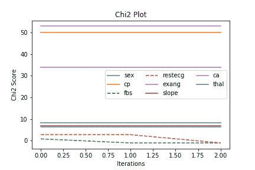
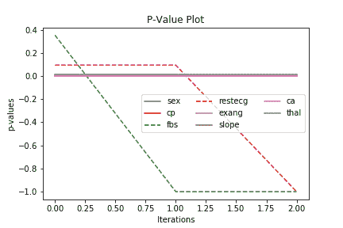
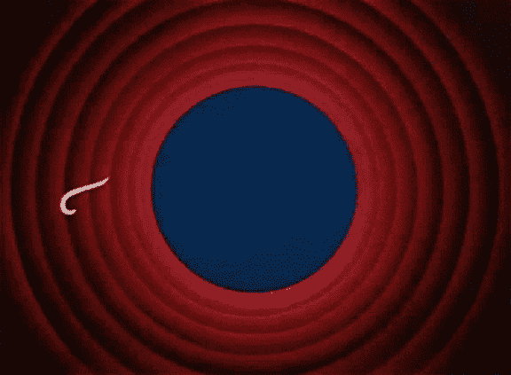

# 用 Kydavra ChiSquaredSelector 解决分类特征选择问题

> 原文：<https://towardsdatascience.com/solving-categorical-feature-selection-with-kydavra-chisquaredselector-1aa19aa1fe4d?source=collection_archive---------49----------------------->


由 Sigmoid 创建的图像

所以我们在之前关于 Kydavra 库的文章中是怎么说的，特征选择是机器学习模型开发中非常重要的一部分。不幸的是，获得理想模型的方法并不只有一种，主要是因为数据几乎每次都有不同的形式，但这也意味着不同的方法。在本文中，我将分享一种使用 Sigmoid 创建的 Kydavra ChiSquaredSelector 选择分类特征的方法。

## 使用 Kydavra 图书馆的 ChiSquaredSelector。

和往常一样，对于那些主要是为了解决问题的人来说，他们需要的是命令和代码:

要安装 kydavra，只需在终端中写入以下命令:

```
pip install kydavra
```

现在，您可以导入选择器并将其应用于数据集，如下所示:

```
from kydavra import ChiSquaredSelectorselector = ChiSquaredSelector()new_columns = selector.select(df, ‘target’)
```

为了测试它，让我们对[心脏病 UCI 数据集](https://www.kaggle.com/ronitf/heart-disease-uci)稍加修改后应用它。我们将删除数字列，而不是保留所有特征。因此，我们的新数据集将只包含以下要素:

```
sex, cp, fbs, restecg, exang, slope, ca and thal
```

我选择的算法是 SVC，在选择特征之前，它的 cross_val_score 是:

```
0.6691582491582491
```

但是在应用 ChiSquaredSelector 之后，cross_val_score 变成:

```
0.8452525252525251
```

保持下一个特征:**性别，cp，exang，斜率，ca，thal。**

## 那么它是如何工作的呢？

所以，和其他选择者一样，ChiSquaredSelector 的灵感来自统计学，当然是来自 Chi2-test。作为 p 值，Chi2 检验用于证明或反驳零假设。只是提醒一下:

**零假设**是对两个被测现象之间没有关系的一般性陈述(或者也称特征)。

所以为了发现特征是否相关，我们需要看看我们是否能拒绝零假设。从技术上说，ChiSquaredSelector 采用计算 chi2-s 时获得的 p 值。只是概括一下。

**P 值** —是给定统计模型的概率值，如果零假设为真，一组统计观测值在数量级上大于或等于观测结果。

因此，通过设置显著性水平(ChiSquaredSelector 的参数),我们可以反复消除具有最高 p 值的要素。

## 奖金！

如果你感兴趣的是为什么选择器选择了一些特性而忽略了另一些，你可以画出选择特性的过程。ChiSquaredSelector 有两个绘图函数，一个用于 Chi2，另一个用于 p 值:

```
selector .plot_chi2()
```



对于 p 值:

```
selector.plot_p_value()
```



每个函数都有以下参数:

*   **标题** —剧情标题。
*   **保存** —布尔值，True 表示将保存剧情，False 表示不保存。默认情况下，它被设置为 false。
*   **文件路径** —新创建的图的文件路径。

如果您想更深入地了解零假设、Chi2 检验和 p 值等概念，或者这个特征选择是如何工作的，下面有一个链接列表。



如果你想深入了解卡方如何工作，我强烈推荐文章末尾的链接。如果你尝试过 kydavra，我邀请你留下一些反馈，并分享你使用它的经验。

西格蒙德用❤做的。

有用的链接:

*   https://en.wikipedia.org/wiki/Null_hypothesis
*   【https://en.wikipedia.org/wiki/P-value 
*   [https://en.wikipedia.org/wiki/Chi-squared_test](https://en.wikipedia.org/wiki/Chi-squared_test)