# 用总期望、方差和协方差定律解决条件概率问题

> 原文：<https://towardsdatascience.com/solving-conditional-probability-problems-with-the-laws-of-total-expectation-variance-and-c38c07cfebfa?source=collection_archive---------12----------------------->

## 深入挖掘条件变量的属性以解决现实世界的问题，然后用 R

安特·罗泽茨基在 [Unsplash](https://unsplash.com?utm_source=medium&utm_medium=referral) 上的照片

在本文中，我们将了解如何使用总期望、方差和协方差法则来解决条件概率问题，例如您可能在求职面试中遇到的问题，或者在建模随机变量以其他随机变量为条件的业务问题时遇到的问题。

我先问几个现实世界中的概率问题:

1.  你在一家公共交通公司工作。您有过去在您所在城市的各个车站上下车的乘客人数的数据。当公共汽车到达任何一个车站时，找出车上预期的乘客人数。量化此评估中的不确定性。
2.  你有一个酒店预订网站。从过去的数据中，你发现对于给定的流量，有 0.1 的转化率。此外，在周末，访问网站的人遵循泊松过程(10 人/小时)。求周六的预期收入。这个数字如何变化？

在这些场景中，你可以观察到我们感兴趣的变量依赖于其他随机变量。例如，在第一个问题中，第 *i* 站的乘客数量很可能取决于第 *(i-1)* 站的乘客数量。这些条件概率问题乍一看似乎很神秘，但是只要牢牢把握住总期望、方差和协方差的法则我们就可以轻松高效地解决它们。

我们将首先看到如何将这些定律应用于一个问题(与上面的总线问题相关)，然后通过模拟 r 中的问题来验证结果。

从这里开始，我假设你对随机变量，它们的期望和方差，以及条件概率有一个基本的了解。如果你想复习一下，这里有一个很好的资源:

 [## 基础概率论与统计

### 我想讨论一些与概率和统计相关的非常基本的术语/概念，这些术语/概念经常会遇到…

towardsdatascience.com](/basic-probability-theory-and-statistics-3105ab637213) 

如果你想对概率的基本概念有更深更透彻的理解，这是一本终极的书:

 [## 概率第一课第九版 PDF —为人工智能做好准备

### 概率的第一个课程(PDF)第 9 版具有清晰和直观的数学解释…

readyforai.com](https://readyforai.com/download/a-first-course-in-probability-9th-edition-pdf/) 

让我们开始吧。这里又是一个版本的总线问题[1]:

> 一辆自动驾驶公共汽车(是的，我们在 2050 年)到达第一站(i = 1)，车上没有乘客。在每个车站，分别有 0、1 或 2 名乘客以 0.3、0.5、0.2 的概率上车。在每个车站，乘客下车的概率是 0.1。求公共汽车
> 1)离开第一站
> 后在第二站
> 下车的乘客数量的期望值和方差 2)公共汽车离开第二站后在第二站【】下车的乘客数量

假设在一个车站上车的乘客数量与其他车站无关，并且车辆具有无限的载客量。

让我们定义以下变量:

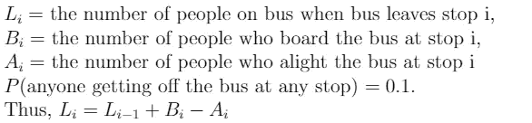

你想想看，一个车站下车的乘客人数是一个带参数的[二项分布](https://en.wikipedia.org/wiki/Binomial_distribution)(n =到达那个车站时车上的乘客人数，p = 0.1)。比如 **A2 ~ Binom(L1，0.1)**

好了，给定所有这些信息，我们如何着手解决这个问题呢？首先，我们可以从激发变量之间使用条件关系的问题中得出一些观察结果:

1.  第二站(L2)后的乘客数量取决于第一站(L1)后的乘客数量。例如，如果在公交车离开第一站后，车上的人更多，那么在公交车离开第二站后，车上的人极有可能更多。
2.  在任何车站下车的乘客数量取决于当公共汽车到达该车站时车上的人数，例如，A2 将取决于 L1。

因此，我们将首先计算其他变量所依赖的变量的估计值，然后使用这些估计值来估计我们的因变量。例如，我们将计算 L1 的估计值，然后我们将使用这些来计算 A2 和 L2 的估计值。

首先，我们要计算问题中变量的期望值。

# 期望值的计算

根据期望值的定义，当公共汽车离开车站 1，E(L1)时，公共汽车上乘客数量的期望值可以计算如下:

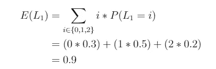

现在，让我们计算 E(A2)，即，当公共汽车离开车站 2 时下车的乘客数量的预期。如上所述，A2 依赖于 L1，因此 E(A2)可以通过对 L1 进行调节来计算，这使我们看到了总期望定律。

## 总期望定律

这里的想法是，对于给定的 L1 值，计算 A2 的期望值，然后将 A2 的期望值与 L1 的值相加。为了更好地理解这一点，这里有一条定律:

给定随机变量 X 和 Y，X 的期望值等于 X 在 Y 上的条件分布的期望值。

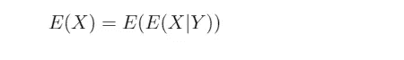

当 Y 是离散随机变量时，该定律变为:

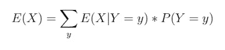

> 这个公式背后的直觉是，为了计算 E(X ),可以打破 X 相对于 Y 的空间，然后以(Y=y)的概率取 E(X|Y=y)的加权平均值作为权重。

给定此信息，E(A2)可计算如下:

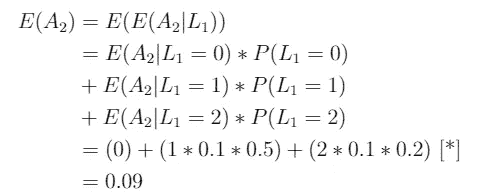

[*] (A2|L1 = m)~二项式(m，0.1)，因此 E(A2| L1 = m) = 0.1*m

类似地，当公共汽车离开车站 2，E(L2)时，公共汽车上乘客数量的预期可计算如下:

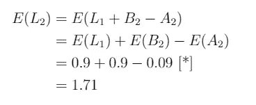

[*]人们必须明白，B2 的期望值和方差与 L1 的相等。原因是，在任何车站上车的人数与在第一站(L1)上车的人数具有相似的概率分布。

问题的期望部分到此结束。牢记业务问题，我们还应该考虑这些估计中的不确定性，这是通过方差来度量的。现在我们来求解方差。

# 差异的计算

让我们从计算 L1 的方差开始，用 Var(L1)表示。由于 L1 不依赖于任何其他变量，我们可以使用基本公式直接求解 Var(L1)。

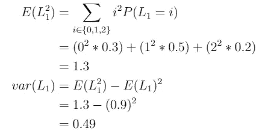

现在让我们看看 A2 的方差。同样，由于 A2 依赖于 L1，采用条件方差使计算更容易。这就把我们带到了总方差定律。

## 总方差定律

这个想法类似于总期望定律。我们将把 A2 的值分成 w . r . t . L1 组，取各组的方差，然后对这些组求和，得到所需的方差。

因为我们正在计算方差，所以有 2 个可变性来源:(A2 中的组内预期可变性)+(A2 的预期值在组间的可变性)。为了更好地理解这一点，请看这个公式:

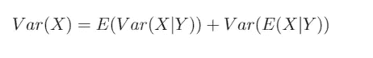

[这个](https://math.stackexchange.com/questions/1742578/law-of-total-variance-intuition)非常清楚地解释了总方差定律背后的直觉，这里总结一下:

> 类似于总期望定律，我们将 X 的样本空间相对于 Y 进行分解。注意，Var(X|Y)和 E(X|Y)都是随机变量。第一个组件计算所有 Y 值的平均值时 X 的预期方差。但是，Var(X|Y)是基于 E(X|Y)的，它也是随机的。因此，我们包括第二项来说明期望值的变化。

现在我们来计算 Var(A2)。

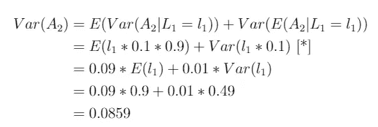

[*] A2|L1 = m~二项式(m，0.1)，因此 Var(A2 | L1 = m)= m * 0.1 *(1–0.1)。

这里，我们还使用了期望和方差的基本属性

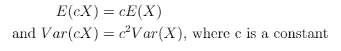

好吧，到目前为止一切顺利。是时候得到 L2 的方差了。

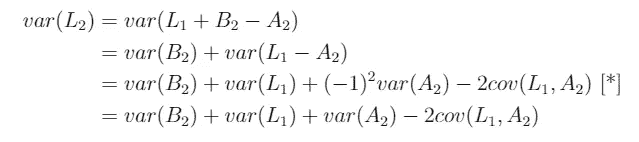

[*]由于 B2 独立于 L1 和 A2，B2 不与 L1 和 A2 共享协方差。但是，L1 和 A2 是相关的，因此扩大方差会在它们之间引入协方差。

所以，要计算 Var(L2)，我们需要计算 cov(L1，A2)。同样，由于 A2 依赖于 L1，我们将使用它们的条件关系来计算协方差，这将我们带到总协方差定律。

## 总协方差定律

这个想法类似于总方差定律，所以我将直接跳到这个定律:给定 3 个随机变量，X，Y 和 Z，总协方差定律表明

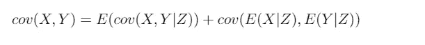

这个很好地解释了我在下面总结的总协方差定律背后的直觉。

> cov(X，Y|Z)，E(X|Z)和 E(Y|Z)是随机变量。类似于总方差定律，第一项说明了不同 Z 值上 X 和 Y 之间的平均协方差。注意 cov(X，Y|Z)是基于随机的 E(X|Z)和 E(Y|Z)的。也就是说，对于 Z 的值，E(X|Z)和 E(Y|Z)将同时实现一个值。因此，第二项包含了对于不同 z 值实现的 X 和 Y 坐标之间的协方差。

理解这一点的另一种方式是将定律分解为:
(组内 X 和 Y 之间的期望协方差)+(组间 X 和 Y 的期望值的协方差)

现在，让我们用这个定律来计算 cov(L1，A2)。

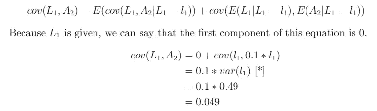

[*]利用协方差的性质:cov(a*X，b*X) = a*b*Var(X)

现在，我们有了计算 Var(L2)的所有部分。

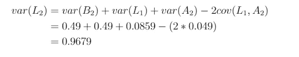

而且，就是这样。我们巧妙地使用了所有三个定律来开发因变量之间的关系，并推导出公共汽车上乘客数量的期望值和方差
1)在离开第一站(L1)
后 2)在第二站下车(A2)
后 3)在离开第二站(L2)

接下来，我们用 R 模拟一下这个，验证一下我们的答案。

# R 中的模拟

下面，我创建了一个函数来模拟 r 中的公交出行次数。这个函数接受要聚合的公交出行次数作为输入，并返回所需的估计值。

接下来，我将使用这个函数生成 10，000 个估计值，每个估计值都是使用 100，000 次公交出行的样本计算的。最后，我们取 10，000 个估计值的平均值来得到最终值。按照[大数定律](https://en.wikipedia.org/wiki/Law_of_large_numbers) (LLN)，这样做提供了真实总体参数的最佳估计。按照 LLN 的说法，你使用的估计值越多，这些估计值的平均值就越接近真实的参数值。

结果如下:

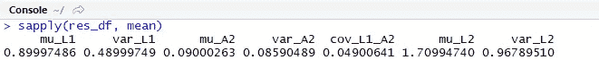

将这些结果与我们从理论上得到的结果进行比较，我们可以看到我们已经验证了我们的解决方案！
E(L1):0.9
Var(L1):0.49
E(A2):0.09
Var(A2):0.0859
cov(L1，A2):0.049
E(L2):1.71
Var(L2):0.9679

我希望这篇博客能帮助你理解总期望、方差和协方差的规律，并对你的概率论知识和解决问题的策略做出有价值的补充。

参考资料:

1.  从算法到 Z 分数:计算机科学中的概率和统计建模。Norm Matloff，加州大学戴维斯分校