# 解三次和四次方程

> 原文：<https://towardsdatascience.com/solving-cubic-and-quartic-equations-f024d4f9e37d?source=collection_archive---------23----------------------->

## 超越二次多项式

皮特·林弗斯德[皮克斯拜](https://pixabay.com/fr/?utm_source=link-attribution&utm_medium=referral&utm_campaign=image&utm_content=1943505)

我们在高中都学过如何解[二次方程](https://mathworld.wolfram.com/QuadraticEquation.html)。二次方程是只涉及一个变量的二阶多项式方程。然而，解[三次](https://en.wikipedia.org/wiki/Cubic_equation)和[四次](https://en.wikipedia.org/wiki/Quartic_function)方程的问题，即使只需要基本的数学技巧，学校也不教。在本文中，我将展示如何推导这两种类型的多项式方程的解。精确解(或多项式的[根)可以使用代数方法或](https://mathworld.wolfram.com/PolynomialRoots.html)[三角学](https://en.wikipedia.org/wiki/Cubic_equation#Trigonometric_and_hyperbolic_solutions)方法找到(然而，本文将仅限于代数方法)。

首先，我将简要概述一下这个主题的历史。

# 历史:鸟瞰

## 三次方程

自从古巴比伦人、希腊人、中国人、印度人和埃及人以来，三次方程已经被研究了几个世纪(更多细节见 [Wiki](https://en.wikipedia.org/wiki/Cubic_equation#History) 文章)。要研究的最古老的三次方程是著名的几何问题[加倍立方体](https://en.wikipedia.org/wiki/Doubling_the_cube)的代数版本，也就是所谓的迪连问题(用代数术语来说相当于求解方程 *x* =2)。

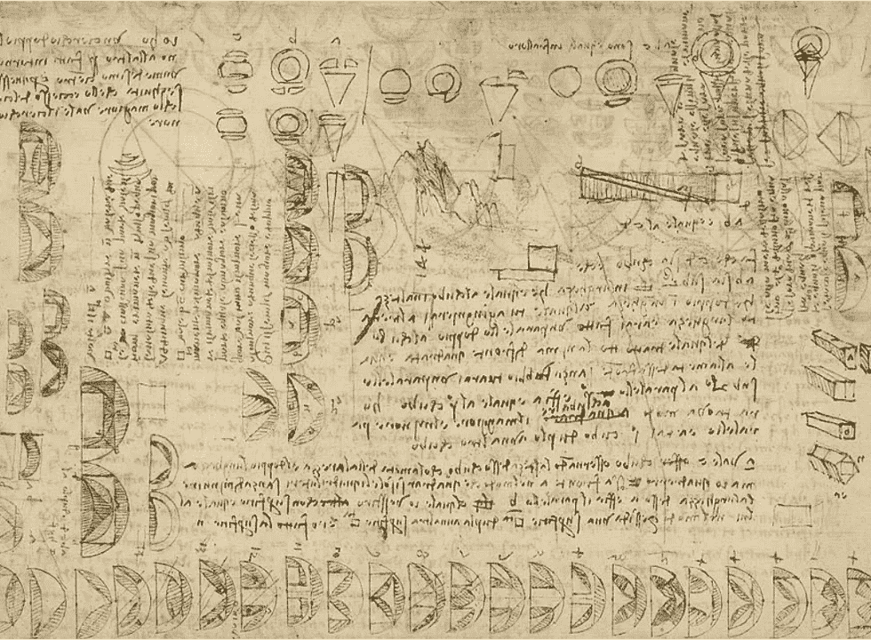

图 1:列奥纳多·达·芬奇试图解决德里昂问题的努力失败了。

几个著名的数学家解决了三次方程的特殊情况，但是直到 16 世纪才找到一般的解决方案。这个解决方案首先由意大利学者吉罗拉莫·卡尔达诺在他的重要代数书《T2 天文学》(1545 年)中发表。这本书的拉丁文版本可以在[这里](http://www.filosofia.unimi.it/cardano/testi/operaomnia/vol_4_s_4.pdf)找到。

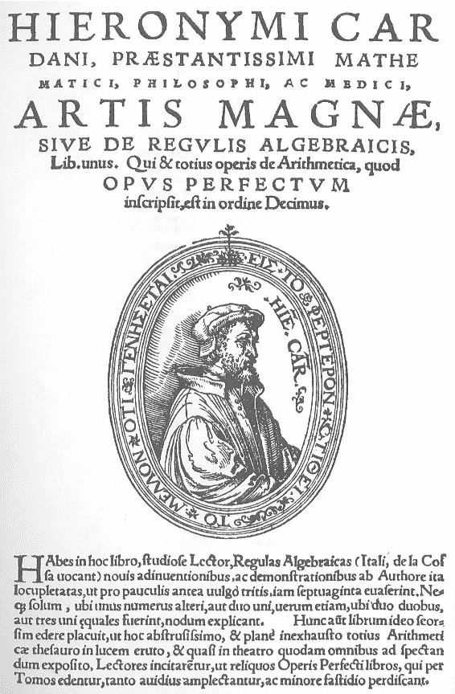

图 2:*Ars Magna 的标题页(* [*来源*](https://en.wikipedia.org/wiki/Ars_Magna_(Cardano_book)) *)。*

然而，卡尔达诺并不是这一结果的最初发现者。第一个找到三次方程的解的是意大利文艺复兴时期的数学家西皮奥内·德尔·费罗。德尔·费罗把他的公式传给了他的学生，数学家安东尼奥·菲奥雷(在他弥留之际)。

图三:从左到右，[西皮奥内·德尔·费罗](https://en.wikipedia.org/wiki/Scipione_del_Ferro)，[尼克洛·塔尔塔利亚](https://en.wikipedia.org/wiki/Niccol%C3%B2_Fontana_Tartaglia)，[吉罗拉莫·卡尔达诺](https://en.wikipedia.org/wiki/Gerolamo_Cardano)。

意大利数学家和工程师尼克洛·塔尔塔利亚也(独立地)发现了答案。后来他被卡尔达诺说服，公开了他的秘密(解决方案)，条件是卡尔达诺发誓永远不公开。然而，当卡尔达诺得知德尔·费罗在塔尔塔利亚之前独立地找到了解决方案时，他决定把它收录到他的 Ars Magna 中(尽管卡尔达诺把最初的发现归功于塔尔塔利亚和德尔·费罗，塔尔塔利亚对他的秘密被揭露感到不高兴！).

然而，卡尔达诺注意到塔尔塔利亚的解决方案有时涉及我们现在所说的复数，所以他没有真正认识到结果的全部含义。意大利数学家[拉斐尔·邦贝利](https://en.wikipedia.org/wiki/Rafael_Bombelli)后来详细研究了这个问题。由于这个原因，许多人认为 Bombelli 是复数的发现者。

## 四次方程

数学家[卢多维科·费拉里](https://en.wikipedia.org/wiki/Lodovico_Ferrari)于 1540 年解决了这个四次方程。然而，正如我们将要看到的，四次方程的解需要三次方程的解。因此，它只是后来才在卡尔达诺的《艺术大书》中发表。

图 4:数学家卢多维科·费拉里([来源](https://sites.google.com/site/ferrari2013g8/ferrari/retratos?overridemobile=true&tmpl=%2Fsystem%2Fapp%2Ftemplates%2Fprint%2F&showPrintDialog=1))。

我们现在将展示如何找到解决方案。让我们从三次方程开始，因为解四次方程需要它们。

# 三次方程

我们的目的是展示如何求解以下三次方程:

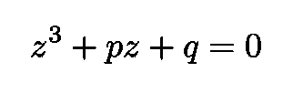

方程 1:我们在这一节的目标是求解三次方程。

这个方程叫做[凹立方](https://en.wikipedia.org/wiki/Cubic_equation#Depressed_cubic)。虽然它们比一般的三次方程(有一个二次项)简单，但任何三次方程都可以化为一个降三次方程(通过改变变量)。

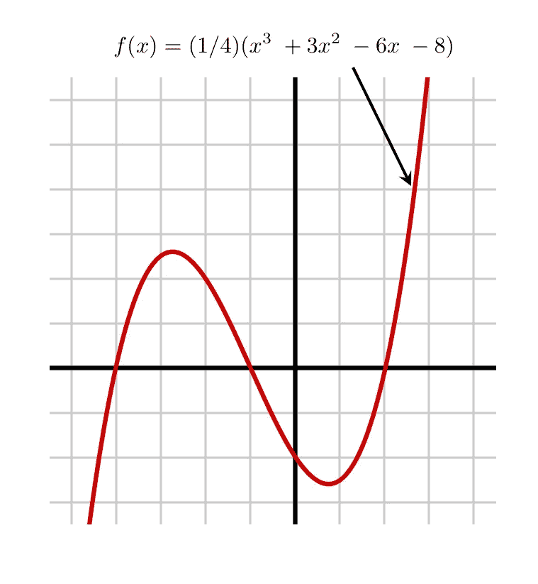

图 5:三次多项式的例子([来源](https://en.wikipedia.org/wiki/Cubic_function))。

Eq 的左手边。1 是一个[多项式**函数**](https://mathworld.wolfram.com/Polynomial.html)*p*(*z*)的例子，是一个涉及变量的幂之和乘以系数的表达式。情商。1 是多项式函数 *p* ( *z* )对应的[多项式**方程**](https://en.wikipedia.org/wiki/Algebraic_equation) 。如前所述，方程的零点被称为[根](https://mathworld.wolfram.com/PolynomialRoots.html)。

在方程式中找到 z。1、我们首先选择两个辅助变量 *u* 和 *v* 使得*u*+*v*=*z*，并将这个表达式代入等式。1.一个方便的术语分组给出了:

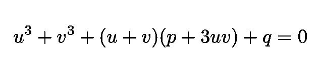

等式 2:在等式中代入 u + v = z 的结果。1.

现在， *u* 和 *v* 可以有任意值，只要它们的和是 *z* 。这里最明显的选择是 *u* 和 *v* 应该服从

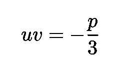

等式 3:对于 *u* 和 *v.* 更明显的选择

因为，有了这个选择，等式中的中项。两个消失了。我们得到一个由两个方程组成的系统:

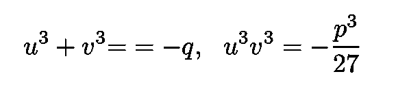

等式 4:在等式中代入 *uv* =- *p* /3。2，中间项消失，我们得到这个方程组。

现在定义:

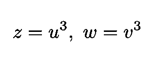

等式 5:z 和 w 的定义。

方程组变成:

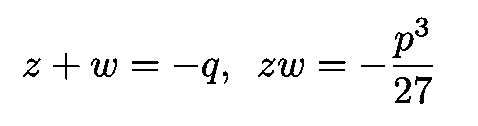

等式 6:等式中的系统。4 使用 Eq。5.

情商。6 代表一个[二次方程](https://mathworld.wolfram.com/QuadraticEquation.html)的解。变量 *z* 和 *w* 则等于:

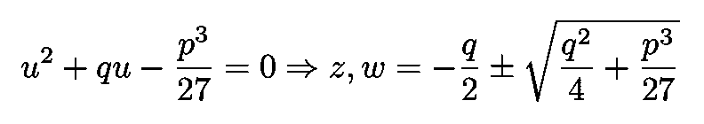

方程 7:对应于服从方程 7 的解的二次方程。6.

使用*u*+*v*=*z*，我们获得了我们正在寻找的解决方案:

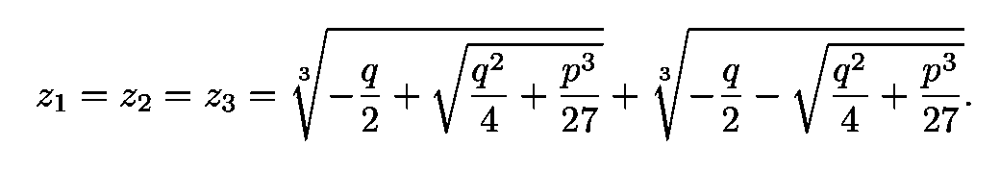

方程式 8:方程式的解。1.

回想一下，这个解决方案假设等式。3 要遵守。现在让我们看看如何求解四次多项式。

# 四次方程

这里将遵循的策略是根据三次方程(我们知道如何求解)的解来获得四次方程的解。这种方法是由历史上最伟大的数学家之一莱昂哈德欧拉发明的。由于不含 *x* 项的四次方程，即所谓的约化四次方程，可以从一个一般的四次方程中仅用一个微小的变量变化得到，我们只需要求解前者(约化方程)。

图 6:雅各布·伊曼纽尔·汉德曼[来源](https://en.wikipedia.org/wiki/Leonhard_Euler)的莱昂哈德欧拉的肖像。

遵循欧拉，我们的目标是证明简化的四次方程

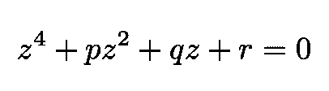

方程式 9:一个四次方程式的例子。

有以下根源:

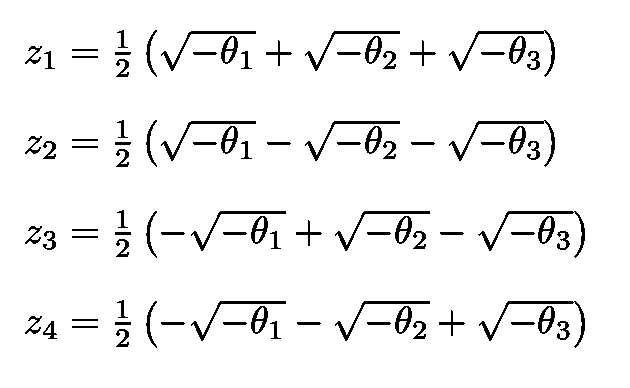

方程 10:方程的解。9.

假设三个 *θ* 是以下三次多项式的零:

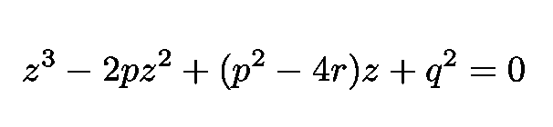

方程 11:其根由 *θ* s 给出的方程。

如前所述，这个方程可以平凡地转化为一个下降的三次方程，我们知道如何解决(见上一节)。

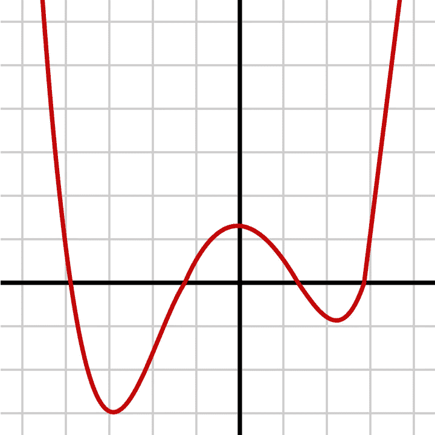

图 7:四次多项式的例子([来源](https://en.wikipedia.org/wiki/Quartic_function))。

为了找到我们的证据，我们进行如下。将等式 4 中的等式相加。10 或者使用维耶塔的公式之一(它建立了多项式系数与其零点之间的联系),我们发现方程的 T2 zs T3。10 满足:

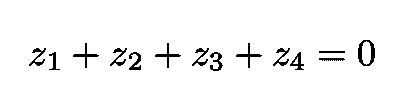

方程式 12:方程式的 *zs* 所遵循的公式。10.

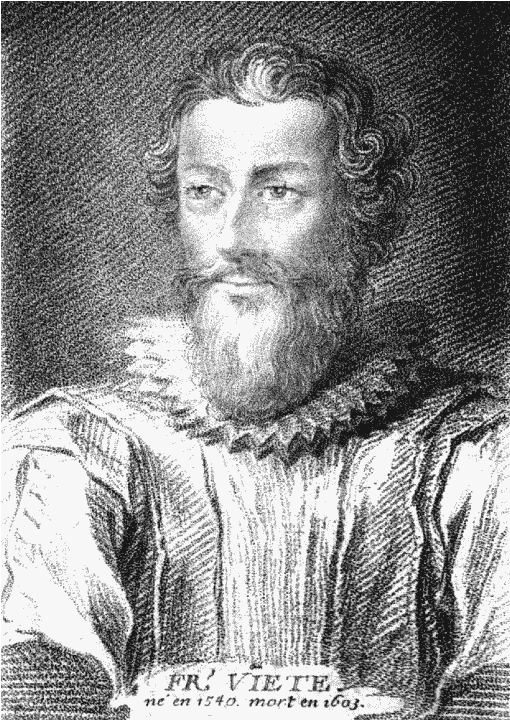

图 8:法国数学家弗朗索瓦·韦达([来源](https://en.wikipedia.org/wiki/Fran%C3%A7ois_Vi%C3%A8te))。

现在我们做如下定义:

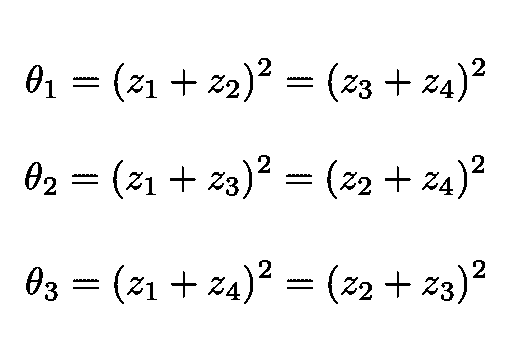

等式 13:θ₁、θ₂和θ₃.的定义

求解该方程组中的四个 *z* ，我们得到等式。10.代入等式。10 进 Eq。9 我们得到:

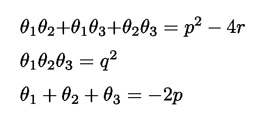

等式 14:代入等式 14 得到的关系。13 成情商。9.

维埃塔公式的直接应用意味着等式中的θ。12 是三次多项式的根

等式 15:θ是这个三次多项式的根。

我们之前学过如何解决。我们的证明到此结束。

感谢您的阅读，再见！一如既往，我们随时欢迎建设性的批评和反馈！

我的 Github 和个人网站 [www.marcotavora.me](http://www.marcotavora.me/) 有一些关于数学和其他主题的有趣材料，如物理、机器学习、深度学习和金融！