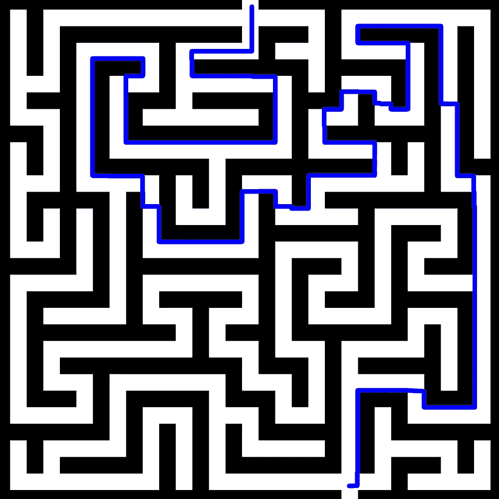

# 用 Python 解迷宫

> 原文：<https://towardsdatascience.com/solving-mazes-with-python-f7a412f2493f?source=collection_archive---------6----------------------->

## 使用 Dijkstra 的算法和 OpenCV


照片由[米切尔罗](https://unsplash.com/@mitchel3uo?utm_source=medium&utm_medium=referral)在 [Unsplash](https://unsplash.com?utm_source=medium&utm_medium=referral)

迷宫对人类来说往往是简单的谜题，但它们提出了一个很大的编程问题，我们可以使用最短路径技术来解决，如 Dijkstra 算法。

# 关于 Dijkstra 算法的复习

Dijkstra 算法是比较流行的基本图论算法之一。它用于在[有向图](https://en.wikipedia.org/wiki/Directed_graph)上寻找节点间的最短路径。我们从一个源节点和节点之间的已知边长开始。

我们首先给所有节点分配一个到源的距离值。节点 *s* 接收 0 值，因为它是源；其余的接收值为∞开始。


我们感兴趣的节点是最小值的未处理节点(显示为灰色)，即 *s* 。首先，我们“放松”感兴趣节点的每个相邻顶点，将它们的值更新为其当前值或感兴趣节点的值加上连接边长度的最小值。


节点 *s* 现已完成(黑色),其邻居 *a* 和 *b* 已采用新值。感兴趣的新节点是 *b* ，因此我们重复“放松” *b* 的相邻节点并最终确定 *b* 的最短路径值的过程。


遍历每个节点后，我们最终会得到一个图，显示从源到每个节点的最短路径长度。


运行 Dijkstra 算法后的最终图表。每个节点中的数字代表与源节点的最短可能距离

# 概念化迷宫图像


来源:[freesvg.org](https://freesvg.org/the-maze)

我们可以把图像想象成一个像素矩阵。每个像素(为简单起见)的 RGB 值为 0，0，0(黑色)或 255，255，255(白色)。我们的目标是创建一条最短的路径，它从白色开始，并且不跨越黑色边界。为了表示这一目标，我们可以将每个像素视为一个节点，并在相邻像素之间绘制边缘，边缘长度基于 RGB 值的差异。我们将使用[欧几里德平方距离](https://en.wikipedia.org/wiki/Color_difference#Euclidean)公式，并添加 0.1 以确保没有零距离路径长度(Dijkstra 算法的要求):


这个公式使得穿过迷宫边界的距离非常大。正如我们所见，从源到目的地的最短路径显然是绕过障碍，而不是穿过障碍。


使用我们的欧几里德平方颜色距离公式显示的路径长度

# 履行

我们可以使用 OpenCV，一个流行的用于 Python 的[图像处理](https://neptune.ai/blog/image-processing-python)库，来提取像素值并显示我们的迷宫图像。让我们通过在迷宫中添加点来确定起点和终点的坐标

```
import cv2
import matplotlib.pyplot as plt
import numpy as npimg = cv2.imread('maze.png') # read an image from a file using
cv2.circle(img,(5,220), 3, (255,0,0), -1) # add a circle at (5, 220)
cv2.circle(img, (25,5), 3, (0,0,255), -1) # add a circle at (5,5)
plt.figure(figsize=(7,7))
plt.imshow(img) # show the image
plt.show()
```


我们创建一个顶点类来帮助我们跟踪坐标。我们还希望跟踪父节点，这样一旦找到距离值，我们就可以重建整个路径。

```
class Vertex:
    def __init__(self,x_coord,y_coord):
        self.x=x_coord
        self.y=y_coord
        self.d=float('inf') #current distance from source node
        self.parent_x=None
        self.parent_y=None
        self.processed=False
        self.index_in_queue=None
```

我们需要创建一个顶点矩阵，代表图像中像素的 2D 布局。这将是我们 Dijkstra 算法图的基础。我们还维护了一个最小堆优先级队列来跟踪*未处理的*节点。

```
def find_shortest_path(img,src,dst):
    pq=[] #min-heap priority queue imagerows,imagecols=img.shape[0],img.shape[1]
    matrix = np.full((imagerows, imagecols), None) 
    #access matrix elements by matrix[row][col] #fill matrix with vertices
    for r in range(imagerows):
        for c in range(imagecols):
            matrix[r][c]=Vertex(c,r)
            matrix[r][c].index_in_queue=len(pq)
            pq.append(matrix[r][c]) #set source distance value to 0
    matrix[source_y][source_x].d=0 #maintain min-heap invariant (minimum d Vertex at list index 0)
    pq = bubble_up(pq, matrix[source_y][source_x].index_in_queue)
```

我们需要几个辅助函数来帮助寻找顶点之间的边和边长:

```
#Implement euclidean squared distance formula
def get_distance(img,u,v):
    return 0.1 + (float(img[v][0])-float(img[u][0]))**2+(float(img[v][1])-float(img[u][1]))**2+(float(img[v][2])-float(img[u][2]))**2#Return neighbor directly above, below, right, and left
def get_neighbors(mat,r,c):
    shape=mat.shape
    neighbors=[]
    #ensure neighbors are within image boundaries
    if r > 0 and not mat[r-1][c].processed:
         neighbors.append(mat[r-1][c])
    if r < shape[0] - 1 and not mat[r+1][c].processed:
            neighbors.append(mat[r+1][c])
    if c > 0 and not mat[r][c-1].processed:
        neighbors.append(mat[r][c-1])
    if c < shape[1] - 1 and not mat[r][c+1].processed:
            neighbors.append(mat[r][c+1])
    return neighbors
```

现在，我们可以实现 Dijkstra 算法，并将距离( *d* )值分配给迷宫图像中的所有像素顶点:

```
while len(pq) > 0:
    u=pq[0] #smallest-value unprocessed node #remove node of interest from the queue
    pq[0]=pq[-1] 
    pq[0].index_in_queue=0
    pq.pop()
    pq=bubble_down(pq,0) #min-heap function, see source code 

    u.processed=True neighbors = get_neighbors(matrix,u.y,u.x)
    for v in neighbors:
        dist=get_distance(img,(u.y,u.x),(v.y,v.x))
        if u.d + dist < v.d:
            v.d = u.d+dist
            v.parent_x=u.x #keep track of the shortest path
            v.parent_y=u.y
            idx=v.index_in_queue
            pq=bubble_down(pq,idx) 
            pq=bubble_up(pq,idx)
```

我们现在可以调用最短路径函数，并在迷宫上画出解决方案:

```
img = cv2.imread('maze.png') # read an image from a file using opencv (cv2) library
p = find_shortest_path(img, (25,5), (5,220))
drawPath(img,p)
plt.figure(figsize=(7,7))
plt.imshow(img) # show the image on the screen 
plt.show()
```


让我们试试网络上的其他迷宫。


来源:Pinterest[上的莎伦·莱曼](https://www.pinterest.com/pin/425168021068848034/)



来源:[freesvg.org](https://freesvg.org/the-maze)

完整的源代码可以在 GitHub [上找到，这里是](https://github.com/maxwellreynolds/Maze)和第 2 部分，下面是为迷宫解算器创建用户界面:

[](https://medium.com/@maxwellreynolds/building-a-simple-ui-for-python-fd0e5f2a2d8b) [## 为 Python 构建一个简单的 UI

### Streamlit:一个基于浏览器的 Python UI，不需要 HTML/CSS/JS

medium.com](https://medium.com/@maxwellreynolds/building-a-simple-ui-for-python-fd0e5f2a2d8b)