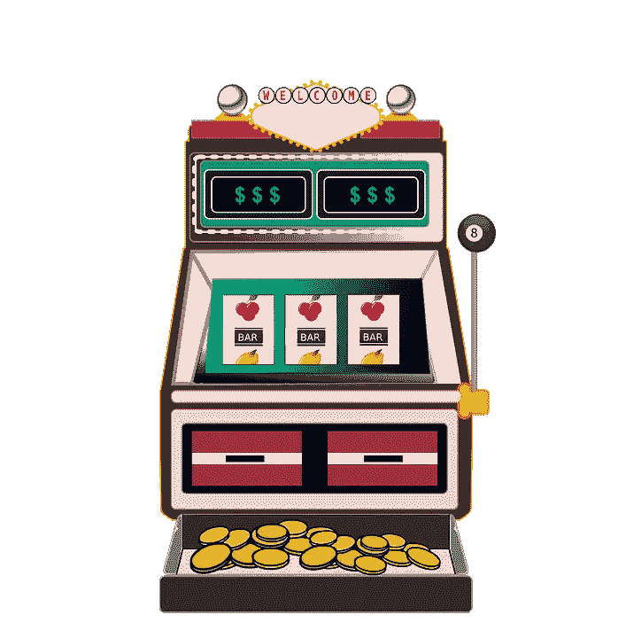
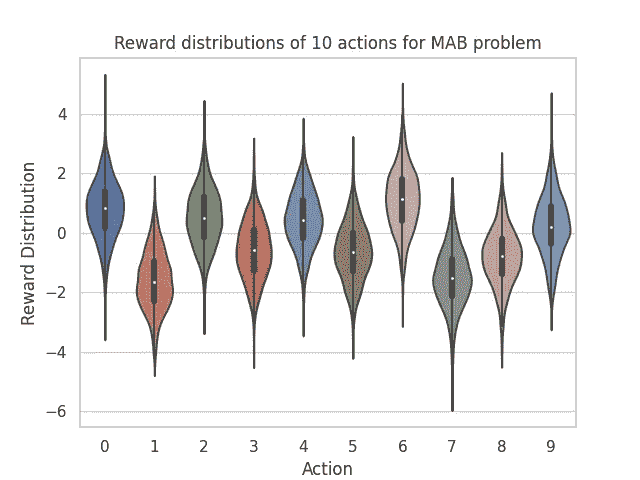
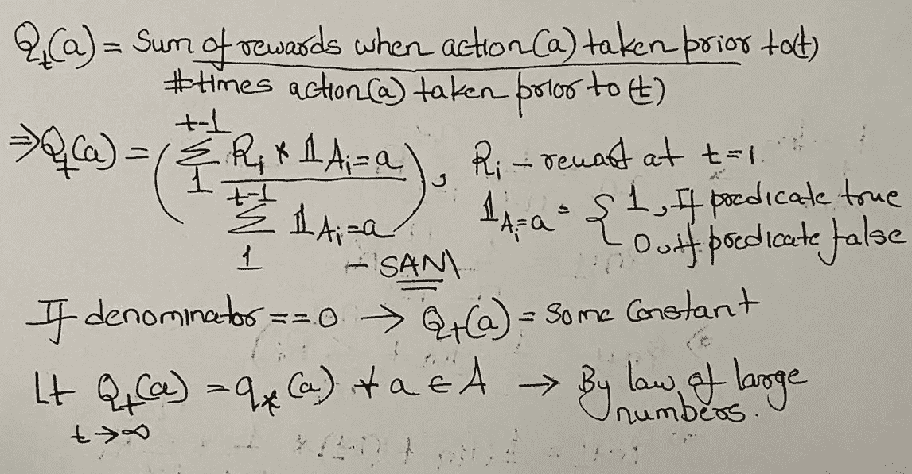
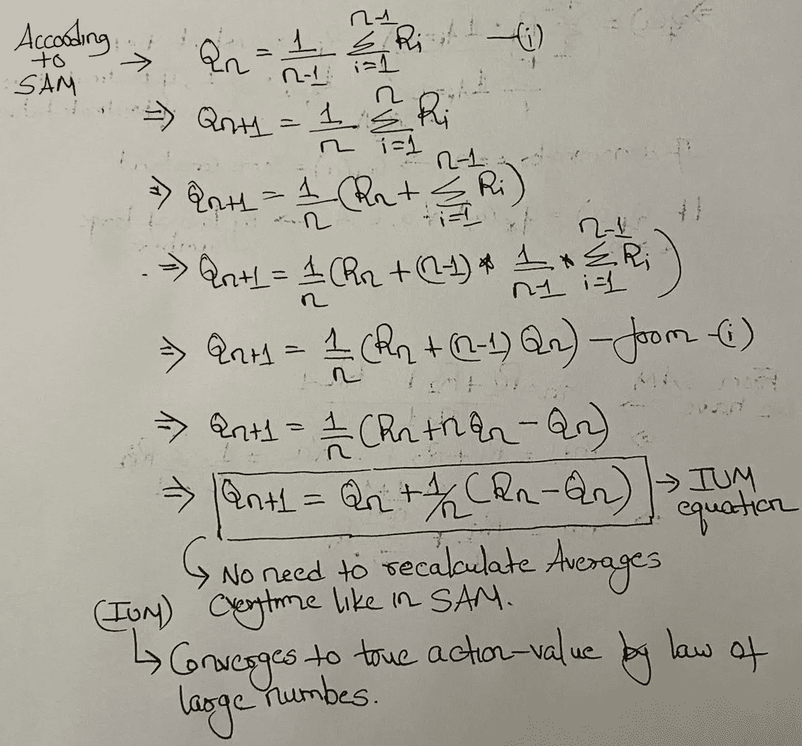
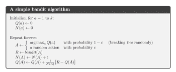
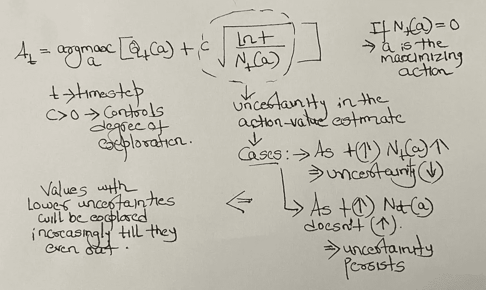
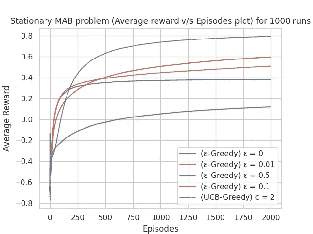

# 用ε-贪婪代理解决多武装匪徒(MAB)问题

> 原文：<https://towardsdatascience.com/solving-multi-armed-bandits-mab-problem-via-%CE%B5-greedy-agents-298de2e69971?source=collection_archive---------51----------------------->

## 在本文中，我们将设计一个多臂土匪问题(如强化学习:介绍— Sutton [1]中所述)，并分析ε-贪婪代理如何试图解决该问题。

(这是我对[1]第 2 章中概念的实现和修改)

# **什么是多臂土匪？**

吃角子老虎机(单臂强盗)

在我们谈论 MABs 之前，我们需要了解什么是**单臂强盗**。

你在典型赌场看到的**吃角子老虎机**是独臂强盗的别称。“独臂”这个名字来源于一个人需要拉动来停止旋转卷轴(现在是按钮来完成这项工作)的杠杆/手臂，因为强盗会抢劫你，咄！

这些吃角子老虎机有一个植入机器的 RNG(随机数发生器)芯片，它产生符号的随机组合。所以一个赌徒在机器上投资一些钱，然后玩这个游戏。一些罕见的组合得到了奖励，而大多数却没有。所有的支出都是在保持长期平均回报百分比的情况下完成的。

## ***该不该赌吃角子老虎机[2]，[3]，[4]？***

1.  让我们假设强盗的平均回报百分比= **x %** 。RNG 芯片被设计成在其寿命期间保持这一平均值。相应地选择可能组合的总数和获胜组合。
2.  强盗会返还投资在机器上的总资金的 x% 。它包含 **(100-x)%** 。这是赌场的提成。为了获取最大利润，赌场引诱越来越多的人玩这个游戏。投资的增加导致利润的增加。
3.  例如，如果有一个 90%回报率(或 10%持有率)的老虎机，那么在这台机器上的总投资 100 美元将导致强盗只获得 10 美元的利润。但是如果总投资是 100 万美元，那么无论如何，强盗最终会抢劫 10 万美元。
4.  天真的赌徒最终会在强盗身上输钱，因为他们认为机器在取样而没有更换。因此，他们认为，通过连续多次玩同一台机器，他们赢的几率会大大增加。他们最终取出越来越多的钱，成为这些无情的强盗的牺牲品。遗憾的是，事实并非如此，因为在每场比赛中，获胜的概率都是一样的。

现在 **MABs** (或 k 臂强盗)可以被认为是具有不同回报百分比的多个吃角子老虎机或具有 k 臂且每个臂具有不同回报百分比的单个吃角子老虎机。玩家/代理的目标是提出一个**策略**(在这种情况下，它是非关联的)，用于在每个时间步长(T)选择一个**动作**(在这种情况下，该动作是决定拉哪只手臂)，使得在某个固定时间段(T)结束时的总回报最大化。

MAB 问题是更一般的随机调度问题**【5】的一个子类，处理最优资源分配。这也是一个单状态 MDP(马尔可夫决策过程)问题。**

**单克隆抗体的实际应用可以在这里阅读[6]。**

# ****设计实验****

**我们要做一些假设来简化实验-**

1.  **我们假设 k 武装匪徒是静止的。这实质上意味着支付率不会随着时间的推移而改变。**
2.  **我们将在**非关联**设置中考虑这个问题，即动作独立于状态。**
3.  **设臂数(k) =10。这里的操作是决定拉哪只手臂(0–9)。**
4.  ***:**t**-时间步长， **a** -动作(0–9)， **q*(a)** -动作的真实值(即与动作(A)相关的平均奖励)， **Q_t(a)** -估计动作-时间步长(t)时动作(A)的值， **R_t** -奖励，***

*****为了模拟 MAB 问题的运作，[1]建议从标准正态分布 N(0，1)中对所有手臂(动作)的真实平均动作值进行采样。因此，从长远来看，平均行动价值较高的那只手臂会带来更好的收益。这些值对代理/玩家是隐藏的。为了解决这个问题，我们必须通过多次扮演强盗来解决这个问题。代理人可以得到的是直接奖励，这些奖励是从各个武器/行动的正态分布 N(q*(a)，1)中抽取的。*****

**********

*****10 支队伍的奖励分布示例(白点代表各自的 q*(a)s)*****

*****使这个问题变得重要的是，在任何时间点，我们都不知道所有动作的真实平均动作值(q*(a))是多少。如果我们知道我们可以选择具有最大 q*(a)的动作(a)。所以我们需要想出一些方法来估计每个时间步的 q*(a)。*****

# *******解决问题**(代理)*****

*****解决问题的一种方法是通过一种**纯粹贪婪的行为选择方法**。在这种方法中，代理总是利用当前的知识(Q_t(a)s)来最大化即时回报(如下式所示)。*****

*******A_t = argmax(Q_t(a))，∀ a ∈ A — (1)*******

*****在**动作值估算**方法中，目标是估算每个动作的真实动作值(即 Q_t(a))，并使用该值通过等式(1)决定在给定的时间步长内采取哪个动作。*****

*****现在，根据**静止 k 臂土匪问题**的【1】，可以使用下述两种方法进行动作值估算*****

1.  ********【same Average Method】(SAM)***:注意，这里需要额外的空间来存储过去的奖励，用于每个时间步的平均计算。*****

**********

******2。* ***增量更新法(IUM)*** :是对之前 SAM 的数学优化。请注意下面的等式是如何节省内存的，因为您不需要存储过去的奖励历史，也不需要在每个时间步重新计算平均值。(我已经在我的代码中使用了它)*****

**********

*   *****需要注意的一点是，上述所有方法都因动作值的初始选择而存在偏差。这种偏见允许一个人预先提供关于期望什么样的回报的信息。前**乐观偏差**(高初始行动值)**鼓励在&早期探索，然后降低**。bias 的缺点是它变成了一个需要用户设置的参数。*****

*****上面介绍的方法造成了一个难题。如果你仅仅基于行动价值估计来选择行动，你将会以我们称之为**的纯粹贪婪代理人**而告终(纯粹贪婪代理人总是利用当前的知识来最大化其直接回报)。但现在的问题是，如果有另一个未尝试的手臂，它最终可以带来更好的总回报，但由于较低的初始行动值而在开始时没有被选中(或探索)，会怎么样？这就是**ε-贪婪的**代理的用武之地。他们试图解决这个难题。*****

**********

*****来自[1]ε-贪婪算法*****

*****如上图所示，**简单的ε-贪婪强盗算法**背后的思想是让代理以非常小的概率(ε)随机探索其他动作，而在其他时候你贪婪地选择动作。可以渐近地证明估计的动作值收敛到真实的动作值，但是算法本身的实际有效性是未知的。*****

*****另一个解决探索 v/s 开发困境的方法是使用***【UCB】*上置信界限的动作选择方法**。在勘探过程中采用这种方法，而不是从可用的行动空间中随机选择，UCB 考虑了这些估计中的不确定性(用(c > 0)确定决定勘探程度的估计的置信水平)。但是这种方法实际上并不能很好地解决 MAB 问题。*****

**********

## *******代号*******

1.  *****安装[k-武装匪徒环境](https://github.com/NoblesseCoder/gym-karmedbandits)。*****
2.  *****转向[加强件](https://github.com/NoblesseCoder/reinforcei)。此报告包含代理的代码及其各自的演示。*****

## *******溶液分析*******

**********

*****上面的图比较了不同代理在相同的 10 臂土匪问题上的表现。统计数据是通过对 1000 次这样的运行进行平均而获得的。
其他一些适用于渐进/更多发作的推论，不同的实验设置&可能在此处不可见:*****

1.  *****ε=0.01 必然比ε=0.1 长期表现更好。并且两者的性能都优于ε=0。*****
2.  *****与静态(ε)相比，将(ε)设计为随时间降低/衰减会带来更好的性能。*****
3.  *****如果奖励更嘈杂，即抽样分布中的方差增加，ε-贪婪代理比纯贪婪代理做得更好。然而，如果我们将方差减少到 0，那么纯粹的贪婪将是可行的，因为在每个时间步长，估计的 q(a)将等于真实的 q*(a)。*****
4.  *****高初始偏差有助于鼓励在稳态 MAB 问题的早期阶段进行探索。*****
5.  *****对于稳态 MAB 问题，UCB 比ε-贪婪算法表现得更好。*****

## *******旁注*******

*****感谢您阅读文章。我希望它是有用的。欢迎任何更正或建议。我希望从基层提高我对 RL 的理解。我计划在下一篇文章中讨论非平稳 MAB 和梯度 Bandit 算法。*****

## *****参考*****

*****[1][https://MIT press . MIT . edu/books/reinforcement-learning-second-edition](https://mitpress.mit.edu/books/reinforcement-learning-second-edition):除了代码之外的所有算法和方程&推导都来自这本书。*****

*****[https://youtu.be/7Wkubf1PrWg](https://youtu.be/7Wkubf1PrWg)*****

*****[https://youtu.be/BFlRH99TQOw](https://youtu.be/BFlRH99TQOw)*****

*****[4]https://youtu.be/4wzg-8QKC5s*****

*****[5][https://en.wikipedia.org/wiki/Stochastic_scheduling](https://en.wikipedia.org/wiki/Stochastic_scheduling)*****

*****[6][https://www . research gate . net/publication/332604222 _ A _ Survey _ on _ Practical _ Applications _ of _ Multi-Armed _ and _ Contextual _ 土匪](https://www.researchgate.net/publication/332604222_A_Survey_on_Practical_Applications_of_Multi-Armed_and_Contextual_Bandits)*****