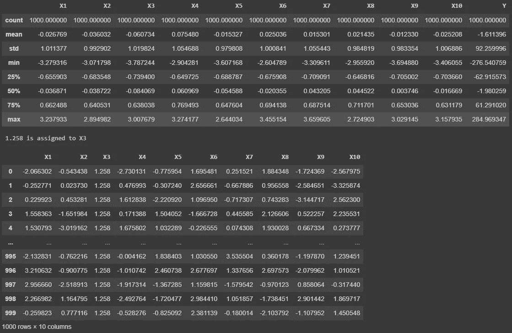
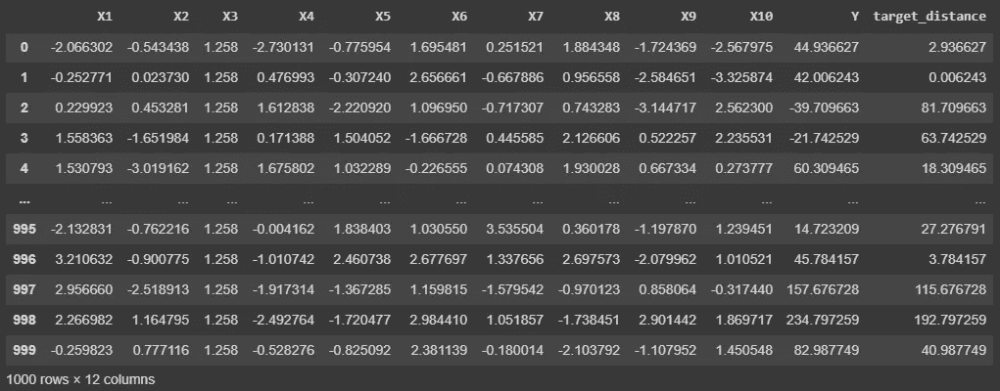
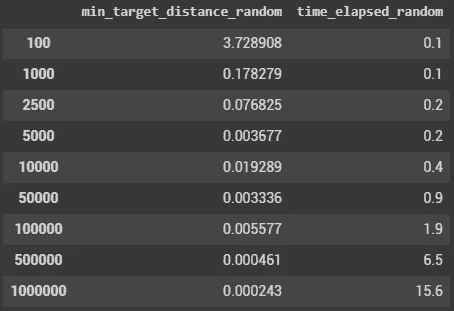

# 用遗传算法解决非线性问题(上)

> 原文：<https://towardsdatascience.com/solving-non-linear-problems-with-genetic-algorithms-part-1-381702b0140e?source=collection_archive---------49----------------------->

## 在这一系列文章中，探索遗传算法(也称为进化算法)如何帮助您解决非线性问题！


奥列格·拉普捷夫在 [Unsplash](https://unsplash.com/s/photos/geometry?utm_source=unsplash&utm_medium=referral&utm_content=creditCopyText) 上拍摄的照片

大多数机器学习用例旨在提供从输入特征推断出的最佳可能预测。

**但是想象一下，你想要确定什么是特性值的最佳组合来达到一个特定的目标。**

当您使用的模型是非线性的并且其对应的函数未知时(例如系综树)，传统的优化算法就没用了。

这是我们在行业中面临的一个典型使用案例，如下所示:

*   **描述过程行为的非线性函数**
*   **每个特性值域的历史记录**
*   **约束**:有些特性有一个我们无法更改的预定值(外部温度、原材料质量等)。)
*   **设置**:可根据我们的需求(压力、流量、速度等)进行微调的功能。)
*   **一个目标**(例如。产品规格、质量等级等。)

# 用例创建

首先，让我们创建一个用例，其中 n 个特征(X)导致一个数字输出(y):


由于这些历史值，我们创建了一个非线性模型(这里是随机森林),而没有对超参数、交叉验证等进行任何特定的优化工作。

我们利用构建该模型的机会来确定特性的重要性:


# 让我们产生一群潜在的解决方案

我们将在下一篇文章中介绍更高级的技术，但是找到将导致我们目标的特性值组合的第一个也是最简单的方法是生成大量随机的潜在解决方案。

人口越多，我们就越有可能找到一个符合我们需求的个体。

因此，对于每个特征，我们在所述特征的最小和最大观察值之间创建值的均匀分布。



注意:一个唯一的值被分配给一个“约束”特征(X3 = 1.258)

对于群体中的每一行(个体),我们可以评估模型预测(Y)及其与目标的相应距离:



现在的问题只是从这个群体中选择最好的个体:

```
population.sort_values("target_distance").head(10)
```


您可能已经猜到，人口越多，最佳解决方案与目标的距离就越小:



注意:由于这是一个纯粹的随机过程，50K 个体迭代确实比 100K 个体迭代取得了更好的性能。再次运行该流程时，情况可能会相反。

这种方法虽然简单，但随着特征和约束数量的增加，可能也需要高计算能力。

在接下来的文章中，我们将探索最聪明的方法来产生连续的群体并达到我们的目标。

跟随这一探索:

[](/solving-non-linear-problems-with-genetic-algorithms-part-2-f4ad33fd813a) [## 用遗传算法解决非线性问题(下)

### 在这一系列文章中，探索遗传算法(也称为进化算法)如何帮助您解决…

towardsdatascience.com](/solving-non-linear-problems-with-genetic-algorithms-part-2-f4ad33fd813a) [](https://pl-bescond.medium.com/pierre-louis-besconds-articles-on-medium-f6632a6895ad) [## 皮埃尔-路易·贝斯康德关于媒介的文章

### 数据科学、机器学习和创新

pl-bescond.medium.com](https://pl-bescond.medium.com/pierre-louis-besconds-articles-on-medium-f6632a6895ad)