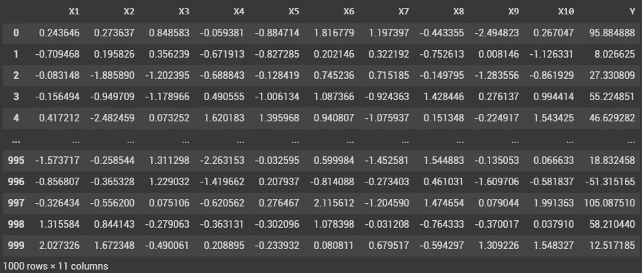
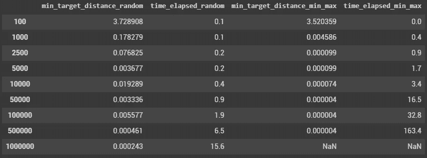

# 用遗传算法解决非线性问题(下)

> 原文：<https://towardsdatascience.com/solving-non-linear-problems-with-genetic-algorithms-part-2-f4ad33fd813a?source=collection_archive---------82----------------------->

## 在这一系列文章中，探索遗传算法(也称为进化算法)如何帮助您解决非线性问题！


乔尔·菲利普在 [Unsplash](https://unsplash.com/s/photos/geometry?utm_source=unsplash&utm_medium=referral&utm_content=creditCopyText) 上的照片

在本系列的第一部分([这里是](https://medium.com/@pl.bescond/solving-non-linear-problems-with-genetic-algorithms-part-1-381702b0140e))，我介绍了优化非线性问题的问题，这些问题是不可微的，标准的优化库对这些问题没有用。

如果你熟悉遗传算法，你就会知道它们通过保留最适应环境的个体来模仿自然选择过程。

> 在我将在这些文章中使用的示例中，这可以翻译如下:**个体特征**(为每个特征设置的值的组合)**与环境**(非线性模型)**交互，环境决定了个体的命运**(回归结果离目标越近，生存的机会就越高！)

我们首先探索了一种非常简单的方法，包括将尽可能多的解决方案(=个体)应用于非线性模型，并挑选出最佳方案。

然而，随着特征数量和模型复杂程度的增加，这种方法可能需要大量的计算能力和时间。

在我们进入排列和突变(这是使用的传统方法)之前，我想提供一个我正在使用的具有良好效果的替代技术。

> 但是，请记住，我使用这种优化技术来解决行业建模问题，它可能(很可能)在其他领域失败。

我将稍微改变最初的方法，通过逐渐减少探索的领域来最大化潜在解决方案的数量。

让我们用一个单一的特性来解释基本思想:X1:

该特征的初始范围对应于最小-最大观察范围。所以，如果 X1 在 30 和 50 之间变化，我们应该创造具有相同特征的个体。

然而，很可能 X1 的最佳值属于较小的范围。

例如，考虑 X1 对应于一个温度，并且它对 35 到 42 之间的目标贡献最大。确切和最佳的温度将最终由其它生产参数和/或约束条件(流速、粘度等)来确定。).

如果我们选择原始观测宇宙，15 个可能的 X1 值将是:

```
np.random.randint(30,51,15)[45, 50, 43, 38, 44, 35, 44, 41, 48, 45, 43, 33, 37, 43, 43]
```

然而最明智的选择是:

```
|np.random.randint(35,42,15)[40, 40, 40, 35, 40, 36, 35, 35, 37, 36, 35, 36, 39, 38, 35]
```

因此，我们将建立一个算法，在每一个新的一代，将逐步缩小每个特征的探索范围，并保持生成的个体数量稳定。因此，我们将最大化获得具有最佳特征的个体的可能性。

让我们直接进入代码吧！

正如我们在第一篇文章中所做的那样，我们将创建一个具有 10 个特征的回归示例，并在不微调任何超参数的情况下训练一个随机森林:



以下函数将根据从上一个函数继承的特征(每个特征的最小-最大范围)和一些潜在的约束来创建新一代:

下面的函数将选择离目标最近的人:

然后，我们用定义数量的代创建整个过程(这里是 5000，但是我们也可以在 n 次迭代之后停止该过程，而对个体没有任何改进)

每一代将由 100 个个体组成；其中只有 10 个会把自己的特征传给下一个。

每次发现改进之处，我们都会强调出来。

这个过程的输出是:

```
Generation # / Distance from target
0 : 3.5203594790711463
1 : 0.17245788609726276
2 : 0.021943158326713785
5 : 0.013048357781954678
8 : 0.004585642441860216
20 : 0.0018902165603407184
21 : 0.0000990125205220238
88 : 0.00007448426300271649
161 : 0.00005387409348855954
164 : 0.000027555658107303316
258 : 0.000009524267987615076
284 : 0.0000043455700051708845
```

为了理解与第一篇文章中描述的[模型的区别，让我们比较它们的性能(第一列对应于创建的个体数量):](https://medium.com/@pl.bescond/solving-non-linear-problems-with-genetic-algorithms-part-1-381702b0140e)



我们可以清楚地看到，与以前的方法相比，这种新方法能够以更少的个体到达更小的目标距离！

你是否热衷于探索其他方法来达到最佳解决方案？

跟随这一探索:

[](/solving-non-linear-problems-with-genetic-algorithms-part-3-480347ca7d90) [## 用遗传算法解决非线性问题(三)

### 在这一系列文章中，探索遗传算法(也称为进化算法)如何帮助您解决…

towardsdatascience.com](/solving-non-linear-problems-with-genetic-algorithms-part-3-480347ca7d90) [](https://pl-bescond.medium.com/pierre-louis-besconds-articles-on-medium-f6632a6895ad) [## 皮埃尔-路易·贝斯康德关于媒介的文章

### 数据科学、机器学习和创新

pl-bescond.medium.com](https://pl-bescond.medium.com/pierre-louis-besconds-articles-on-medium-f6632a6895ad)