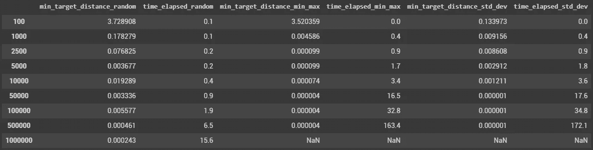
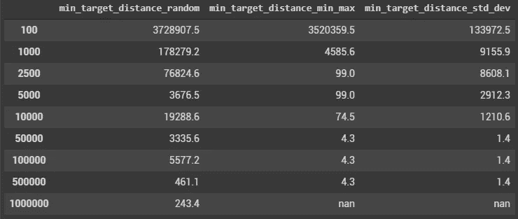
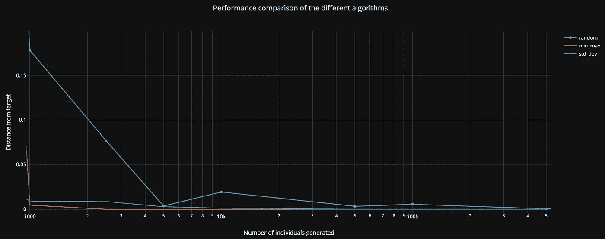

# 用遗传算法解决非线性问题(三)

> 原文：<https://towardsdatascience.com/solving-non-linear-problems-with-genetic-algorithms-part-3-480347ca7d90?source=collection_archive---------70----------------------->

## 在这一系列文章中，探索遗传算法(也称为进化算法)如何帮助您解决非线性问题！


西尔维奥·昆特在 [Unsplash](https://unsplash.com/s/photos/geometric?utm_source=unsplash&utm_medium=referral&utm_content=creditCopyText) 上的照片

在本系列的第一篇文章(链接到[第一部分](https://medium.com/@pl.bescond/solving-non-linear-problems-with-genetic-algorithms-part-1-381702b0140e)和[第二部分](https://medium.com/@pl.bescond/solving-non-linear-problems-with-genetic-algorithms-part-2-f4ad33fd813a))中，我描述了两种使用遗传算法解决非线性问题的潜在(简单)方法:

1.  探索尽可能多的解决方案，并选择最佳方案
2.  一代接一代，缩小每个特性的探索范围，以便更快地找到最佳解决方案

在这最后一篇文章中，我们将使用一个与前两个略有不同的算法，基于“突变”原理。

> 这个想法是这样的:
> 
> 我们基于原始数据集的特征启动第一代
> 
> 我们选择这一代的 n 个最佳个体，基于他们的适应度
> 
> 我们通过复制这些最优秀的个体来创造新一代，并随机对他们的特征进行改变。这就是“突变”过程。在这里的例子中，这种改变将根据标准偏差因子来执行。

值得一提的是，基于随机性、各种分布类型等，有多种方式来执行突变。这些变化可以与特征和/或个体之间的交叉相结合。选择过程也可以基于比分类/切割更复杂的原则:锦标赛、轮盘赌和其他广泛记载的概率方法。

初始数据集创建和模型训练与[第 2 部分](https://medium.com/@pl.bescond/solving-non-linear-problems-with-genetic-algorithms-part-2-f4ad33fd813a)中描述的相似。

我们对这一过程进行了一些微调:

*   我们防止特征值超出最初观察到的全域限制(=全域约束)。
*   突变过程将使用 0.5 的因子来实现，该因子可总结如下:

```
new_value = original_feature_value +/- one standard deviation * 0.5
```

*   随着优化过程的进行，标准偏差系数将逐渐降低，以帮助微调个体特征。对于那些熟悉 learning_rates 问题的人来说，哲学是相同的！

```
Generation # / Distance from target
0 : 0.1339725062531727
1 : 0.10594988801634031
2 : 0.019531289828471188
5 : 0.01204014370247819
8 : 0.009155880407085704
11 : 0.008608138256597897
39 : 0.006970989388712212
47 : 0.0029122949569213574
55 : 0.001959993072830457
73 : 0.0012105657915313373
248 : 0.0011502227638615636
263 : 0.0008513611293921031
274 : 0.0000013788767674327573
```



**为便于阅读，距离乘以 10⁶的同一表格:**



我想简单回顾一下我观察到的这三种方法的优缺点，因为它们都提供了有趣的功能。

*   [**大型随机选择(第 1 部分)**](https://medium.com/@pl.bescond/solving-non-linear-problems-with-genetic-algorithms-part-1-381702b0140e) 提供快速结果，但随着特征数量和模型复杂性的增加，将变得计算密集型。
*   [**【Min-Max】缩小选择(第二部分)**](https://medium.com/@pl.bescond/solving-non-linear-problems-with-genetic-algorithms-part-2-f4ad33fd813a) 生成的个体越少，精度越高。
*   **标准偏差选择**(第 3 部分)将提供更高的准确性，但严重依赖于我们定义的过程生成和选择标准。

 [## 不同算法的性能比较| pierrelouisscond | plot ly

### 编辑描述

plotly.com](https://plotly.com/~pierrelouisbescond/1/) 

[”//plotly.com/~pierrelouisbescond/1.embed”](”//plotly.com/~pierrelouisbescond/1.embed”)


 [## 不同算法的性能比较| pierrelouisscond | plot ly

### 编辑描述

plotly.com](https://plotly.com/~pierrelouisbescond/1/) 

我真心希望你能欣赏这个关于非线性问题优化的系列！

[](https://pl-bescond.medium.com/pierre-louis-besconds-articles-on-medium-f6632a6895ad) [## 皮埃尔-路易·贝斯康德关于媒介的文章

### 数据科学、机器学习和创新

pl-bescond.medium.com](https://pl-bescond.medium.com/pierre-louis-besconds-articles-on-medium-f6632a6895ad)