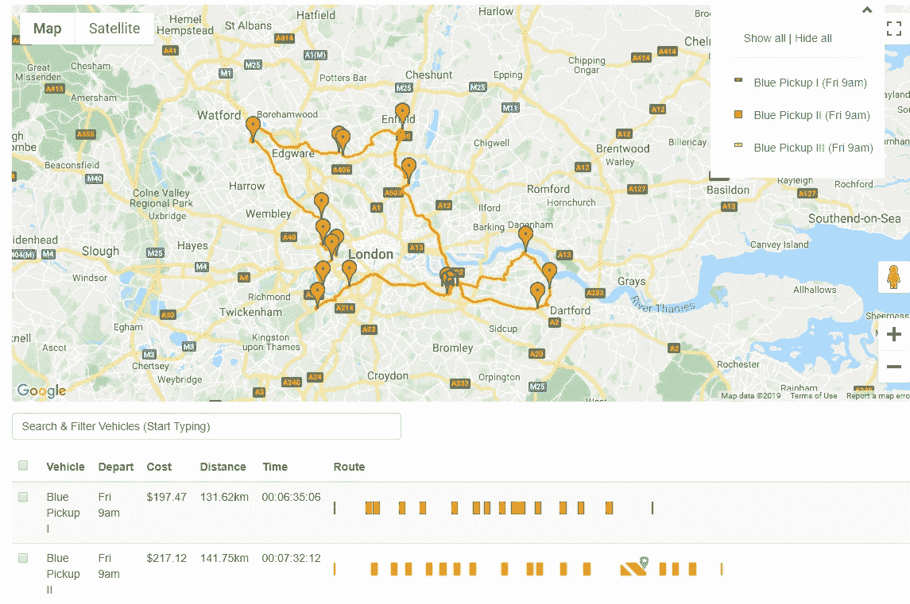

# 解决交通运输中的一个大问题

> 原文：<https://towardsdatascience.com/solving-one-truly-big-number-problem-in-transport-480ec2a128d1?source=collection_archive---------31----------------------->

关于如何解决运输中极其复杂的数学问题的简要概述。

降低[最后一英里](https://en.wikipedia.org/wiki/Last_mile_(transportation))的运输成本是简化整体供应链成本的重要组成部分。

由于供应链总成本的 30%发生在最后一英里，精确的交付计划可以削减运输成本并提高竞争力。

现实世界中的送货计划可能是一项棘手的工作。

> 一个简单的[路线优化问题](https://optergon.com/blog/route-optimization-explained)有一辆车和 50 个停靠站，它的排列比太阳中的氢原子多 3 千万倍(10⁵⁷).

此外，不同的车辆有不同的运营成本、运载能力、驾驶员能力和薪酬水平等等。然而，交货必须以保持低成本的方式按时完成。

随着像亚马逊这样的大公司不断挑战终端客户和消费者对送货服务的期望，竞争只会越来越激烈。

为了产生有用的节约，企业可以在现实世界中应用这些路线，这些路线必须考虑车辆容量和容量类型(*即车辆是否具有冷链运载能力*)、距离(*即每英里成本*)和时间成本(*即司机支付*)以及车辆属性(*即车辆是否具有码头升降机*)。

考虑*3 辆蓝色皮卡* ( *一个假设的由 3 辆蓝色皮卡*组成的送货公司)需要访问 60 个地点，这些地点可能是送货和皮卡的任意组合(*即返回*)。

起始地图可能看起来像这样。

*3 车辆 60 停图由*[*Optergon*](https://optergon.com/)*提供。*

在没有任何交付计划的情况下，这 3 辆车和这些停靠点的最佳路线计划(*给定上午 9 点到下午 5 点的时间限制*)如下所示。

*3 车辆 60 停路线优化*[*Optergon*](https://optergon.com/)*。*

希望你能看到，这 3 辆车有可能在允许的时间内参观所有地点。

然而，两辆车在规定的八个小时的几分钟内到达，所以这个路线计划显示只有*才*可能参观所有的地点。

> 有用的信息，为任何企业试图保持其车队尽可能精简和高效。如果没有这些信息，我们假设的公司可能不得不花大价钱租第四辆车。

那是我们理论上的最佳路线。

在现实世界中完全没有用，因为它没有考虑到所需的送货和取货。

如果*蓝色皮卡 II* 路线逛了太多地点，运载能力用完了怎么办？

它将不得不在路线中途返回停车场重新装载(*这肯定会要求它在路上的时间超过允许的时间范围，导致司机或司机们的加班费*)。

而对交付进行记账可能意味着一辆或多辆车的多次旅行。根据运载能力限制规划路线可以使它们在现实世界中对公司更有商业用途。

让我们重温一下理论时间表，更新一些运载能力的车辆。

*真实世界车辆载重量由*[*Optergon*](https://optergon.com/)*提供。*

我们的三辆蓝色皮卡现在的载重量是用*板条箱*测量的。它可以是你喜欢的任何东西——重量、体积、调色板、包裹、长颈鹿等等。

我还增加了一些趣味。

*蓝色皮卡 III* 因为是较大的车辆，所以可以搭载 *20 个板条箱*。为了保持现实，该车辆的距离成本被设置为每英里 1.20 美元，而两个较小的皮卡被设置为每英里 1 美元。

我们的小型船队总载重量为 50 箱。

接下来，我们可以导入一个交货清单，指定每个地点的交货和提货。为了便于解释结果，我们将从向每个地点运送一个板条箱开始。

总共 60 箱。超出了我们的承受能力。

这是结果。

*路线优化与配送计划*[*Optergon*](https://optergon.com/)*。*

这里有一些微妙的效率在起作用。

两辆车，*蓝色皮卡 II* 和*蓝色皮卡 III* ，在第二次出发前必须返回停车场重新进货(在路线概要中用灰色条纹位置表示的*)。*

这是意料之中的，因为我们需要运送 60 箱货物，而容量只有 50 箱。

隔离*蓝色皮卡 II* 的交付计划显示了它如何执行两个有效的循环，这两个循环的起点和终点都在仓库附近。

*多次行程交付计划由*[*Optergon*](https://optergon.com/)*提供。*

*蓝色皮卡 I* ，载重量 *15 箱，*单趟运送 *14 箱*。

蓝色小货车 III 的载重量更高，可装载 *20 箱*，最终比两辆较小的小货车运送到更多的地方。

有道理吗？

*蓝色皮卡 III* 可以运载更多，但在距离成本方面贵了 20%。

当然，我们想尽量减少它的使用？

每辆车行驶的确切距离可在路线摘要图表中看到。

*最佳路线距离和时间成本摘要由*[*Optergon*](https://optergon.com/)*提供。*

仔细看*蓝色皮卡 III* 行驶的距离。

尽管在交付方面做了大量工作，但它实际上行驶的距离大约是这两款更便宜的汽车的一半。这意味着交付计划的成本被最小化，同时仍然充分利用额外的运载能力。

这很有效，因为这种车能够专注于紧紧捆绑在市中心的送货地点，而价格较低的车辆则在郊区行驶。

> 单位距离最贵的汽车在路上花的时间更多，但行驶的距离更短。

花费的时间太多，超过了日程安排的 8 小时。

因此，目前的时间表无法在规定的时间内完成。有道理，因为需要多次往返才能完成交货。

几次提货会有什么影响(*相对于只送货*)会有什么影响？

假设我们有 50 次送货和 10 次提货，而不是 60 次送货。这意味着我们有 *50 个板条箱*要交付，有 *50 个板条箱*的容量，加上 *10 个板条箱*要提货并返回仓库。

您会采取什么方法来最好地满足这些新需求？需要多次出差吗？

这是最佳路线和交付计划的样子。

*最优配送和路线计划由*[*Optergon*](https://optergon.com/)*提供。*

新的计划是有效的。三辆车都在规定的 8 小时内完成了行程。

*蓝色皮卡 III* 做两趟，其他两辆车只需要一趟。

同样，*蓝色皮卡 III* 行驶的距离大约是其他两辆车的一半——尽管必须返回停车场。

蓝色皮卡 II 的容量为 *15 个板条箱*，但它在一次行程中走访了 19 个地方。这是因为它执行五次提货(*提货在每辆车的时间线*中用灰色大头针表示)，这意味着正好 *14 个板条箱*必须在仓库装载——在路线开始时留出 *1 个板条箱*容量。

*蓝色皮卡 I* 也带着 *14 个板条箱*离开，留下 *1 个板条箱*容量可用，从车辆段。

*蓝色皮卡 III* 带着 *19 个板条箱*出发。在完成其路线之前，它先放下一个板条箱，然后再拾起一个(*以保持略低于容量*)。

这种双重交付/路线优化使*蓝色皮卡 III* 能够在两条高效路线上往返于停车场，而无需降低任何一条路线在时间和距离方面的质量。

你可能想知道为什么前两辆车没有充分利用它们的能力来防止*蓝色车辆 III* 不得不进行多次旅行。

看看*蓝色车辆 III* 的路线，告诉你为什么。

*最优多行程配送及路线规划由*[*Optergon*](https://optergon.com/)*提供。*

第二次旅行中参观的三个地点(*用红色*圈起来)彼此都很近，但离仓库有一段距离。

如果其他车辆中的每一辆都接受了这些交付中的一次，则仍然会有一次交付剩余，这将需要其中一辆车返回到仓库。无论是*蓝色皮卡 I* 还是*蓝色皮卡 II* 都没有多少剩余时间——两者都有可能超过计划时间限制——并增加了解决方案的总体成本。

你们中的一些人可能想知道为什么有必要进行多次旅行。毕竟，时间表规定 *50 个板条箱*以 *50 个板条箱*的能力交付。

如果最初交付了一些，以释放车辆的一些运载能力，那么剩余的 10 辆皮卡可以被安置在各种路线的某个地方。

表面上看，这听起来很合理。

解决方案必须采用这种形式的原因是，这是现实世界中的*最佳*解决方案。

*‘现实世界’*是关键。

从技术上讲，避免多次往返是可能的，但这需要*蓝色皮卡 III* 行驶更远。其他两辆车的路线的任何增加都可能会使他们超过允许的时间限制——除非他们在其他地方减少了一些交付。

换句话说，

> 要么会超出计划的时间限制，要么解决方案的成本会高得多。

对这些路线的进一步分析开始变得相当复杂。

如果你有企业级的、真实世界的路线规划工具，我鼓励你让你自己的专家来解决这个问题。看看他们有什么发现。

一句警告。

这种规模的车辆路径问题有很多可能性可以探索。大约:

3⁶⁰ x 60！= **3.5 x 10 ⁰**

为了客观地看待这个问题，

> 你可以用构成整个宇宙的原子(包括 10⁸⁰氢原子)来重建地球上的所有海洋，但仍然不会达到那么大的数字。

最终，交付计划和路线优化是关于克服令人难以置信的复杂数学问题，以产生最低成本的解决方案*，这可以在现实世界中实现*。