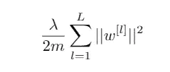
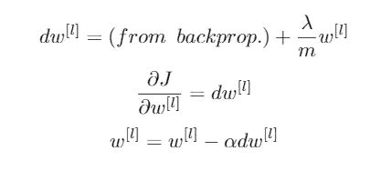
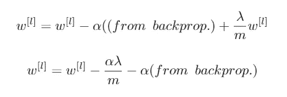

# 用正则化方法解决神经网络过拟合问题

> 原文：<https://towardsdatascience.com/solving-overfitting-in-neural-nets-with-regularization-301c31a7735f?source=collection_archive---------37----------------------->


过度拟合是一个巨大的问题，尤其是在深度神经网络中。如果你怀疑你的神经网络过拟合你的数据。有相当多的方法可以发现你过度拟合了数据，也许你有一个高方差的问题，或者你画了一个训练和测试精度图，发现你过度拟合了。在这种情况下，你应该尝试的第一件事就是正规化。

本博客中使用的所有 LaTex 代码都是在本博客的 GitHub repo 上编译的:

[](https://github.com/Rishit-dagli/Solving-overfitting-in-Neural-Nets-with-Regularization) [## rishit-dagli/用正则化解决神经网络中的过拟合

### 了解如何使用正则化来解决过度拟合及其背后的直觉…

github.com](https://github.com/Rishit-dagli/Solving-overfitting-in-Neural-Nets-with-Regularization) 

# 为什么要正规化？

解决高方差的另一种方法是获得更多相当可靠的训练数据。如果你得到了更多的训练数据，你可以这样想，你正试图在所有情况下推广你的体重。这解决了大多数情况下的问题，那么为什么还有其他的呢？但是这样做的一个很大的缺点是，你不能总是获得更多的训练数据，获得更多的数据可能会很昂贵，有时甚至无法获得。

现在我们讨论一些有助于减少过拟合的方法是有意义的。添加正则化通常有助于防止过度拟合。你猜怎么着，这有一个隐藏的好处，通常正则化也有助于你最小化网络中的随机误差。讨论了为什么正规化的想法有意义，现在让我们来理解它。

# 理解 L₂正则化

我们将从开发物流功能的这些想法开始。回想一下，你试图最小化一个叫做成本函数的函数，看起来像这样


你的 T1 是一个大小为 T2 的矩阵，T3 是损失函数。只是快速复习一下，没什么新的。

因此，为了增加正则化，我们将在这个成本函数方程中增加一项，我们将会看到更多这样的内容


因此，λ是另一个可能需要调整的超参数，称为正则化参数。

根据理想惯例,`||w||²₂`仅仅意味着`w`的欧几里德 L₂范数，然后对它求平方，让我们用一个等式来总结它，这样对我们来说就变得容易了，我们将稍微简化一下 L₂范数项


我刚刚用向量素数对向量`w`的平方欧几里德范数表达了它。所以我们刚刚谈到的术语叫做 L₂正则化。不要担心，我们将在一会儿讨论更多关于我们如何得到λ项，但是至少你现在对它如何工作有一个粗略的想法。这种方法实际上有一个叫做“L₂归一化”的原因，之所以这么叫是因为我们正在计算`w`的 L₂范数。

到目前为止，我们讨论了参数`w`的正则化，你可能会问自己一个问题，为什么只有`w`？为什么不加一个带`b`的名词？这是一个逻辑问题。事实证明，在实践中，你可以添加一个`w`项或为`w`做这件事，但我们通常只是省略它。因为如果你观察参数，你会注意到`w`通常是一个非常高维的向量，特别是有一个高方差的问题。请理解为`w`只有许多单独的参数，所以您不能很好地拟合所有的参数，而`b`只是一个数字。所以几乎你所有的主要参数都在`w`而不是`b`。因此，即使你把最后一个`b`项加入你的等式，实际上也不会有很大的不同。

# L₁正则化

我们刚刚讨论了 L₂正则化，你可能也听说过 L₁正则化。因此，L₁正则化是当取代我们之前谈论的术语时，您只需添加参数向量的 L₁范数`w`。让我们从数学的角度来看这个术语-


如果你使用 L₁正则化，你的`w`可能会变得稀疏，这意味着你的`w`向量会有很多零。人们常说，这有助于压缩模型，因为参数集为零，存储模型需要的内存更少。我觉得，在实践中，L₁正则化使你的模型稀疏，帮助不大。所以我不建议你使用这个，至少对于模型压缩来说是这样。当你训练你的网络时，L₂正则化会用得更多。

# 将这个想法扩展到神经网络

我们刚刚看到了如何对逻辑函数进行正则化，现在您对正则化的含义和工作原理有了清晰的认识。所以，现在看看这些想法如何扩展到神经网络会很好。因此，对于神经网络的回忆或成本函数，它看起来像这样:


现在，回想一下我们之前讨论时添加的内容，我们添加了正则化参数λ、缩放参数以及最重要的 L₂范数，因此我们将做一些类似的事情，而不是对图层求和。因此，我们添加的术语应该是这样的:



现在让我们来简化这个 L₂范数项，它被定义为矩阵中每个元素的和除以和:


这里的第二行告诉你的是你的权重矩阵或者这里的`w`是维度`nˡ, nˡ⁻¹`的，这些分别是层`l`和`l-1`中单元的数量。这也称为矩阵的“Frobenius 范数”, Frobenius 范数非常有用，在相当多的应用中使用，其中最令人兴奋的是在推荐系统中。通常用下标“F”表示。你可能会说，称它为 L₂范数更容易，但由于一些传统的原因，我们称它为弗罗贝纽斯范数，它有不同的表示-

```
||⋅||₂² - L₂ norm
||⋅||²_F - Frobenius norm
```

# 实施梯度下降

因此，之前我们会使用反向传播来计算`dw`，获得任意给定层`l`的成本函数`J`相对于`w`的偏导数，然后更新`wˡ`并包括α参数。既然我们已经将正则项引入到目标中，那么我们将简单地添加一个正则项。这些是我们为此做的步骤和方程式-



所以，之前的第一步只是从反向传播得到的，现在我们给它增加了一个正则项。其他两个步骤与你在其他神经网络中所做的几乎相同。这个新的`dw[l]`仍然是你的成本函数的导数的正确定义，关于你的参数，现在你已经在末尾增加了额外的正则项。因此，L₂正则化有时也被称为权重衰减。所以，现在如果你把第一步的方程代入第三步的方程-



因此，这表明无论你的矩阵`w[l]`是什么，你都要把它变小一点。这实际上就好像你在取矩阵`w`并乘以`1 - α λ/m`。

这就是为什么 L₂范数正则化也被称为权重衰减。因为它就像普通的梯度下降，你通过减去从反向传播得到的原始梯度的α倍来更新`w`。但是现在你也把 w 乘以这个东西，它比 1 小一点。因此，L₂正则化的另一个名字是权重衰减。我不经常使用这个术语，但是你现在知道它的名字是怎么来的了。

# 为什么正则化减少过度拟合

当实现正则化时，我们添加了一个称为 Frobenius 范数的项，它惩罚权重矩阵过大。所以，现在要考虑的问题是，为什么缩小 Frobenius 范数会减少过度拟合？

**创意一**

一个想法是，如果你将正则化参数λ设置得非常大，他们将会非常有动力将权重矩阵`w`设置得合理地接近零。因此，一个直觉是，对于许多隐藏单元来说，它将权重设置得如此接近于零，这基本上消除了这些隐藏单元的许多影响。如果是这样的话，那么神经网络就变成了一个更小更简单的神经网络。事实上，它几乎就像一个逻辑回归单位，但堆叠最有可能一样深。这将把你从过度拟合的情况带到更接近高偏差的情况。但有希望的是，应该有一个产生最优解的λ中间值。因此，总而言之，你只是归零或减少一些隐藏层的影响，本质上是一个更简单的网络。

完全清除一堆隐藏单元的直觉是不太正确的，在实践中也不太好。事实证明，实际发生的是，我们仍然会使用所有的隐藏单元，但每个隐藏单元的效果会小得多。但是你最终得到了一个更简单的网络，就好像你有一个更小的网络，因此不容易过度拟合。

**想法二**

这是正则化的另一个直觉或想法，以及为什么它减少了过度拟合。为了理解这个想法，我们以`tanh`激活函数为例。所以，我们的`g(z) = tanh(z)`。


这里注意，如果`z`只采用小范围的参数，也就是说`|z|`接近于零，那么你只是在使用双曲正切函数的线性范围。如果仅当`z`被允许漂移到更大的值或更小的值，或者`|z|`远离 0，则激活函数开始变得不那么线性。因此，你可能从中获得的直觉是，如果正则化参数λ较大，那么你的参数将相对较小，因为它们在成本函数中因较大而受到惩罚。

所以如果`w` 的权重很小，那么因为`z = wx+b`但是如果`w`趋向于很小，那么`z`也会相对较小。特别是，如果`z`最终取相对较小的值，将导致`g(z)`大致呈线性。因此，就好像每一层都会像线性回归一样大致呈线性。这将使它就像一个线性网络。所以即使一个非常深的网络，有一个线性激活函数，最终也只能计算一个线性函数。这将不可能适合一些非常复杂的决策。

如果你有一个神经网络和一些非常复杂的决策，你可能会过度拟合，这肯定有助于减少你的过度拟合。

# 要记住的提示

当您实施梯度下降时，调试梯度下降的步骤之一是绘制成本函数`J`作为梯度下降的高程数的函数，并且您希望看到成本函数`J`在梯度下降的每个高程之后单调下降。如果你正在实现正则化，那么记住`J`现在有了新的定义。如果你画出旧的定义`J`，那么你可能不会看到单调下降。因此，为了调试梯度下降，请确保您正在绘制的`J`的新定义也包括第二项。否则，您可能看不到`J`在每个高度上单调下降。

我发现正则化在我的深度学习模型中非常有帮助，并多次帮助我解决过拟合问题，我希望它们也能帮助你。

# 关于我

大家好，我是里希特·达利

[LinkedIn](https://www.linkedin.com/in/rishit-dagli-440113165/)—l【inkedin.com/in/rishit-dagli-440113165/ 

[网站](https://rishit.tech/) — rishit.tech

如果你想问我一些问题，报告任何错误，建议改进，或者给我反馈，你可以发电子邮件给我

*   rishit.dagli@gmail.com
*   hello@rishit.tech