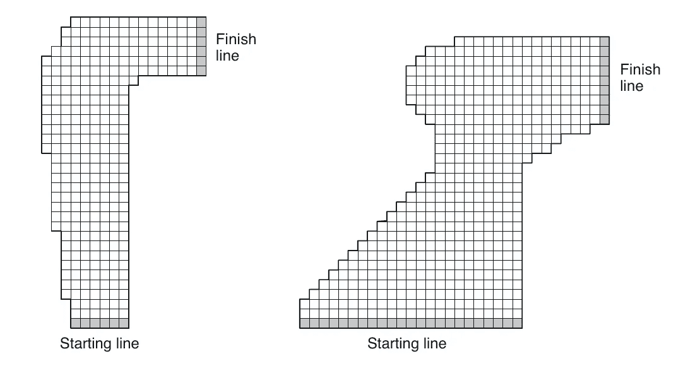
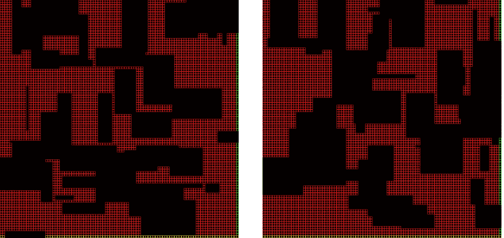
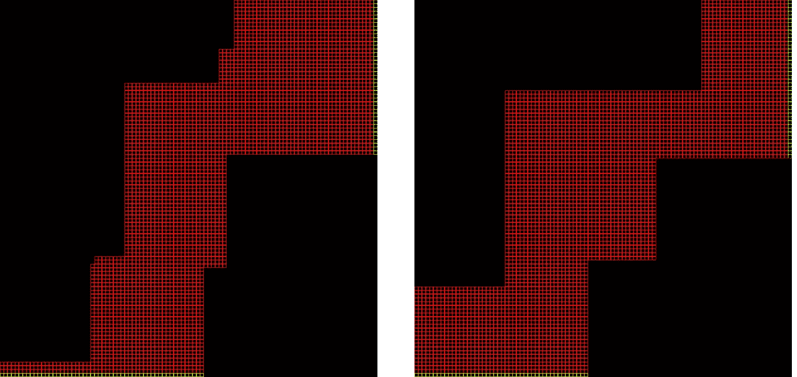
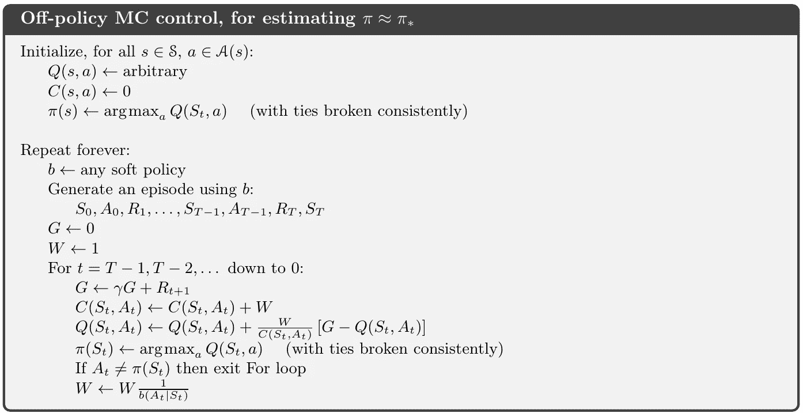
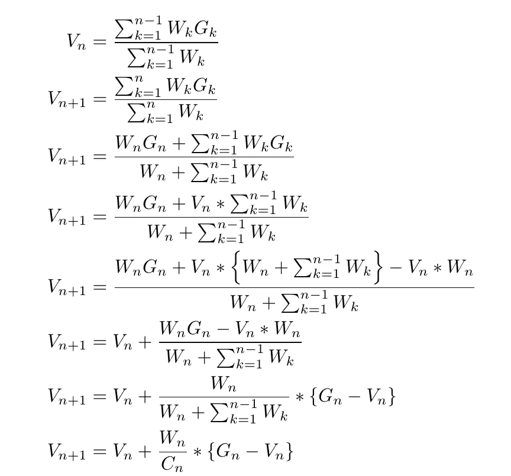
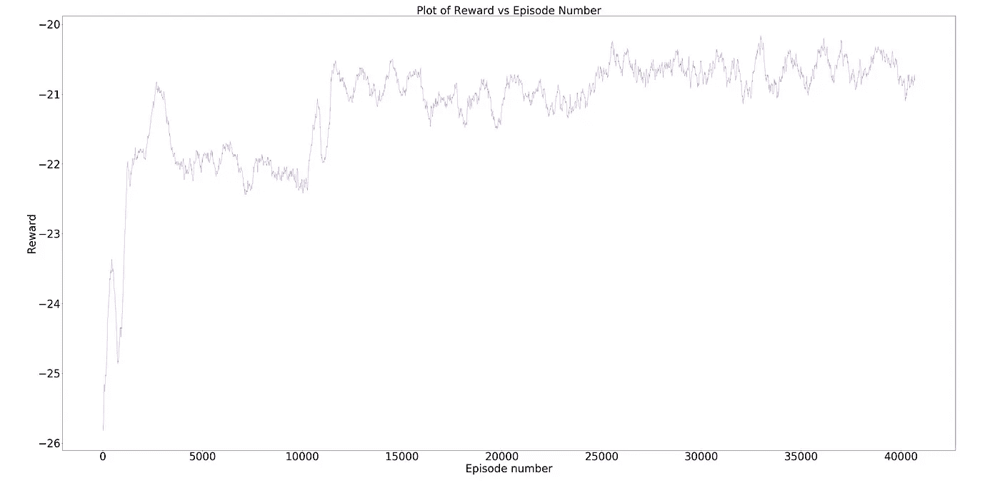
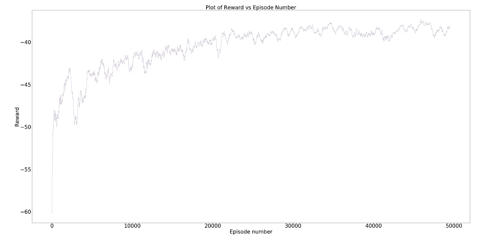

# 用蒙特卡罗控制解决强化学习中的跑道问题

> 原文：<https://towardsdatascience.com/solving-racetrack-in-reinforcement-learning-using-monte-carlo-control-bdee2aa4f04e?source=collection_archive---------13----------------------->

> 在这篇博文中，我们将一步一步地解决强化学习中的跑道问题。

# 问题陈述

首先，让我们看看问题是什么。考虑在如下图所示的赛道上驾驶赛车。在我们简化的赛道上，赛车位于一组离散的网格位置中的一个，即图中的单元。速度也是离散的，许多网格单元在每个时间步长水平和垂直移动。

[1]:我们简化的赛道示例

因此，我们的汽车的状态可以由汽车所在的行列索引和汽车的速度来表示。所以，这是一个 4 元组。

这些动作是对速度分量的改变。每个都可以一步改变+1、1 或 0。因此，对于每个速度分量，我们有 3 个动作选择，总共有 9 个动作。

为了简单起见，我们对速度有一些限制。两个速度分量都被限制为非负且小于 5，除了在起跑线上，它们不能都为零。

每一集开始于一个随机选择的起始状态，两个速度分量都为零。

*我们想尽可能地快，但又不想快得脱离轨道。所以，我们把奖励函数做如下。在汽车越过终点线之前，每走一步奖励 1 英镑。如果赛车撞上了赛道边界，它会被移回到起跑线上的任意位置，两个速度分量都为零，这一集继续。*

当汽车穿过终点线时，这一集就结束了。

# 解决方案概述

为了解决上述问题，我们需要具备以下东西:

1.  我们需要一个生成器，它的职责是为我们随机生成赛道。
2.  我们需要为这个问题建立一个环境。它的主要职责是开始和结束剧集。它还应该能够获得新的状态和奖励给定的当前状态和行动的价值。
3.  我们需要有一个代理(例如这里的 car ),它可以根据给定的状态选择一个动作。
4.  还需要一个可视化工具来可视化生成的赛道以及代理在赛道上的位置。
5.  蒙特卡洛偏离策略控制算法的实现。

# 生成赛道

有许多方法可以生成赛道。我们的方法是从一个边长为 100 的正方形网格开始，然后在上面随机打孔。然后我们得到了下面的赛道，这些赛道看起来并不是我们真正想要的。

因此，我们修改了我们的方法，根据哪个角更近，将这些随机的洞一直加宽到左上角或右下角。然后我们得到了一些像这样令人满意的赛道。

# 营造环境

现在，我们有了赛道，我们需要为这个问题创造环境。

我们首先需要思考在开始一集时需要做的事情。我们需要得到我们的起始状态。如上所述，我们的状态是一个 4 元组(行索引、列索引、速度 x、速度 y)。我们需要将初始速度设置为零，并且我们需要从起始行单元格中随机选择行索引和列索引。起跑线和终点线是跑道上所有单元格的集合，这些单元格分别位于最后一行和最后一列。

环境的另一个责任是返回新的状态，并奖励给定的当前状态和动作值。为此，我们需要检查两种情况，首先是赛车是否通过穿越终点线完成比赛，其次是赛车是否脱离赛道。

*怎么才能知道车是否过了终点线？我们可以根据汽车的当前速度得到它的下一个位置。基于汽车的当前和下一个位置，我们得到一个单元格矩阵，它的左下角是汽车的当前位置，右上角是汽车的下一个位置。我们可以检查该矩阵是否包含任何终点线单元。*

要检查汽车是否驶出赛道，我们可以查看新位置是否没有有效的赛道像元值，或者是否超出了赛道维度的范围。

# 构建代理

代理需要根据其当前状态采取行动。所以，它会使用一些策略来采取行动。此外，我们还编写了一些有用的函数，如在给定当前速度的情况下寻找有效的可能动作，这将检查给定的速度约束，并将动作从 1 维映射到 2 维，反之亦然。

# 可视化工具

可视化器获取系统的状态，并创建一个 pygame 窗口来可视化赛道顶部代理的当前位置。

# 非策略蒙特卡罗控制算法

[1]:关闭策略蒙特卡罗控制算法

*on-policy 方法的显著特征是，它们在使用策略进行控制的同时估计策略的价值。在非策略方法中，这两个功能是分开的。用于生成行为的策略，称为行为策略，实际上可能与被评估和改进的策略无关，称为目标策略。虽然在原则上，行为策略可以与目标策略无关，但在实践中，它保持了对目标策略的相当的代表性。*

这种分离的优点在于，目标策略可以是确定性的(例如，贪婪的)，而行为策略可以继续对所有可能的动作进行采样。非策略蒙特卡罗控制方法遵循行为策略，同时学习和改进目标策略。

让我们更详细地看看这个算法。我们使用行为策略动作来生成剧集，行为策略动作是ε-贪婪策略，这意味着以概率ε，它随机选择动作统一，以概率 1-ε，它选择贪婪动作。这确保了对先前未探索的状态-动作值的探索。

但是，我们如何使用从行为策略生成的片段来更新我们的 Q 值，该 Q 值应该遵循贪婪目标策略？这就是重要性抽样概念的由来。

**重要性抽样**

假设 X 是一个离散随机变量，取值范围为 1 到 n。那么，

如果我们从概率分布 b 中取样，并将每个样本 x 乘以π(x)/b(x ),那么这些乘积的期望将与我们从目标分布中获得的样本相同。这是重要性抽样背后的基本思想。

*注意，由于我们是从分布 b 中抽样，因此 b(x)对于任何样本都不会为零(否则它不会首先生成)。因此，在上面的等式中乘以和除以 b(X=x)可以没有任何问题地完成。*

给定一个起始状态 St，在任何政策π下出现后续状态-行动轨迹的概率为

[1]:给定起始状态的后续轨迹的概率

因此，目标和行为策略下轨迹的相对概率为:

[1]:目标和行为策略下轨迹的相对概率

下面等式中的τ(s)表示访问状态 s 的所有时间步长的集合。

[1]:普通重要性抽样

因此，上面的等式是由重要性抽样比率加权的所有回报的简单平均值。

*注意，上述平均值是无偏的，即它的期望值是 Vπ(s)。但是这个估计量的方差通常是无界的，因为比率的方差可以是无界的。由于这个无界方差的问题，通常，另一种称为加权重要性抽样的估计量(使用加权平均值)比普通重要性抽样更受青睐。*

[1]:加权重要性抽样

*虽然这个估计量是有偏的(它的期望是 Vb(s))，但是如果我们假设收益有界，那么加权重要抽样估计量的方差收敛到零。实际上，加权估计量的方差通常比普通的重要抽样低得多。还要注意，行为策略被认为是目标策略的典型代表，因此在实践中，这种偏见不会导致任何负面影响。*

上面的等式可以用下面的方式重写，其中 G1、G2 …等等是返回的序列，都从相同的状态开始，其中每个 Wi 是重要性抽样比率。

[1]:逐步实现加权重要性抽样(n≥2)

现在，使用上面的等式，我们希望获得 Vn+1 和 Vn 之间的关系，这样我们就可以在每次观察到返回后递增地更新我们的 Q 值。

我们寻求的增量关系可以推导如下。

其中 Cn 是 Wi 的累计和，可由下式表示。

以类似的方式推导这些状态-动作 Q 值的增量方程，我们得到了在本节的上图中书写的蒙特卡罗偏离策略算法。

# 结果

在我们的环境中培训我们的代理后，我们得到了以下结果。

回报与情节数量的关系图请注意，情节回报是在大小为 50 的窗口中进行平均的

# 结论

在这篇博客文章中，我们用不符合政策的蒙特卡罗控制解决了赛道问题。我们看到代理为每个开始状态学习这个任务的最佳策略。作为未来的练习，我们可以通过添加更多的复杂因素来使这个环境更具挑战性，例如暂时阻碍代理的加速，并观察代理如何修改其策略，在某种意义上，更谨慎地驾驶并避免赛道上的危险路径。

此问题的解决方案代码可在以下网址找到:

[https://github.com/thunderInfy/Racetrack](https://github.com/thunderInfy/Racetrack)

# 参考

[1]萨顿和巴尔托(2017 年)。强化学习:导论。剑桥，麻省理工学院出版社