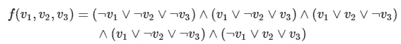
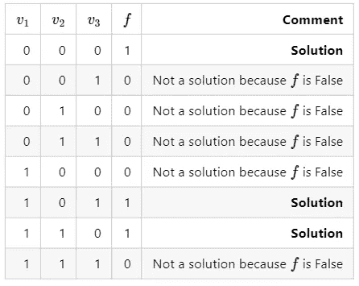
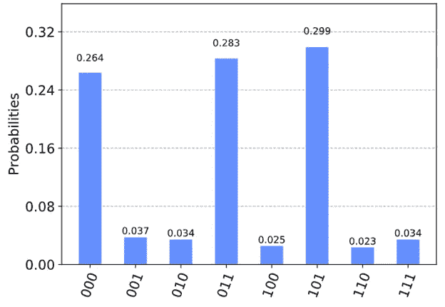

# 用 Grover 算法解决可满足性问题

> 原文：<https://towardsdatascience.com/solving-satisfiability-problems-with-grovers-algorithm-quantum-computing-c9d6c177b966?source=collection_archive---------19----------------------->


迈克尔·泽兹奇在 [Unsplash](https://unsplash.com?utm_source=medium&utm_medium=referral) 上的照片

## 增强机器学习的量子计算

除了数据库搜索， [Grover 的算法](https://medium.com/@uwashingtongold/grovers-algorithm-quantum-computing-1171e826bcfb)还有几个应用，其中之一就是解决可满足性问题。我们将探讨什么是可满足性(SAT)问题，以及它们的解决方案如何记录在 qi skit(IBM 的量子计算 Python 库)中。

# SAT 问题

布尔 SAT 问题是确定布尔函数中是否有某些输入使得输出为真的问题。这是一个搜索问题，这也是为什么 Grover 的算法非常适合解决这些问题。

例如，考虑下面的布尔函数 *f* :



一些符号:

*   是一个布尔 NOT，它翻转下一个布尔值
*   ∨是布尔或
*   ∧是布尔与

因此，函数用文字表示:对于输入 v.1、v.2 和 v.3(其中。表示 sub)，函数 *f* 输出的真值为 NOT v.1 或 NOT v.2 或 NOT v.3，AND，v.1 或 v.2 或 NOT v.3，AND，v.1 或 NOT v.2 或 NOT v.3，AND，NOT v.1 或 v.2 或 v.3。

天真的解决方案是尝试每一种可能的组合(在这个场景中只有 2 = 8，但是随着变量数量的增加会呈指数级飙升)，并检查哪些是解决方案。



使用 Grover 的算法，可以一次查询所有结果。IBM 的量子计算 Python 库 Qiskit 使这个过程变得非常简单。

# Qiskit 中的实现

Qiskit 接受一个描述函数的多行字符串。必须遵循以下语法:

-以“c”开头的行是注释

-第一个非注释行必须采用“p cnf nbvar nbclauses”形式，其中:

*   cnf 表示输入是 CNF 格式的
*   nbvar 是文件中出现的变量的确切数量
*   nbclauses 是文件中子句的确切数目
*   例如，p cnf 3 5 将是上述函数的第一个非注释行。

-对于每个子句，都有一行:

*   正数表示相应的变量
*   负数表示相应变量的负数
*   该行必须以 0 结尾。
*   -1 2 3 0 '对应于子句 v.1 ∨ v.2 ∨ v.3。

```
import numpy **as** np
from qiskit import BasicAer
from qiskit.visualization import plot_histogram
**%config** InlineBackend.figure_format = 'svg'
from qiskit.aqua import QuantumInstance, run_algorithm
from qiskit.aqua.algorithms import Grover
from qiskit.aqua.components.oracles import LogicalExpressionOracle, TruthTableOracle#Input function encoding
input_3sat **=** '''
c example DIMACS-CNF 3-SAT
p cnf 3 5
-1 -2 -3 0
1 -2 3 0
1 2 -3 0
1 -2 -3 0
-1 2 3 0
'''oracle = LogicalExpressionOracle(input_3sat)
grover = Grover(oracle)
backend = BasicAer.get_backend('qasm_simulator')
quantum_instance = QuantumInstance(backend, shots = 1024)
result = grover.run(quantum_instance)
print(result['result'])
```

输出:

```
[1, -2, 3]
```

我们可以画出结果:

```
plot_histogram(result['measurement'])
```



可满足性问题的三个结果是 000、011 和 101。

这是格罗弗算法的许多有趣应用之一——SAT 问题可以适用于几个现实生活中的问题。

如果你喜欢这篇文章，可以看看我的其他文章，比如这篇 [one](/how-ai-could-become-sentient-9246d3e1883b?source=your_stories_page---------------------------) 讨论了本文探索的类似算法如何创造有感知能力的人工智能。