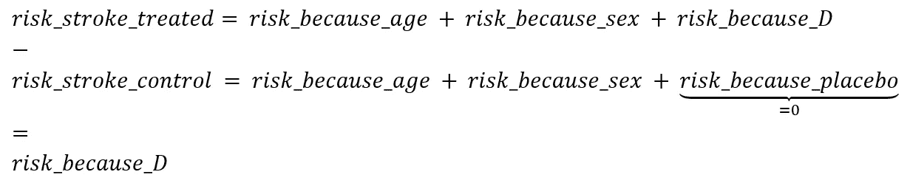
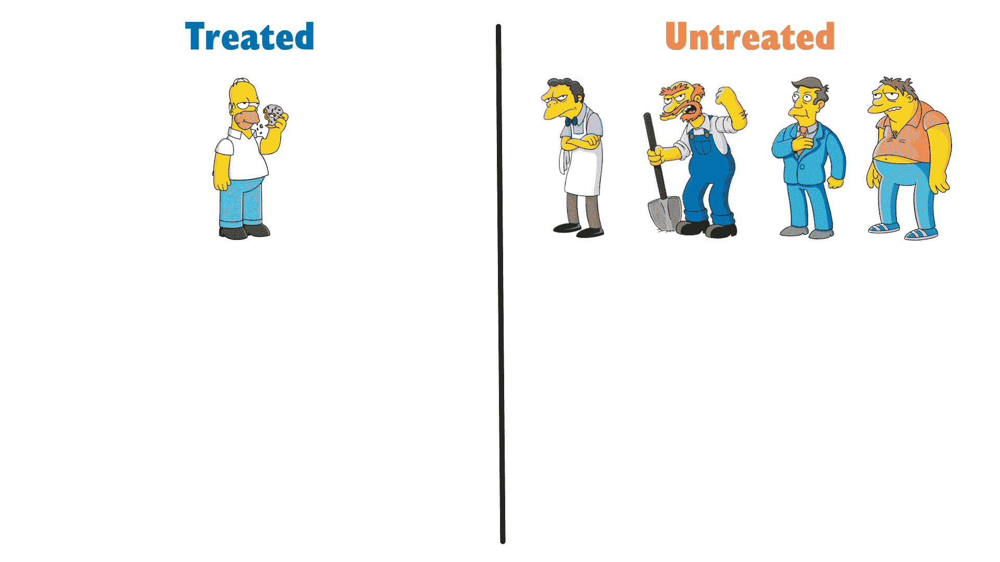
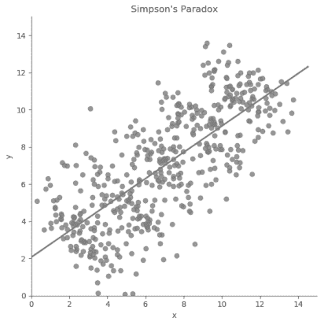
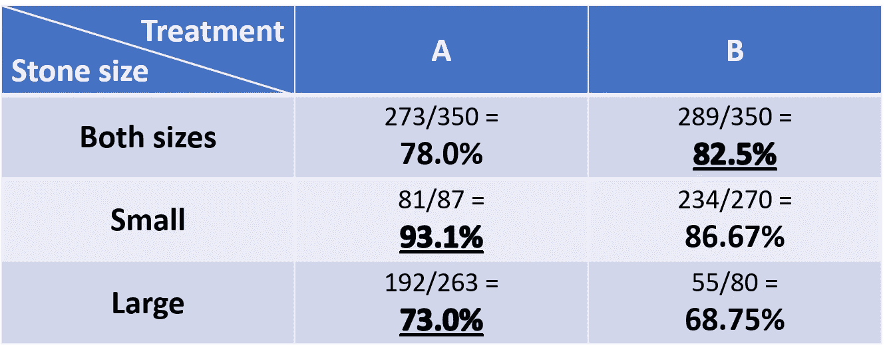
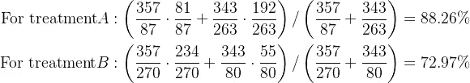
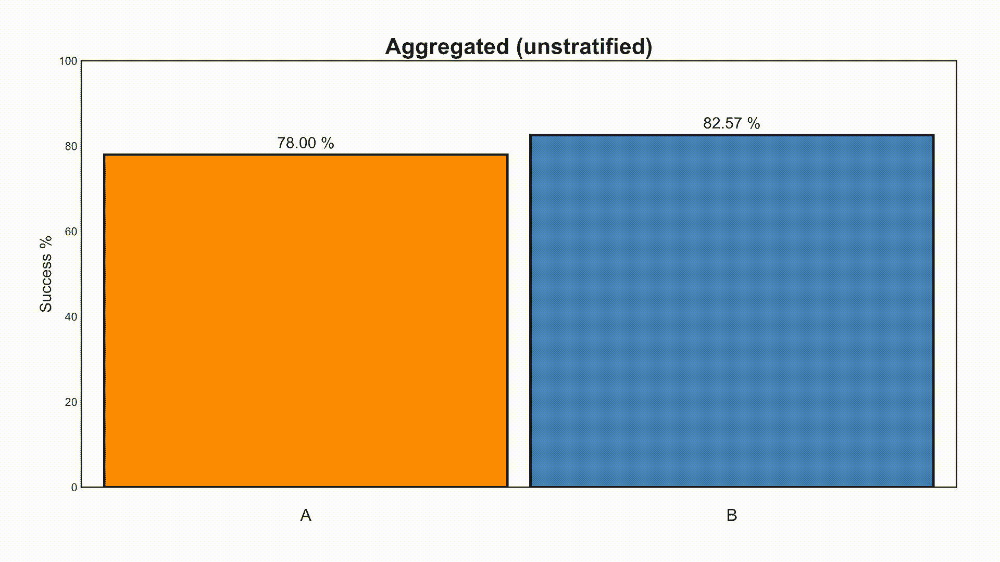

# 用逆概率加权解决辛普森悖论

> 原文：<https://towardsdatascience.com/solving-simpsons-paradox-with-inverse-probability-weighting-79dbb1395597?source=collection_archive---------15----------------------->

## 直观地了解因果推理中最流行的方法是如何工作的，以及它是如何解决统计学中最流行的悖论之一的。

统计学家喜欢用“悖论”这个词来描述简单而不直观的结果，不管这让他们的逻辑学家同事多么不安。为了反驳他们，我们将应用因果关系来解决他们最著名的悖论之一——*辛普森悖论*。

在这篇文章中，我将简要介绍什么是因果推理中的 IPW，并给出它如何工作的简单直觉。然后，我将提供一个来自医学领域的悖论的流行例子，我们将直观地看到 IPW 如何解决它。
想跳过细节吗？滚动到文章末尾。

# 基于 IPW 的因果推理

IPW 是逆概率(有时是倾向)加权的缩写，是一种从数据中估计因果关系的流行方法。这是一个简单而强大的工具来消除混杂或选择偏差。为了保持随意(哈！)，让我们通过一个简单的假设例子来介绍一下，这个例子是估计药物 *D* 对中风风险的因果影响。

为此，我们将绕过随机对照试验。

## 随机对照试验

通常，为了估计药物的因果效应，我们会构建一个随机对照试验(RCT)。这意味着，我们会招募一些人，然后抛硬币，让他们要么服用药物 *D* 要么服用安慰剂(对照)。然后我们将测量每组的中风率，比较它们，并得出结论 *D* 是否增加或减少了患病风险。

我们知道有多种因素导致中风。例如，性别(男性和女性之间的血管系统可以区分)和年龄(随着时间的推移，静脉往往会堵塞)。我们可以简单地比较两组而忽略其他因素的原因与我们应用的随机化有很大关系。
随机化在两组之间形成了相似的年龄和性别分布(平均而言)。因此，当比较各组时，这些变量的贡献相互抵消。各组之间唯一一致不同的参数是他们是否服用了 *D* 或安慰剂，因此，我们观察到的风险差异只能归因于 *D* ，使其成为 *D* 的因果效应。

我们可以将这个简单例子中的中风风险分解成一个稍微简洁的数学符号:

在我们的例子中分解不同的风险因素

我们通过取差值来比较两组之间的风险。由于年龄和性别在两组人群中分布相似，他们在两组人群中造成相同的风险，因此他们相互抵消。由于安慰剂是小糖丸，其贡献为零。于是，我们只剩下:
*risk _ stroke _ treated-risk _ stroke _ control = risk _ cause _ D*。

瞧啊。 *D* 对中风的因果作用。

## 非实验数据的因果效应

然而，进行随机对照试验需要花费金钱和时间(以及其他缺点)。我们还在付学生贷款，我们没有资源进行这样的实验。我们拥有的是数据，因为数据变得越来越便宜，卫生组织很容易收集它们。

来自健康维护组织的这类观察数据的问题是，它不再来自我们良好的实验分布。对我们来说不幸的是(但对我们来说真的很幸运)，**医生不是随机的**。他们根据我们的特征(比如年龄和性别)来分配治疗方案。因此，总的趋势可能是给某些群体开一种药而不开另一种药。在这种情况下，如果我们简单地比较那些服用了 *D* 的人和那些没有服用的人，这些因素的分布不一定相同，因此他们的贡献不再相互抵消。
因此，我们将观察到的“效果”将不再是 *D* 的*因果*效果，而是一个将因果和非因果影响交织在一起的量，本质上是将 *D* 的因果效果与那些其他因素的贡献相混淆。

为了估计真正的因果效应，我们首先需要将这两组进行比较，而使它们进行比较的方法就是因果推理，特别是 IPW 发挥作用的地方。

## 反向概率/倾向加权

现在我们已经设置好了场景，我们终于可以呈现 IPW 是什么了。正如我们所说，IPW 代表反向倾向加权。这是一种通过给每个数据点一个权重来平衡组的方法，因此第一组中特征的加权分布类似于第二组中特征的加权分布。

我们提到过，医生不会随意开药，而是根据病人的特点开药。因此，根据患者的特点，每位患者接受 *D* 处方的可能性不同。这种可能性被称为*治疗倾向*。用数学的方法来说，如果我们把我们的患者特征标为 *X* ，倾向就是患者得到或不得到治疗的概率: *Pr[D|X]* 。一旦我们估算出这个概率来对待，我们赋予的权重就是它的逆: *1/Pr[D|X]* 。

当我们有大量特征时，我们将需要一些机器学习模型来将所有这些高维数据压缩到一个概率标量中。但是为了了解为什么这个过程会导致平衡的人口，让我们举一个简单的例子，比如说一个成年男性。

**IPW 举个简单的例子**

我们的原始人口不平衡，因为未经治疗的成年男性比经过治疗的多。如果我们要比较这些组，我们将无法理清药物和性别的作用，也无法分辨观察到的效果是由于接受治疗还是由于男性。

检查上图中的分布，我们看到我们的群体在男性方面不平衡。因此，如果我们简单地计算每组的平均风险，我们将不能说我们看到的差异是由于治疗还是仅仅因为是男性。
我们的第一步是计算每个人在他们实际被分配到的群体中的概率。我们总共有 5 个人，1 个接受了治疗，4 个没有。因此，我们可以做一个简单的估计，男性得到药物的概率是⅕，男性得不到药物的概率是⅘.

我们的第二步是逆转这些概率，并分配给每个人。因此，荷马的权重为 5，而莫伊、巴尼、场地管理员威利和斯金纳校长的权重分别为 5/4。我们基本上创建了一个伪种群，其中有 5 个本垒打，每种都有 5/4 未处理的——这意味着我们有一个 Moe，一个 Barney，一个 Willie，一个 Skinner，以及另一个混血儿。总共有 5 个治疗组和 5 个对照组。

我们的伪种群包括相似数量的成年雄性(注意复制的荷马和未处理的杂种)，所以当比较各组时——成年雄性的影响将自我抵消，我们将只剩下治疗的影响。

看到我们能够创造一个群体，其中男性在群体中平均分布。
当然，在现实生活中，需要处理的功能不止一个，这就是为什么我们需要一个模型来估计 *Pr[D|X]* 。

TL；博士:

IPW 取不平衡人口，造平衡伪人口。(图片由作者提供，辛普森一家组件来自维基百科，合理使用)

# 辛普森悖论

到现在为止，你可能已经有了一个预感，我们可以如何使用 IPW 来解决辛普森悖论，但在此之前，让我们简要介绍一下这个悖论是怎么回事。Blyte 创造的术语“辛普森悖论”是以第一个明确指出这个问题的统计学家 Edward Simpson 命名的。简而言之，当在检查其组成子群体时，总体平均趋势被逆转或抵消时，悖论就发生了。
连续案例中的直觉非常清晰，如这张 GIF 所示:

直观地了解总体人口中的趋势如何在组成子人口中逆转。(图片由作者提供)

为了更好地理解这一现象，让我们来看一个[现实世界的例子](https://www.ncbi.nlm.nih.gov/pmc/articles/PMC1339981/) :
根据这篇论文，我们有两种治疗肾结石的方法。要么采用开放式手术( *A* )要么采用使用冲击波的新的非侵入性方法( *B* )。我们收集了 700 人的医疗记录，每个治疗组 350 人，并比较他们的成功率。

为了得出哪种方法更好的结论，我们比较了组 *A* 和组 *B* 的成功率，发现它们分别为 78%和 82.5%。天真地，我们想推断出 *B* 更好(4.5%)，但是我们记得我们在某处读到过(哪里？)医生不是随机的。我们怀疑患者接受某种治疗而不接受另一种治疗可能有某种原因，这可能与他们以前的医疗状况有关。

你瞧，当我们根据结石大小来划分患者时，我们看到了不同的趋势。突然之间，小结石和大结石的治愈率分别为 93.1%和 73%。

平均过程可能掩盖了一些重要信息，所以让我们看看原始数据。
治疗 *A* 小结石成功率 81/87 (93.1%)，大结石成功率 192/263 (73%)。同时，治疗方法 *B* 对小结石的成功率为 234/270 (86.67%)，对大结石的成功率为 55/80 (68.75%)。

**B** 整体成功率较好，但 **A** 在小、大肾结石均较好。发生这种情况是因为 **B** 得到了大多数容易的案件(小石头)，而 **A** 得到了大多数困难的案件。

你看到分母隐藏了什么吗？游戏被操纵了。 *B* 得到大部分容易的案件(小石头)，而 *A* 得到大部分困难的案件。患者的严重程度在各治疗组之间的分布并不相似。由于较大的结石也有较低的成功机会——因为它们更难处理，我们发现自己处于一种有偏见的情况下，比较治疗是不公平的。这在日常场景中很常见，因为当医生遇到更棘手的病例(较大的结石)时，他们会倾向于使用更大的枪(开放式手术)。

一般来说，影响治疗分配和结果的变量被称为**混杂变量**。在我们的案例中，患者的严重程度，以其肾结石的大小来表示，是一个混杂因素，因为它增加了被分配到更严格的医疗程序(更可能有效的手术)的可能性，也增加了失败的风险(结石没有被完全清除)。

在这篇文章的最后，我们将使用 IPW 解决治疗组和对照组在特征(结石大小的严重程度)上的差异。

# 利用 IPW 解决辛普森悖论

我们有一个不平衡的情况，而如果你有小结石，得到治疗的概率是 87/(87+270)=24.4%，如果你有大结石，得到治疗的概率是 263/(263+80)=76.67%。类似地，对于处理 *B* ，它是 270/(270+87)=75.6%和 80/(80+263)=23.33%。

因此，我们可以很容易地通过取每个组中人的倒分数来计算每个个体的权重(由于我们只看二进制石头大小，所以我们的个体在他们的组内基本上是相同的，所以我们可以使用组级权重)。要计算无偏的成功风险，我们只需计算由以下权重加权的成功风险的平均值:

计算 IP 加权平均值: ***1/Pr[D|X] Pr[Y|D，X]***

我们看到，现在，即使我们合计石头的大小，处理 *A* 也比 *B* 好(大约 15%)。这与*和*在每一个小组中都更好是一致的，所以我们之前看到的逆转不再存在。

我们已经解决了辛普森悖论。

TL；以防你一个字都没看过，下面是整篇文章的 GIF 摘要:

直观地分解辛普森悖论，并通过创建一个由 IP 权重加权的平均风险来解决它。作者的《可视化》是基于我记得在推特上看到的[约翰·伯恩-默多克](https://medium.com/u/751b6306bd5d?source=post_page-----79dbb1395597--------------------------------)的一篇类似文章。