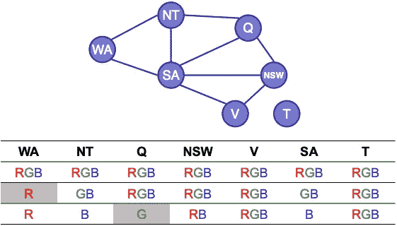

# 用人工智能解数独

> 原文：<https://towardsdatascience.com/solving-sudoku-with-ai-d6008993c7de?source=collection_archive---------12----------------------->

我目前是我的导师[什洛莫·齐尔伯斯坦](https://groups.cs.umass.edu/shlomo/)在[马萨诸塞阿姆赫斯特](https://www.cics.umass.edu/)大学教授的[研究生级人工智能课程](http://rbr.cs.umass.edu/shlomo/classes/683/index.html)的助教。在一项家庭作业中，学生们必须写一些代码来解决数独难题。这意味着我最近一直在谈论如何使用人工智能算法来解决数独。因为这让我记忆犹新，我想我应该写一篇快速而肮脏的博客文章，讨论我们如何使用简单的人工智能算法来解决数独谜题和类似的游戏。


照片由 [Marijakes](https://pixabay.com/users/marijakes-14282294/?utm_source=link-attribution&utm_medium=referral&utm_campaign=image&utm_content=4691414) 在 [Pixabay](https://pixabay.com/?utm_source=link-attribution&utm_medium=referral&utm_campaign=image&utm_content=4691414) 上拍摄

## 地图着色问题

在开始数独之前，让我们回顾一下人工智能中的一个传统例子，这是在这一点上的一个通过仪式。假设我们必须用不同的颜色给一张地图着色，没有两个相邻的区域可以有相同的颜色。简而言之，我们只需要给地图上的每个区域涂上不同的颜色，相邻的区域不能有相同的颜色。例如，假设我们想给澳大利亚这个几乎在每个人工智能类中都使用的典型例子着色:


现在，如果我们必须给这张地图涂上三种不同的颜色，比如红色、绿色和蓝色，这将是我们地图着色问题的有效解决方案:


顺便提一下，要将此地图转换为算法可以理解的表示形式，我们可以将其转换为一个图形，其中每个节点表示一个区域，每个边表示两个区域是否相邻，如下所示:


注意塔斯马尼亚*地区*是如何不与任何其他地区相连的。这意味着我们可以随心所欲地给这个区域上色。另一方面，由于南澳大利亚地区与其他几个地区相连，我们必须小心。

## 约束满足问题

更广泛地说，我们在这里讨论的地图着色问题是我们在人工智能中称之为**约束满足问题**的一个实例。不过我们通常称它为 **CSP** 。从形式上看，CSP 有几个属性:

*   一组 *n* **变量** *X* = { *X1* ， *X2* ，…， *Xn* }其中每个变量 *X1* 都需要赋值。
*   一组 *n* **域** *D* = { *D1* ， *D2* ，…， *Dn* }其中每个域*Di*= {， *V2* ，…， *Vm* }对于每个变量*都有 *m* 个可能值换句话说，每个变量都有一个定义域，每个定义域都有该变量所有可能的(尽管可能是无效的)值。*
*   一组 *p* **约束** *C* = { *C1* ， *C2* ，…， *Cp* }其中每个约束 *C1* 约束一些变量。

简而言之，我们有一组需要查找值的**变量**，一组告诉我们每个变量所有可能值的**域**，以及一组以某种方式约束值的**约束**。

一旦我们指定了一个 CSP，我们的目标就是找到一个解决方案，为每个变量赋值，同时满足每个约束条件。就是这样！

现在，如果我们回到之前的澳大利亚地图着色问题，我们可以很容易地指定一个 CSP，如下所示:

*   **变量。** *X* = { *WA* ， *NT* ， *SA* ， *Q* ， *NSW* ， *V* ， *T* }。每个变量代表澳大利亚的一个地区。
*   **领域。** *D* = {{ *红色*，*绿色*，*蓝色* }，…，{ *红色*，*绿色*，*蓝色* }。每个域只有红色、绿色和蓝色。
*   **约束。**C= {*WA*！= *NT* ， *WA* ！= *SA* ， *NT* ！= *SA* ， *NT* ！= *Q* ， *SA* ！= *Q* ， *SA* = *新州*， *SA* ！= *Q* ， *SA* ！= *新州*， *SA* ！= *V* ， *Q* ！= *新州*，*新州*！= *V* }。每个约束确保没有相邻区域具有相同的颜色。

## 回溯搜索

虽然我们将地图着色问题表示为 CSP 很棒，但是我们如何解决它呢？这就是回溯搜索的用武之地。回溯搜索只是一种搜索算法，它找到满足 CSP 的一些分配。**在一个非常高的层次上，该算法为每个变量逐个赋值，直到达到违反某个约束的*有效*赋值或*无效*赋值，此时它*回溯*到搜索中还没有违反的地方。**更详细地说，在接受一个 CSP 和一个空赋值作为参数后，回溯搜索是这样做的:

1.  **如果**赋值完成，**返回**赋值。
2.  **从 CSP 中选择**一个*尚未赋值的变量。*
3.  **对于满足约束的变量域中的每个**值，**执行**以下步骤。
4.  **—将**的值添加到赋值中。
5.  **—递归调用**部分赋值的回溯搜索。
6.  **—如果**回溯搜索返回一个有效的赋值，**返回**它。
7.  **—否则**，**从赋值中移除**值。
8.  **返回** *假*。

给你另一个视角，回溯搜索最终只是一个搜索树。搜索树的每一层都与一个变量及其有效值相关联。在搜索树的最后一层，如果可能的话，会有一个赋值，每个变量都被赋予一个有效值。这意味着作业是我们 CSP 的答案。视觉上，我们可以用下面的方式来说明回溯搜索:


如果你对此感兴趣，这里有回溯搜索的伪代码:

```
**function** recursiveBacktrackingSearch(*assignment*, *csp*):
  **if** *assignment*.isComplete():
    **return** *assignment* *variable* = selectUnassignedVariable(*csp*.variables()) **for** **each** *value* **in** orderDomainValues(*csp*.domain()):
    **if** *assignment*.isConsistentWith(*csp*.constraints()):
      *assignment*.add(*variable*, *value*) *result* = recursiveBacktrackingSearch(*assignment*, *csp*) if *result* **is** *false*:
        return *result* *assignment*.remove(*variable*, *value*); **return** *false*
```

就是这样！这会给我们一个解决 CSP 的任务。但是我们能做得更好吗？原来有一些优化让回溯搜索更有效率。现在让我们逐一看一下。

## 变量排序

看一下伪代码中的`selectUnassignedVariable(*csp*.variables())`函数。请注意，我们实际上并没有描述这个函数是如何工作的。*它会随机选择一个未赋值的变量吗？* D *它会以某种顺序选择一个未赋值的变量吗？或者它能做比这两者更复杂的事情？*简而言之，我们可以使用一些试探法来选择我们未赋值的变量。这些试探法通常会切出状态空间的大部分区域(或者通常会被尝试的大量赋值)，使得回溯搜索更快。

第一种试探法叫做**最小剩余值试探法**。顾名思义，这种启发式方法挑选剩余合法值最少的未赋值变量。这使得回溯搜索能够选择很可能很快导致失败的未赋值的值。顺便说一下，它有时被称为**最受约束变量启发式**。不管你怎么称呼它。

*如果有两个未赋值的变量具有相同数量的最小合法值，会发生什么？*这就是**度启发式**的用武之地。如果两个未赋值的变量之间有联系，我们可以简单地选择约束条件最多的未赋值变量。这样做的目的是尽可能减少回溯搜索的分支因子。它也被称为**限制变量最多的启发式算法**。只是脱口而出…

## **值排序**

既然我们已经以更好的方式对未赋值变量进行了排序，我们可以考虑如何对即将被赋值的未赋值变量的值进行排序。在伪代码中，您会看到这发生在`orderDomainValues(*csp*.domain())`函数中。对未赋值变量的值进行排序的一个好方法是使用**最小约束值启发式**。这种试探法只选择排除了受未赋值变量约束的变量的最少选择的值。我们为什么要这么做？排序*变量*的试探法试图尽可能快地导致失败，而排序*值*的试探法旨在为其他未赋值变量提供尽可能多的灵活性，这些变量将在将来被赋值。

## 约束传播

最后但同样重要的是，我们将讨论另一个*真正*重要的改进回溯搜索的方法。考虑以下情况。假设算法刚刚给某个未赋值的变量赋值。这个未赋值的变量反过来又约束了 CSP 中其他未赋值的变量。例如，在地图着色问题中，假设我们将变量*西澳大利亚*标记为红色。这对变量*北领地*和*南部*澳洲意味着什么？意思是他们俩现在不可能都红了。事实上，它们只能是绿色和蓝色。虽然回溯搜索目前没有考虑这种类型的推理，但我们当然可以添加它。当我们添加回溯搜索的能力来修改其他未赋值变量的域，当它给某个变量赋值时，我们实现了我们所说的**约束传播**。

虽然有许多复杂的约束传播形式，但在本文中我们只讨论最简单的一种:**前向检查**。在向前检查中，当某个变量被赋值时，回溯搜索做以下两件事:

1.  它计算与该变量相邻的每个未赋值变量。
2.  它从每个相邻变量的定义域中删除所有与该变量的新值不一致的值。

为了说明这个想法，是时候再次回到地图着色问题上来了。假设回溯搜索*刚好*开始解决地图着色问题。换句话说，回溯搜索还没有给任何变量赋值，就像这样:


假设我们将变量*西澳大利亚*指定为红色。通过使用前向检查，回溯搜索可以修改相邻未赋值变量*北领地*和*南澳大利亚*的域，如下所示。你会注意到，这两个未赋值的相邻变量在它们的定义域中不再有红色。*为什么？*这是因为变量*西澳大利亚*被赋予了红色，这意味着变量*北领地*和*南澳大利亚*不能是红色。


让我们更进一步，将绿色赋给变量*昆士兰*。现在正向检查做什么？它从变量*北领地*、*南澳大利亚*和*新南威尔士*的域中消除了绿色。



让我们谈谈为什么这会使回溯搜索更快。基本上，它做两件事。首先，它会在早期导致失败，因为如果一个未赋值变量的域为空，我们可以立即回溯。第二，它减少了回溯搜索必须尝试的赋值的数量。简单地说，通过从每个未赋值变量的域中消除值，回溯搜索自然要尝试更少的值。

## 数独谜题

终于到了解释如何使用 CSP 解决数独的时候了。令人惊讶的是*超级*容易。像任何 CSP 一样，我们必须提出一组变量、一组域和一组约束。让我们现在做那件事。

**变数。** *X* = { *A1* ， *A2* ，…， *I8* ， *I9* }。数独游戏中的每个单元格都有一个变量，总共有 81 个变量。为了让您了解这个符号的含义，变量 *A1* 只是一个表示第 *A* 行和第 *1* st 列中的单元格的变量。对于任何已经填充了值的单元格，我们将自动将其设置为该值。简单。

**域。** *D* = { *1* ， *2* ， *3* ， *4* ， *5* ， *6* ， *7* ， *8* ， *9* }。对于每个变量的定义域，我们从 1 到 9 的所有数字开始。请记住，随着时间的推移，前向检查会修剪这些域。注意，对于已经有一个数字的单元格，它只有一个只有一个数字的域。

**约束。**我们在这里有三种类型的约束:一种约束表示每个*列*中的所有变量必须不同，每个*行*中的所有变量必须不同，每个*方块*中的所有变量必须不同。没什么太棘手的。让我们在下面形式化这些类型的约束。

1.  **列约束。***all diff*(*A1*， *B1* ， *C1* ， *D1* ， *E1* ， *F1* ， *G1* ， *H1* ， *I1* ，…，AllDiff( 【T72 因为有 9 列，所以总共有 9 列约束。
2.  **行约束。** *AllDiff* ( *A1* ， *A2* ， *A3* ， *A4* ， *A5* ， *A6* ， *A7* ， *A8* ， *A9* ，…， *AllDiff* ( *I1* ，*同样，我们总共有 9 行约束，因为有 9 行。*
3.  **方形约束。***all diff*(*A1*， *A2* ， *A3* ， *B1* ， *B2* ， *B3* ， *C1* ， *C2* ，*C3*……， *AllDiff* ( *令人惊讶的是，我们将有 9 个正方形约束，因为有 9 个正方形。*

一旦将数独定义为 CSP，就大功告成了！你现在所要做的就是将 CSP 输入到你的回溯搜索算法中，以获得任何数独谜题的答案。你也会惊讶它有多快。即使对一个人来说最难的数独谜题也能在不到一秒钟的时间内解决。