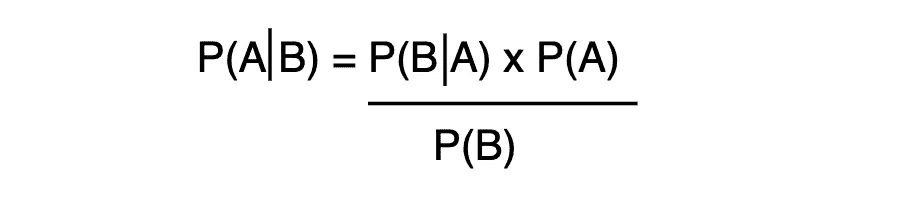

# 用 Bayes 定理解决 Monty Hall 问题

> 原文：<https://towardsdatascience.com/solving-the-monty-hall-problem-with-bayes-theorem-893289953e16?source=collection_archive---------3----------------------->

## 你的直觉会让你在游戏秀上输钱

照片由 [vaun0815](https://unsplash.com/@vaun0815?utm_source=unsplash&utm_medium=referral&utm_content=creditCopyText) 在 [Unsplash](https://unsplash.com/s/photos/3-fancy-doors?utm_source=unsplash&utm_medium=referral&utm_content=creditCopyText) 上拍摄

你在一个名为“让我们做个交易吧”的游戏秀上。你面前有三扇紧闭的门。

每扇门后都有奖品。一扇门有一辆**汽车**，一扇门有**薄荷糖**，一扇门有**肥皂**。你会在你挑的门后面拿到奖品，但是你不知道哪个奖品在哪个门后面。很明显你想要这辆车！

所以你挑**门一个**。

在打开**门 A** 之前，节目主持人蒙蒂·霍尔现在打开**门 B，**露出一块肥皂。然后他问你是否愿意改变你的猜测。你应该吗？

我的直觉告诉我，我是否改变我的猜测并不重要。有两扇门，所以每扇门都有 50%的胜算。不幸的是，对我来说，这是 100%错误的。

这就是著名的蒙蒂霍尔问题。

通过贝叶斯定理，我们可以计算出如果我们坚持使用**门 A** ，或者切换到**门 C** ，赢得汽车的实际几率。

# 贝叶斯定理

贝叶斯定理描述了在一个事件发生时，另一个事件发生的概率。

贝叶斯定理

`A` =一个事件。

`B` =另一个事件。

`P(A|B)` =后验=一个事件发生的概率，假设另一个事件发生。

`P(B|A)` =可能性=事件 B 发生的概率，如果事件 A 发生。

`P(A)` =先验=一个事件发生的概率，在你知道另一个事件是否发生之前。

`P(B)` =归一化常数。

# 贝叶斯定理+蒙蒂霍尔

*注:这里计算中的 A、B、C 是门的名称，不是贝叶斯定理中的 A、B。*

现在让我们在蒙蒂霍尔问题的背景下计算贝叶斯定理的组成部分。

让我们假设**我们选择门 A** ，然后**蒙蒂打开门 B** 。

如果赛车落后于`C`，蒙蒂不会开`C`，所以我们只需要计算两个后验概率:

1.  `P(door=A|opens=B)`，概率`A`正确如果天魔开`B`，
2.  `P(door=C|opens=B)`，概率`C`正确如果天魔开了`B`。

## 先前:P(A)

在我们选门之前，任何一扇门正确的概率是 1/3。奖品在门后随机排列，我们没有其他信息。所以任何一扇门正确的、`P(A)`前的**是**的 1/3** 。**

1.  `P(door=A)`，门`A`包含轿厢的先验概率= 1/3
2.  `P(door=C)`，门`C`包含轿厢的先验概率= 1/3

## 可能性:P(B|A)

如果汽车确实在门`A`后面，那么蒙蒂可以打开门`B`或`C`。所以两者打开的概率都是 50%。

如果汽车确实在门`C`后面，那么蒙蒂只能打开门`B`。他打不开我们选的门。他也打不开门`C`，因为后面有车。

1.  `P(opens=B|door=A)`，如果门`A`正确，则天魔打开门`B`的可能性= 1/2
2.  `P(opens=B|door=C)`如果门`C`正确，则天魔打开门`B`的可能性= 1

## 分子:P(A) x P(B|A)

1.  `P(door=A) x P(opens=B|door=A)`= 1/3×1/2 = 1/6
2.  `P(door=C) x P(opens=B|door=C)`= 1/3×1 = 1/3

## 归一化常数:P(B)

在被分析的事件覆盖所有可能的选项并且不重叠的情况下，我们可以取分子的和。

`P(B)` = 1/6 + 1/3 = 3/6 = 1/2

## 后:P(A|B)

现在我们只需要做剩下的数学运算。

1.  `P(door=A|opens=B)` = (1/6) / (1/2) = 1/3
2.  `P(door=C|opens=B)` = (1/3) / (1/2) = 2/3

如果我们在蒙蒂打开一扇门后换了门，我们就有更高的获胜概率。

如果这是超级反直觉的，我认为记住两条信息是很重要的:

*   蒙蒂需要打开一扇门
*   车在后面，他打不开门

# 结论

我发现这是一个超级有趣的例子，直觉和概率是不一致的。

试着问问人们(尤其是聪明人)如果玩蒙提霍尔问题会怎么做。有时候看他们怎么回答挺好玩的:)