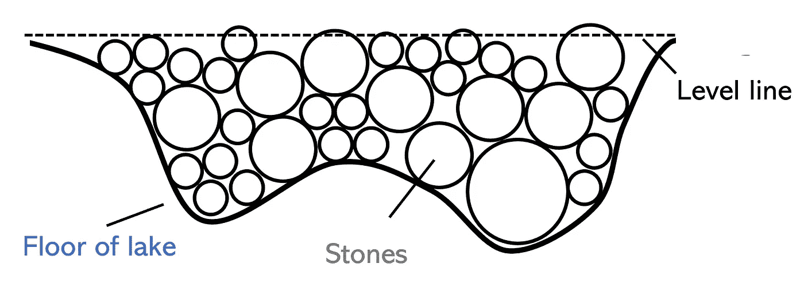

# 有人称之为天才，有人称之为愚蠢:有史以来最有争议的神经网络

> 原文：<https://towardsdatascience.com/some-call-it-genius-others-call-it-stupid-the-most-controversial-neural-network-ever-created-2224ed22795a?source=collection_archive---------6----------------------->

## 极限学习机

有人认为，极限学习机是有史以来最聪明的神经网络发明之一——以至于有一个会议专门研究 ELM 神经网络架构。ELMs 的支持者认为，它可以以指数级更快的训练时间执行标准任务，只需很少的训练示例。另一方面，除了它在机器学习社区中规模不大这一事实之外，它还受到了深度学习专家的大量批评，包括 Yann LeCun，他认为它已经得到了比它应得的更多的宣传和可信度。

大多数情况下，人们似乎认为这是一个有趣的概念。

榆树架构由两层组成；第一个是随机初始化和固定的，而第二个是可训练的。本质上，网络随机地将数据投射到一个新的空间，并执行多元回归(当然，然后通过输出激活函数传递它)。随机投影需要一种降维(或增维)方法，这种方法将随机矩阵乘以输入——尽管这个想法听起来可能很奇怪，但从战略分布中随机抽取实际上可以非常好地工作(正如我们稍后将通过直观的类比看到的)。它应用了一种随机的扭曲，这种扭曲会产生噪音——如果做得正确，这是一种好的方式——并让网络的其余部分适应，从而为学习机会打开了新的大门。

事实上，正是因为这种随机性，极端学习机已经被证明在隐藏层中具有相对较小的节点的情况下，具有[通用逼近定理](https://medium.com/analytics-vidhya/you-dont-understand-neural-networks-until-you-understand-the-universal-approximation-theorem-85b3e7677126)的能力。

事实上，在 20 世纪 80 年代和 90 年代，在神经网络发展的早期领域已经探索了随机投影的想法，在这个名称下——这是一个批评榆树不是新东西的背后的推理；只是用新名字包装的旧研究。许多其他体系结构，如回声状态机和液态状态机，也利用随机跳过连接和其他随机性来源。

然而，ELMs 和其他神经网络架构之间最大的区别可能是它不使用反向传播。相反，由于网络的可训练部分只是一个多元回归，参数的训练方式大致与回归系数的拟合方式相同。这代表了神经网络被认为是训练方式的根本转变。

自传统人工神经网络以来开发的几乎每一个神经网络都通过在网络中前后跳跃信息信号，使用迭代更新(或者称之为调整)进行了优化。因为这种方法已经存在了这么长时间，所以人们必须假设它已经被尝试和测试过是最好的方法，但是研究人员承认标准的反向传播有很多问题，比如训练非常慢或者陷入非常诱人的局部最小值。

另一方面，ELM 使用一个更加数学化的公式来设置权重，在不深入数学的情况下，人们可以认为使用随机层来补偿计算成本更高的细节，否则它将被替换。如果有帮助的话，从技术上来说，非常成功的辍学层是一种随机投影。

> 因为 ELMs 采用了随机性和无反向传播算法，所以它们的训练速度比标准神经网络快得多。
> 
> 另一方面，他们的表现是否更好，则是另一个问题。

有人可能会认为，elm 比标准神经网络更能反映人类的学习方式(尽管两者都很远)，因为它可以只用几个例子非常快速地解决更简单的任务，但迭代神经网络至少需要运行数万个样本才能进行归纳并表现良好。与机器相比，人类可能有其弱点，但他们在学习与示例比率(示例是他们接触到的训练示例的数量)方面的巨大优势是让我们真正聪明的原因。

极限学习机的概念非常简单——简单到有些人可能会说它愚蠢。伟大的计算机科学家和深度学习的先驱 Yann LeCun 宣称，“随机连接第一层几乎是你能做的最愚蠢的事情，”根据这一论点，他列举了更先进的非线性变换向量维数的方法，如 SVM 使用的核方法，这些方法通过反向传播定位得到了进一步加强。

LeCun 说，从本质上来说，榆树本质上是一个 SVM，有一个更糟糕的转换内核；ELM 能够解决的有限范围的问题可能更适合用 SVM 来建模。对此的唯一反驳是使用“随机核”而不是专用核的计算效率，因为 SVM 是众所周知的高功率模型；尽管 ELM 可能带来的性能下降是否值得是另一个值得讨论的问题。

比较 ELMs 和 SVMs 的一种方法。

然而，不管是否喜欢 ELM 根据经验，在简单的神经网络和其他模型中使用随机投影或过滤器已经显示出在各种(现在，被认为是“简单的”)标准训练任务中表现得非常好，比如 MNIST。虽然这些性能不是顶级的，但事实上，一个受到如此多审查、其概念几乎被视为荒谬的架构，可以凭借最先进的神经网络(此外，还有更轻量级的架构和指数级更小的计算量)在排行榜上名列前茅，这至少是一件有趣的事情。

> 为什么使用固定随机连接会有效？

这是一个价值百万美元的问题:很明显，如果 ELM 中随机连接的东西表现得和普通的反向传播神经网络一样好，甚至更好，那么它就是在工作。虽然它的数学是不直观的，但最初的极端学习机器论文的作者黄广斌讲了一个比喻来说明这个概念(根据语言、简洁和绘制深度学习的相似性进行了编辑):

> *你想用石头填满一个湖，直到你得到一个用石头而不是水填满的水平表面，你可以看到空湖的底部，这是一条曲线(代表数据的函数)。工程师仔细计算湖的大小，填充它的石头的大小，以及在优化任务中起作用的许多其他小因素。(优化用于拟合函数的许多参数。)*

往湖里填石头的工作很糟糕，但还可以接受。

> *另一方面，农村的农民炸毁附近的山，并开始将落下的石头扔进或推入湖中。当农村农民捡起一块石头(隐藏层节点)时，他不需要知道湖的大小或石头的大小——他只是随机地扔它们，并将石头分散开来。如果一个地区的岩石开始堆积在地表以上，农民拿起锤子砸碎它(贝塔参数——各种正规化)，平整地表。*
> 
> *当工程师还在计算岩石的高度、体积和湖水的形状时，农夫已经把湖水填满了。对农夫来说，他扔多少石头都没关系:他能更快地完成工作。*

虽然这种类比在不同场景的直接应用中存在一些问题，但它直观地解释了 ELM 的本质以及随机性在模型中所起的作用。ELM 的本质是，天真并不总是一件坏事:更简单的解决方案可能能够更好地解决不太复杂的问题。

# 要点

*   极限学习机使用固定的、随机的第一层和可训练的第二层。这基本上是一个随机预测，然后是多元回归。
*   支持者表示，elm 能够在更简单的场景中(如 MNIST)用很少的例子快速学习，其优势是非常容易编程，并且没有需要选择架构、优化器和损耗等参数的负担。另一方面，反对者认为，在这些情况下，SVM 会更好，ELM 不适合更复杂的问题，它只是一个非常旧的想法的更名。
*   elm 通常在复杂的任务上表现不佳，但是它在较简单的任务上表现良好的事实是一个很好的理由来探索轻量级架构、非反向传播模型拟合和随机投影的世界。至少，极限学习机——或者无论你想给这个想法冠以什么名字——是每个深度学习爱好者都应该知道的一个有趣的想法。

> 你对榆树有什么看法？

所有图片均由作者创作。