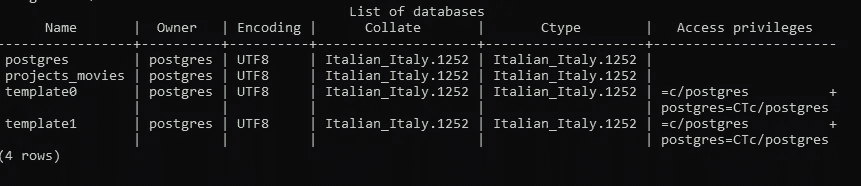
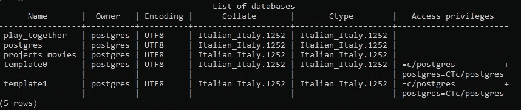
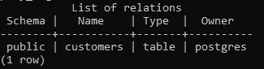
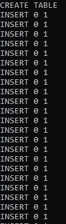
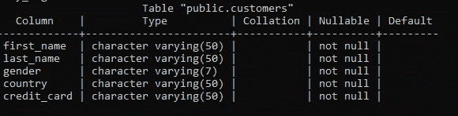
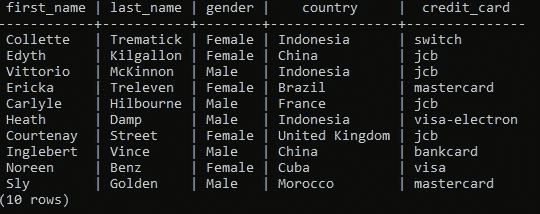
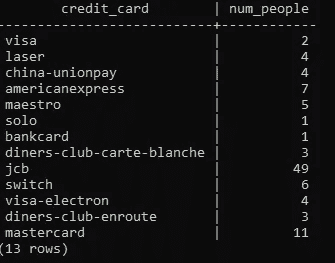
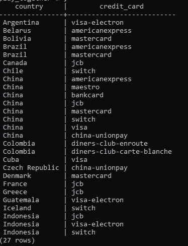

# 开始使用 PostgreSQL 的一些重要概念

> 原文：<https://towardsdatascience.com/some-important-key-concepts-to-start-using-postgresql-c6de63ab683f?source=collection_archive---------29----------------------->

## [带 PostgreSQL 的 SQL 教程](http://towardsdatascience.com/tagged/Sql Tutorial)

## 使用 Shell 命令行学习 PostgreSQL


马尔科·布拉切维奇在 Unsplash 拍摄的照片

## 介绍

PostgreSQL 是最先进的开源关系数据库系统之一。它具有许多功能，可以帮助开发人员构建应用程序，帮助管理员保护数据完整性，并帮助数据分析师和数据科学家管理他们的数据，而不管数据集的大小如何。

此外，PostgreSQL 允许我们定义自己的数据类型，构建自定义函数，用不同的编程语言编写代码，而无需重新编译数据库。

如果你没有 PostgreSQL，你可以在这里轻松下载[。然后，你也可以安装名为 PgAdmin 的 Postgres GUI，你可以在这里找到](https://www.postgresql.org/)。

我个人认为这是当今最好的 RDMS，因为每个人都可以免费下载，并学习以最高的性能水平操作数据。

在这篇文章中，我不会解释如何使用 PostgreSQL 的图形用户界面 PgAdmin，您可以在其中单击、拖动或添加内容。原因是当我们操作或转换数据时，PgAdmin 不允许我们理解 PostgreSQL 背后的逻辑。

因此，我们将使用 Psql 终端的命令行，我还将向您介绍一些基本的查询。

## 第一部分:需要了解的一些基本 shell 命令行

当您在 SQL shell 中时，按 enter 键，直到您必须插入您在 PosgreSQL 安装过程中选择的密码。

```
Server [localhost]:
Database [postgres]:
Port [5432]:
Username [postgres]:
Password for user postgres:_
```

我想向您介绍的第一个命令允许了解数据库列表。

```
postgres =# \l
```

出局:



作者图片

正如您在上面看到的，我们有四个数据库。现在我想创建一个新的数据库，我称之为“play_together”。

```
postgres =# CREATE DATABASE play_together;
```

我们可以使用命令\l 验证**play _ together**是否在数据库列表中。

出局:



作者图片

我们想连接到我们的数据库。这个命令非常简单。

```
postgres =# \c play_together
```

现在要做的第一件事是创建一个表格，如下图所示。

```
play_together=# CREATE TABLE customers (
play_together(# first_name VARCHAR(50),
play_together(# last_name VARCHAR(50),
play_together(# gender VARCHAR(7),
play_together(# country VARCHAR(50),
play_together(# Credit_Card VARCHAR(50) );
```

我们可以使用下面的命令创建一个控件来查看数据库中是否有一个名为 customers 的表。

```
play_together=# \d
```

出局:



作者图片

在这篇文章中，我创建了一个随机数据集，显示每个客户的名、姓、性别、使用的信贷类型和国家。数据是不真实的。你可以从我的 [GitHub](https://github.com/moryba/SQL_Tutorial) 下载文件。

现在我们要插入我随机生成的数据。因此，通过了解数据集的路径，我可以使用这个简单的命令。

```
play_together=#\i /Users/moryb/Desktop/exercise/customers.sql
```

出局:



作者图片

上面，您可以看到表已经创建好了。为了更加确定，您可以使用下面的命令来显示我们的表的特征。

```
play_together=# \d customers
```

出局:



作者图片

## 第二部分:一些基本的 SQL 语句来概述我们的数据

SQL 是一种非常容易学习的语言。使用 SQL，我们可以读取、操作和更改数据。此外，SQL 允许我们直接访问数据的存储位置。

在这一步中，我们希望对我们的表有一个概述。一个简单的方法是观察前 10 行。所以:

```
play_together=# SELECT * FROM customers
play_together-# LIMIT 10;
```

出局:



作者图片

然后，我们需要知道使用维萨卡和万事达卡的人。

```
play_together=# SELECT * FROM customers
play_together-# WHERE credit_card IN (‘visa’,’mastercard’) ;
```

出局:


作者图片

## 第三部分:介绍分组依据、选择区别和排序依据

假设我们想知道有多少人使用特定类型的卡。这里，我们可以使用 Group By。

```
play_together=# SELECT credit_card, COUNT(last_name) AS num_people play_together=#FROM customers
play_together-# GROUP BY credit_card;
```

出局:



作者图片

现在我们知道大多数人使用 JBC 卡。

了解每个国家使用哪种类型的卡也很有趣。解决这个问题的一个简单方法是使用 SELECT DISTINCT 和 ORDER BY。

```
play_together=# SELECT DISTINCT country, credit_card FROM customers
play_together-# ORDER BY country
play_together-# LIMIT 27;
```

出局:



作者图片

## 结论

SQL 是一种对数据分析师或数据科学家非常有用的语言，通过 PostgreSQL，您可以真正在最高级别上执行查询。

本文是一系列文章的第一部分，在这些文章中，我将逐步向您展示 SQL 中使用的一些强大的技术。

在下一篇文章的[中，我不仅将向您介绍其他 SQL 语句，还将介绍主键和外键的概念，这些概念对于理解实体关系图的有用性以及能够处理多个表非常重要。所以，敬请期待！](/working-with-multiple-tables-thanks-to-sql-and-erd-9cb5dcb99228)

我们也可以在我的[电报群**数据科学新手群中取得联系。**](https://t.me/DataScienceForBeginners)