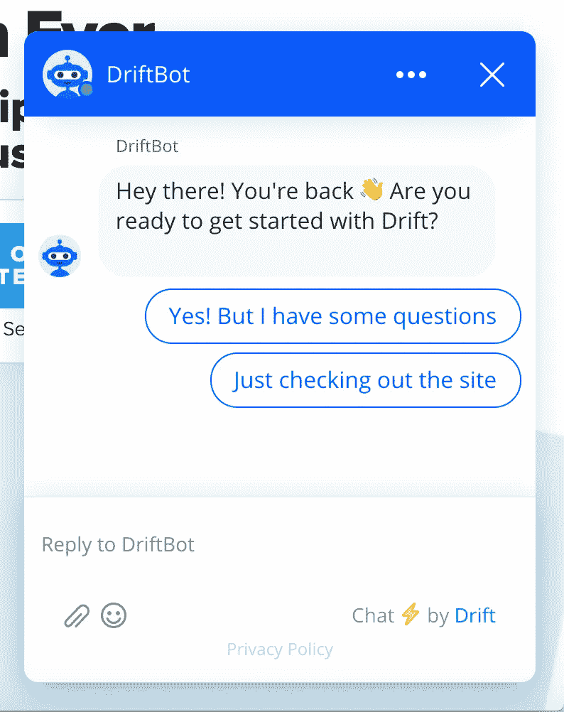

# 有些交互应该用 AI 自动完成。有些不应该。

> 原文：<https://towardsdatascience.com/some-interactions-should-be-automated-with-ai-some-shouldnt-a88c4373cced?source=collection_archive---------61----------------------->

## 意见

## 鉴于失业率飙升，我们还需要销售和支持自动化技术吗

图片由[苏进·索曼](https://pixabay.com/users/sujins-8495731/?utm_source=link-attribution&amp;utm_medium=referral&amp;utm_campaign=image&amp;utm_content=3262759)从[皮克斯拜](https://pixabay.com/?utm_source=link-attribution&amp;utm_medium=referral&amp;utm_campaign=image&amp;utm_content=3262759)拍摄

大多数工程师都有一个根深蒂固的信念，那就是如果你能编写代码来实现自动化，那么你就应该这么做(懒惰的程序员模式)。在产品领导者中，如果你把代码捆绑到产品中，人们会购买它。**但以我的经验来看，往往不是这样。**

我最近推出了面向中型企业的开放领域问答产品。它使用 [transformer networks](/tinybert-for-search-10x-faster-and-20x-smaller-than-bert-74cd1b6b5aec) 来回答网站内容中的基本客户问题，为销售和支持人员节省时间。

从表面上看，这似乎很棒——时间就是金钱，对吗？如果你的顾客能更快地得到他们的问题的答案，那么他们不是更快乐的顾客吗？虽然我们采访的一些潜在合作伙伴证实了这一假设，**对于许多中型公司来说，回答大量的客户问题并不是一个真正的问题。**

这些公司有足够多的员工来为销售或支持提供定制的响应，这些人类的响应往往比当前人工智能技术提供的响应更好。下面，我将更深入地探讨自动化销售和支持所遇到的具体挑战。

# 销售

www.drift.com 截图

在销售方面，许多公司使用像 [Drift](https://www.drift.com/) 这样的工具作为与想要交谈的潜在客户互动的第一手段。这些基本上是脚本形式，收集访问者的电子邮件和意图，并将它们发送到销售漏斗的正确部分。这种解决方案的根本问题是，它必须手动管理和更新，并且不允许访问者探索非常有限的流量之外的主题，即使网站上有关于这些主题的公开内容。一些公司甚至保留一名全职员工，只是为了让他们跟上时代。

从工程师的角度来看，目前的产品似乎已经成熟，可以用人工智能来颠覆——但从最终会购买它的销售或营销副总裁的角度来看呢？**根据我的经验，我们的这位副总裁朋友在转向人工智能时会遇到两个关键问题:**

## 无法控制互动的每个方面

从具有关键字映射和预定义规则的确定性系统到基于概率性机器学习的系统的转变意味着许多人还没有准备好的技术思维的根本转变。允许算法从你给它们的信息之外获取信息并生成新答案的能力有一个天然的缺陷，那就是不能保证这些答案会是什么。虽然绝大多数(95%以上)的回答对最好的 ML 系统来说可能是好的，但这对我们的营销副总裁朋友来说可能还不够。

## 失去个人风格

失去个人魅力的第二个问题更加不言自明。**达成交易和销售软件(尤其是 B2B)几乎完全是为了发展关系，这是人工智能可能永远做不到的。**

**在当前的市场中，人们渴望工作，那么为什么我们的营销副总裁不应该雇用他们来销售软件呢？他们有可能比现在的人工智能做得更好，尤其是如果你能在电话上找到他们。如果收到的查询量太大，您的团队无法处理，这种情况就会发生，但这是一个好问题(如果他们是合格的销售线索),这意味着您可能有足够的资金来雇佣更多的销售助理。**

## 核查/监管

此外，某些行业(如人力资源软件)需要在早期阶段进行人工干预，以验证线索的合规性并避免欺诈。在许多情况下，人工智能可以实现这一点，但需要更大的信任，这进一步阻碍了采用。

# 支持

自动化支持流程的人工智能技术比销售人工智能研究得更好，也更成熟。然而，他们仍然面临着一些相同的收养问题。首先，让我们看看我们可以尝试自动化的 3 种主要类型的支持问题:*简单*、*困难*和*需要行动*。

让我们把简单的问题定义为普通人可以很容易地在谷歌或网站上找到的东西。其他一切都是长尾“硬”问题，可能需要综合多个来源和/或客户不具备的知识。最后，让我们区分需要代表支持代表采取*行动*的支持请求和仅需要响应的支持请求。

## 简单的问题

通过采用基于变压器的排名和问答技术，简单的问题可以得到高精度的回答，就像谷歌最近开始在搜索结果顶部或他们的[苏格拉底](https://apps.apple.com/us/app/socratic-by-google/id1014164514)应用程序中使用答案框一样。这些结果来自两个*结构化数据*来源(例如，“奥巴马多大了？”)和*非结构化数据*(答案是文本形式的段落的一部分的任何东西)。

接下来的挑战是将企业信息转化为知识库，就像谷歌在互联网上所做的那样。基础设施的规模和成本可能会成为一个问题，因为一些算法需要非常大的模型，这些模型需要昂贵的 GPU 或 TPU 来运行。

## 难题和需要私人数据的问题

难题需要对来自多个来源的信息进行推理，以综合出答案。他们可能还需要关于特定客户的知识或通过工作经验获得的知识。

以下是技术支持领域的一些示例:

> “我的云虚拟机 id #2345 刚刚崩溃，是什么导致的？”
> 
> “当我运行以下命令时，在一个具有 8gb ram 和 2 个 vCPUs 的 aws VM 上，java/ spark 内存不足:…”

当谈到像这样的技术支持问题时，在栈溢出和谷歌上查找类似的问题是目前最好的方法，据我所知没有人工智能更好(尽管 IBM 的 [TechQA 数据集可能会改变这一点)。](https://leaderboard.techqa.us-east.containers.appdomain.cloud/#)

类似地，我们可以想象银行的硬性支持问题:“我的账户的取款限额是多少？”为了回答这个问题，人工智能代理必须查找客户的账户类型，然后访问取款限额。如果这是一个足够常见的问题，那么可以使用类似于 [dialogflow](https://dialogflow.com/) 的东西来构建一个定制工具来回答这个问题或许多其他问题。但是这种解决方案扩展性很差，因为每家银行都必须雇佣开发人员来构建自己的定制代理，而且它似乎只对大公司有意义。

## 需要采取的行动

最后，有些支持请求不仅需要响应，还需要代表支持代理的操作项。例如，航空公司的支持代理可能会被问到“您能取消我的航班预订吗？”这可以通过如上所述的定制工具来实现，但是存在认证请求以防止滥用的额外障碍。

## AI 最终会自动化掉大部分销售和支持吗？

我认为支持是肯定的，销售是否定的。理论上，几乎所有的支持问题都可以由足够先进的人工智能来回答。另一方面，销售更多的是建立关系，而不是回答关于产品或服务的问题。我怀疑人工智能是否会提供这种东西。

**此外，取消销售职位有什么意义。**一个没有销售团队的世界将会是一个人们购买更少的世界，这将是经济上的一种倒退。然而，一个不需要支持团队的世界将会是一个事情按照它们应该的方式运行的世界。