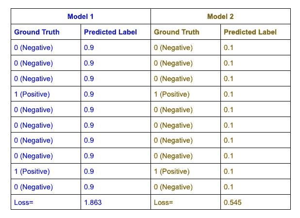
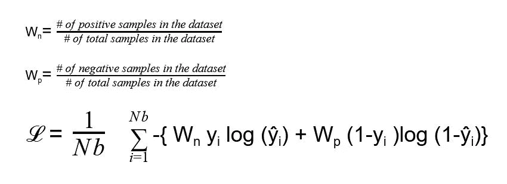

# 构建医学诊断人工智能模型的一些关键挑战

> 原文：<https://towardsdatascience.com/some-key-challenges-in-building-an-ai-model-for-medical-diagnosis-63f7438f14a?source=collection_archive---------36----------------------->

## *在医学中使用人工智能的初学者指南*

图片:[哈尔·盖特伍德](https://unsplash.com/@halacious)

目前，由于易于访问大量数据以及更快处理器的创新，人工智能正越来越受欢迎。在人工智能的所有应用领域中，医疗部门是最重要的领域之一，可以对人类产生许多有益的影响。随着人工智能的不断发展，它在医疗领域的可能性将是无限的。

人工智能在医疗领域的一个重要用途是在医疗诊断问题上。这个领域正在进行大量的研究，一些模型表现得像一群专家一样准确，显示出有希望的结果。目前，深度学习模型将无法取代医生，但它将能够向用户指示是否应该检查特定的问题。与其他典型的计算机视觉问题不同，关于医学数据集的模型的训练过程面临一些挑战。一些关键挑战是:

1.  **阶层失衡**

在正常的深度学习问题中，数据集通常包含每个类的几乎等量的数据。但是，在医学数据集中，数据的分布通常反映了特定疾病在人群中的分布(患病率),在大多数情况下为 0-10%。

由于数据集不平衡，损失函数变得更加专注于正确预测具有更多样本的类。因此，该模型将产生大量的假阴性输出，对于一种罕见疾病的诊断来说，这是一个可怕的场景。

由于数据集中的类别不平衡，两个同样简单的模型具有不同的训练损失(图片由作者提供)

图中显示了两种模型。两个人都一样幼稚。模型 1 预测每个样本为正，模型 2 预测每个样本为负。但是我们可以从损失函数中看到，当模型 2 预测每个样本为负时，它具有 4 倍低的成本函数。但是，这两个批次的成本应该是相同的。

2.**小数据集**

关于计算机视觉的典型深度学习问题伴随着大量数据。由于神经网络模型需要大量数据，因此大量数据有助于模型解决复杂的分类问题。但是，与正常数据集相比，医学数据的可用性是有限的。由于其隐私的性质，很难容易地收集大量的医疗数据。

**这些问题的一些可能的解决方案:**

1.  类别不平衡问题可以通过使用加权损失函数来解决。在计算每个样品的损失时，应乘以不同的重量，该重量与其在批次中的出现次数成反比。如果我们有一批 10 个样本，其中 7 个样本为阴性，3 个样本为阳性。在计算阴性样品的损失时，应乘以 3/10。同样，在计算阳性样本损失时，应乘以 7/10。所以，

这个过程激励模型给予每个类同等的优先权，而不管它们出现的频率。

另一种可能的解决方案是对少数类的数据进行过采样，对多数类的数据进行欠采样，使得在单个批次中，每个类的样本数量相等。因此，在这种方法中不需要调整损失函数。

2.小数据集的问题可以通过两种不同的过程来解决:

(I)深度学习模型的较低层通常识别对象的小的一般特征(边缘、曲线等)。互联网上有许多模型，这些模型是根据数百万图像数据预先训练的。使用我们的小数据集，预训练模型的权重可用于微调上层。这个过程叫做迁移学习。

(ii)使用数据扩充，可以通过对图像进行适当的变换来增加数据量。它防止模型记住不必要的特征，这在用小数据集训练的模型中是常见的。

在通过考虑上述挑战来训练模型之后，该模型将在其测试期间面临一些新的挑战。在评估医疗诊断模型的准确性时，必须考虑以下几点:

1.  患者可能多次去医院进行测试，并且他们的数据可以多次存储在数据库中。在将这些数据分成训练集、验证集和测试集的过程中，同一患者的样本可能会出现在不同的数据集中。这会导致数据泄露，并给模型一种错误的准确性感觉。在分割数据集时，应考虑到训练、验证和测试集不包含相同的患者样本。
2.  假设，在一个数据集中，有 80%的负样本和 20%的正样本。该模型训练得很差，对每个输入只输出 0(负)。如果数据集被随机分割，测试集也将包含不均匀(80–20)分布的阴性和阳性样本。模型的测试准确率会是 80%，这是不成立的。因此，必须仔细考虑，以使测试集(和验证集)的样本均匀分布在各个类中，从而使测试准确性反映模型的实际性能。但是，这将在训练集中产生更多的不平衡，这可以通过加权损失函数或训练数据的过采样/欠采样来减轻。
3.  在医学数据集中，有一个选择基础事实的问题。由于数据集是由人或测试(也有一定程度的不准确性)标记的，因此模型的准确性可以与人和测试一样好。因此，在选择这些基本事实时应该仔细考虑。地面实况可以通过以下方式选择:

(I)取得一组专家的一致意见，并将他们的集体决定作为基本事实。也可以通过听取多位专家的意见并以多数人的意见作为地面事实来选择。

(二)可以进行更明确的测试，以提高地面实况的可靠性。例如，X 射线的诊断可以通过做 CT 扫描来进一步验证。但是这些测试是昂贵的，并且不总是可用于相同的样本。因此，选项(I)主要用于建立地面真相。

很多深度学习爱好者，他们正在进行他们的第一个医疗诊断项目，在工作时面临这些问题。我希望这篇文章能帮助他们更有效地构建和解决他们的深度学习项目。