# 机器学习项目的一些策略

> 原文：<https://towardsdatascience.com/some-strategies-for-machine-learning-projects-5f2f32c34635?source=collection_archive---------47----------------------->

## 错误分析可以帮助您提高系统性能

本文将总结一些机器学习项目的策略。首先，我们将说明为什么我们需要机器学习策略的原因。其次，我们将根据系统的方差和偏差，为您提供一些改进系统性能方向的见解。第三，我们将进行错误分析，这需要人工检查错误。此外，我们将介绍机器学习中常用的一些其他方法，如不匹配训练、迁移学习和多任务学习。最后，我们还将给出一些训练神经网络的技巧，如调整超参数和选择训练、开发/测试数据集。

# **1。为什么我们需要机器学习的策略？**

例如，我们训练一个识别猫的模型，得到 90%的准确率。与人类水平的性能相比，人类水平的性能可以达到接近 100%的准确性，因为人类很容易识别猫，这个结果还不够好。那么我们能做些什么来提高性能呢？

有很多想法你可以尝试，例如，

1.  收集更多数据。
2.  收集更多样化的训练集。
3.  用梯度下降训练算法。
4.  尝试其他优化算法，如 Adam，而不是梯度下降。
5.  尝试更大或更小的网络。
6.  试试转正，退学。
7.  更改网络架构，例如，使用不同的激活功能或更改隐藏单元的数量。

问题是走哪条路？

由[好奇记者名单](http://www.curiousjourneylist.com/wp_quiz/what-kind-of-traveler-are-you/which-way-to-go/)上的[拉拉](http://www.curiousjourneylist.com/author/lara/)撰写

这里我们需要策略，以便**更有效地提高机器学习性能****。因为如果我们在错误的方向上努力，我们就不能取得很大的进步，浪费很多时间。与此同时，我们需要在我们选择的方向上获得一些期望，例如，精确度可以提高多少。我们可以做的第一件事是调查培训和开发错误，以便找到改进模型性能的方向。**

# ****2。提高机器学习系统性能的方向****

## ****2.1 方差、偏差和“可避免偏差”的定义****

**让我们首先回顾方差、偏差的一些定义，并介绍吴恩达定义的“可避免偏差”[1]的新终结。**

**首先，**方差**是指**训练误差**和**开发误差**之间的差值。这告诉你你的算法是否能够从训练集推广到开发集。**

**其次，**偏差**是指将**训练误差**与 **0%** 进行比较。这是对偏差的估计。但是在大多数情况下，即使贝叶斯误差不为零，也不可能得到 0%的误差。**

**第三，吴恩达首先提出的**“可避免的偏见”**。因为将机器学习系统与人类水平的性能进行比较是很自然的。通常，人的水平误差可以用作贝叶斯误差的近似值。“可避免的偏差”是**训练误差**和**贝叶斯误差**之间的差异。这三个定义可以归纳如下:**

**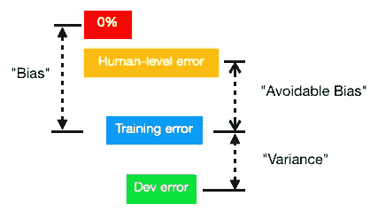**

**差异、偏差和“可避免的偏差”**

**对可避免的偏差和方差有一个好的估计有助于做出更好的决定:是关注**方差减少**策略还是**偏差减少**策略。**

## ****2.2 差异减少策略****

**就像上面“识别一只猫”的例子，假设人的水平误差是 1%，训练误差是 1%，dev 误差是 5%，那么提高性能的方向是什么？**

**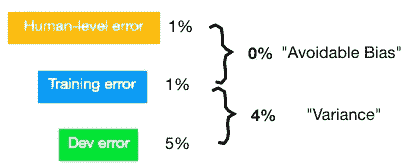**

**高方差**

**在本例中，最好关注方差减少，因为偏差为 0%，方差为 4%。高方差意味着训练集性能不能很好地推广到开发/测试集。有如下几种减少高方差的方法，**

1.  **收集更多数据。**
2.  **正则化，如 l2 正则化，辍学，数据论证。**
3.  **尝试各种神经网络架构/参数搜索。**

## ****2.3 偏差减少策略****

**假设人因误差为 1%，训练误差为 5%，dev 误差为 6%，那么提高系统性能的方向是什么？**

****

**高偏差**

**最好先做**偏倚缩减**，因为偏倚是 4%，方差只有 1%。大偏差意味着机器学习系统不能很好地适应训练集。**

**有几种方法可以减少偏差，**

1.  **在更大的模型上训练。**
2.  **训练更长/更好的优化算法。**
3.  **尝试其他神经网络架构或参数。例如，你可以试试 RNN 或 CNN。**

**对机器学习中的偏差和差异有一个好的想法是很重要的，因为“在如何提高你的机器学习系统的性能方面，它可以帮助你比许多机器学习团队更加**高效、系统和战略性**”[1]。**

# ****3。错误分析****

## ****3.1 手动检查错误****

**更常见的是，如果偏差很大，这意味着模型不能像人类一样完成任务，而你想改进它，你需要手动**检查你的算法正在犯的错误。这可以让你知道下一步该做什么。这个过程叫做误差分析。****

**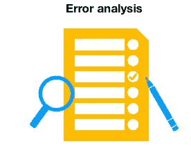**

**就像上面“识别一只猫”的例子一样，假设你已经达到了 90%的准确率，或者相当于你的开发集上 10%的错误，你想知道什么在开发集上被错误地分类为一只猫。然后你可以收集 100 个(例如)**贴错标签的例子**，手动检查。只需列出被错误分类的真实类别，并得到下表，**

**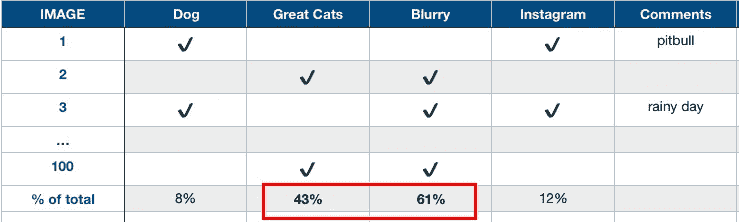**

**把误识别的图像统计起来之后，就很清楚的看到每一类的百分比了。显然，在这个例子中，很多错误是在**模糊的图像**和**巨大的猫图像**上犯的。因此，如果您能在模糊图像或出色的猫图像中做得更好，您的模型性能可以得到更大的提高。回想一下，dev set 的误差为 10%，因此误差可能会降低 6.1%或 4.3%。而无论你在狗或 Instagram 上做得多好，误差也只能减少 0.8%或 1.2%。**

**这个过程的结论给你一个估计，在这些不同类别的错误中，每一个都是有价值的。性能提升的幅度是有上限的。这并没有给你一个严格的数学公式来告诉你该做什么，但它给了你一种追求最佳选择的感觉。**

**对于这个例子，也许你可以收集更多关于大型猫科动物的数据，或者进行增强，以满足模糊图像的需求。**

**此外，您还可以在上面的错误分析表中生成新的错误类别。例如，如果您浏览示例，发现有许多 Snapchat 过滤器也搞乱了分类器，您可以在此过程中创建新的类别。它给你新方向的灵感。**

## ****3.2 错误标记的数据****

**还会发生数据被贴标签者贴错标签的情况。那我们能拿这个错误怎么办？**

**事实证明，深度学习算法对训练集中的随机错误具有鲁棒性。如果数据被标注者意外地错误标注，这可能是好的，只要总数据集足够大并且这些错误标注数据的百分比不太高，就让错误保持原样，而不需要花费太多时间来修复它。**

**当谈到评估开发/测试集时，我们可以像以前一样通过将它作为一个类别添加到错误分析表中并对其进行计数来分析错误。**

**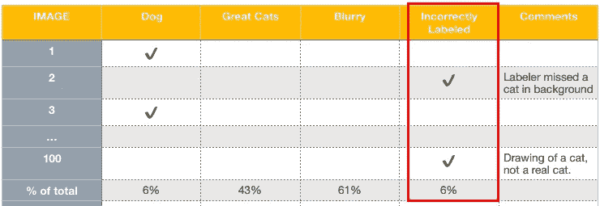**

**在对错误标记的错误进行计数后，我们可以得到它在总开发集错误中所占的比例，以评估是否值得纠正它。例如，假设我们有两个算法 A 和 B，总开发误差分别为 10%和 2%，如下所示:**

**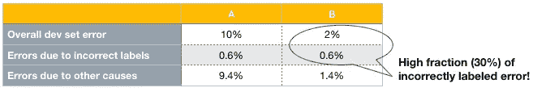**

**查看错误标记错误的百分比，如果它不像算法 A 中那样太高，则可能没有必要修复它。而在算法 B 中，不正确标记的误差分数是总 dev set 误差的 2%的 0.6%，达到 30%，相对较高，因此修复它可能更值得。**

**还有另一种情况，可能需要修复错误标记的数据。例如，如果你要评估另外两个算法，它们的误差分别是算法 C 的 2.1%和算法 D 的 1.9%，尽管 D 的误差低于 C，但很难说算法 D 比 C 好，因为 dev 集中有 0.6%的错误标签。在这种情况下，修正不正确的标签变得很有必要。**

**虽然 DL(深度学习)算法对随机误差具有鲁棒性，但它在系统误差方面表现不佳。对于**训练**数据，如果贴标签者一直将白狗贴上猫的标签，那就有问题了，因为你的分类器会学习将白狗归类为猫。**

## ****3.3 纠正不正确的开发/测试数据****

**首先，如果您计划修正开发数据集，最好也修正测试集，以确保两者来自相同的分布。**

**其次，它还需要考虑你的算法“正确”的例子。因为有了不正确的标签，你得到的可能实际上是错误的。**

**第三，当需要校正开发和测试数据时，这些数据通常比训练集小得多，您可能不想校正训练集，因为这是一项巨大的工作。那么我们能做什么呢？事实证明，当训练数据和开发数据来自不同的分布时，学习算法是健壮的，我们将在后面讨论。**

**总的来说，手动检查错误可能有点无聊，但它实际上可以为提高系统性能提供一个有希望的方向。花几个小时做手工错误分析实际上可以节省几个月的时间，你可能会花在一个不太值得的方向。**

# ****4。不匹配的训练****

**机器学习算法对训练数据有着巨大的渴求。但是在很多情况下，我们没有大量的训练数据。那么，当我们没有这么多数据时，我们能做些什么来帮助我们的应用程序获得良好的性能呢？**

## ****4.1 不匹配的培训和开发/测试集****

**经常使用的方法之一是对来自不同于开发和测试集的数据进行训练。这叫错配训练。让我们看一个例子。作为上面的“识别猫”应用程序，我们希望对用户上传的可能具有**低像素**的图片进行正确的分类，但我们并没有太多的上传图片，而我们实际上有很多来自网站的具有**高像素**的图片，如下所示。**

**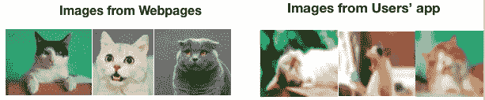**

**在 [Unsplash](https://unsplash.com/s/photos/cat) 上由 [Manja Vitolic](https://unsplash.com/@madhatterzone) 拍摄的照片**

**很明显，这两个数据源来自不同的分布。但是网页上的图片实际上对我们的训练模型有很大帮助。事实证明，这些图像可以用于训练。谈到测试，我们仍然使用用户移动应用程序的数据来评估我们模型的准确性，以确保我们的目标是这些应用程序用户。假设有 20 万张图片来自网页，1 万张图片来自 app 用户。我们可以如下选择训练集和开发集，**

****

**请注意，我们使用来自网页的所有图像和来自用户应用程序的一半图像作为训练数据，来自用户应用程序的另一半图像作为开发和测试集。因为我们想专注于我们的目标，即应用程序用户。不建议将网页和应用程序中的所有数据混在一起，然后将它们分成相应的百分比，如 98%用于训练，1%用于开发，1%用于测试数据。因为它会改变我们最初的目标，开发和测试结果不能反映我们真正关心的东西。**

## ****4.2 数据不匹配问题****

**虽然我们可以使用来自不同于开发/测试集的分布的数据来帮助训练模型，但是这种方法存在一个问题，即**数据** **不匹配问题**。那如何发现我们的模型是否存在这种数据不匹配的问题呢？我们可以通过从训练数据中剪切一段数据来添加一个 **training-dev error** ，如下所示:**

**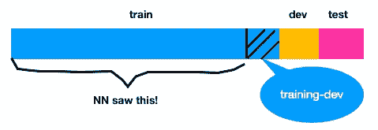**

**神经网络现在只能使用原始训练集的一部分。例如，1%的原始训练集现在被用作训练开发集。现在我们可以根据 training-dev 错误和 dev 错误来分析数据不匹配。****训练开发错误和开发错误** **的区别在于数据不匹配**。****

****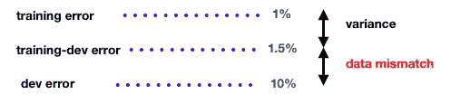****

****数据不匹配问题****

****这种“差距”很容易理解，因为即使模型在训练集中表现良好，在开发集中也可能表现不佳，因为它们来自不同的发行版。****

****结合我们之前讨论的方差和偏差，我们可以得出更全面的观点，包括“可避免的偏差”、方差和数据不匹配，如下所示:****

****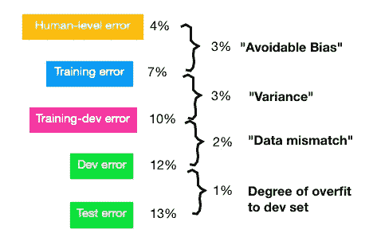****

****让我们看一个“语音识别”的例子。有一个“后视镜语音识别”，用来采集司机的声音，进行识别。但是，在存在大量通用语音数据的同时，来自驾驶员的语音数据却不多。众所周知，来自车内驾驶员的语音可能有更多的交通噪声，声音可能不那么清晰，而一般的语音数据总是质量好，听起来清晰。当使用一般的语音数据来训练并且使用驾驶员的声音数据来验证或测试时，我们可以得到如下的更一般的误差分析，****

****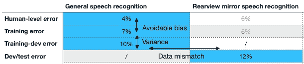****

****一般误差分析****

****从上表中可以清楚地检查出模型中的问题所在，例如，它是否有高偏差或高方差或数据不匹配问题。只需在蓝色单元格中填入数据，它就能为您指出一个有希望的方向。此外，通过填充这些灰色单元格，您还可以获得更多见解。“后视镜”中人类水平误差的第一个数字 6%可以通过要求一些人类标记这些语音数据来获得。显然，对于一个人来说，要像在一般的语音数据中那样准确地识别是比较困难的，因为有大量的交通噪声。而且你还可以通过后视镜语音数据的训练得到“后视镜”中的训练误差。这两点并不常用，但实际上可以给你一些启示。****

****现在我们对算法中的问题有了很好的了解，包括偏差、方差和数据不匹配问题。我们以前解决过高偏差和高方差的问题。但是我们不知道如何解决数据不匹配的问题。下一节我们将解决这个问题。****

## ******4.3 地址数据不匹配问题******

****数据不匹配问题是由训练数据和开发数据之间的差异引起的。因此，手动比较训练集和开发集有助于理解这两个集之间的差异。例如，正如我们之前提到的“后视镜语音识别”，您可以从来自一般语音数据的训练集中手动选取一些声音并听它，然后与来自“后视镜”驾驶员声音的 dev 集进行比较。也许你会发现“后视镜”里司机的声音要嘈杂得多，也不那么清晰。****

****那么如何解决这个数据不匹配的问题呢？您可以尝试的一种方法是让训练数据更类似于开发/测试数据，这可以通过“**人工数据合成**来实现，或者收集更多类似于开发/测试集的数据。就像上面的例子一样，你可以将“汽车噪音”添加到“一般语音数据”中，得到合成的车内音频，这与开发/测试集非常相似。****

****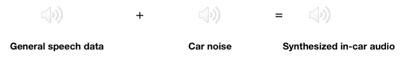****

****请注意，您不要使用一个小的汽车噪音集，因为这可能会导致您的模型过度适应汽车噪音。例如，如果您有 10，000 小时的一般语音数据，而只有 1 小时的汽车噪音，那么您重复 10，000 次这 1 小时的汽车噪音，并将其添加到一般语音数据中。也许对人类来说，这听起来完全没问题，但有可能你的模型会过度适应这 1 小时的噪音。它实际上是从这个空间的一个非常小的子集合成数据，如下所示，****

****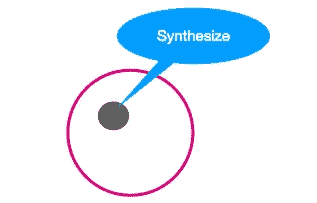****

****所以如果你收集更多独特的噪音数据，更有希望的是模型的性能会变得好得多。****

# ******5。转移学习******

## ****5.1 迁移学习过程****

****迁移学习是将神经网络从一项任务中学到的知识应用到另一项任务中。例如，如果你有一个用于“识别猫”的神经网络，你可以使用这个模型或模型的一部分，通过读取 X 射线扫描来“识别肿瘤”。该过程如下:****

****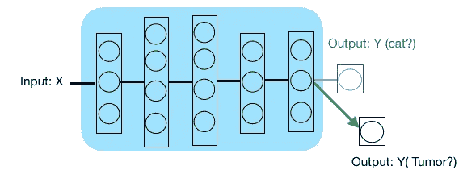****

****假设我们已经在图像识别上训练了上述神经网络来识别一只猫。该模型的输入是物体图像，如鸟、猫、狗或其他东西。我们有训练过的重量。然后，我们想使用这个包括结构和重量的训练模型来读取 X 射线扫描。该方法是删除原始神经网络的最后一个输出层和馈入最后一层的权重，并用一组随机初始化的权重创建新的最后一层，现在我们有了放射学诊断的输出。然后，我们可以使用我们的放射学图像作为输入来训练模型的最后一层，并获得放射学诊断的输出。您还可以添加更多层，而不仅仅是最后一层，****

****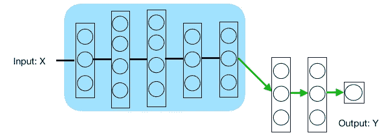****

****您可以自由决定是否重新训练模型的其他层。在上面的例子中，我们“冻结”了除最后一层之外的其他层，你也可以只“冻结”部分层，如下所示:****

****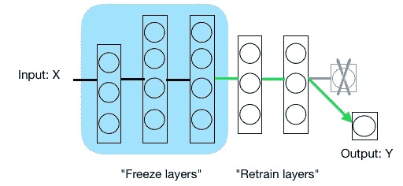****

****此外，如果你有很多数据，那么也许你可以重新训练网络中的所有参数。如果你重新训练神经网络中的所有参数，那么图像识别训练的初始阶段被称为**预训练**，因为你使用图像识别数据来预初始化或预训练神经网络的权重。然后，如果您随后更新所有权重，那么对放射学数据的训练被称为**微调**。****

## ****5.2 迁移学习什么时候有意义？****

****问题是我们什么时候可以用迁移学习。有三点应该考虑，****

****首先，任务 A(原始神经网络:上面的“猫识别”示例)和任务 B(你的目标工作:X 射线扫描示例)必须具有相同的输入 X。它需要你将任务 A 的**相同形状**的图像输入任务 B 的模型。****

****其次，任务 A 的数据比任务 b 多得多。****

****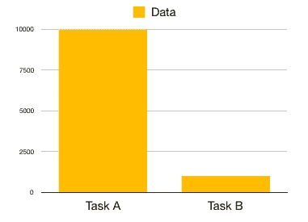****

****第三，任务 A 的底层特征有助于学习任务 b。****

****我认为迁移学习有点像我们之前讨论过的不匹配训练。不同之处在于，迁移学习直接使用已经被训练的任务 A 的模型的权重，而不匹配训练仅使用任务 A 的数据。两者都需要任务 A 和任务 b 存在一些相似性。存在一些迁移学习架构，如用于图像识别和对象检测的“Inception v3”。****

****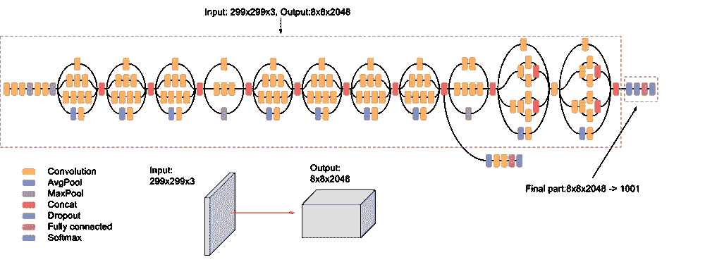****

****[盗梦空间 v3 架构](https://cloud.google.com/tpu/docs/inception-v3-advanced)****

# ******6 多任务学习******

## ****6.1 多任务学习架构****

****多任务学习是指让一个神经网络同时完成几项任务。如果你熟悉计算机视觉，你可能知道很多图像识别算法，如掩模 RCNN，YOLO，U Net，更快的 RCNN。这些算法都在使用多任务学习。多任务学习的架构绘制如下，****

****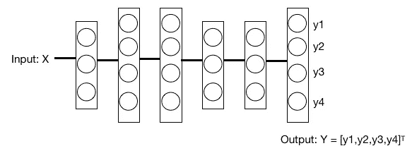****

****让我们看一个简化的自动驾驶汽车的例子。车辆必须同时检测几个事物:行人、汽车、路标、交通灯、骑自行车的人等等。输入𝑥是带有多个标签的图像。根据四个任务，输出 Y 具有 4 个标签:****

****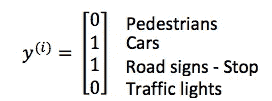****

****结果应该看起来像这样，****

****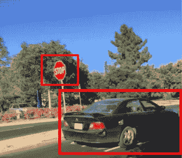****

****成本函数可以写成:****

****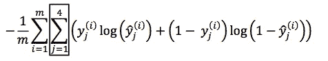****

****有一种情况是，标注者没有标注所有这四个类别，可能只是标注了标签的子集。比如贴标签机给上图的车贴了标签却忘了贴站牌。有了这样的数据集，你仍然可以训练你的算法同时做四项任务。数据集可以如下，****

****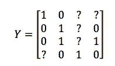****

****你不应该把这些没有标记的例子 **j** 加到代价函数里，只在 y_j 等于 0 或者 1 的时候加 y_j。****

****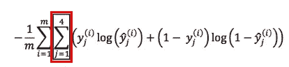****

## ****6.2 多任务学习什么时候有意义？****

****首先，在一组任务上进行训练，这些任务可以从共享低级特征中受益。例如，有一些数据集，如 ImageNet、COCO 数据集，其中包含上下文中的常见对象。****

********

****来源于 [COCO 数据集](http://cocodataset.org/#home)****

****其次，每个任务的数据量通常都很相似。因为如果一个或一些任务比其他任务有更多的数据，算法可能会预测输出是有更多数据的那个类。****

****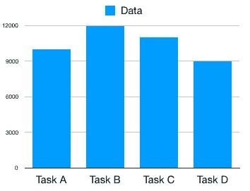****

****第三，当训练足够大的神经网络时，它可以在所有任务中做得比在每个任务上训练单独的神经网络更好。****

# ****7.训练神经网络的技巧****

## ****7.1 调整超参数****

****调整超参数时最重要的是保持**正交化**。如果您调整超参数来同时满足多个目标，这不是一个好主意。以老式电视为例，有几个旋钮可以调节图像的宽度、长度、梯形或旋转。****

****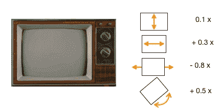****

****Zynio 制作的复古电视，途经 FreeVector.com****

****当调整神经网络时，它也应该服从正交化。当设计监督学习系统时，这 4 个假设需要是真实的和正交的。****

****首先，你通常必须确保你至少在训练集上做得很好，这意味着可避免的偏差不应该太大，我们之前已经讨论过减少偏差的策略。****

****其次，在训练集中表现良好之后，它应该很好地适应开发集，这意味着方差不应该太高，我们之前也讨论过方差减少策略。****

****第三，它应该在成本函数上很好地拟合测试集。****

****最后，它应该在现实世界中表现良好。(如果它执行得不好，则开发或测试集设置不正确，或者成本函数没有评估正确的东西。)****

****查看模型的性能，然后调整这四个问题并分别解决它们是一个好主意。有一种称为“早期停止”的技术，它不太正交，因为它同时影响训练集和开发集的性能。****

## ****7.2 选择培训/开发/测试设备****

****如果您有足够的数据来训练模型，而不是我们之前讨论的不匹配的训练，那么更推荐的是使训练集和开发/测试集来自同一个分布。例如，随机打乱整个数据集，然后将它们分成训练集、开发集和测试集。因为如果训练和开发/测试集来自不同的分布，就好像你为你的算法设定了不同的目标。****

****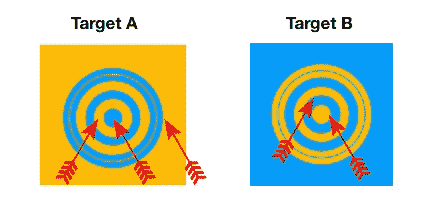****

## ****7.3 培训、开发和测试集的规模****

****如果整个数据的大小很小，比如 100 个，它通常使用 70/30 或 60/20/20 分割成一个训练和开发/测试集，如下所示，****

****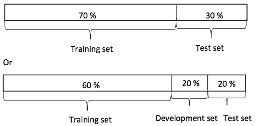****

****但就目前来说，大数据时代，大量的数据是可用的。假设您有一百万个训练示例，将 98%的数据用于训练集，1%用于开发集，1%用于测试集可能是非常合理的。****

****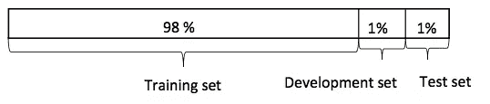****

# ****摘要****

****我知道这是一篇很长的文章，但在处理机器学习的项目时，它真的可以帮助你很多。本文围绕“机器学习的策略”这一主题展开，并举例说明了错误分析，以提高机器学习模型的性能。同时，我们也介绍了不匹配学习，迁移学习，多任务学习，以及何时使用它们。方便你按标题查。最后，我们总结了一些机器学习的技巧。希望这篇文章能对你的工作有所帮助。****

******参考******

****[1]吴恩达，[【结构化机器学习项目】](https://www.coursera.org/learn/machine-learning-projects/home/welcome?) *，* Coursera。****