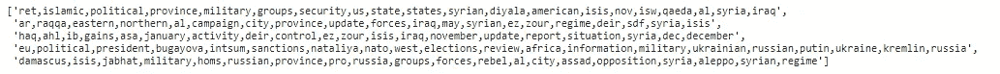
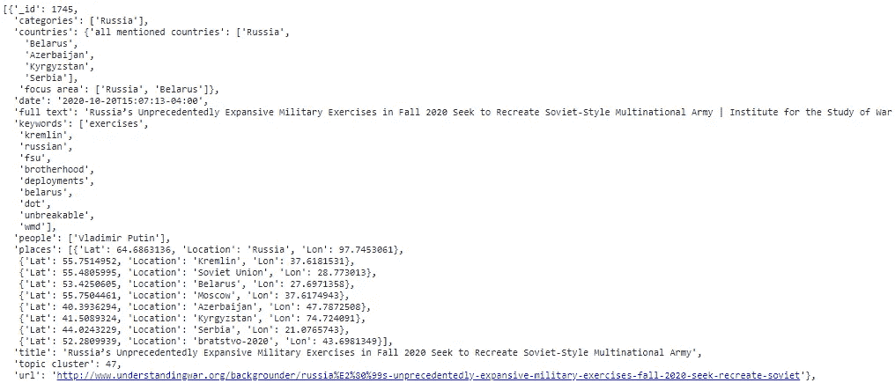

# 从无到有:使用 NLP 和 ML 提取和结构化 Web 数据

> 原文：<https://towardsdatascience.com/something-from-nothing-use-nlp-and-ml-to-extract-and-structure-web-data-3f49b2f72b13?source=collection_archive---------11----------------------->

## [实践教程](https://towardsdatascience.com/tagged/hands-on-tutorials)

## 使用 NLTK、Spacy 和 BeautifulSoup 等 Python 库从非结构化 web 数据创建结构化数据集。

掌握你的数据。利用自然语言处理技术来构建最混乱的 web 数据。

# 介绍

在本文中，我们将基于[战争研究所](http://www.understandingwar.org/) (ISW)生产库创建一个结构化文档数据库。ISW 为外交和情报专业人员创造信息产品，以更深入地了解世界各地发生的冲突。

要查看与本文相关的原始代码和笔记本，[点击此链接](https://colab.research.google.com/drive/1pTrOXW3k5VQo1lEaahCo79AHpyp5ZdfQ?usp=sharing)。要访问托管在 Kaggle 上的最终结构化数据集，[请点击此链接](https://www.kaggle.com/connerbrew2/isw-web-scrape-and-nlp-enrichment)。

这篇文章将是一个 web 抽取、自然语言处理(NLP)和命名实体识别(NER)的练习。对于 NLP，我们将主要使用开源 Python 库 **NLTK** 和 **Spacy** 。本文旨在演示 web 抽取和 NLP 的一个用例，**而不是**介绍这两种技术用法的综合初学者教程。如果您是 NLP 或 web 提取的新手，我会建议您遵循不同的指南，或者浏览一下[空间](https://spacy.io/api/doc)、[美丽群组](https://www.crummy.com/software/BeautifulSoup/bs4/doc/)和 [NLTK](https://www.nltk.org/) 文档页面。

# 初始化变量

首先，我们将在最终的结构化数据中初始化我们想要的数据字段。对于每个文档，我都要提取出**标题**、**出版日期**、**人名**、**地名**以及其他各种信息。我们还将增强文档中已经存在的信息——例如，我们将使用文档中的地名来获取相关坐标，这对以后可视化数据可能很有用。

# 提取 Hrefs

我们将从 ISW 的产品库中提取我们的文档。首先，我们将抓取**‘browse’**页面来获取每个产品的 href 链接。然后，我们将这些链接存储在一个*列表*中，供我们的提取函数稍后访问。

# 网页提取

我们将编写的前几个函数是相当简单的文本提取。本教程并不是关于 BeautifulSoup 用法的教程——关于 Python 中 web 抓取的介绍，请点击这里查看文档。

## 获取日期

对于我们的第一个函数，我们将提取出版日期。它扫描从产品网页中提取的 html 文档，找到一个类别为**‘submitted’**的字段。这包含我们的生产日期。

## 获得标题

接下来，我们需要产品标题。同样，这个字段被方便地标记为一个类**‘title’**。

## 获取所有文本

最后，我们将提取文档的全文。当我提取文本时，我通常遵循“先提取，后过滤”的网页提取方式。这意味着，在我的初始文本提取中，我对文本执行最少的过滤和处理。我更喜欢在以后的分析中进行处理，因为这是必要的。但是，如果您更高级，您可能希望对提取的文本进行比下面的函数演示的更多的预处理。我再次建议您遵循[文档](https://www.crummy.com/software/BeautifulSoup/bs4/doc/)进行参考。

对于我的 *get_contents* 函数，我坚持使用最简单的方法——我在黑名单中列出了一些 html 父类，用于我不想提取的文本。然后，我从页面中提取所有文本，并将其附加到一个临时字符串中，该字符串又被附加到*列表* **content_text** 中。

# 自然语言处理

接下来，我们将弄清楚产品中引用了哪些国家。有许多 API 可以用来检查国家的文本内容，但是这里我们将使用一个简单的方法:一个世界上所有国家的列表。这个列表来自维基百科。

该函数在文档中识别出**所有提及的国家**后，使用基本的统计分析来识别哪些国家最突出，这些国家最有可能成为文档叙述的焦点。为此，该函数计算一个国家在整个文档中被提及的次数，然后找到被提及次数超过平均值的国家。这些国家随后被追加到一个**关键国家**列表中。

# 命名实体识别:地点

接下来，我们要丰富我们的数据。最终，结构化数据的目标通常是执行某种分析或可视化-在这种国际冲突信息的情况下，按地理位置绘制信息很有价值。为此，我们需要与文档相对应的坐标。

## 获取地名

首先，我们将使用**自然语言处理(NLP)** 和**命名实体识别(NER)** 从文本中提取地名。NLP 是机器学习的一种形式，其中计算机算法使用语法和句法规则来学习文本中单词之间的关系。利用这种学习，NER 能够理解某些单词在句子或段落中的作用。本教程并不是对 NLP 的全面介绍——要获得这样的资源，请在 Medium 上尝试[这篇文章。](https://medium.com/@ODSC/an-introduction-to-natural-language-processing-nlp-8e476d9f5f59)

## 从外部 API 获取坐标

为了找到地名的坐标，我们将使用 **Open Cage API** 来查询坐标；您可以在这里创建一个免费帐户并获得一个 API 密钥[。有许多其他流行的地理编码 API 可供选择，但通过反复试验，我发现 Open Cage 在给定中东模糊地名的情况下具有最佳性能。](https://opencagedata.com/api)

首先，我们遍历从文档中检索到的每个地名，并在 Open Cage 中查询它。完成后，我们将交叉引用 Open Cage 结果和之前创建的**提到的 _countries** 列表。这将确保我们检索的查询结果位于正确的位置。

# 命名实体识别:人

接下来，我们将提取文档中提到的人名。为此，我们将再次使用来自 **NER-D python 库**的 NER 算法。

## 获取全名

在最终的结构化数据中，我只想要全名。找到一个带有“杰克”或“约翰”的*‘被提及人’*的数据条目会不会令人困惑？为了做到这一点，我们将再次使用一些基本的统计数据。当提到全名时，该函数将跟踪它们，通常是在文本的开头。

当稍后提到部分名称时，它将引用全名列表来标识部分名称所引用的人。例如，如果一篇新闻报道是这样的:'*乔·拜登正在竞选总统。乔最广为人知的身份是前总统巴拉克·奥巴马的副总统。*我们知道**乔**指的是**乔·拜登**，因为他的全名早在文中就给出了。该功能将以相同方式运行。

## 消除相似名称的冲突

在出现重复的情况下，该函数将使用之前用于 country 函数的相同统计数据。它将计算一个名字被提及的次数，并将其作为最可能的标识符。例子:乔·拜登和他的儿子亨特·拜登是受欢迎的美国政治家。乔·拜登是前任副总统。拜登现在正在与现任总统唐纳德·特朗普竞选总统我们知道**“拜登”**是指**“乔·拜登”**的上下文。根据文本的统计重点，这段话显然是关于乔·拜登，而不是亨特·拜登。

## 验证名称

一旦该函数计算出所有提到的全名，它将把它们添加到一个列表中。然后，它将查询**维基百科**中的每个名字，以验证它是值得包含在结构化数据中的有影响力的人的名字。

# 关键词提取:词频-逆文档频率

我们的下一个任务是从文本中提取关键词。最常见的方法是使用名为**术语频率-逆文档频率(TF-IDF)** 的方法。基本上，TF-IDF 模型测量一个术语或单词在单个文档中的使用频率，然后将其与它在整个文档语料库中的平均使用频率进行比较。如果一个术语在单个文档中频繁使用，而在整个文档语料库中很少使用，则该术语很可能代表该特定文档特有的关键字。本文并不打算全面概述 TF-IDF 模型。欲了解更多信息，请查看媒体上的[这篇文章。](https://medium.com/datadriveninvestor/tf-idf-in-natural-language-processing-8db8ef4a7736)

首先，我们的函数将创建一个通常所说的*‘单词包’*。这将跟踪每个文档中使用的每个单词。然后，它会统计每个文档中每个单词的每一次使用——**词频**。然后，取包含该术语的每个文档中每个句子的常用对数，即**逆文档频率**。然后将这些值写入一个矩阵中的坐标，然后对其进行排序，以帮助我们找到最有可能代表我们文档的唯一关键字的单词。

# 主题建模

NLP 中最常见的任务之一就是**主题建模**。这是一种聚类形式，试图根据文本内容自动将文档分类。在这个具体的例子中，我想知道 ISW 正在报道什么话题。通过根据文本内容将文档分类，我可以很容易地对文档的主要思想有一个粗略的了解。

## …向量化…

对于这个例子，我将使用一个 [*k-means 聚类*](https://medium.com/dataseries/k-means-clustering-explained-visually-in-5-minutes-b900cc69d175) 算法来进行主题建模。首先，我将再次使用 TF-IDF 算法对每个文档进行矢量化。**矢量化**是一个机器学习术语，指的是将非数字数据转换成计算机可以用来执行机器学习任务的数字空间数据。

## 最佳化

一旦文档被矢量化，辅助函数就会检查最佳的集群数量。****k****中****k-意为*** *)* 。在这种情况下，最佳数量为 **50** 。一旦我找到了最佳的数字，在这个例子中我注释掉了那行代码，手动调整参数等于 50。这是因为我正在分析的数据集不会经常改变，所以我可以预计最佳聚类的数量会随着时间的推移保持不变。对于变化更频繁的数据，您应该以变量的形式返回最佳聚类数，这将有助于您的聚类算法自动设置其最佳参数。我在我的时序分析文章中展示了一个例子。*

## *使聚集*

*一旦每个聚类完成，我将每个聚类的编号*(1–50)*保存到列表 **cluster_numbers** 中，并将组成每个聚类的关键字保存到列表 **cluster_keywords** 中。稍后将使用这些集群关键字为每个主题集群添加标题。*

# *把它放在一起*

*最后，我们将提取我们的数据。使用我们之前得到的 hrefs 列表，是时候将我们所有的提取函数应用到 web 内容上了。*

# *主题建模丰富化*

*我们的下一个问题是这样的:我们的聚类给了我们一个与每个聚类相关的单词列表，但是这些聚类的标题仅仅是数字。这给了我们绘制单词云或其他有趣的可视化的机会，可以帮助我们理解每个集群，但它对于结构化数据集中的*一目了然的*理解来说并不有用。此外，我认为有些文档可能属于多个主题类别。k-means 不支持多重聚类，所以我必须手动识别这些文档。首先，我将打印前几行关键字，以了解我正在处理的数据。*

**

*与每个主题群相关联的一些关键词。我们将使用这些关键字将集群分类到预定义的类别中。*

*在对各种技术进行大量实验后，我决定采用一种非常简单的方法。我浏览了与每个集群相关的每个关键词列表，并注意到了每个列表中与特定主题相关的重要关键词。在这个阶段，**领域知识**是关键。例如，我知道，在一份 ISW 文件中，阿勒颇几乎肯定是指叙利亚内战。对于您的数据，如果您缺乏适当的领域知识，您可能需要做进一步的研究，咨询团队中的其他人，或者定义一种更高级的编程方法来命名您的分类。*

*然而，对于这个例子，简单的方法工作得很好。在记录了聚类列表中出现的几个重要的关键字之后，我自己制作了几个列表，其中包含了与结构化数据中我想要的最终主题类别相关的关键字。该函数只是将每个集群的关键字列表与我创建的列表进行比较，然后根据列表中的匹配项分配一个主题名称。然后，它将这些最终主题附加到一个列表 **topic_categories** 中。*

# *数据库创建*

*最后一步是将所有提取的数据汇集在一起。对于这个数据，我更喜欢 **JSON** 格式。这是因为我想以不同的方式构建某些类型的数据——例如,**位置**字段将包含一个包含地名、纬度和经度的**字典列表**。在我看来，JSON 格式是将这种格式化数据存储到本地磁盘的最有效方式。我还在文档数据库 **MongoDB** 中备份了这个数据库的副本，但这不是本文的重点。如果您对将结构化数据保存到文档数据库感兴趣，请尝试使用媒体上的[这篇文章。](https://medium.com/free-code-camp/learn-mongodb-a4ce205e7739)*

# *摘要*

*现在我们完成了！我们从网页中提取链接，然后使用这些链接从网站中提取更多的内容。我们使用这些内容，然后使用**外部 API**、ML **聚类算法**和 **NLP** 来提取和增强这些信息。如今，NLP 是商业智能社区中最流行的词汇之一，现在您可以自信地在 NLP 中执行中级操作来进行文档分析。可以进行 **TF-IDF 矢量化**、**关键词提取**、**主题建模**。这些都是 NLP 的基石。如果您有更多的问题或需要信息，请联系[并祝您在未来的 NLP 工作中好运！](https://www.linkedin.com/in/cmbrew/)*

**

*我们的最终产品。一个 ISW 产品的文档数据库条目。*