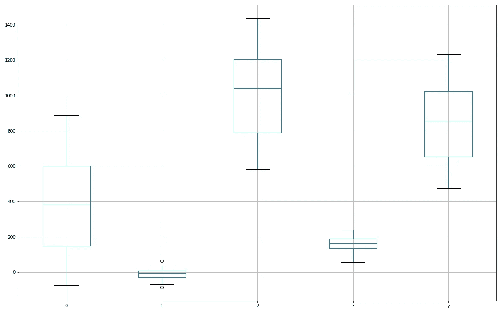
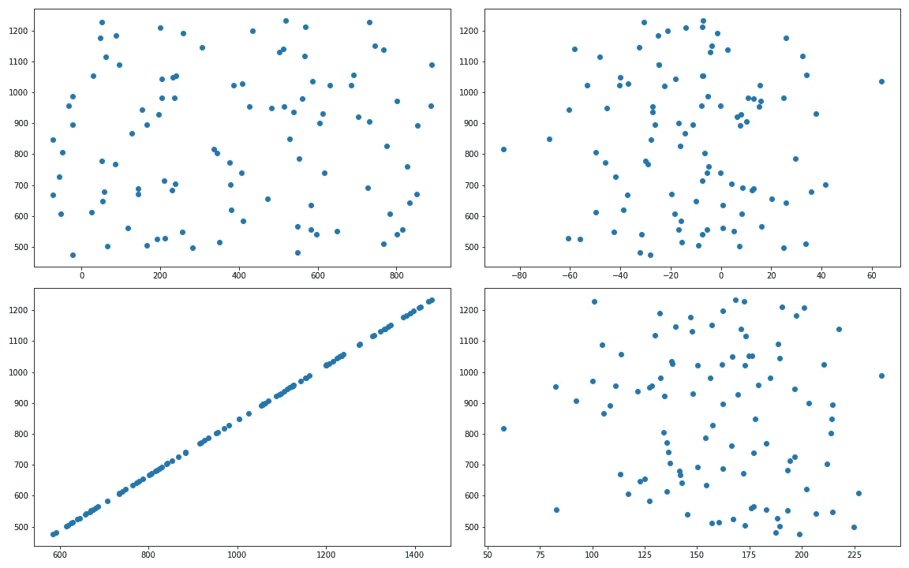
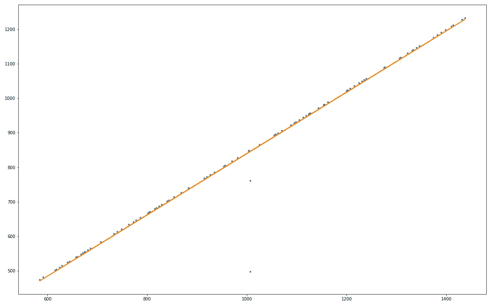

# 有时候，我想要答案，而不是约束。

> 原文：<https://towardsdatascience.com/sometimes-i-want-answers-not-constraints-cb4b978c4f35?source=collection_archive---------71----------------------->

## 在数据科学世界中创造挑战

我喜欢参与代码挑战。网上有很多，每个都有自己的优点和缺点。他们大多关注数据结构，关心速度和内存的[](https://en.wikipedia.org/wiki/Big_O_notation)*。但是，我的主要职业是数据科学和 AI，不是软件工程。*

*当然，到处都有[和数据以及问题，但这并没有提供我非常喜欢的关于软件工程挑战的快速“一个问题的挑战”格式。](https://kaggle.com)*

*总之，我决定自己做点东西。*

# *数据游乐场*

*这是一个想法:一个单键数据集生成器，伴随着一个问题；即，对于给定的 y，X 中的最高预测值是什么？*

*我拼凑了一些代码，你可以在这里找到: [data-playground](https://github.com/sijmenw/data-playground) 。下面是一段抓住了这个想法的代码:*

```
*def generate_data(size=100, n_vars=5):
    data = np.zeros((size, n_vars))

    # insights
    data = add_insights(data)

    # return as X, y
    X = data[:, :-1]
    y = data[:, -1]

    return X, y, answer*
```

# *试运转*

*让我们看看我们是否能解决我们给自己制造的一个挑战。让我们来回答这个问题:X 中的哪一个特征对 y 的预测能力最强？*

*要获取数据:*

```
*import data_playground
X, y, answer = data_playground.generate_data()*
```

*让我们看看使用 pandas boxplot 函数得到的数据:*

```
*import pandas as pd
import matplotlib.pyplot as pltdf = pd.DataFrame(X)
df[‘y’] = yfig = plt.figure(figsize=(16,10)) # show large in Jupyter lab
df.boxplot()*
```

**

*箱线图显示 X 中的四个特征变量和目标变量 y*

*好的，很棒的东西。现在，让我们分别检查每个特征与目标的散点图。*

**

*每个特征变量(x 轴)与目标变量(y 轴)的散点图*

*嗯……看来我们的预测者已经找到了。由于噪声(还)不是数据生成器的一部分，所以预测变量和目标变量之间的相关性为 1 是合乎逻辑的。*

*让我们用找到的预测值和目标变量拟合一条线*

```
*from numpy.polynomial.polynomial import polyfitx = X[:, 2] # select the predictor as x# Fit with polyfit
b, m = polyfit(x, y, 1)*
```

*哦不！我们得到一个错误:*

```
*LinAlgError: SVD did not converge in Linear Least Squares*
```

*让我们来看看我们的预测数据:*

```
*array([ 804.47413666,  842.97551303,  748.1380677 , 1215.17156503,
       1276.81035949,  584.42126573, 1234.71707604,  882.6102377 ,
        706.84325884, 1199.374478  , 1004.41162981, 1057.4067627 ,
        659.40211494, 1087.62207358,  956.11178348,  823.99392245,
       1143.45258157,           nan, 1431.19129368, 1437.55897016,
       1230.64007   ,  617.81872218, 1062.12360521, 1201.80237097,
       1206.63668203,  882.78966205,  853.57276331, 1308.64976626,
       1097.63082906,  786.40660024, 1162.29695854,  674.5633299 ,
        624.71361214, 1389.87441326, 1104.76126325, 1200.38449289,
       1431.31478774,  591.59451421, 1398.08042032,  686.02957951,
       1201.50246581,  674.86646811,  919.48563472, 1155.23023783,
        914.36359672,  640.30226409, 1332.67749091,  740.15844807,
        829.20419027,           nan, 1003.42401407, 1410.10634418,
       1413.14987011,  772.21443592, 1118.37010464,  657.38659094,
        969.84855077,  926.63859525,  840.08468061, 1127.08928725,
       1235.22602886,  806.12183971, 1321.99606412,  867.78834899,
       1153.57274271,  667.14093202,  763.41042449,  953.45037745,
        670.57004238, 1125.52558347,  733.96942094, 1124.68968026,
        629.2784078 ,  614.83884103, 1112.5953336 , 1274.8264045 ,
       1094.69476358, 1382.11932072,  644.08898909, 1239.15631856,
       1070.14816499, 1224.89101018,  733.14740355, 1374.17210495,
       1054.74359293,  818.35508666, 1123.32875169,  934.47218873,
       1057.92690666, 1331.08625474,  814.7746755 ,  680.6920455 ,
       1024.99541524,  801.86090882, 1339.60803444, 1305.60718156,
        981.19456372, 1346.10765152,  777.84669881, 1154.19337888])*
```

*你发现了吗？*

*我们的集合中有 nan 值，这是数据生成器中实现的一个技巧，目的是让您保持警觉。*

*让我们用特征的平均值替换 nan 值，然后再试一次。*

```
*import numpy as np
from numpy.polynomial.polynomial import polyfitx = X[:, 2]# set the nan values to the mean of the non-nan values
x[np.isnan(x)] = x[~np.isnan(x)].mean()# Fit with polyfit
b, m = polyfit(x, y, 1)*
```

*是的，这次成功了！*

**

*预测变量与目标变量的散点图有一条最佳拟合线，被平均值取代的两个 nan 值清楚地显示在该线之外。*

*检查 b 和 m 变量显示: *b= -48.40* 和 *m = 0.888。**

*现在我们来看看给出的答案:*

```
*>>> answer.reveal()
Answers: Col 2 adds linearly to target with factor 0.8882422214069292*
```

*这似乎是正确的！*

# *总结*

*使用它肯定很有趣，但是在它成为一个有用的练习之前，还需要做一些工作。需要实现更复杂的关系和噪声，以及离群值和数据科学家必须处理的其他讨厌的事情。*

*我很乐意在未来继续这方面的工作(非常欢迎合并请求！)，我们来看看它去哪了！*