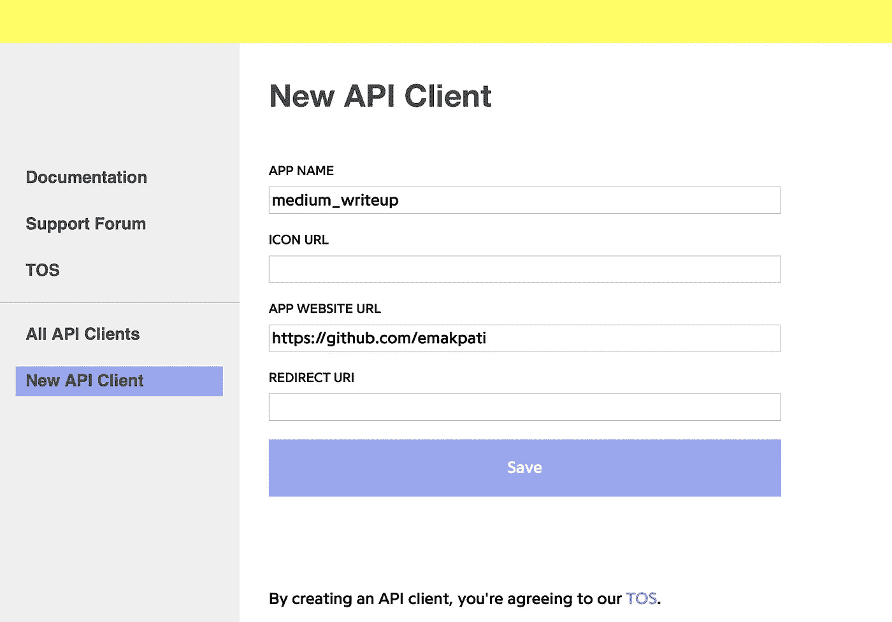
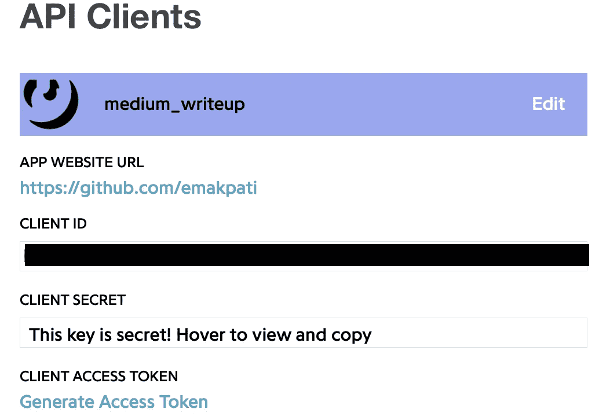
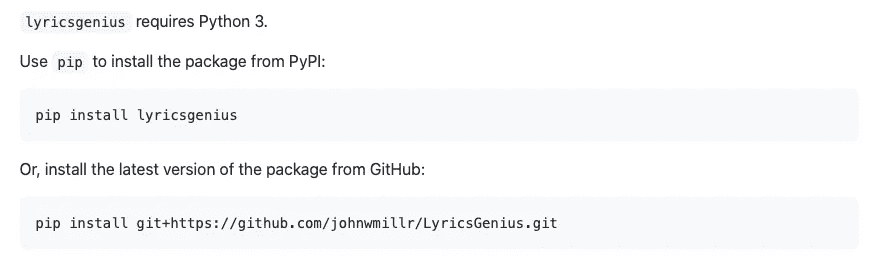
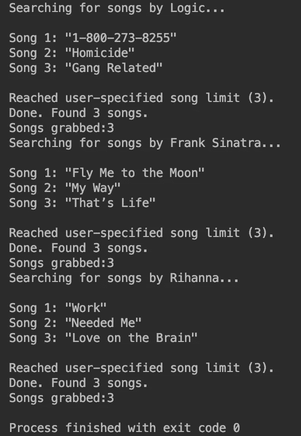
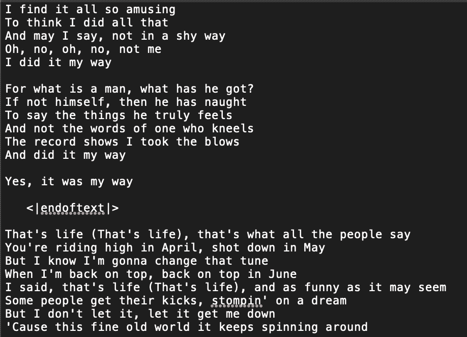

# 如何用 Python 收集歌词

> 原文：<https://towardsdatascience.com/song-lyrics-genius-api-dcc2819c29?source=collection_archive---------11----------------------->

## 一种创建用于训练生成语言模型的歌词数据集的简单方法


Brandon Erlinger-Ford 在 [Unsplash](https://unsplash.com/s/photos/music-artists?utm_source=unsplash&utm_medium=referral&utm_content=creditCopyText) 上的照片

## **简介**

为语言模型训练和微调构建数据集可能非常繁琐。当我试图收集一个对话文本数据集和一个小众歌词数据集时，我学到了这一点，这两个数据集都是为了训练一个单独的 [GPT-2](https://openai.com/blog/better-language-models/) 模型。经过几个小时的半自动刮擦和人工清理，我才碰到了 [Genius](https://genius.com/Genius-about-genius-annotated) 和它的 [API](https://docs.genius.com) 。这真是天赐良机。它不仅易于安装和使用，而且还拥有大量不一定家喻户晓的艺术家。这使得它成为创建主流和小众歌词数据集的绝佳选择。当与 [lyricsgenius](https://github.com/johnwmillr/LyricsGenius) 堆叠在一起时，这个过程变得更加轻松，lyricsgenius 是由 [John Miller](https://github.com/johnwmillr) 创建的一个包，它大大简化了过滤由 Genius API 检索的数据的任务。

这篇文章将围绕为生成式语言模型(如 GPT)构建训练数据集的用例展开。明确地说，这将不包括实际构建模型的步骤。我们将逐步完成设置 API 客户端的过程，然后编写一个函数来获取 ***k*** 歌曲的歌词并将歌词保存到一个. txt 文件中。

## 设置 API 客户端

1.  查看 [API 文件页面](https://docs.genius.com/)。
2.  查看 [API 服务条款](https://genius.com/static/terms)。
3.  在文档页面，点击 *API 客户端管理页面*导航到[注册/登录页面](https://genius.com/signup_or_login)。
4.  使用您选择的注册或登录(如果您有帐户)方法完成表格，然后单击*创建帐户*。这应该会把你带到你的 *API 客户端*页面，或者让你重新回到主页。如果您返回到主页，向下滚动到页面页脚并点击*开发者*。


5.一旦进入 API 客户端页面，点击*创建 API 客户端*(在 Safari 上)或*新建 API 客户端*(在 Chrome 上)来创建你的应用。在这种情况下，术语“应用程序”是指 Genius API 的使用。只有下面截图中的*应用程序名称*和*应用程序网站 URL* 字段是继续的必要条件。我们将主要使用应用程序名称来识别这个单独的客户端(您可以创建几个 API 客户端)。我通常默认使用我的 Github 来满足大多数网站的需求，但任何网站都应该适合 URL 字段。



6.点击*保存*将带您进入凭证页面，该页面应类似于下面的屏幕截图。如果您已经创建了多个 API 客户端，它们都会显示在这里。稍后，我们将回到这个页面，查看客户端访问令牌。恭喜你，你已经完成了注册过程！



## 安装 LyricsGenius



来自[https://github.com/johnwmillr/LyricsGenius](https://github.com/johnwmillr/LyricsGenius)

可以使用 *pip install lyricsgenius* 从 [PyPI](https://pypi.org/project/lyricsgenius/) 安装 Lyricsgenius，或者使用*pip install git+https://Github . com/johnwmillr/lyricsgenius . git*从 [Github](https://github.com/johnwmillr/LyricsGenius) 安装 lyrics genius。

## 代码(最终)

我们首先从导入 lyricsgenius 开始。

```
import lyricsgenius as lg
```

我们还需要为我们想要写入歌词的文件的路径创建一个变量。在这个例子中。txt 文件命名为 ***auto_。txt*** 。

```
file = open("/Users/User/Desktop/auto_.txt", "w")
```

终于到了使用我们的 API 客户端凭证的时候了。导航回您的 API 客户端页面，然后单击生成访问令牌。

这个令牌将被传递给***lyricsgius。Genius()*** 连同我们要用来过滤文本数据的参数。在过滤方面，我们将忽略非官方歌曲的歌词，忽略现场表演和混音。将***remove _ section _ headers***设置为 ***True*** 也是一个好主意，假设我们希望我们的数据集只关注口语歌词，并排除歌曲元数据。

```
genius = lg.Genius('Client_Access_Token_Goes_Here', skip_non_songs=True, excluded_terms=["(Remix)", "(Live)"], remove_section_headers=True)
```

最后，让我们编写一个名为 ***get_lyrics()*** 的函数，该函数将艺术家姓名列表和我们希望为每个艺术家获取的歌曲数量 ***k*** 作为参数。该功能将打印收集的每首歌曲的名称和每个艺术家成功抓取的歌曲总数，然后将歌词写入我们的。txt 文件。

```
def get_lyrics(arr, k):
    c = 0
    for name in arr:
        try:
            songs = (genius.search_artist(name, max_songs=k, sort='popularity')).songs
            s = [song.lyrics for song in songs]
            file.write("\n \n   <|endoftext|>   \n \n".join(s))
            c += 1
            print(f"Songs grabbed:{len(s)}")
        except:
            print(f"some exception at {name}: {c}")
```

我们来分解一下逻辑。

1.  设置一个计数器 ***c*** 用来记录写入的歌词的组数。txt 文件。
2.  循环浏览姓名列表 ***arr*** 。
3.  创建一个 ***试*** 块。
4.  把的名字传给 ***的抒情天才。genius . search _ artist()***连同我们想要的歌曲数量 ***k*** 并按照 ***流行度*** 对歌曲进行排序，以便首先抓取每个艺术家最流行的歌曲(当然是达到我们的限制 ***k*** )。这会给我们一个名为 ***歌曲*** 的歌名列表。
5.  通过 ***歌曲*** 列表理解循环，将每首歌曲的歌词 ***song.lyrics*** 添加到新列表 ***s*** 。
6.  调用 ***file.write()*** 并传递 ***“。join(s)*** 将字符串列表压缩成一个字符串，并将新生成的字符串(代表抓取的所有歌词)写入。txt 文件。除了联合反对***"***，我们还可以联合反对一个更明显的分隔符，如***" \ n \ n<| endoftext |>\ n \ n "***，这将使阅读文本文件变得容易得多，因为每一组单曲歌词都将由该分隔符接续。另外，[分隔符在为一些语言模型](https://git.scc.kit.edu/debatelab/gpt-2/commit/1e32b10ac456cb70331ccd3dff83437a7e33836d)构建数据集时非常有用，可以帮助模型理解单个文本样本何时结束。
7.  将 ***c*** 增加 1。
8.  打印通用成功消息以及收集的歌曲数量***【len(s)】***。
9.  创建除和块之外的**和*。***
10.  打印通用异常消息以及引发异常的艺术家姓名和 ***c*** 。

输出:



运行 **get_lyrics(['Logic '，' Frank Sinatra '，' Rihanna']，3)** 时打印输出。



的示例。运行**时的 txt 输出 get_lyrics(['Logic '，' Frank Sinatra '，' Rihanna']，3)** 。

## **流程改进**

一个明显需要改进的地方是我们的流程对传递给 ***lyricsgenius 的艺术家姓名集合的依赖。Genius.search_artist()*** 。手动创建艺术家姓名列表肯定是不可伸缩的。在我们的例子中，我们只使用了三个艺术家，但是为了建立一个足够大的数据集来微调生产级别的模型，我们理想的是需要几十个艺术家和一个高得多的 **k** 变量。

该解决方案自动执行创建艺术家列表的任务；一种方法是使用 [bs4](https://www.crummy.com/software/BeautifulSoup/bs4/doc/) 从两个来源中的一个获取名称。[维基百科提供了几个基于音乐流派的音乐家名单](https://en.wikipedia.org/wiki/Lists_of_musicians)，可能是获取这些艺术家名字的一个伟大的单一来源。

## 结论

由于 Genius 团队和 John Miller 的努力，曾经困难而复杂的流程现在变得顺畅而简化。

下面是我在上面使用的所有代码，用于连接到 API 并将歌词写到。txt 文件。

非常感谢你让我分享，以后还会有更多。😃