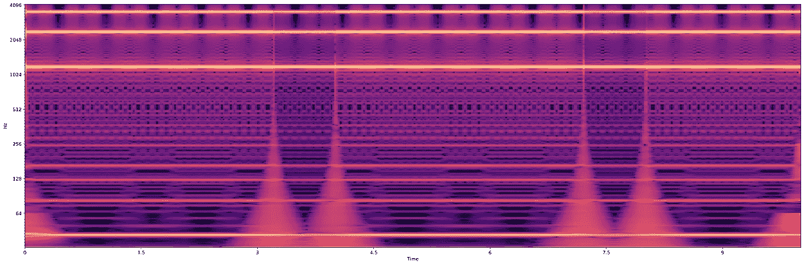
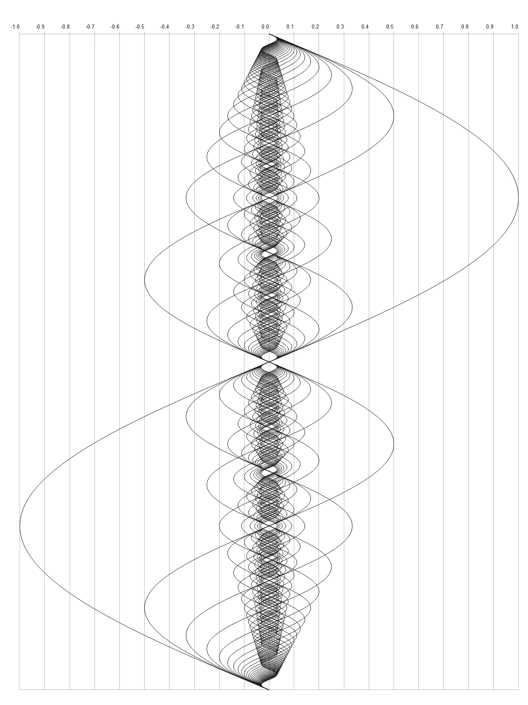
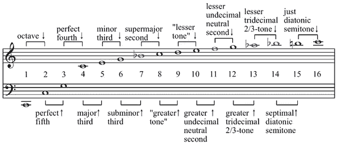
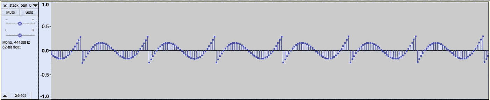
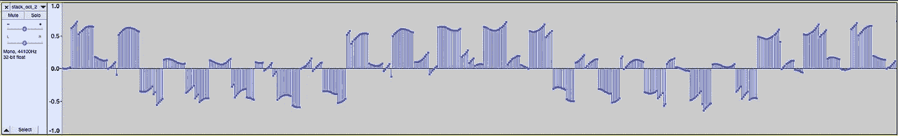
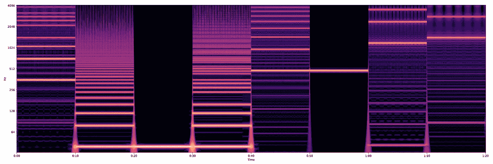
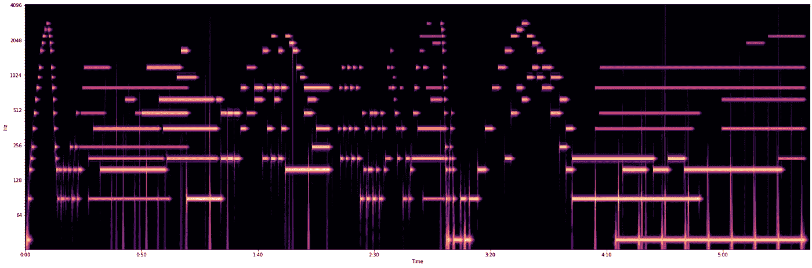
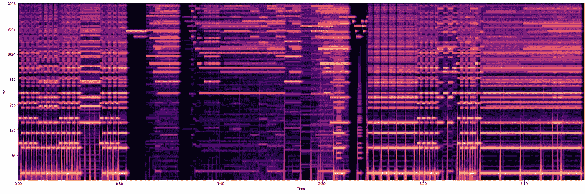
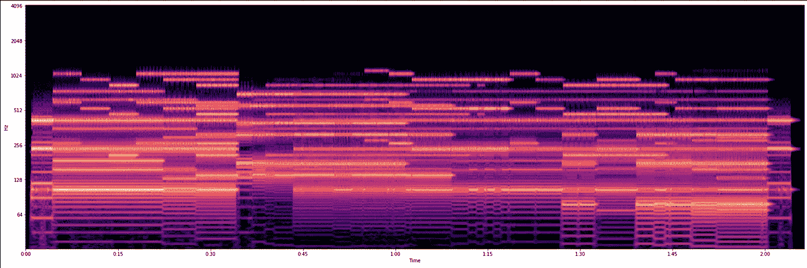

# 发音π

> 原文：<https://towardsdatascience.com/sonifying-%CF%80-c453c20a7acd?source=collection_archive---------40----------------------->

*(利用面向对象的编程探索超越数与数字信号处理)*



mod _ 1193.0116 _ sq _ duty _ cycle . wav

*在这篇文章中，我将简要回顾什么是超越数，以及调和级数如何与这些类型的数相互作用。我还将给出使用面向对象编程来生成和发音 Pi 的例子。最后，我将使用类对象的输出来构建一组合成器。*

3 月 14 日刚刚过去。在庆祝圆周率日的时候，我发现自己在思考作曲家是如何将圆周率谱成曲子的。通常这个过程是从数字到音高名称的文字转换。有时转换是全音阶的。有时转换是半音阶的。但是如果我们使用 3.14 到 3.14 Hz 的文字转换作为一个谐波序列的基础呢？结果数列是什么，听起来会是什么样的？

**π**

为了复习超越数的概念，我们来玩个游戏。这个游戏的要点是把任何一个给定的数化为零。游戏规则很简单:

1.  您只能使用整数

2.你可以加、减、乘或取给定数字的任意次方——假设这个次方是一个整数。

圆周率日的前一天，我和一个朋友在一家意大利街角小酒馆吃饭。她是一名数学家，并介绍了游戏。

> 你想从哪个数字开始？"

我回答说:‘15’

我们可以把 15 乘以零，但让它变得更有趣。她看着我说，

> “还是自己减去吧。'

```
15 - 15 = 0
```

好吧——这看起来微不足道。但这是一个好的开始。

> 换个类型的号码怎么样？"

我回答:“2/5”——(*那是五分之二——不是 2 除以 5)*

2/5 —乘以 5，减去 2。我们零点到达。

```
5(2/5) - 2 = 0
```

好吧——有道理。

> 来点更疯狂的怎么样？√2 '呢

我不确定什么数乘以自身等于 2，但也许这并不重要。我们可以将√2 提高到 2 的幂，然后减去 2，得到零。

```
(√2)^2 - 2 = 0
```

我们以√-1 继续比赛。

```
(√-1)^2 + 1 = 0
```

简单。我们用以下内容结束了游戏:

> 你如何将√2 + √3 减少到零？

首先:

```
(√2 + √3)^2 = 2 + 2√2√3 + 3which reduces down to5 + 2√2√3
```

第二:

```
5 + 2√2√3 - 5 = 2√2√3and if we (2√2√3)^2we get:4x2x3 = 24
```

所以很自然，第三步是减去 24，你得到零。

有趣的是，如果倒着玩游戏，从零开始，把初始数设为 X；这个游戏变成了求解 x，这个游戏是一个代数练习。它揭示了哪些数字需要进行代数运算。这些可以称为代数数。但是像 2.71828 这样的数字呢？

## e

> e 有几个特殊的性质。其中之一是增长潜力。它使用'**自然'**指数函数，其中它的斜率就是它的值。*’*

```
f(x) = e^x
```

简而言之，代数运算不能把它化为零。它有一个独特的性质，那就是不变。

与 e 类似，圆周率是一个圆的周长与其直径的比值。它也是一个常数。这两个数字的大小被认为是无限的。这两个数字都超越了代数运算。它们包含指数性质，不能减少。这就是超越数的含义。

## 调和级数

谐波系列是一组频率，由一个基波和与其相关的一个精确分数的谐波组成如果你在谷歌上快速搜索，你会很快看到这个定义:

> **调和级数**是 n = 1 到无穷大的和，带有 1/n 项，如果写出前几项，**级数**展开如下:1 + 1/2 + 1/3 + 1/4 + 1/5 +。。.等，随着 n 趋于无穷大，1/n 趋于 0。

为了帮助理解这一点，这里有一个分层频率系列的可视化。



可视化频率中的谐波级数

在音乐上，等式很简单:

```
f = Fundamental Frequency1xf, 2xf, 3xf, 4xf, 5xf....etc
```

沿级数的每个位置都是与基频相关的泛音。功能和声和音乐的结构就是从这些泛音中衍生出来的。在这个系列中，每一个全音阶和弦的元素都存在，旋律小调音阶的元素也存在。有了谐波系列，就有了一整套谐波音程工具包。要激活这个工具包，只需要设置一个基本的。



音乐音高中的调和级数

## 用π生成原始数据和 Wav 信号

如果你想知道更多关于这些类的内幕，这两个模块都在我的 Github 上有详细的文档。但本质上来说， ***wav_table*** 和 ***freq_table*** 这两个模块是交互式 DSP 模块，具有计算 Pi、计算八度音阶、计算谐波级数以及将频率转换为原始信号和 wav 信号的类和函数。此外，还有堆叠和连接信号以产生音程、和弦和进行的功能。您可以直接将这些信号输出为 wav 文件或原始数据文件。还有对随机频率的最近全音阶音高进行分类的功能。最后，还有一些工具可以显示原始信号和 wav 信号。为了好玩，一旦你从一个给定的频率创建了一个 wav 或原始信号对象，你可以存储这些对象供以后使用，也可以打印检查报告。

## **通过谐波级数传递π**

*注意:本笔记本中的代码生成 320 多个 wav 文件。*

## 检查类对象

如果您直接在*下查看，让我们查看 Pi 谐波的 Pi_Wav_objs 字典*，您将看到 Wav_Signal 字典中的一个对象被检查，随后是一个 Hz 类对象的检查。读出的内容详细描述了整个类对象，并描述了其独特的属性和功能。

## 检查一些音频输出

在生成了各种 Pi 的 wav 信号之后，这里有一组可视化效果来进一步探索它们。

这里显示了四种主要的 wav 文件。

1.  简单的
2.  被调的
3.  叠放在一起的
4.  连接的

*‘简单’*类别是未经修改的 wav 文件。它们只是一个持续时间为十秒钟的频率。在'*'简单'*范畴内有四种类型。

1.  正弦波
2.  方波
3.  具有占空比的方波
4.  锯齿波

“调制”类别也有同样的四种类型，但不同于*“简单”* wav，因为振幅对信号进行调制和整形。随着信号变得越来越大、越来越小、越来越大、越来越小，我们看到和听到了这一点。

*“Stacked”*是一组 wav 文件，随着过程的继续，它们变得越来越失真和嘈杂。第一个堆叠的音频波看起来像这样:



堆栈对 0.wav

叠加的两个信号频率完全相同，但波形类型不同。这里我们看到的是一个带有锯齿层的正弦波。

随着堆叠的继续，它形成了更多独特的形状。



stack_oct_2.wav

这里我们有许多层出现。有一种较慢的正弦波，分层有两种类型的方波。这两种方波的周期不同，但频率相似。有一个高音调的锯齿层在那里。这声音很刺耳。但是这个信号有一种近乎艺术的视觉质量。

最后，我们有*‘串联’*类别。在笔记本上，你可以清楚地看到音色和波形的不同部分。此外，您可以发现哪些频率是最常见的。在某些情况下，你可以通过并置的部分看到一个强频率是如何呈现的；表现为光谱图前景中的饱和线。下面是笔记本末尾的一个例子。



非常蒸汽波

## 监听

下面是三个频率从 Pi 的和声系列发音。它们是按时间顺序从系列中取出的。它们是基础系列的泛音 2、3 和 4，向上移调了 3 个八度。

39.4384 赫兹正弦波

这里的频率几乎听不见。如果你有足够大的扬声器，你能更清楚地感受到信号，而不是听到它。

88.7364 赫兹正弦波

大致以高于九度音程移动。信号更接近可听度，但仍然很低。这些音高非常接近这个系列的基本音。

157.7536 赫兹正弦波

就在中音以下，又是一个小七度，我们的音高比初始音高了两个八度。

从音名上来说，这些频率非常接近 <eb class="kl">1_F2_Eb3 >。实际音调频率只有几分之差。</eb>

Eb1 = 38.89hz 赫兹

F2 = 87.31hz 赫兹

Eb3 = 155.56hz 赫兹

有趣的是，我们能听到和听不到的东西有一个范围。即使在我们的范围之外，声音仍然存在。例如，单独听 157.7536hz 与一起听这三个频率有很大不同。一旦结合在一起，整个音调就具有了每个信号相互作用所产生的品质。尽管我们在隔离时听不到每个信号，但当它们在一起时，我们可以从声音上注意到它们之间的数学效应。下面是一个三个频率组成三和弦的例子。

# 科学与艺术的交叉

下面三个音频文件是我做的三个合成器。第一种是在正弦波中使用*π的谐波级数；二是在方波*中使用*π的调和级数；第三种是使用简单的 38.4384 88.7364 157.7563 正弦三和弦 wav* 。每个音频文件下面是声谱图中相同的音频数据。每种音色都有其独特的特征。在最后一个合成器中，使用相同的样本来确定每个音调的音高。这意味着每个音高都是原始样本的移调，而不是像前两个样本一样，每个样本都是独立的数学实体。

> 有趣的提示:原来圆周率接近 G 自然的调和级数。

## 结果

时而舒缓，时而刺耳刺耳。这种声音让人想起 20 世纪中期的印象派电脑音乐。随意在音轨上跳来跳去，聆听音色和频率的不同组合。

Pi 正弦波合成器



Pi 正弦波合成器

π平方 8 Wav 合成器



π平方 8 Wav 合成器

堆叠正弦三和弦合成器



堆叠正弦三和弦合成器

这两个模块仍在开发中，随着项目的继续，将包括更多不同的功能。请继续关注将来的文章，回顾这些模块的文档以及 DSP 的简介。